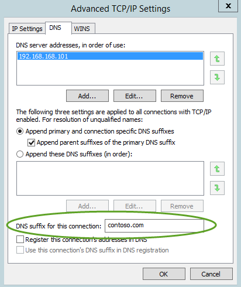

# ATA Planning and Requirements
This section describes the requirements to successfully deploy the ATA Center and the ATA Gateway in your environment, and includes the following sections:

[Active Directory Domain Services (AD DS)](#ATAADDS)

[SEIM/Syslog](#ATASIEM)

[ATA Center](#ATAcenter)

[ATA Console](#ATAconsole)

[ATA Gateway](#ATAgateway)

[Additional items](#ATAmisc)

## Active Directory Domain Services (AD DS)
The following section describes the requirements to successfully deploy the ATA Center and the ATA Gateway in your environment.

### General

-   Domain controllers running on Windows Server 2008 and later.

-   User account and password with read access to **all objects** in the domains that will be monitored.

    > [!NOTE]
    > If you have set custom ACLs on various Organizational Units (OU) in your domain, make sure that the selected user has read permissions to those OUs.

    Optional: User should have read only permissions on the Deleted Objects container. This will allow ATA to detect bulk deletion of objects in the domain. For information about configuring read only permissions on the Deleted Objects container, see the **Changing permissions on a deleted object container** section in the [View or Set Permissions on a Directory Object](https://technet.microsoft.com/library/cc816824%28v=ws.10%29.aspx) topic.

-   Optional: A user account of a user who has no network activities. This account will be configured as the ATA Honeytoken user. To configure the Honeytoken user you will need the SID of the user account, not the username.

### Networking
The ATA Gateway needs to see all the network traffic to and from each domain controller being monitored. Configure **port mirroring** for each domain controller to be monitored, as the **source** of the network traffic. See [Configure Port Mirroring](../../ems/ATA_Content/Configure-Port-Mirroring.md) for additional information. Typically, you will need to work with the networking or virtualization team to configure port mirroring.

## Event collection
In addition to collecting and analyzing network traffic to and from the domain controllers, ATA can use Windows event 4776 to further enhance ATA Pass-the-Hash detection. This can be received from your SIEM or by  setting Windows Event Forwarding from your domain controller. Events collected provide ATA with additional information that is not available via the domain controller network traffic.

### SIEM/Syslog
For ATA to be able to consume data from a Syslog server, you need to configure the following:

-   Configure one of your ATA Gateway servers to listen to and accept events forwarded from the SIEM/Sylog server.

-   Configure your SIEM/Syslog server to forward specific events to the ATA Gateway.

> [!IMPORTANT]
> -   Do not forward all the Syslog data to the ATA Gateway.
> -   ATA supports UDP traffic from the SIEM/Syslog server.

Refer to your SIEM/Syslog server's product documentation for information on how to configure forwarding of specific events to another server. For more information about the events forwarded to ATA, see [Configure Event Collection](../../ems/ATA_Content/Configure-Event-Collection.md).

### Windows Event Forwarding
If you do not use a SIEM/Syslog server, you can configure your Windows domain controllers to forward Windows Event ID 4776 to be collected and analyzed by ATA. Windows Event ID 4776 provides data regarding NTLM authentications.

For more information see:  [Configuring Windows Event Forwarding](http://msdn.microsoft.com/en-us/library/1608e89e-0d73-499e-a603-8c540b6f5b9d).

## Short-term lease subnets
Identify the subnets in which IP addresses are reassigned between devices within a very short period of time (seconds or minutes). ATA reduces the cache lifetime for all IP addresses in these subnets to accommodate the fast re-assignment between devices. VPN or Wi-Fi networks are common examples of short-term lease subnets. See [ATA Installation](../../ems/ATA_Content/ATA-Installation.md) for short-term lease subnet configuration.

## ATA Center
This section lists the requirements for the ATA Center.

### Operating System:
The ATA Center supports installation on a server running Windows Server 2012 R2. Run Windows Update and make sure all important updates are installed.

> [!NOTE]
> The ATA Center can be installed on a server that is a member of a domain or workgroup.

### Time Synchronization
The ATA Center server and the ATA Gateway server must have time synchronized to within 5 minutes of each other.

### BIOS settings
The ATA database necessitates that you DISABLE Non-uniform memory access (NUMA) in the BIOS. Your system may refer to NUMA as Node Interleaving, in which case you will have to ENABLE Node Interleaving. See your BIOS documentation for more information.

### Hardware requirements:
The number of domain controllers you are monitoring and the load on each of the domain controllers dictates the hardware requirements.

**Minimum requirements**

> [!NOTE]
> If you want to install ATA in a lab with a few VMs, it is recommended that you have at least 2 cores, 4 GB of RAM and 100GB of storage to allow you to interact with the ATA Console without support for production deployment.

-   CPU -  8 cores

-   Memory - 48 GB

-   Storage - 1000 GB per month to monitor 2 lightly loaded domain controllers

The ATA Center requires a minimum of 21 days of data for user behavioral analytics. For more information on hardware requirements, see [ATA Capacity Planning](../../ems/ATA_Content/ATA-Capacity-Planning.md).

### Networking

#### Network adapters:
Requirements:

-   One network adapter

-   Two IP addresses

Communication between the ATA Center and the ATA Gateway is encrypted using SSL on port 443. Additionally the ATA Console runs on IIS and is secured using SSL on port 443. **Two IP addresses** are recommended. The ATA Center service will bind port 443 to the first IP address and IIS will bind port 443 to the second IP address.

> [!NOTE]
> A single IP address with two different ports can be used, but two IP addresses are recommended.

#### Ports:
The following table lists the minimum ports that have to be opened for the ATA Center to work properly.

In this table, IP address 1 is bound to the ATA Center service and IP address 2 is bound to the IIS service for the ATA Console.

|Protocol|Transport|Port|To/From|Direction|IP Address|
|------------|-------------|--------|-----------|-------------|--------------|
|**SSL** (ATA Communications)|TCP|443, or configurable|ATA Gateway|Inbound|IP address 1|
|**HTTP**|TCP|80|Company Network|Inbound|IP address 2|
|**HTTPS**|TCP|443|Company Network and ATA Gateway|Inbound|IP address 2|
|**SMTP** (optional)|TCP|25|SMTP Server|Outbound|IP address 2|
|**SMTPS** (optional)|TCP|465|SMTP Server|Outbound|IP address 2|
|**Syslog** (optional)|TCP|514|Syslog server|Outbound|IP address 2|

### Certificates (optional):
To ease the installation of the ATA Center, you can install self-signed certificates during the installation of the ATA Center. Post deployment you can replace the self-signed with a certificate from an internal Certification Authority to be used by the ATA Gateway.

> [!NOTE]
> Self-signed certificates should be used only for lab deployment.

The ATA Center requires certificates for the following services:

-   Internet Information Services (IIS) – Web server certificate

-   ATA Center service – Server authentication certificate

> [!NOTE]
> If you are going to access the ATA Console from other computers, ensure that those computers trust the certificate being used by IIS otherwise you will get a warning page that there is a problem with the website's security certificate before getting to the log in page.

### Virtualization:
Installation of the ATA Center as a virtual machine is supported.

> [!NOTE]
> If you run the ATA Center as a virtual machine, shut down the server before creating a new checkpoint to avoid potential database corruption.

### Components installed during installation
The following components are installed and configured during the installation of ATA Center:

-   Internet Information Services (IIS)

-   MongoDB

-   ATA Center service and ATA Console IIS site

-   Custom Performance Monitor data collection set

-   Self-signed certificates (if selected during the installation)

> [!NOTE]
> To help in troubleshooting and product enhancement, it is recommended that you install MongoVue and any other MongoDB add-in, or any other third-party tool of your choice. MongoVue requires .Net Framework 3.5 to be installed.

## ATA Console
Access to the ATA Console is via a browser. The following browsers are supported:

-   Internet Explorer version 10 and above

-   Google Chrome  40 and above

-   Minimum screen width resolution of 1700 pixels

## ATA Gateway

### Operating system
The ATA Gateway supports installation on a server running Windows Server 2012 R2.

Run Windows Update and make sure all **Important** updates have been installed. 
Before installing ATA Gateway confirm that the following update has been installed: [KB2919355](https://support.microsoft.com/en-us/kb/2919355/).

Run the following PowerShell cmdlet to check if the hot fix is installed, `[Get-HotFix -Id kb2919355]`.

> [!NOTE]
> -   The ATA Gateway can be installed on a server that is a member of a domain or workgroup.
> -   The ATA Gateway CANNOT be installed on a domain controller.

### Power settings
For optimal performance, set the **Power Option** of the ATA Gateway to **High Performance**.

### Time synchronization
The ATA Center server and the ATA Gateway server must have time synchronized to within 5 minutes of each other.

### Hardware requirements:
An ATA Gateway can support monitoring multiple domain controllers, depending on the amount of network traffic to and from the domain controllers.

**Minimum requirements:**

-   CPU - 4 cores

-   Memory - 8 GB

-   Storage - Enough for the OS + 10GB for ATA + crash dumps = at least 100 GB

For more information, see [ATA Capacity Planning](../../ems/ATA_Content/ATA-Capacity-Planning.md).

### Networking

#### Network adapters:
The ATA Gateway requires two or more network adapters.

-   **Management adapter** - will be used for communications on your corporate network. This adapter should be configured with the following:

    -   Static IP address including default gateway

    -   Preferred and alternate DNS servers

    -   The **DNS suffix for this connection** should be the DNS name of the domain for each domain being monitored.

        > [!NOTE]
        > If the ATA Gateway is a member of the domain, this is configured automatically.
        > 
        > 

-   **Capture adapter** - will be used to capture traffic to and from the domain controllers.

    > [!IMPORTANT]
    > -   Configure port mirroring for the capture adapter as the destination of the domain controller network traffic. See [Configure Port Mirroring](../../ems/ATA_Content/Configure-Port-Mirroring.md)  for additional information. Typically, you will need to work with the networking or virtualization team to configure port mirroring.
    > -   Configure a static non-routable IP address for your environment with no default gateway and no DNS server addresses. For example, 1.1.1.1/32. This will ensure that the capture network adapter can capture the maximum amount of traffic and that the management network adapter is used to send and receive the required network traffic.

#### Ports:
The following table lists the minimum ports that the ATA Gateway requires configured on the management adapter.

|Protocol|Transport|Port|To/From|Direction|
|------------|-------------|--------|-----------|-------------|
|LDAP|TCP and UDP|389|Domain controllers|Outbound|
|Secure LDAP (LDAPS)|TCP|636|Domain controllers|Outbound|
|LDAP to Global Catalog|TCP|3268|Domain controllers|Outbound|
|LDAPS to Global Catalog|TCP|3269|Domain controllers|Outbound|
|Kerberos|TCP and UDP|88|Domain controllers|Outbound|
|Netlogon|TCP and UDP|445|Domain controllers|Outbound|
|Windows Time|UDP|123|Domain controllers|Outbound|
|DNS|TCP and UDP|53|DNS Servers|Outbound|
|NTLM over RPC|TCP|135|All devices on the network|Outbound|
|NetBIOS|UDP|137|All devices on the network|Outbound|
|SSL|TCP|443 or as configured for the Center Service|ATA Center:  -   Center Service IP Address -   IIS IP Address|Outbound|
|Syslog (optional)|UDP|514|SIEM Server|Inbound|
> [!NOTE]
> As part of the resolution process done by the ATA Gateway, the following ports need to be open inbound on devices on the network from the ATA Gateways.
> 
> -   NTLM over RPC
> -   NetBIOS

### Virtualization:
For information on using virtual machines with the ATA Gateway, see [Configure Port Mirroring](../../ems/ATA_Content/Configure-Port-Mirroring.md).

> [!NOTE]
> If you run the ATA Gateway as a virtual machine, shut down the server before creating a new checkpoint to avoid potential database corruption.

### Certificates:
To ease installation of the ATA Center, you can install self-signed certificates during the installation of the ATA Center. Post deployment you can replace the self-signed with a certificate from an internal Certification Authority to be used by the ATA Gateway.

> [!NOTE]
> Self-signed certificates should be used only for lab deployment.

A certificate supporting **Server Authentication** is required to be installed in the Computer store of the ATA Gateway in the Local Computer store. This certificate must be trusted by the ATA Center.

### Components installed during setup
The following components are installed and configured during the installation of the ATA Gateway:

-   KB 3047154

    > [!IMPORTANT]
    > -   Do not install KB 3047154 on a virtualization host. This may cause port mirroring to stop working properly.
    > -   Do not install Message Analyzer, Wireshark, or other network capture software on the ATA Gateway. If you need to capture network traffic, install and use Microsoft Network Monitor 3.4.

-   ATA Gateway service

-   Microsoft Visual C++ 2013 Redistributable

-   Custom Performance Monitor data collection set

## See Also
[ATA Architecture](../../ems/ATA_Content/ATA-Architecture.md)
 [ATA Installation](../../ems/ATA_Content/ATA-Installation.md)
 [For support, check out our forum!](https://social.technet.microsoft.com/Forums/security/en-US/home?forum=mata)

