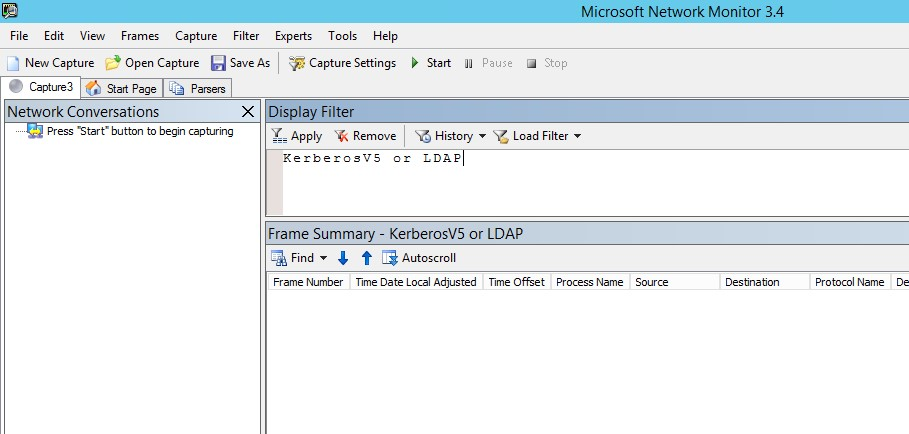
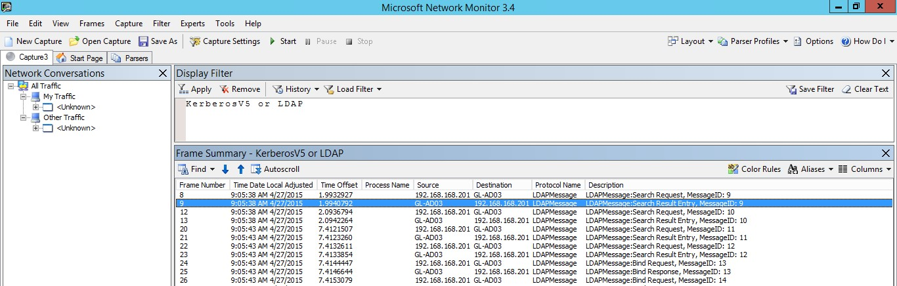

# Validate Port Mirroring
The following steps walk you through the process for validating that port mirroring is properly configured.

1.  Install [Microsoft Network Monitor 3.4](http://www.microsoft.com/download/details.aspx?id=4865) or another network sniffing tool.

    > [!IMPORTANT]
    > Do not install Microsoft Message Analyzer, or any other traffic capture software on the ATA Gateway.

2.  Open Network Monitor and create a new capture tab.

    1.  Select only the **Capture** network adapter or the network adapter that is connected to the switch port that is configured as the port mirroring destination.

    2.  Ensure that P-Mode is enabled.

    3.  Click **New Capture**.

        

3.  In the Display Filter window, enter the following filter: **KerberosV5 OR LDAP** and then click **Apply**.

    

4.  Click **Start** to start the capture session. If you do not see traffic to and from the domain controller, review your port mirroring configuration.

    > [!NOTE]
    > It is important to make sure you see traffic to and from the domain controllers.
    > 
    > 

## See Also
[Configure Port Mirroring](../../ems/ATA_Content/Configure-Port-Mirroring.md)
 [For support, check out our forum!](https://social.technet.microsoft.com/Forums/security/en-US/home?forum=mata)

