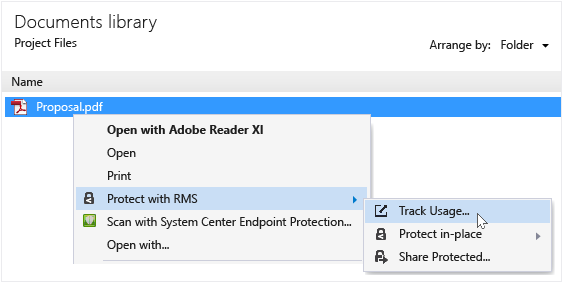

# Track and revoke your documents when you use the RMS sharing application
After you have protected your documents by using the RMS sharing application, you can track how people are using your protected documents, and if necessary, revoke access to them when you want to stop sharing. To do this, you use the document tracking site, which you can access from Windows computers, Mac computers, and even from tablets and phones.

> [!TIP]
> Two minute video: [Azure RMS Document Tracking and Revocation](http://channel9.msdn.com/Series/Information-Protection/Azure-RMS-Document-Tracking-and-Revocation)

When you access this site, you just need to sign in to track your documents. Then, you can see who tried to open the files that you protected and whether they were successful (they were successfully authenticated) or not. Each time they tried to access the document, and their location at the time. In addition:

-   If you need to stop sharing a document: Click **Revoke access**, note the period of time that the document will continue to be available, and decide whether to let people know that you’re revoking access to the document you previously shared, and provide a customized message.

-   If you want to export to Excel: Click **Open in Excel**, so that you can then modify the data, and create your own views and graphs.

-   If you want to configure email notifications: Click **Settings** and select how and whether to be emailed when the document is accessed.

-   If you have questions or want to provide feedback about the document tracking site: Click the Help icon to access the [FAQ for Document Tracking](http://go.microsoft.com/fwlink/?LinkId=523977).

## Using Office to access the document tracking site

-   For the Office applications, Word, Excel, and PowerPoint: On the **Home** tab, in the **RMS** group, click **Share Protected**, and then click **Track Usage**.

    

-   For Outlook: On the **Home** tab, in the  **RMS** group, click **Track Usage**:

    

If you do not see these options for RMS, it’s likely that either the RMS sharing application is not installed on your computer, the latest version isn’t installed, or your computer must be restarted to complete the installation. For more information about how to install the sharing application, see [Download and install the Rights Management sharing application](../../ems/RMS_Client/Download-and-install-the-Rights-Management-sharing-application.md).

### Other ways to track and revoke your documents
In addition to tracking your documents on Windows computers by using Office applications, you can also use these alternatives:

-   **Using a web browser**: This method works for all supported devices.

-   **Using File Explorer**: This method works for Windows computers.

-   **Using an Outlook email message**: This method works for Windows computers.

##### Using a web browser to access the doc tracking site

-   Using a supported browser, go to the [document tracking site](http://go.microsoft.com/fwlink/?LinkId=529562).

    Supported browsers: We recommend using Internet Explorer that is at least version 10, but you can use any of following browsers to use the document tracking site:

    -   Internet Explorer: At least version 10

    -   Internet Explorer 9 with at least MS12-037: Cumulative Security Update for Internet Explorer: June 12, 2012

    -   Mozilla Firefox: At least version 12

    -   Apple Safari 5: At least version 5

    -   Google Chrome: At least version 18

##### Using File Explorer to access the doc tracking site

-   Right-click the file, select **Protect with RMS**, and then select **Track Usage**:

    

##### Using an Outlook email message to access the doc tracking site

-   In an email message, in the **Message** tab, in the  **RMS** group, click **Share Protected**, and then click **Track Usage**:

    

## Examples and other instructions
For examples for how you might use the Rights Management sharing application, and how-to instructions, see the following sections from the Rights Management sharing application user guide:

-   [Examples for using the RMS sharing application](../../ems/RMS_Client/Rights-Management-sharing-application-user-guide.md#BKMK_SharingExamples)

-   [What do you want to do?](../../ems/RMS_Client/Rights-Management-sharing-application-user-guide.md#BKMK_SharingInstructions)

## See Also
[Rights Management sharing application user guide](../../ems/RMS_Client/Rights-Management-sharing-application-user-guide.md)

