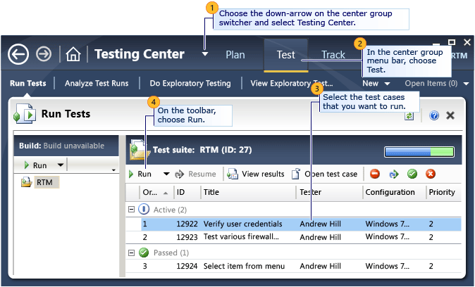
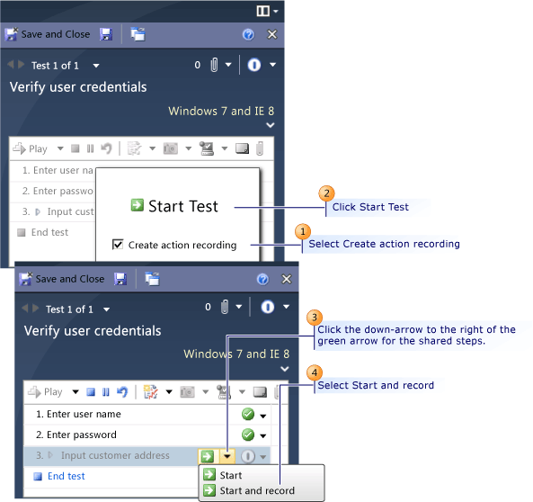
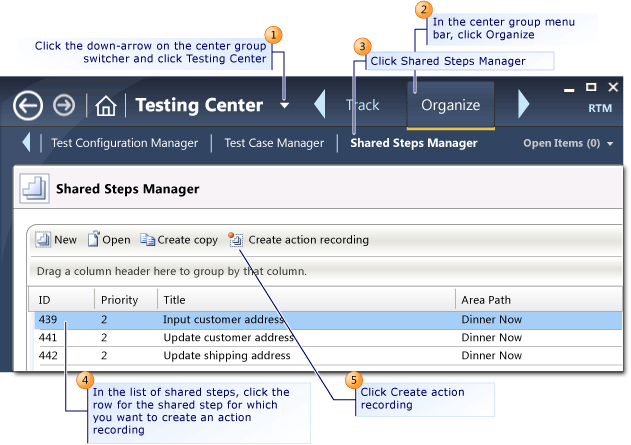

# -How to: Create an Action Recording for Shared Steps
While you run a manual test using [!INCLUDE[mtrlong](../vs140/includes/mtrlong_md.md)], you might have a test that includes *shared steps*. Shared steps contain a set of common steps that are used in several different tests. For example, several tests may have the identical steps in the application for entering customer address information or logon credentials. Using shared steps saves time and effort when you create a test. For more information, see [How to: Share Common Test Case Steps](../vs140/share-steps-between-test-cases.md) and [Share Steps between Test Cases](../vs140/share-steps-between-test-cases.md).  
  
 To reduce the time impact of testing, you can create an action recording that is specific to shared steps. By doing this, you will not have to repeatedly enter identical information numerous times, such as the user logon information, or address information.  
  
 **Requirements**  
  
-   Visual Studio Enterprise, [!INCLUDE[vstsTestEssLong](../vs140/includes/vststestesslong_md.md)]  
  
> [!NOTE]
>  You can also create an action recording for a complete test. See [How to: Create an Action Recording](../vs140/--how-to--create-an-action-recording.md).  
  
 You can create an action recording for shared steps in two ways:  
  
-   In [!INCLUDE[mtrshort](../vs140/includes/mtrshort_md.md)] while you are running a test that includes shared steps.  
  
-   In [!INCLUDE[TCMext](../vs140/includes/tcmext_md.md)] while you organize and manage your shared steps.  
  
## Load a Test into Test Runner  
 First, you must load a test that contains the shared steps into [!INCLUDE[mtrshort](../vs140/includes/mtrshort_md.md)]. Then you can create an action recording for shared steps while you run the test. The shared steps can be run automatically when the shared steps are included in this test and other tests.  
  
   
  
#### To load a test with shared steps into Test Runner  
  
1.  Open [!INCLUDE[TCMext](../vs140/includes/tcmext_md.md)]. (Go to Start, All Programs, Microsoft Visual Studio, Microsoft Test Manager.)  
  
2.  On the center group switcher, choose the down-arrow and then choose **Testing Center**.  
  
3.  On the center group menu bar, choose **Test**.  
  
4.  In the menu under the center group menu bar, choose **Run Tests** if it is not already selected.  
  
5.  In the left pane, under **Run Tests**, select either the test plan or the test suite listed under the test plan that contains the test that you want to run.  
  
     The right side pane displays the test cases within the selected test suite.  
  
6.  In the right side pane, choose the test case that contains shared steps and then choose **Run**.  
  
     [!INCLUDE[mtrlong](../vs140/includes/mtrlong_md.md)] opens.  
  
    > [!NOTE]
    >  Select **Run with options** to specify a build to run the test on, or to override the test settings and environment settings for the test plan.  
  
## Record an Action Recording on a Shared Step Set in Test Runner  
 First you must load a test that contains shared steps for which you want to create an action recording into [!INCLUDE[mtrlong](../vs140/includes/mtrlong_md.md)]. For more information, see the previous procedure titled "To load a test with shared steps into Test Runner."  
  
   
  
#### To create an action recording for shared steps in Test Runner  
  
1.  Upon loading a test from [!INCLUDE[TCMext](../vs140/includes/tcmext_md.md)] into [!INCLUDE[mtrshort](../vs140/includes/mtrshort_md.md)], you are prompted to **Start Test** with the option **Create action recording**. Select **Create action recording** and choose **Start Test**.  
  
    > [!NOTE]
    >  If the test contains an existing action recording, you are prompted with the option **Overwrite existing action recording**. Select this option to create a new recording that replaces the previous action recording, and then choose **Start Test**.  
  
     The action recording can be played using the **Play** option in the toolbar. For more information, see [How to: Play Back an Action Recording](../vs140/--how-to--play-back-an-action-recording.md).  
  
     You can specify which applications to record in your test settings for the actions diagnostic data adapter. If you have configured test settings to create an action log for the test being run, selecting the **Create action recording** option when you start a test will use the settings that you configured. If you did not configure the actions diagnostic data adapter in your test settings, then the default values are used to create your action recording. For more information, see [How to: Record User Interface Actions for Manual Tests Using Test Settings](../vs140/how-to--choose-the-applications-that-are-recorded-in-a-manual-test.md).  
  
     Each test step including launching the application is recorded after you choose **Start Test**.  
  
2.  Perform the steps of the test case and mark each step with a result. Use the drop-down arrow to the right of the step and select either **Pass** or **Fail**.  
  
     The words **Currently Recording** appear in the title bar of each application that is being recorded. An *action recording section,* presented as a blue indicator, is displayed to the right of the test. The blue indicator is divided into individual sections that correspond to the steps of your test.  
  
    > [!NOTE]
    >  If you do not mark each test step as passed or failed, then the action recording section can span several test steps. It includes all unmarked test steps since the last step that was marked as passed or failed.  
  
3.  When you reach the shared steps, choose the down-arrow next to the shared steps icon and select **Start and record**.  
  
     The individual steps in the shared steps are new displayed.  
  
4.  Perform the steps in the shared steps and mark each step with a result. Use the drop-down arrow to the right of the step and select either **Pass** or **Fail**.  
  
     As with the non-shared steps, the words **Currently Recording** appear in the title bar of each application that is being recorded.  
  
5.  Choose **End shared steps**.  
  
     An *action recording section* presented as a blue indicator appears at the right of the shared steps.  
  
6.  If there are any remaining steps in the test case after the shared steps, perform the steps of the test case and mark each step with a result. Use the drop-down arrow to the right of the step and select either **Pass** or **Fail**.  
  
7.  Choose **End Test**.  
  
8.  In the toolbar at the top of [!INCLUDE[mtrshort](../vs140/includes/mtrshort_md.md)], choose one of the following options:  
  
    -   Choose **Save and Close** to save your test results to the [!INCLUDE[esprtfs](../vs140/includes/esprtfs_md.md)] and close [!INCLUDE[mtrshort](../vs140/includes/mtrshort_md.md)].  
  
    -   Choose **Save** to save the test results to the [!INCLUDE[esprtfs](../vs140/includes/esprtfs_md.md)].  
  
    -   Choose **Close** to close [!INCLUDE[mtrshort](../vs140/includes/mtrshort_md.md)] and not save the test results.  
  
    > [!NOTE]
    >  If an existing action recording already exists for the test, the **Test Runner - Microsoft Test Manager** dialog appears with the option to either **Overwrite existing recording** or **Discard new recording**.  
    >   
    >  The action recording can now be replayed when you run this test case in the future. For more information, see [How to: Play Back an Action Recording](../vs140/--how-to--play-back-an-action-recording.md).  
  
## Creating an Action Recording for Shared Steps in Microsoft Test Manager  
 You can create an action recording for a shared step in [!INCLUDE[TCMext](../vs140/includes/tcmext_md.md)] that will automatically run when the shared step is included in test cases.  
  
   
  
#### To create an action recording for shared steps in Microsoft Test Manager  
  
1.  Open [!INCLUDE[TCMext](../vs140/includes/tcmext_md.md)].  
  
    > [!NOTE]
    >  To display the [!INCLUDE[TCMext](../vs140/includes/tcmext_md.md)] window, choose Start, and then choose All Programs. Point to Microsoft [!INCLUDE[vs_dev11_long](../vs140/includes/vs_dev11_long_md.md)] and then choose Microsoft Test Manager.  
  
2.  On the center group switcher, choose the down-arrow and then choose **Testing Center**.  
  
3.  On the center group menu bar, choose **Organize**.  
  
4.  On the menu, choose **Shared Steps Manager**.  
  
5.  In the list of shared step, choose the row for the shared step for which you want to create an action recording.  
  
6.  Choose **Create action recording**.  
  
     The Test Runner is displayed.  
  
7.  Choose **Create action recording**.  
  
8.  In [!INCLUDE[mtrshort](../vs140/includes/mtrshort_md.md)], perform the steps of the test case.  
  
     The words **Currently Recording** appear in the title bar of each application that is being recorded. An *action recording section* presented as a yellow line appears at the right of the test, which is divided into individual sections that correspond to the steps of your test.  
  
9. Choose **End shared steps**.  
  
    > [!NOTE]
    >  If you overwrite an existing action recording for shared steps, the **Test Runner - Microsoft Test and Lab Manager** dialog box will appear informing you of what test cases will be impacted and prompt you to either **Overwrite existing recording** or **Discard new recording**.  
  
10. In the toolbar at the top of [!INCLUDE[mtrshort](../vs140/includes/mtrshort_md.md)], choose one of the following options:  
  
    -   Choose **Save and Close** to save your test results to the [!INCLUDE[esprtfs](../vs140/includes/esprtfs_md.md)] and close [!INCLUDE[mtrshort](../vs140/includes/mtrshort_md.md)].  
  
    -   Choose **Save** to save the test results to the [!INCLUDE[esprtfs](../vs140/includes/esprtfs_md.md)].  
  
    -   Choose **Close** to close [!INCLUDE[mtrshort](../vs140/includes/mtrshort_md.md)] and not save the test results.  
  
     The shared steps can now be automatically replayed when you run a test that contains this shared step set.  
  
## See Also  
 [How to: Fast Forward an Action Recording](../vs140/--how-to--play-back-an-action-recording.md)   
 [How to: Record a Video of Your Desktop as You Run Tests Using Test Settings](assetId:///2cefe8c2-430a-4cb4-bbe0-f3edb2e5bc03)   
 [How to: Create an Action Recording for Shared Steps](../vs140/-how-to--create-an-action-recording-for-shared-steps.md)   
 [Recording and Playing Back Manual Tests](../vs140/record-and-play-back-manual-tests.md)