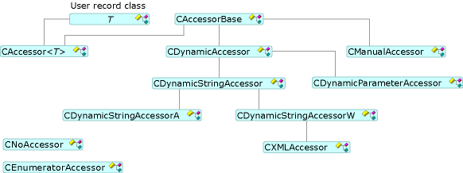

# Accessors and Rowsets
To set and retrieve data, OLE DB Templates use an accessor and a rowset through the [CAccessorRowset](../vs140/caccessorrowset-class.md) class. This class can handle multiple accessors of different types.  
  
## Accessor Types  
 All accessors derive from [CAccessorBase](../vs140/caccessorbase-class.md). <CodeContentPlaceHolder>0\</CodeContentPlaceHolder> provides both parameter and column binding.  
  
 The following figure shows the accessor types.  
  
   
Accessor Classes  
  
-   [CAccessor](../vs140/caccessor-class.md) Use this accessor when you know the structure of the database source at design time. <CodeContentPlaceHolder>1\</CodeContentPlaceHolder> statically binds a database record, which contains the buffer, to the data source.  
  
-   [CDynamicAccessor](../vs140/cdynamicaccessor-class.md) Use this accessor when you do not know the structure of the database at design time. <CodeContentPlaceHolder>2\</CodeContentPlaceHolder> calls <CodeContentPlaceHolder>3\</CodeContentPlaceHolder> to get the database column information. It creates and manages an accessor and the buffer.  
  
-   [CDynamicParameterAccessor](../vs140/cdynamicparameteraccessor-class.md) Use this accessor to handle unknown command types. When you prepare the commands, <CodeContentPlaceHolder>4\</CodeContentPlaceHolder> can get parameter information from the <CodeContentPlaceHolder>5\</CodeContentPlaceHolder> interface, if the provider supports <CodeContentPlaceHolder>6\</CodeContentPlaceHolder>.  
  
-   [CDynamicStringAccessor](../vs140/cdynamicstringaccessor-class.md), [CDynamicStringAccessorA](../vs140/cdynamicstringaccessora-class.md), and [CDynamicStringAccessorW](../vs140/cdynamicstringaccessorw-class.md) Use these classes when you have no knowledge of the database schema. <CodeContentPlaceHolder>7\</CodeContentPlaceHolder> retrieves data as ANSI strings; <CodeContentPlaceHolder>8\</CodeContentPlaceHolder> retrieves data as Unicode strings.  
  
-   [CManualAccessor](../vs140/cmanualaccessor-class.md) With this class, you can use whatever data types you want if the provider can convert the type. It handles both result columns and command parameters.  
  
 The following table summarizes the support in the OLE DB Template accessor types.  
  
|Accessor type|Dynamic|Handles params|Buffer|Multiple accessors|  
|-------------------|-------------|--------------------|------------|------------------------|  
|<CodeContentPlaceHolder>9\</CodeContentPlaceHolder>|No|Yes|User|Yes|  
|<CodeContentPlaceHolder>10\</CodeContentPlaceHolder>|Yes|No|OLE DB Templates|No|  
|<CodeContentPlaceHolder>11\</CodeContentPlaceHolder>|Yes|Yes|OLE DB Templates|No|  
|<CodeContentPlaceHolder>12\</CodeContentPlaceHolder>|Yes|No|OLE DB Templates|No|  
|<CodeContentPlaceHolder>13\</CodeContentPlaceHolder>|Yes|Yes|User|Yes|  
  
## Rowset Types  
 The OLE DB Templates support three kinds of rowsets (see the preceding figure): single rowsets (implemented by [CRowset](../vs140/crowset-class.md)), bulk rowsets (implemented by [CBulkRowset](../vs140/cbulkrowset-class.md)), and array rowsets (implemented by [CArrayRowset](../vs140/carrayrowset-class.md)). Single rowsets fetch a single row handle when <CodeContentPlaceHolder>14\</CodeContentPlaceHolder> is called. Bulk rowsets can fetch multiple row handles. Array rowsets are rowsets that can be accessed using array syntax.  
  
 The following figure shows the rowset types.  
  
   
Rowset Classes  
  
 [Schema rowsets](../vs140/obtaining-metadata-with-schema-rowsets.md) do not access data in the data store but instead access information about the data store, called metadata. Schema rowsets are typically used in situations in which the database structure is not known at compile time and must be obtained at run time.  
  
## See Also  
 [OLE DB Consumer Templates](../vs140/ole-db-consumer-templates--c---.md)