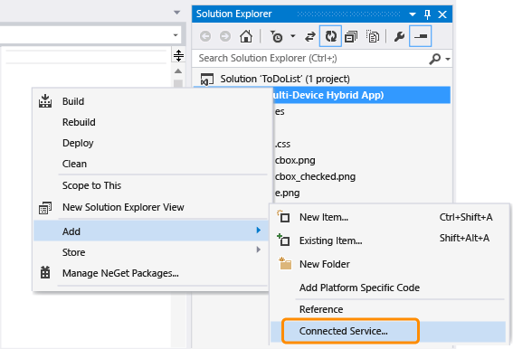
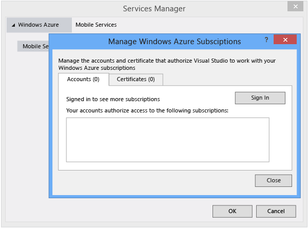
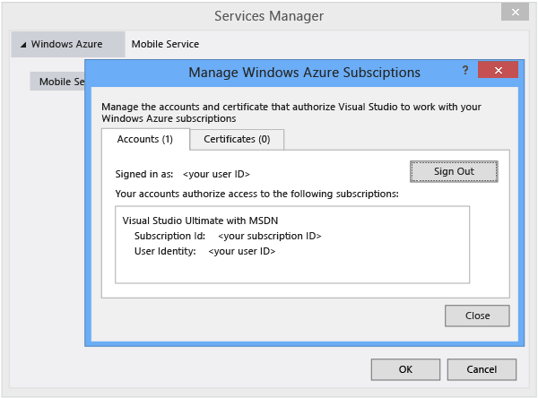
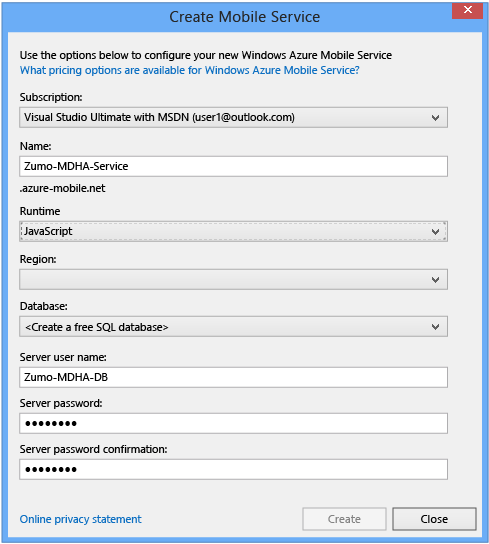
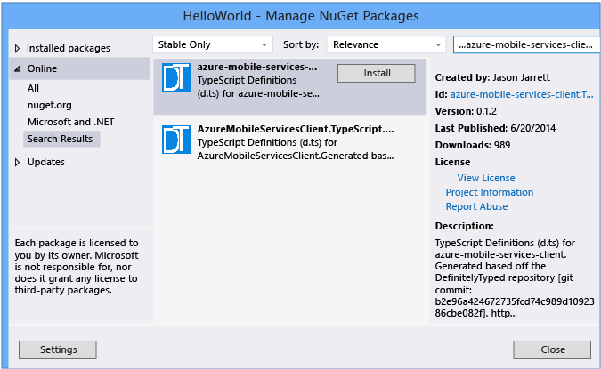
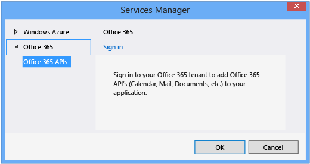

# Add Connected Services to App Built with Visual Studio Tools for Apache Cordova
[!INCLUDE[cordova_header](../vs140/includes/cordova_header_md.md)]  
  
 The Visual Studio Services Manager for connected services lets you integrate Microsoft services like Azure Mobile Services, Office 365, and other services into your app built with Visual Studio Tools for Apache Cordova. The manager makes it easy to add services without leaving Visual Studio.  
  
 In this article:  
  
-   [Opening Service Manager](#ServiceMan)  
  
-   [Adding Azure Mobile Services](#Azure)  
  
-   [Adding Office 365 services](#Office)  
  
 For information and tutorials on using connected services like Azure and o365with Cordova apps in Visual Studio, see the following articles and blog posts.  
  
 Azure  
  
-   [Try it now](http://azure.microsoft.com/pricing/free-trial/)  
  
-   Azure Tables (using Azure Mobile Services)  
  
    -   [AngularJS sample](http://go.microsoft.com/fwlink/p/?LinkID=398516)  
  
    -   [WinJS sample](http://go.microsoft.com/fwlink/p/?LinkID=398518)  
  
    -   [Backbone sample](http://go.microsoft.com/fwlink/p/?LinkID=398517)  
  
-   Azure Storage (using Azure Mobile Services)  
  
    -   [Cordova Upload Images](https://github.com/Mikejo5001/mobile-services-samples/tree/master/CordovaUploadImages)  
  
-   [Push Notifications to Cordova Apps with Microsoft Azure](https://msdn.microsoft.com/magazine/dn879353.aspx) (MSDN Magazine)  
  
 O365  
  
-   [Create a Cordova app using O365 Discovery Services and the Files API](../vs140/cordova-sample-app-with-o365-discovery-service-and-the-files-api.md)  
  
-   [Create a Cordova app using O365 Outlook Services and Ionic](assetId:///8588f879-e841-496c-b289-dd6625949964)  
  
##  \<a name="ServiceMan">\</a> Open Services Manager  
 To add a connected service, first open the Visual Studio Services Manager.  
  
#### To open the manager  
  
-   In Solution Explorer, open the shortcut menu for your project, and then choose **Add**, **Connected Service**.  
  
       
  
     The following sections explain how to add different types of connected services.  
  
##  \<a name="Azure">\</a> Azure Mobile Services  
 Azure Mobile Services let you add cloud-based services such as data and push notifications to your app.  
  
#### To add Azure Mobile Services to your app  
  
1.  If you don't have an Azure account, [create one](http://azure.microsoft.com/pricing/free-trial/).  
  
2.  In Visual Studio, open the Services Manager, choose **Windows Azure**, and then choose **Manage subscriptions**.  
  
       
  
3.  Sign in to your account.  
  
     Accounts available for your use will be listed here.  
  
       
  
4.  In the Services Manager, choose **Create service** to add a new Azure Mobile Service, fill out the required information, and then choose **OK**.  
  
       
  
     To get started, you will typically choose **\<Create a free SQL Database>**, and then supply the **Server user name**, **Server password**, and **Server password confirmation**. The steps required here are similar to steps shown in the section "Create a new mobile service from Visual Studio" in [this article](http://azure.microsoft.com/documentation/articles/mobile-services-windows-store-javascript-get-started-data/).  
  
     The new service appears in the Services Manager list of connected services.  
  
5.  In the Services Manager, choose **OK**.  
  
     Visual Studio adds a service.js file to your project under services/*azure_service_name*/. This file contains your Azure key for accessing and using the service in your app.  
  
 If you’re creating a TypeScript app, you’ll need a [TypeScript definition](http://typescript.codeplex.com/wikipage?title=Writing%20Definition%20%28.d.ts%29%20Files&referringTitle=Documentation) (.d.ts file) that describes the API surface of the Azure service you’re using. You can find definitions created by the community in NuGet, which you can access from Visual Studio.  
  
#### To use Azure Mobile Services with TypeScript  
  
1.  From the shortcut menu for the project in Solution Explorer, choose **Manage NuGet Packages**,  
  
2.  Choose **Online**.  
  
3.  Search for “azure-mobile-services-client”.  
  
4.  Choose one of the “azure-mobile-services-client.TypeScript.DefinitelyTyped” definitions, and then choose **Install** to add the definition file to your project.  
  
       
  
     For more information about the definitions, open the **Id** link in the right pane.  
  
##  \<a name="Office">\</a> Office 365 services  
 You can develop apps by using the Office 365 APIs to access services such as email, calendar, and contacts. For more information, see [Announcing Office 365 API Tools for Visual Studio](http://blogs.msdn.com/b/officeapps/archive/2014/03/12/announcing-office-365-api-tools-for-visual-studio-preview.aspx) on the Apps for Office and SharePoint blog.  
  
#### To add Office 365 services to your app  
  
1.  Install the Visual Studio extension for [Office 365 API Tools](http://aka.ms/office365apitoolspreview).  
  
2.  In Visual Studio, open Services Manager, and then choose **Office 365 APIs**.  
  
    > [!TIP]
    >  If you don't see the Office 365 APIs in the Services Manager after installing them, close and reopen Visual Studio.  
  
3.  If this is the first time you’re adding the service in Visual Studio, you might be asked to sign in to your Office 365 developer account. Choose **Sign in**.  
  
       
  
     After you sign in, you can configure permissions for different Office 365 services.  
  
  [Get the Visual Studio Tools for Apache Cordova](http://aka.ms/mchm38) or [learn more](https://www.visualstudio.com/cordova-vs.aspx)  
  
## See Also  
 [Getting started with Visual Studio Tools for Apache Cordova](../vs140/get-started-with-visual-studio-tools-for-apache-cordova1.md)   
 [FAQ](http://go.microsoft.com/fwlink/?linkid=398476)