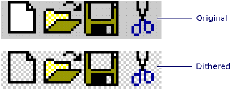

# AfxGetDitheredBitmap
Copies a bitmap, replacing its background with a dithered (checker) pattern.  
  
## Syntax  
  
<CodeContentPlaceHolder>0\</CodeContentPlaceHolder>  
#### Parameters  
 <CodeContentPlaceHolder>1\</CodeContentPlaceHolder>  
 The source bitmap.  
  
 <CodeContentPlaceHolder>2\</CodeContentPlaceHolder>  
 The destination bitmap.  
  
 <CodeContentPlaceHolder>3\</CodeContentPlaceHolder>  
 One of the two dither colors, typically white.  
  
 <CodeContentPlaceHolder>4\</CodeContentPlaceHolder>  
 The other dither color, typically light gray (COLOR_MENU).  
  
## Remarks  
 The source bitmap is copied to the destination bitmap with a two-color (<CodeContentPlaceHolder>5\</CodeContentPlaceHolder> and <CodeContentPlaceHolder>6\</CodeContentPlaceHolder>) checkered pattern replacing the source bitmap's background. The background of the source bitmap is defined as its white pixels and all pixels matching the color of the pixel in the upper-left corner of the bitmap.  
  
   
  
## Example  
 [!code[NVC_MFCDocView#192](../vs140/codesnippet/CPP/afxgetditheredbitmap_1.cpp)]  
  
## Requirements  
 **Header:** afxwin.h  
  
## See Also  
 [Macros and Globals](../vs140/mfc-macros-and-globals.md)   
 [Gray and Dithered Bitmap Functions](../vs140/gray-and-dithered-bitmap-functions.md)   
 [AfxDrawDitheredBitmap](../vs140/afxdrawditheredbitmap.md)   
 [AfxGetGrayBitmap](../vs140/afxgetgraybitmap.md)