# Analyze CPU Usage in a Windows Universal App
  
  
 When you need to investigate performance issues in your app, a good place to start is understanding how it uses the CPU. The **CPU Usage** tool shows you where the CPU is spending time executing code. To focus on specific scenarios, CPU Usage can be run with the [XAML UI Responsiveness](../vs140/analyze-ui-responsiveness-in-store-apps--xaml-.md) tool, the [Energy Consumption](../vs140/analyze-energy-use-in-store-apps.md) tool, or both tools in a single diagnostic session.  
  
> [!NOTE]
>  The **CPU Usage** tool cannot be used with Windows Phone Silverlight 8.1 apps.  
  
 This walkthrough takes you through collecting and analyzing CPU usage for a simple Windows Universal XAML app.  
  
##  \<a name="BKMK_Create_the_CpuUseDemo_project">\</a> Create the CpuUseDemo project  
 **CpuUseDemo** is an app that was created to demonstrate how to collect and analyze CPU usage data. The buttons generate a number by calling a method that selects the maximum value from multiple calls to a function. The called function creates a very large number of random values and then returns the last one. The data is displayed in a text box.  
  
1.  Create a new C# Windows Universal app project named **CpuUseDemo** using the **BlankApp** template.  
  
     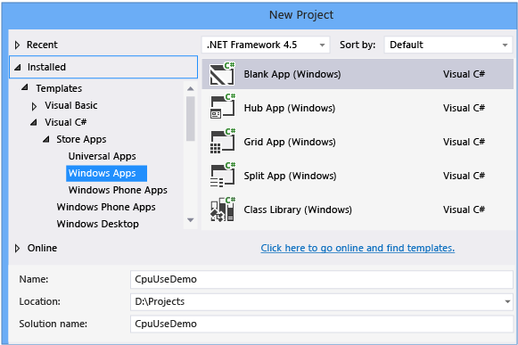  
  
2.  Replace MainPage.xaml with [this code](#BKMK_MainPage_xaml).  
  
3.  Replace MainPage.xaml.cs with [this code](#BKMK_MainPage_xaml_cs).  
  
4.  Build the app and try it out. The app is simple enough to show you some common cases of CPU Usage data analysis.  
  
##  \<a name="BKMK_Collect_CPU_usage_data">\</a> Collect CPU usage data  
   
  
1.  In Visual Studio, set the deployment target to **Simulator** and the solution configuration to **Release**.  
  
    -   Running the app in the simulator lets you switch easily between the app and the Visual Studio IDE.  
  
    -   Running this app in **Release** mode gives you a better view of the actual performance of your app.  
  
2.  On the **Debug** menu, choose **Performance Profiler...**.  
  
3.  In the Performance and Diagnostic hub, choose **CPU Usage** and then choose **Start**.  
  
     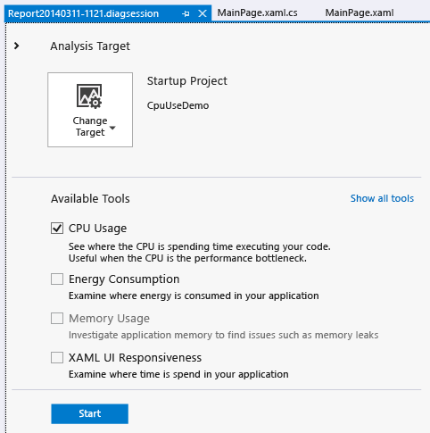  
  
4.  When the app starts, click **Get Max Number**. Wait about a second after the output is displayed, then choose **Get Max Number Async**. Waiting between button clicks makes it easier to isolate the button click routines in the diagnostic report.  
  
5.  After the second output line appears, choose **Stop Collection** in the Performance and Diagnostic hub.  
  
 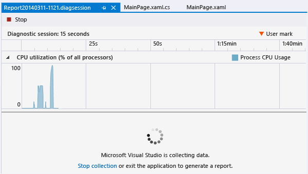  
  
 The CPU Usage tool analyzes the data and displays the report.  
  
 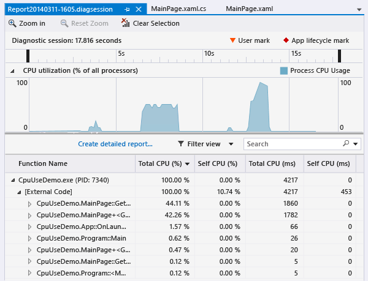  
  
##  \<a name="BKMK_Analyze_the_CPU_Usage_report">\</a> Analyze the CPU Usage report  
  
###  \<a name="BKMK_CPU_utilization_timeline_graph">\</a> CPU utilization timeline graph  
 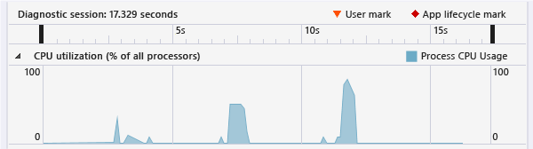  
  
 The CPU utilization graph shows the CPU activity of the app as a percent of all CPU time from all the processor cores on the device. The data of this report was collected on a dual-core machine. The two large spikes represent the CPU activity of the two button clicks. <CodeContentPlaceHolder>2\</CodeContentPlaceHolder> performs synchronously on a single core, so that it makes sense that method’s graph height never exceeds 50%. <CodeContentPlaceHolder>3\</CodeContentPlaceHolder> runs asynchronously across both cores, so it so it again looks right that its spike gets closer to utilizing all of the CPU resources on both cores.  
  
####  \<a name="BKMK_Select_timeline_segments_to_view_details">\</a> Select timeline segments to view details  
 Use the selection bars on the **Diagnostic session** timeline to focus on the GetMaxNumberButton_Click data:  
  
 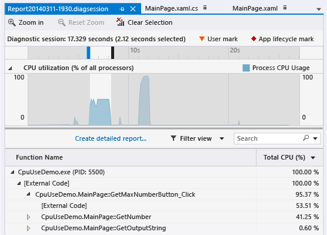  
  
 The **Diagnostic session** timeline now displays the time spent in the selected segment (a bit more than 2 seconds in this report) and filters the call tree to those methods that ran in the selection.  
  
 Now select the <CodeContentPlaceHolder>4\</CodeContentPlaceHolder> segment.  
  
 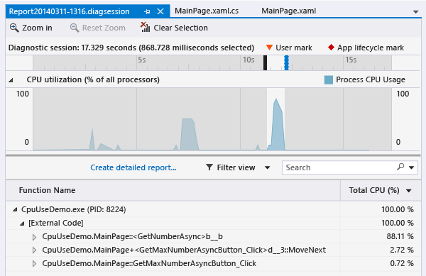  
  
 This method completes about a second faster than <CodeContentPlaceHolder>5\</CodeContentPlaceHolder>, but the meaning of the call tree entries are less obvious.  
  
###  \<a name="BKMK_The_CPU_Usage_call_tree">\</a> The CPU Usage call tree  
 To get started understanding call tree information, reselect the <CodeContentPlaceHolder>6\</CodeContentPlaceHolder> segment, and look at the call tree details.  
  
####  \<a name="BKMK_Call_tree_structure">\</a> Call tree structure  
 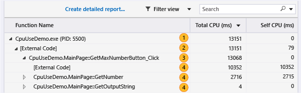  
  
|||  
|-|-|  
||The top-level node in CPU Usage call trees is a pseudo-node|  
||In most apps, when the **Show External Code** option is disabled, the second-level node is an **[External Code]** node that contains the system and framework code that starts and stops the app, draws the UI, controls thread scheduling, and provides other low-level services to the app.|  
||The children of the second-level node are the user-code methods and asynchronous routines that are called or created by the second-level system and framework code.|  
||Child nodes of a method contain data only for the calls of the parent method. When **Show External Code** is disabled, app methods can also contain an **[External Code]** node.|  
  
####  \<a name="BKMK_External_Code">\</a> External Code  
 External code consists of functions in system and framework components that are executed by the code you write. External code includes functions that start and stop the app, draw the UI, control threading, and provide other low-level services to the app. In most cases, you won’t be interested in external code, and so the CPU Usage call tree gathers the external functions of a user method into one **[External Code]** node.  
  
 When you want to view the call paths of external code, choose **Show External Code** from the **Filter view** list and then choose **Apply**.  
  
 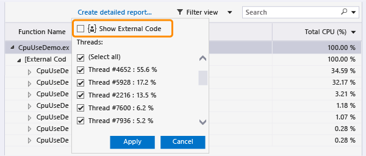  
  
 Be aware that many external code call chains are deeply nested, so that the width of the Function Name column can exceed the display width of all but the largest of computer monitors. When this happens, function names are shown as **[…]**:  
  
 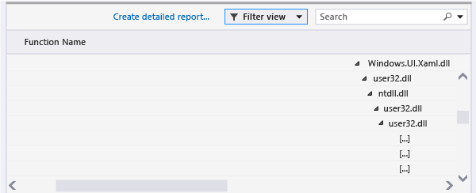  
  
 Use the search box to find a node that you are looking for, then use the horizontal scroll bar to bring the data into view:  
  
 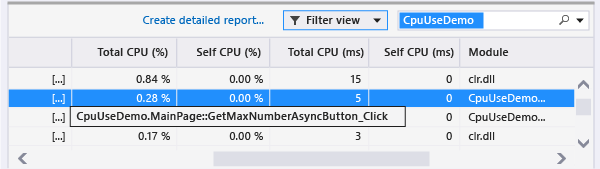  
  
###  \<a name="BKMK_Call_tree_data_columns">\</a> Call tree data columns  
  
|||  
|-|-|  
|**Total CPU (%)**|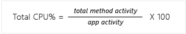\ \  The percentage of the app's CPU activity in the selected time range that was used by calls to the function and the functions called by the function. Note that this is different from the **CPU Utilization** timeline graph, which compares the total activity of the app in a time range to the total available CPU capacity.|  
|**Self CPU (%)**|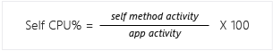\ \  The percentage of the app's CPU activity in the selected time range that was used by the calls to the function, excluding the activity of functions called by the function.|  
|**Total CPU (ms)**|The number of milliseconds spent in calls to the function in the selected time range and the functions that were called by the function.|  
|**Self CPU (ms)**|The number of milliseconds spent in calls to the function in the selected time range and the functions that were called by the function.|  
|**Module**|The name of the module containing the function, or the number of modules containing the functions in an [External Code] node.|  
  
###  \<a name="BKMK_Asynchronous_functions_in_the_CPU_Usage_call_tree">\</a> Asynchronous functions in the CPU Usage call tree  
 When the compiler encounters an asynchronous method, it creates a hidden class to control the method’s execution. Conceptually, the class is a state machine that includes a list of compiler-generated functions that call operations of the original method asynchronously, and the callbacks, scheduler, and iterators required to them correctly. When the original method is called by a parent method, the runtime removes the method from the execution context of the parent, and runs the methods of the hidden class in the context of the system and framework code that control the app’s execution. The asynchronous methods are often, but not always, executed on one or more different threads. This code is shown in the CPU Usage call tree as children of the **[External Code]** node immediately below the top node of the tree.  
  
 To see this in our example, re-select the <CodeContentPlaceHolder>7\</CodeContentPlaceHolder> segment in the timeline.  
  
   
  
 The first two nodes under **[External Code]** are the compiler-generated methods of the state machine class. The third is the call to original method. Expanding the generated methods shows you what’s going on.  
  
 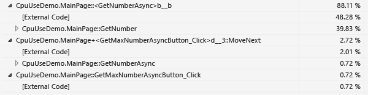  
  
-   <CodeContentPlaceHolder>8\</CodeContentPlaceHolder> does very little; it manages a list of the task values, computes the maximum of the results, and displays the output.  
  
-   <CodeContentPlaceHolder>9\</CodeContentPlaceHolder> shows you the activity required to schedule and launch the 48 tasks that wrap the call to <CodeContentPlaceHolder>10\</CodeContentPlaceHolder>.  
  
-   <CodeContentPlaceHolder>11\</CodeContentPlaceHolder> shows you the activity of the tasks that call <CodeContentPlaceHolder>12\</CodeContentPlaceHolder>.  
  
##  \<a name="BKMK_Next_steps">\</a> Next steps  
 The CpuUseDemo app is not the most brilliant of apps, but you can extend its utility by using it to experiment with asynchronous operation and other tools in the Performance and Diagnostics hub.  
  
-   Note that <CodeContentPlaceHolder>13\</CodeContentPlaceHolder> spends more time in [External Code] than it does executing the GetNumber method. Much of this time is the overhead of the asynchronous operations. Try increasing the number of tasks (set in the <CodeContentPlaceHolder>14\</CodeContentPlaceHolder> constant of MainPage.xaml.cs) and reducing the number of iterations in <CodeContentPlaceHolder>15\</CodeContentPlaceHolder> (change the <CodeContentPlaceHolder>16\</CodeContentPlaceHolder> value). Run the collection scenario and compare the CPU activity of <CodeContentPlaceHolder>17\</CodeContentPlaceHolder>to that in the original CPU Usage diagnostic session. Try reducing the tasks and increasing the iterations.  
  
-   Users often don’t care about the real performance of your app; they do care about the perceived performance and responsiveness of the app. The XAML UI Responsive tool shows you details of activity on the UI thread that effect perceived responsiveness.  
  
     Create a new session in the Diagnostic and Performance hub, and add both the XAML UI Responsive tool and the CPU Usage tool. Run the collection scenario. If you’ve read this far, the report probably doesn’t tell you anything that you haven’t already figured out, but the differences in the **UI Thread utilization** timeline graph for the two methods is striking. In complex, real-world apps, the combination of tools can be very helpful.  
  
##  \<a name="BKMK_MainPage_xaml">\</a> MainPage.xaml  
  
<CodeContentPlaceHolder>0\</CodeContentPlaceHolder>  
##  \<a name="BKMK_MainPage_xaml_cs">\</a> MainPage.xaml.cs  
  
<CodeContentPlaceHolder>1\</CodeContentPlaceHolder>