# Analyze UI responsiveness in Store apps (XAML)
  
  
 Use the **XAML UI Responsiveness** profiler for Store apps to find and fix performance issues related to XAML processing and rendering. Long startup and navigation times, uneven panning and scrolling, and lags in processing user input are some of the issues that the tool can help you analyze.  
  
> [!NOTE]
>  You can collect and analyze CPU usage data and energy consumption data along with the XAML UI responsiveness data. See [Run analysis tools from the Performance and Diagnostic page](../vs140/run-analysis-tools-from-the-performance-and-diagnostic-page.md)  
  
##  \<a name="BKMK_Contents">\</a> Contents  
 [Identify scenarios with user marks](#BKMK_Identify_scenarios_with_user_marks)  
  
 [Collect UI responsiveness data for your app](#BKMK_Collect_UI_Responsiveness_data_for_your_app)  
  
 [Collect UI responsiveness data for an installed app](#BKMK_Collect_energy_profile_data_for_an_installed_app)  
  
 [Analyze UI Responsiveness data](#BKMK_Analyze_UI_Responsiveness_data)  
  
 [Optimize XAML responsiveness](#BKMK_Optimize_XAML_responsiveness)  
  
##  \<a name="BKMK_Identify_scenarios_with_user_marks">\</a> Identify scenarios with user marks  
 You can add *user marks* to your profiling data to help identify areas in the timeline ruler.  
  
 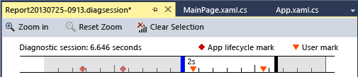  
  
 The mark appears as an orange triangle in the timeline at the time the method executed. The message and the time are displayed as a tooltip when you hover over the mark. If two or more user marks are close together, the marks are merged and the tooltip data is combined. You can zoom in on the timeline to separate the marks.  
  
 To add a user mark to C#, Visual Basic, C++ code, first create a [Windows.Foundation.Diagnostics LoggingChannel](http://msdn.microsoft.com/library/windows/apps/windows.foundation.diagnostics.loggingchannel.aspx) object. Then insert calls to [LoggingChannel.LogMessage](http://msdn.microsoft.com/library/windows/apps/dn264210.aspx) methods at the points in your code that you want to mark. Use [LoggingLevel.Information](http://msdn.microsoft.com/library/windows/apps/windows.foundation.diagnostics.logginglevel.aspx) in the calls.  
  
 When the method executes, a user mark is added to the profiling data along with a message.  
  
> [!NOTE]
>  -   Windows.Foundation.Diagnostics.LoggingChannel implements the [Windows.Foundation.IClosable](http://msdn.microsoft.com/library/windows/apps/windows.foundation.iclosable.aspx) interface  (projected as [System.IDisposable](http://msdn.microsoft.com/library/System.IDisposable.aspx) in C# and VB).To avoid leaking operating system resources, call \<xref:Windows.Foundation.Diagnostics.LoggingChannel.Dispose*>() when you are finished with a logging channel.  
> -   Each open logging channel must have a unique name. Attempting to create a new logging channel with the same name as an undisposed channel causes an exception.  
  
 See the Windows SDK Sample [LoggingSession Sample](http://code.msdn.microsoft.com/windowsapps/LoggingSession-Sample-ccd52336) for examples.  
  
##  \<a name="BKMK_Collect_UI_Responsiveness_data_for_your_app">\</a> Collect UI responsiveness data for your app  
 You can profile the responsiveness of your app on the Visual Studio device, the Visual Studio simulator or emulators, or on a remote device. See [Run Windows Store apps from Visual Studio](../vs140/run-store-apps-from-visual-studio.md). Here are the basic steps:  
  
1.  Choose where you want to run the app from the drop-down list next to the **Start Debugging** button on the debugger Standard toolbar.  
  
     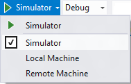  
  
2.  When you are profiling on a tablet or PC that is not the same as the Visual Studio computer, configure your project for remote profiling. See [Run Windows Store apps on a remote machine from Visual Studio](../vs140/run-windows-store-apps-on-a-remote-machine.md)  
  
3.  On the **Debug** menu, choose **Start Diagnostics Without Debugging**.  
  
     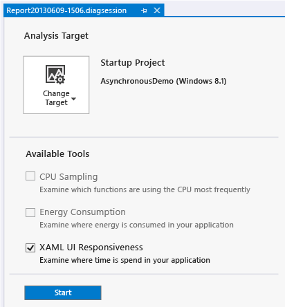  
  
4.  Choose **XAML UI Responsiveness** and then choose **Start**.  
  
    > [!NOTE]
    >  When you start the **XAML UI Responsiveness** profiler, you might see a User Account Control window requesting your permission to run VsEtwCollector.exe. Choose **Yes**.  
  
5.  Run your app to collect data.  
  
    > [!TIP]
    >  Run the app directly on the device. The application performance observed on the simulator or through a remote desktop connection might not be indicative of the actual performance on the device.  
  
6.  To stop profiling, switch back to Visual Studio (Alt + Tab) and choose **Stop collection** on the **Performance and Diagnostics** page.  
  
     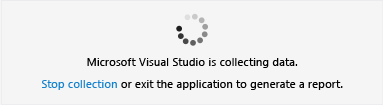  
  
     Visual Studio analyzes the collected data and displays the results.  
  
     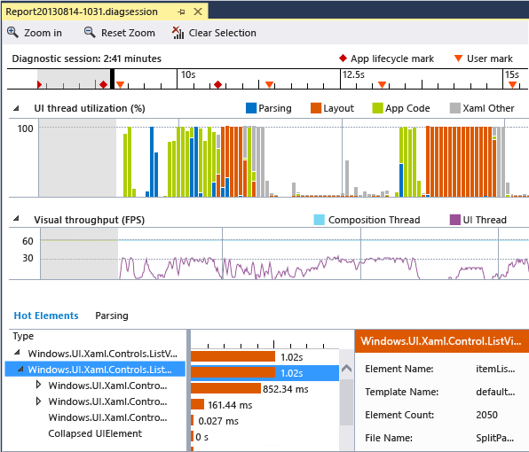  
  
##  \<a name="BKMK_Collect_energy_profile_data_for_an_installed_app">\</a> Collect UI responsiveness data for an installed app  
 The **XAML UI Responsiveness** profiler can only be run on Window Store 8.1 apps that are launched from a Visual Studio solution or are installed from the Windows store. When a solution is open in Visual Studio, the default target is the **Startup Project**. You can profile XAML Responsiveness for an installed app on the local or on a remote device without an open solution.  
  
 To target an installed app:  
  
1.  Choose **Change Target** and then choose **Installed App**.  
  
     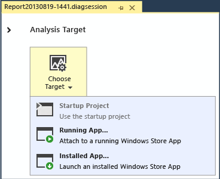  
  
2.  **Remote profiling.** To run the XAML responsiveness profiler on a remote device, the Visual Studio Remote Tools must be installed and running on the device. See [Debug and test Windows Store apps on a remote machine from Visual Studio](../vs140/run-windows-store-apps-on-a-remote-machine.md).  
  
     On the **Select Installed App Package** dialog box, choose **Remote Machine** and then specify the remote device.  
  
     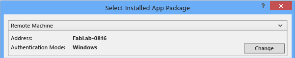  
  
3.  From the **App packages installed for current session** list, choose the target app.  
  
     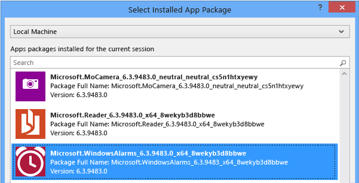  
  
4.  Choose **XAML UI Responsiveness** on the Performance and Diagnostics page.  
  
5.  Choose **Start** to begin profiling.  
  
 To stop profiling, switch back to Visual Studio (Alt + Tab) and choose **Stop collection** on the Diagnostic hub page.  
  
##  \<a name="BKMK_Analyze_UI_Responsiveness_data">\</a> Analyze UI Responsiveness data  
 [Diagnostic session timeline](#BKMK_Diagnostic_session_timeline) **&#124;** [UI Thread utilization](#BKMK_CPU_utilization) **&#124;** [Visual throughput (FPS)](#BKMK_Visual_throughput__FPS_) **&#124;** [Parsing view](#BKMK_Parsing_view) **&#124;** [Hot Elements view](#BKMK_Hot_Elements_view)  
  
 After you have collected the profiling data, you can use these steps to start your analysis:  
  
1.  Examine the information in the **UI thread utilization** and **Visual throughput (FPS)** graphs and then use the timeline navigation bars to select a time range that you want to analyze.  
  
2.  Using the information in the **UI thread utilization** or **Visual throughput (FPS)** graphs, examine the details in the **Parsing** or **Hot Elements** views to discover possible causes for any apparent lack of responsiveness.  
  
###  \<a name="BKMK_Diagnostic_session_timeline">\</a> Diagnostic session timeline  
 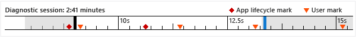  
  
 The ruler at the top of the **Performance and Diagnostics** page shows the timeline for profiled information. This timeline applies to both the **UI thread utilization** graph and the **Visual throughput** graph. You can narrow the scope of the report by dragging the navigation bars on the timeline to select a segment of the timeline.  
  
 The timeline also displays any user marks that you have inserted, and the app's activation lifecycle events.  
  
###  \<a name="BKMK_CPU_utilization">\</a> UI thread utilization  
 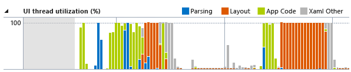  
  
 The **UI thread utilization (%)** graph displays the relative amount of time spent on the UI thread for these categories:  
  
|||  
|-|-|  
|**Parsing**|Indicates time spent on the UI thread parsing XAML and retrieving app resources.|  
|**Layout**|Indicates the time spent on the UI Thread laying out XAML elements.|  
|**App Code**|Indicates time spent on the UI thread executing application (user) code that is not related to parsing or layout.|  
|**Xaml Other**|Indicates time spent on the UI thread executing XAML runtime code.|  
  
###  \<a name="BKMK_Visual_throughput__FPS_">\</a> Visual throughput (FPS)  
 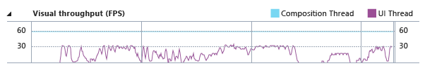  
  
 The **Visual throughput (FPS)** line graph shows the frames per second (FPS) on the UI and composition thread for the app. The values are what you would see in the chrome of an app when \<xref:Windows.UI.Xaml.DebugSettings.EnableFrameRateCounter*> is enabled.  
  
###  \<a name="BKMK_Parsing_view">\</a> Parsing view  
 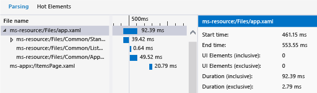  
  
 The **Parsing** view contains a horizontal bar chart of the XAML files that are loaded and processed in the selected portion of the timeline. The children of a XAML file node are files that are included by the node file. Nodes are listed in the order that they were loaded. The details pain displays these values for a selected file.  
  
 **Inclusive and exclusive values**  
  
|||  
|-|-|  
|**Duration Exclusive**|The time taken to process the elements defined explicitly in this node.|  
|**Duration Inclusive**|The time taken to process the elements defined in this node and in all child nodes.|  
|**UI Elements (Exclusive)**|The number of elements defined explicitly in this node.|  
|**UI Elements (Inclusive)**|The number of elements defined explicitly in this node and in all child nodes.|  
  
###  \<a name="BKMK_Hot_Elements_view">\</a> Hot Elements view  
 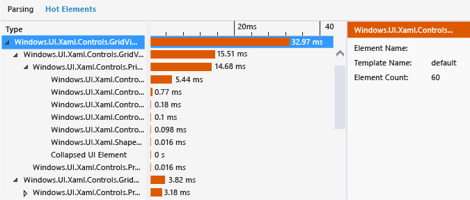  
  
 The **Hot Elements** view contains a horizontal bar graph that represents all the elements that participate in layout during the selected portion on the timeline. The elements are grouped by their template and sorted in descending order by the time they took for layout.  
  
 The children of an element node are the elements that are contained by the element of the parent node. Child nodes are also ordered by their layout time. The details view displays name and timing values for a selected element.  
  
##  \<a name="BKMK_Optimize_XAML_responsiveness">\</a> Optimize XAML responsiveness  
 One of the best places to look for information about optimizing the performance of your app are topics in [Performance best practices for Windows Store apps using C++, C#, and Visual Basic](assetId:///567bcefa-5da5-4e42-a4b8-1358c71adfa2).  
  
 Here are some ideas about optimizing XAML performance:  
  
 **Optimize startup and page navigation**  
  
 You can speed up your app’s startup and page navigation by carefully examining the XAML, resource, and data files that your pages load. Your app can appear slow if the XAML files create or reference a large number of UI elements that are not needed when the page first loads, if resource files are loaded that reference templates and styles that are not applicable to the current page, or if the same XAML or resource file is loaded more than once.  For techniques to address these issues, see one of these topics:  
  
-   [Optimize loading XAML (Windows Store apps using C#/VB/C++ and XAML)](assetId:///8f3da3a8-0f5b-4d68-a7ef-d36927086962)  
  
-   [Minimize startup time (Windows Store apps using C#/VB/C++ and XAML)](assetId:///b38f6c63-520b-4bf6-a47a-9a4af6303e71)  
  
-   [Access the file system efficiently (Windows Store apps using C#/VB/C++ and XAML)](assetId:///f28c5219-5b9a-4d97-83b5-fc127dac78b6)  
  
 **Optimize panning and scrolling**  
  
 Panning and scrolling performance issues can be caused by not using a virtualizing container, templates that are large and complex, or inefficient algorithms in custom per-frame callback methods. For techniques to address these issues, see one of these topics:  
  
-   [Load, store, and display large sets of data efficiently (Windows Store apps using C#/VB/C++ and XAML)](assetId:///1c3dd885-c2e9-4f1c-980f-d815bf500505)  
  
-   [Make animations smooth (Windows Store apps using C#/VB/C++ and XAML)](assetId:///74e5bd5c-d140-4c33-94d2-21b3210241b2)  
  
 **Optimize input responsiveness**  
  
 For techniques to address these issues, see [Keep the UI thread responsive (Windows Store apps using C#/VB/C++ and XAML)](assetId:///e8d5cf06-d185-48bd-8701-07ba692582ff)