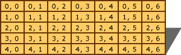

# Arrays (C++)
An array is a collection of like objects. The simplest case of an array is a vector, which may be declared by the following sequence:  
  
<CodeContentPlaceHolder>0\</CodeContentPlaceHolder>  
 1. The declaration specifier:  
  
-   An optional storage class specifier.  
  
-   Optional **const** and/or <CodeContentPlaceHolder>5\</CodeContentPlaceHolder> specifiers.  
  
-   The type name of the elements of the array.  
  
 2. The declarator:  
  
-   The identifier.  
  
-   A constant expression of integral type enclosed in brackets, **[].** If multiple dimensions are declared using additional brackets, the constant expression may be omitted on the first set of brackets.  
  
-   Optional additional brackets enclosing constant expressions.  
  
 3. An optional initializer.  See [Initializers](../vs140/initializers.md).  
  
 The number of elements in the array is given by the constant expression. The first element in the array is the 0th element, and the last element is the (*n*-1) element, where *n* is the number of elements the array can contain. The *constant-expression* must be of an integral type and must be greater than 0. A zero-sized array is legal only when the array is the last field in a <CodeContentPlaceHolder>6\</CodeContentPlaceHolder> or **union** and when the Microsoft extensions (/Ze) are enabled.  
  
 The following example shows how to define an array at run time:  
  
<CodeContentPlaceHolder>1\</CodeContentPlaceHolder>  
 Arrays are derived types and can therefore be constructed from any other derived or fundamental type except functions, references, and <CodeContentPlaceHolder>7\</CodeContentPlaceHolder>.  
  
 Arrays constructed from other arrays are multidimensional arrays. These multidimensional arrays are specified by placing multiple bracketed constant expressions in sequence. For example, consider this declaration:  
  
<CodeContentPlaceHolder>2\</CodeContentPlaceHolder>  
 It specifies an array of type <CodeContentPlaceHolder>8\</CodeContentPlaceHolder>, conceptually arranged in a two-dimensional matrix of five rows and seven columns, as shown in the following figure:  
  
   
Conceptual Layout of Multidimensional Array  
  
 In declarations of multidimensioned arrays that have an initializer list (as described in [Initializers](../vs140/initializers.md)), the constant expression that specifies the bounds for the first dimension can be omitted. For example:  
  
<CodeContentPlaceHolder>3\</CodeContentPlaceHolder>  
 The preceding declaration defines an array that is three rows by four columns. The rows represent factories and the columns represent markets to which the factories ship. The values are the transportation costs from the factories to the markets. The first dimension of the array is left out, but the compiler fills it in by examining the initializer.  
  
 Topics in this section:  
  
-   [Using Arrays](../vs140/using-arrays--c---.md)  
  
-   [Arrays in Expressions](../vs140/arrays-in-expressions.md)  
  
-   [Interpretation of Subscript Operator](../vs140/interpretation-of-subscript-operator.md)  
  
-   [Indirection on Array Types](../vs140/indirection-on-array-types.md)  
  
-   [Ordering of C++ Arrays](../vs140/ordering-of-c---arrays.md)  
  
## Example  
 The technique of omitting the bounds specification for the first dimension of a multidimensional array can also be used in function declarations as follows:  
  
<CodeContentPlaceHolder>4\</CodeContentPlaceHolder>  
 **The minimum cost to Market 3 is: 17.29**   
## Comments  
 The function <CodeContentPlaceHolder>9\</CodeContentPlaceHolder> is written such that adding new factories does not require any code changes, just a recompilation.  
  
## See Also  
 [C++ Abstract Declarators](assetId:///e7e18c18-0cad-4450-942b-d27e1d4dd088)