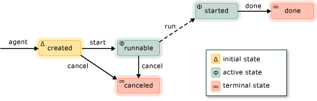

# Asynchronous Agents
An *asynchronous agent* (or just *agent*) is an application component that works asynchronously with other agents to solve larger computing tasks. Think of an agent as a task that has a set life cycle. For example, one agent might read data from an input/output device (such as the keyboard, a file on disk, or a network connection) and another agent might perform action on that data as it becomes available. The first agent uses message passing to inform the second agent that more data is available. The Concurrency Runtime task scheduler provides an efficient mechanism to enable agents to block and yield cooperatively without requiring less efficient preemption.  
  
 The Agents Library defines the [concurrency::agent](../vs140/agent-class.md) class to represent an asynchronous agent. <CodeContentPlaceHolder>0\</CodeContentPlaceHolder> is an abstract class that declares the virtual method [concurrency::agent::run](../vs140/agent--run-method.md). The <CodeContentPlaceHolder>1\</CodeContentPlaceHolder> method executes the task that is performed by the agent. Because <CodeContentPlaceHolder>2\</CodeContentPlaceHolder> is abstract, you must implement this method in every class that you derive from <CodeContentPlaceHolder>3\</CodeContentPlaceHolder>.  
  
## Agent Life Cycle  
 Agents have a set life cycle. The [concurrency::agent_status](../vs140/agent_status-enumeration.md) enumeration defines the various states of an agent. The following illustration is a state diagram that shows how agents progress from one state to another. In this illustration, solid lines represent methods that you call from your application; dotted lines represent methods that are called from the runtime.  
  
   
  
 The following table describes each state in the <CodeContentPlaceHolder>4\</CodeContentPlaceHolder> enumeration.  
  
|Agent State|Description|  
|-----------------|-----------------|  
|<CodeContentPlaceHolder>5\</CodeContentPlaceHolder>|The agent has not been scheduled for execution.|  
|<CodeContentPlaceHolder>6\</CodeContentPlaceHolder>|The runtime is scheduling the agent for execution.|  
|<CodeContentPlaceHolder>7\</CodeContentPlaceHolder>|The agent has started and is running.|  
|<CodeContentPlaceHolder>8\</CodeContentPlaceHolder>|The agent finished.|  
|<CodeContentPlaceHolder>9\</CodeContentPlaceHolder>|The agent was canceled before it entered the <CodeContentPlaceHolder>10\</CodeContentPlaceHolder> state.|  
  
 <CodeContentPlaceHolder>11\</CodeContentPlaceHolder> is the initial state of an agent, <CodeContentPlaceHolder>12\</CodeContentPlaceHolder> and <CodeContentPlaceHolder>13\</CodeContentPlaceHolder> are the active states, and <CodeContentPlaceHolder>14\</CodeContentPlaceHolder> and <CodeContentPlaceHolder>15\</CodeContentPlaceHolder> are the terminal states.  
  
 Use the [concurrency::agent::status](../vs140/agent--status-method.md) method to retrieve the current state of an <CodeContentPlaceHolder>16\</CodeContentPlaceHolder> object. Although the <CodeContentPlaceHolder>17\</CodeContentPlaceHolder> method is concurrency-safe, the state of the agent can change by the time the <CodeContentPlaceHolder>18\</CodeContentPlaceHolder> method returns. For example, an agent could be in the <CodeContentPlaceHolder>19\</CodeContentPlaceHolder> state when you call the <CodeContentPlaceHolder>20\</CodeContentPlaceHolder> method, but moved to the <CodeContentPlaceHolder>21\</CodeContentPlaceHolder> state just after the <CodeContentPlaceHolder>22\</CodeContentPlaceHolder> method returns.  
  
## Methods and Features  
 The following table shows some of the important methods that belong to the <CodeContentPlaceHolder>23\</CodeContentPlaceHolder> class. For more information about all of the <CodeContentPlaceHolder>24\</CodeContentPlaceHolder> class methods, see [agent Class](../vs140/agent-class.md).  
  
|Method|Description|  
|------------|-----------------|  
|[start](../vs140/agent--start-method.md)|Schedules the <CodeContentPlaceHolder>25\</CodeContentPlaceHolder> object for execution and sets it to the <CodeContentPlaceHolder>26\</CodeContentPlaceHolder> state.|  
|[run](../vs140/agent--run-method.md)|Executes the task that is to be performed by the <CodeContentPlaceHolder>27\</CodeContentPlaceHolder> object.|  
|[done](../vs140/agent--done-method.md)|Moves an agent to the <CodeContentPlaceHolder>28\</CodeContentPlaceHolder> state.|  
|[cancel](../vs140/agent--cancel-method.md)|If the agent was not started, this method cancels execution of the agent and sets it to the <CodeContentPlaceHolder>29\</CodeContentPlaceHolder> state.|  
|[status](../vs140/agent--status-method.md)|Retrieves the current state of the <CodeContentPlaceHolder>30\</CodeContentPlaceHolder> object.|  
|[wait](../vs140/agent--wait-method.md)|Waits for the <CodeContentPlaceHolder>31\</CodeContentPlaceHolder> object to enter the <CodeContentPlaceHolder>32\</CodeContentPlaceHolder> or <CodeContentPlaceHolder>33\</CodeContentPlaceHolder> state.|  
|[wait_for_all](../vs140/agent--wait_for_all-method.md)|Waits for all provided <CodeContentPlaceHolder>34\</CodeContentPlaceHolder> objects to enter the <CodeContentPlaceHolder>35\</CodeContentPlaceHolder> or <CodeContentPlaceHolder>36\</CodeContentPlaceHolder> state.|  
|[wait_for_one](../vs140/agent--wait_for_one-method.md)|Waits for at least one of the provided <CodeContentPlaceHolder>37\</CodeContentPlaceHolder> objects to enter the <CodeContentPlaceHolder>38\</CodeContentPlaceHolder> or <CodeContentPlaceHolder>39\</CodeContentPlaceHolder> state.|  
  
 After you create an agent object, call the [concurrency::agent::start](../vs140/agent--start-method.md) method to schedule it for execution. The runtime calls the <CodeContentPlaceHolder>40\</CodeContentPlaceHolder> method after it schedules the agent and sets it to the <CodeContentPlaceHolder>41\</CodeContentPlaceHolder> state.  
  
 The runtime does not manage exceptions that are thrown by asynchronous agents. For more information about exception handling and agents, see [Exception Handling in the Concurrency Runtime](../vs140/exception-handling-in-the-concurrency-runtime.md).  
  
## Example  
 For an example that shows how to create a basic agent-based application, see [Walkthrough: Creating an Agent-Based Application](../vs140/walkthrough--creating-an-agent-based-application.md).  
  
## See Also  
 [Asynchronous Agents Library](../vs140/asynchronous-agents-library.md)