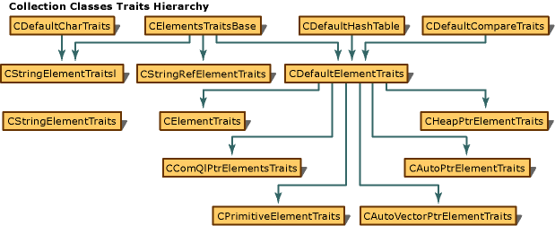

# ATL Collection Classes
ATL provides many classes for storing and accessing data. Which class you decide to use depends on several factors, including:  
  
-   The amount of data to be stored  
  
-   Efficiency versus performance in accessing the data  
  
-   The ability to access the data by index or by key  
  
-   How the data is ordered  
  
-   Personal preference  
  
## Small Collection Classes  
 ATL provides the following array classes for dealing with small numbers of objects. However, these classes are limited and designed for use internally by ATL. It is not recommended that you use them in your programs.  
  
|Class|Type of data storage|  
|-----------|--------------------------|  
|[CSimpleArray](../vs140/csimplearray-class.md)|Implements an array class for dealing with small numbers of objects.|  
|[CSimpleMap](../vs140/csimplemap-class.md)|Implements a mapping class for dealing with small numbers of objects.|  
  
## General Purpose Collection Classes  
 The follow classes implement arrays, lists, and maps and are provided as general purpose collection classes:  
  
|Class|Type of data storage|  
|-----------|--------------------------|  
|[CAtlArray](../vs140/catlarray-class.md)|Implements an array.|  
|[CAtlList](../vs140/catllist-class.md)|Implements a list.|  
|[CAtlMap](../vs140/catlmap-class.md)|Implements a mapping structure, whereby data can be referenced by key or value.|  
|[CRBMap](../vs140/crbmap-class.md)|Implements a mapping structure using the Red-Black algorithm.|  
|[CRBMultiMap](../vs140/crbmultimap-class.md)|Implements a Red-Black multimapping structure.|  
  
 These classes will trap many programming errors when used in debug builds, but for sake of performance, these checks will not be performed in retail builds.  
  
## Specialized Collection Classes  
 More specialized collection classes are also provided for managing memory pointers and interface pointers:  
  
|Class|Purpose|  
|-----------|-------------|  
|[CAutoPtrArray](../vs140/cautoptrarray-class.md)|Provides methods useful when constructing an array of smart pointers.|  
|[CAutoPtrList](../vs140/cautoptrlist-class.md)|Provides methods useful when constructing a list of smart pointers.|  
|[CComUnkArray](../vs140/ccomunkarray-class.md)|Stores `IUnknown` pointers and is designed to be used as a parameter to the [IConnectionPointImpl](../vs140/iconnectionpointimpl-class.md) template class.|  
|[CHeapPtrList](../vs140/cheapptrlist-class.md)|Provides methods useful when constructing a list of heap pointers.|  
|[CInterfaceArray](../vs140/cinterfacearray-class.md)|Provides methods useful when constructing an array of COM interface pointers.|  
|[CInterfaceList](../vs140/cinterfacelist-class.md)|Provides methods useful when constructing a list of COM interface pointers.|  
  
## Choosing a Collection Class  
 Each of the available collection classes offers different performance characteristics, as shown in the table below.  
  
-   Columns 2 and 3 describe each class's ordering and access characteristics. In the table, the term "ordered" means that the order in which items are inserted and deleted determines their order in the collection; it does not mean the items are sorted on their contents. The term "indexed" means that the items in the collection can be retrieved by an integer index, much like items in a typical array.  
  
-   Columns 4 and 5 describe each class's performance. In applications that require many insertions into the collection, insertion speed might be especially important; for other applications, lookup speed may be more important.  
  
-   Column 6 describes whether each shape allows duplicate elements.  
  
-   The performance of a given collection class operation is expressed in terms of the relationship between the time required to complete the operation and the number of elements in the collection. An operation taking an amount of time that increases linearly as the number of elements increases is described as an O(n) algorithm. By contrast, an operation taking a period of time that increases less and less as the number of elements increases is described as an O(log n) algorithm. Therefore, in terms of performance, O(log n) algorithms outperform O(n) algorithms more and more as the number of elements increases.  
  
### Collection Shape Features  
  
|Shape|Ordered?|Indexed?|Insert an   element|Search for   specified element|Duplicate   elements?|  
|-----------|--------------|--------------|---------------------------|--------------------------------------|-----------------------------|  
|List|Yes|No|Fast (constant time)|Slow O(n)|Yes|  
|Array|Yes|By int (constant time)|Slow O(n) except if inserting at end, in which case constant time|Slow O(n)|Yes|  
|Map|No|By key (constant time)|Fast (constant time)|Fast (constant time)|No (keys) Yes (values)|  
|Red-Black Map|Yes (by key)|By key O(log n)|Fast O(log n)|Fast O(log n)|No|  
|Red-Black Multimap|Yes (by key)|By key O(log n) (multiple values per key)|Fast O(log n)|Fast O(log n)|Yes (multiple values per key)|  
  
## Using CTraits Objects  
 As the ATL collection classes can be used to store a wide range of user-defined data types, it can be useful to be able to override important functions such as comparisons. This is achieved using the CTraits classes.  
  
 CTraits classes are similar to, but more flexible than, the MFC collection class helper functions; see [Collection Class Helpers](../vs140/collection-class-helpers.md) for more information.  
  
 When constructing your collection class, you have the option of specifying a CTraits class. This class will contain the code that will perform operations such as comparisons when called by the other methods that make up the collection class. For example, if your list object contains your own user-defined structures, you may want to redefine the equality test to only compare certain member variables. In this way, the list object's Find method will operate in a more useful manner.  
  
## Example  
  
### Code  
 [!code[NVC_ATL_Utilities#112](../vs140/codesnippet/CPP/atl-collection-classes_1.cpp)]  
  
## Comments  
 For a list of the CTraits classes, see [Collection Classes](../vs140/collection-classes.md).  
  
 The following diagram shows the class hierarchy for the CTraits classes.  
  
   
  
## Collection Classes Samples  
 The following samples demonstrate the collection classes:  
  
-   [MMXSwarm Sample](../vs140/visual-c---samples.md)  
  
-   [DynamicConsumer Sample](../vs140/visual-c---samples.md)  
  
-   [UpdatePV Sample](../vs140/visual-c---samples.md)  
  
-   [Marquee Sample](../vs140/visual-c---samples.md)  
  
## See Also  
 [Concepts](../vs140/active-template-library--atl--concepts.md)   
 [Collection Classes](../vs140/collection-classes.md)