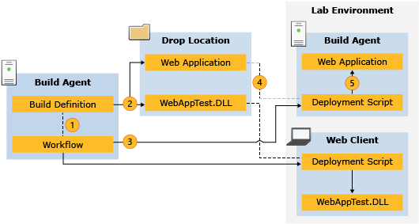

# Automated build-deploy-test workflows
You can use a build-deploy-test workflow on Team Foundation Server to deploy and [test](../vs140/automate-system-tests.md) your application when you [run a build](assetId:///a971b0f9-7c28-479d-a37b-8fd7e27ef692). This lets you schedule and run the build, deployment, and testing of your application with one build process. Build-deploy-test workflows work with [Lab Management](assetId:///14ba54c8-a158-4a6e-b00a-b00ae960feb8) to deploy your applications to a lab environment and run tests on them as part of the build process.  
  
 If your lab environment is an [SCVMM environment](assetId:///386f79b2-dfdd-46c3-b481-5d7a627175d3), you can also use workflows to create and restore snapshots that automatically create a clean environment before you run tests, and to save the state of your environment when a test fails. This ensures that each test isn’t influenced by changes to the lab environment from previous test runs. In addition, it ensures that testers can accurately reproduce that state of a lab environment when they reproduce bugs.  
  
 **Requirements**  
  
-   Visual Studio Enterprise, [!INCLUDE[vstsTestEssLong](../vs140/includes/vststestesslong_md.md)]  
  
 You can use a build-deploy-test workflow in the following scenarios:  
  
> [!TIP]
>  **Build, or Build and Test**: If you are building your application in a drop folder without deploying it to a lab environment, then you can use the default build process template. For more information, see [Define a Build Process that is Based on the Default Template](assetId:///43930b12-c21b-4599-a980-2995e3d16e31). If you also want to test your application without deploying it, see [Run Tests in Your Build Process](assetId:///d05743a1-c5cf-447e-bed9-bed3cb595e38)  
  
-   **Build, Deploy, and Test** − Build your application, then deploy it and run automated tests on it in a lab environment. This workflow enables you to run a series of tests from a test plan, on a deployed application, as part of your build process. This scenario is common when running **build verification tests**.  
  
-   **Deploy and Test** − This scenario is similar to the “build, deploy, and test” scenario, except a new build isn’t created during the workflow. Instead, the workflow uses an existing build from a drop folder.  
  
-   **Deploy Only** – Deploy an existing build from a drop folder to a lab environment without running automated tests during the workflow. Once a build has passed your build verification tests, and is ready to be sent to a test team, you might want to send that specific build to the test team so they can run additional tests that aren’t part of your workflow. This scenario is common when running **manual tests**.  
  
-   **Build and Deploy** – This scenario is similar to the “deploy only” scenario, except a new build is created during the workflow.  
  
 A build-deploy-test workflow is a Windows Workflow file that defines how a *build definition* will run a build, deploy an application, and run tests. A build-deploy-test workflow is created in a build definition by choosing a *build process template* called the lab default template (LabDefaultTemplate.11.xaml), and configuring the settings. You can also create a customized build process template for your workflow depending on your requirements. You configure your build definition after you set up your build machine, test machines, and lab environments.  
  
 The deployment settings in a build-deploy-test workflow define how an application is deployed by specifying the deployment scripts to run on specific machines in your lab environment. You can specify a lab management role to run each deployment script on, or you can specify a specific machine in your lab environment. Creating deployment scripts is a major part of setting up build-deploy-test workflows. Deployment scripts copy files from your build to your lab environment, and then run your installation packages.  
  
 The following diagram describes how a build is deployed by a build-deploy-test workflow:  
  
   
  
 The following steps are displayed in the diagram above.  
  
1.  The build-deploy-test workflow starts a build, and then gets the deployment scripts.  
  
2.  The build definition copies the build files to the drop location.  
  
3.  The workflow runs each deployment script in the working directory of the specific machine or machine role that the script is assigned to.  
  
4.  Each deployment script retrieves build files from the drop location.  
  
5.  Each deployment script copies or installs the specified build files onto machines in the lab environment.  
  
## Prerequisites  
 You must complete these steps before you set up a build-deploy-test workflow.  
  
1.  **Configure Team Foundation Build Service**  
  
     Set up a build configuration for your team project collection using the Administration Console for your Team Foundation Server. When you set up your build configuration, you will select build controllers and build agents to use when building and deploying your application. For information on setting up your build configuration, see **How to Configure a Build Machine**.  
  
2.  **Set up a test controller**  
  
     Install a test controller and register it with your team project collection: [Setting Up Test Controllers in Lab Environments with Microsoft Test Manager](assetId:///f5113275-14f5-4a40-8e3a-50d347ddb83a).  
  
3.  **Set up a lab environment**  
  
     Set up a lab environment. Your lab environment can be an SCVMM environment or a standard environment. When you set up your lab environment, test agents will be installed on each machine in the environment. For information about creating a lab environment, see [Using a Lab Environment for Your Application Lifecycle](assetId:///14ba54c8-a158-4a6e-b00a-b00ae960feb8).  
  
4.  **Additional steps to run automated tests from a test plan in a lab environment**  
  
     Before running automated tests from a test plan, you must first associate your automated tests with test cases from that test plan. When you run automated tests from a test plan, you must use a lab environment. To create a test plan and associate your automated test with it, you must carry out the following tasks.  
  
    1.  Create a test plan and test suite: [Defining Your Testing Effort Using Test Plans](../vs140/plan-manual-tests-with-microsoft-test-manager.md)  
  
    2.  Associate your automated tests with test cases from your test suite: [How to Associate an Automated Test with a Test Case](../vs140/automate-a-test-case-in-microsoft-test-manager.md)  
  
## Tasks  
 Use the following topics to set up your build-deploy-test workflow to deploy your application or to run tests on your application as part of a build process:  
  
|Topic|Description|  
|-----------|-----------------|  
|**Create deployment scripts for your build-deploy-test workflow:** To deploy your application, you must first create deployment scripts for your build-deploy-test workflow. Deployment scripts copy parts of your build to specific machines in your lab environment. In addition, if your build contains a web deployment package or installation package, your deployment scripts must run those packages.|-   [Creating Deployment Scripts for a Build-Deploy-Test Workflows](assetId:///1c86cd25-91c4-4dfa-a09f-aa4e16c9be18)|  
|**Create your build-deploy-test workflow:** You can set up a build-deploy-test workflow with a standard environment, or an SCVMM environment. If you are using an SCVMM environment, you can also use a build process to restore your environment with a snapshot before you run tests, and create a snapshot after your application is deployed.|-   [How to: Deploy an Application to a Standard Environment](assetId:///f448c943-73e9-4265-98a2-ca11138e4948) -   [How to: Deploy an Application to an SCVMM Environment](assetId:///4464d4df-6aa9-4d7b-882d-917d693a63b9)|  
|**Accommodate additional build-deploy-test requirements by customizing your workflow:** If you have additional requirements that the default build process template doesn’t meet, you can create a custom build process template.|-   [Customizing Lab Management Workflow](assetId:///1c15910f-8952-4313-bb9d-87daaab3f67a)|  
|**Run Tests as part of your build-deploy-test workflow, or after your workflow is complete:** You can run automated tests as part of your build-deploy-test workflow, or you can run manual and automated tests after your workflow is complete.|-   [Running Tests using Lab Environments](assetId:///14ba54c8-a158-4a6e-b00a-b00ae960feb8)|  
  
## See Also  
 [Testing the Application](../vs140/test-apps-early-and-often.md)