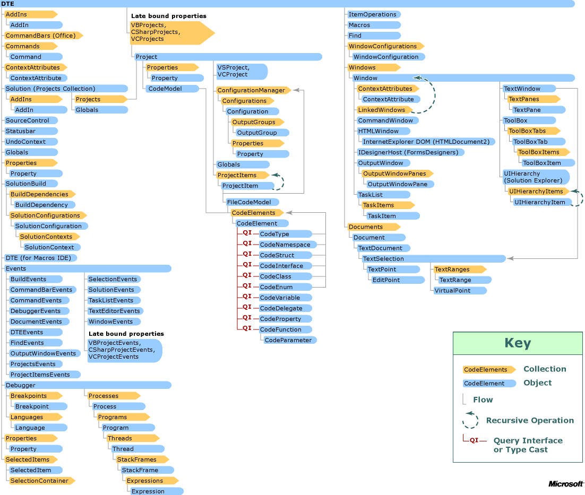

# Automation Model Overview
The automation model consists of a set of objects against which you can write a Visual Studio add-in or extension. An add-in is an application that can manipulate the Visual Studio environment and automate common tasks. A Visual Studio extension can create custom Visual Studio components or add to the functionality of standard components such as the text editor.  
  
## Objects in the Automation Model  
 The automation model consists of related groups of objects that control major facets of the common environment. The following is a diagram that shows the extensive set of objects that compose the automation model.  
  
   
Visual Studio automation objects  
  
 For more information, see [Extending the Visual Studio Environment](assetId:///4173a963-7ac7-4966-9bb7-e28a9d9f6792).  
  
 The environment provides a model for different functional areas. For instance, there is a code model for various elements that you might find in code. There is a document model for various document elements. One area, the project area, is of particular interest to VSPackage providers. You will likely want your new project types to contribute to the automation model in much the same way as [!INCLUDE[vcprvc](../vs140/includes/vcprvc_md.md)] and [!INCLUDE[vbprvb](../vs140/includes/vbprvb_md.md)] contribute to the automation model. That process is outlined in [Providing Automation for VSPackages](../vs140/providing-automation-for-vspackages.md).  
  
 Places where you can consider extending the automation model of the environment:  
  
-   Project  
  
-   Document  
  
-   Code  
  
-   Build  
  
 For more information on automation, see [Automation and Extensibility for Visual Studio](assetId:///f71a2253-3e68-4e5e-9a18-edbba816caf6). This document and the documents it provides links to, help you make decisions regarding how you should provide automation for your VSPackage.  
  
## See Also  
 [Creating an Add-in](assetId:///50be56d2-e3a5-4cd2-8569-2a0666b268ce)