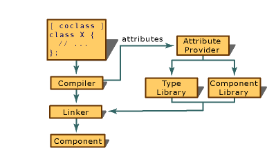

# Basic Mechanics of Attributes
There are three ways to insert attributes into your project. First, you can insert them manually into your source code. Second, you can insert them using the property grid of an object in your project. Finally, you can insert them using the various wizards. For more information on using the Properties window and the various wizards, see [Creating and Managing Visual C++ Projects](../vs140/creating-and-managing-visual-c---projects.md).  
  
 Starting with Visual C++ .NET, the compiler recognizes the presence of attributes in a source file and is able to dynamically parse and verify them during compilation.  
  
 As before, when the project is built, the compiler parses each C++ source file, producing an object file. However, when the compiler encounters an attribute, it is parsed and syntactically verified. The compiler then dynamically calls an attribute provider to insert code or make other modifications at compile time. The implementation of the provider differs depending on the type of attribute. For example, ATL-related attributes are implemented by Atlprov.dll.  
  
 The following figure demonstrates the relationship between the compiler and the attribute provider.  
  
   
  
> [!NOTE]
>  Attribute usage does not alter the contents of the source file. The only time the generated attribute code is visible is during debugging sessions. In addition, for each source file in the project, you can generate a text file that displays the results of the attribute substitution. For more information on this procedure, see [/Fx (Merge Injected Code)](../vs140/-fx--merge-injected-code-.md) and [Debugging Injected Code](../vs140/how-to--debug-injected-code.md).  
  
 Like most C++ constructs, attributes have a set of characteristics that defines their proper usage. This is referred to as the context of the attribute and is addressed in the attribute context table for each attribute reference topic. For example, the [coclass](../vs140/coclass.md) attribute can only be applied to an existing class or structure, as opposed to the [cpp_quote](../vs140/cpp_quote.md) attribute, which can be inserted anywhere within a C++ source file.  
  
## See Also  
 [Concepts](../vs140/attributed-programming-concepts.md)