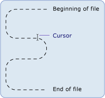

# Basics of .NET Framework File I-O and the File System (Visual Basic)
Classes in the <xref:System.IO?qualifyHint=False> namespace are used to work with drives, files, and directories.  
  
 The <xref:System.IO?qualifyHint=False> namespace contains the <xref:System.IO.File?qualifyHint=False> and <xref:System.IO.Directory?qualifyHint=False> classes, which provide the [!INCLUDE[dnprdnshort](../vs140/includes/dnprdnshort_md.md)] functionality that manipulates files and directories. Because the methods of these objects are static or shared members, you can use them directly without creating an instance of the class first. Associated with these classes are the <xref:System.IO.FileInfo?qualifyHint=False> and <xref:System.IO.DirectoryInfo?qualifyHint=False> classes, which will be familiar to users of the `My` feature. To use these classes, you must fully qualify the names or import the appropriate namespaces by including the `Imports` statement(s) at the beginning of the affected code. For more information, see [Imports Statement](../vs140/imports-statement--.net-namespace-and-type-.md).  
  
> [!NOTE]
>  Other topics in this section use the `My.Computer.FileSystem` object instead of `System.IO` classes to work with drives, files, and directories. The `My.Computer.FileSystem` object is intended primarily for use in [!INCLUDE[vbprvb](../vs140/includes/vbprvb_md.md)] programs. `System.IO` classes are intended for use by any language that supports the [!INCLUDE[dnprdnshort](../vs140/includes/dnprdnshort_md.md)], including [!INCLUDE[vbprvb](../vs140/includes/vbprvb_md.md)].  
  
## Definition of a Stream  
 The [!INCLUDE[dnprdnshort](../vs140/includes/dnprdnshort_md.md)] uses streams to support reading from and writing to files. You can think of a stream as a one-dimensional set of contiguous data, which has a beginning and an end, and where the cursor indicates the current position in the stream.  
  
   
  
## Stream Operations  
 The data contained in the stream may come from memory, a file, or a TCP/IP socket. Streams have fundamental operations that can be applied to them:  
  
-   Reading. You can read from a stream, transferring data from the stream into a data structure, such as a string or an array of bytes.  
  
-   **Writing**. You can write to a stream, transferring data from a data source into the stream.  
  
-   **Seeking**. You can query and modify your position in the stream.  
  
 For more information, see [Composing Streams](assetId:///da761658-a535-4f26-a452-b30df47f73d5).  
  
## Types of Streams  
 In the [!INCLUDE[dnprdnshort](../vs140/includes/dnprdnshort_md.md)], a stream is represented by the <xref:System.IO.Stream?qualifyHint=False> class, which forms the abstract class for all other streams. You cannot directly create an instance of the <xref:System.IO.Stream?qualifyHint=False> class, but must use one of the classes it implements.  
  
 There are many types of streams, but for the purposes of working with file input/output (I/O), the most important types are the <xref:System.IO.FileStream?qualifyHint=False> class, which provides a way to read from and write to files, and the <xref:System.IO.IsolatedStorage.IsolatedStorageFileStream?qualifyHint=False> class, which provides a way to create files and directories in isolated storage. Other streams that can be used when working with file I/O include:  
  
-   <xref:System.IO.BufferedStream?qualifyHint=False>  
  
-   <xref:System.Security.Cryptography.CryptoStream?qualifyHint=False>  
  
-   <xref:System.IO.MemoryStream?qualifyHint=False>  
  
-   <xref:System.Net.Sockets.NetworkStream?qualifyHint=False>.  
  
 The following table lists tasks commonly accomplished with a stream:  
  
|||  
|-|-|  
|To|See|  
|Read and write to a data file|[Reading and Writing to a Newly Created Data File](assetId:///e209d949-31e8-44ea-8e38-87f9093f3093)|  
|Read text from a file|[Reading Text from a File](assetId:///ed180baa-dfc6-4c69-a725-46e87edafb27)|  
|Write text to a file|[Writing Text to a File](assetId:///060cbe06-2adf-4337-9e7b-961a5c840208)|  
|Read characters from a string|[Reading Characters from a String](assetId:///27ea5e52-6db8-42d8-980a-50bcfc7fd270)|  
|Write characters to a string|[Writing Characters to a String](assetId:///1222cbeb-0760-44bf-9888-914a2a37174b)|  
|Encrypt data|[Encrypting Data](assetId:///7ecce51f-db5f-4bd4-9321-cceb6fcb2a77)|  
|Decrypt data|[Decrypting Data](assetId:///9b266b6c-a9b2-4d20-afd8-b3a0d8fd48a0)|  
  
## File Access and Attributes  
 You can control how files are created, opened, and shared with the <xref:System.IO.FileAccess?qualifyHint=False>, <xref:System.IO.FileMode?qualifyHint=False>, and <xref:System.IO.FileShare?qualifyHint=False> enumerations, which contain the flags used by the constructors of the <xref:System.IO.FileStream?qualifyHint=False> class. For example, when you open or create a new <xref:System.IO.FileStream?qualifyHint=False>, the <xref:System.IO.FileMode?qualifyHint=False> enumeration allows you to specify whether the file is opened for appending, whether a new file is created if the specified file does not exist, whether the file is overwritten, and so forth.  
  
 The <xref:System.IO.FileAttributes?qualifyHint=False> enumeration enables the gathering of file-specific information. The <xref:System.IO.FileAttributes?qualifyHint=False> enumeration returns the file's stored attributes, such as whether it is compressed, encrypted, hidden, read-only, an archive, a directory, a system file, or a temporary file.  
  
 The following table lists tasks involving file access and file attributes:  
  
|||  
|-|-|  
|**To**|**See**|  
|Open and append text to a log file|[Opening and Appending to a Log File](assetId:///74423362-1721-49cb-aa0a-e04005f72a06)|  
|Determine the attributes of a file|<xref:System.IO.FileAttributes?qualifyHint=False>|  
  
## File Permissions  
 Controlling access to files and directories can be done with the <xref:System.Security.Permissions.FileIOPermission?qualifyHint=False> class. This may be particularly important for developers working with Web Forms, which by default run within the context of a special local user account named ASPNET, which is created as part of the [!INCLUDE[vstecasp](../vs140/includes/vstecasp_md.md)] and [!INCLUDE[dnprdnshort](../vs140/includes/dnprdnshort_md.md)] installations. When such an application requests access to a resource, the ASPNET user account has limited permissions, which may prevent the user from performing actions such as writing to a file from a Web application. For more information, see [Security Permissions](assetId:///b03757b4-e926-4196-b738-3733ced2bda0), and the <xref:System.Security.Permissions.FileIOPermission?qualifyHint=False>.  
  
## Isolated File Storage  
 Isolated storage is an attempt to solve problems created when working with files where the user or code may lack necessary permissions. Isolated storage assigns each user a data compartment, which can hold one or more stores. Stores can be isolated from each other by user and by assembly. Only the user and assembly that created a store have access to it. A store acts as a complete virtual file system—within one store you can create and manipulate directories and files.  
  
 The following table lists tasks commonly associated with isolated file storage.  
  
|||  
|-|-|  
|To|See|  
|Create an isolated store|[Obtaining Stores](assetId:///fcb6b178-d526-47c4-b029-e946f880f9db)|  
|Enumerate isolated stores|[Enumerating Stores](assetId:///0fcf279a-f241-48f0-8034-2e3d331f1fcb)|  
|Delete an isolated store|[Deleting Stores](assetId:///3947e333-5af6-4601-b2f1-24d4d6129cf3)|  
|Create a file or directory in isolated storage|[Creating Files and Directories](assetId:///2ca4d2a4-809b-4f00-bc08-bf4a64d3a5c3)|  
|Find a file in isolated storage|[Finding Existing Files and Directories](assetId:///eb28458a-6161-4e7a-9ada-30ef93761b5c)|  
|Read from or write to a file in insolated storage|[Reading and Writing to Files](assetId:///f977ebdc-1b55-475a-bc3d-3376470b08ae)|  
|Delete a file or directory in isolated storage|[Deleting Files and Directories](assetId:///8fcc0dea-435b-4d40-ba4d-ba056265c202)|  
  
## File Events  
 The <xref:System.IO.FileSystemWatcher?qualifyHint=False> component allows you to watch for changes in files and directories on your system or on any computer to which you have network access. For example, if a file is modified, you might want to send a user an alert that the change has taken place. When changes occur, one or more events are raised, stored in a buffer, and handed to the <xref:System.IO.FileSystemWatcher?qualifyHint=False> component for processing.  
  
## See Also  
 [Composing Streams](assetId:///da761658-a535-4f26-a452-b30df47f73d5)   
 [File and Stream I/O](assetId:///4f4a33a9-66b7-4cd7-a285-4ad3e4276cd2)   
 [Asynchronous File I/O](assetId:///dbdd55e7-d6b9-4f9e-8abb-ab0edd4457f7)   
 [Classes Used in .NET Framework File I/O and the File System](../vs140/classes-used-in-.net-framework-file-i-o-and-the-file-system--visual-basic-.md)