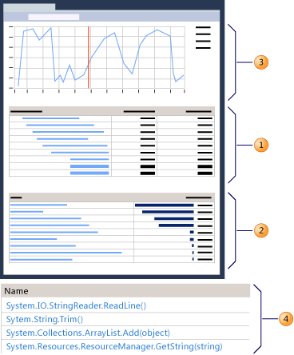
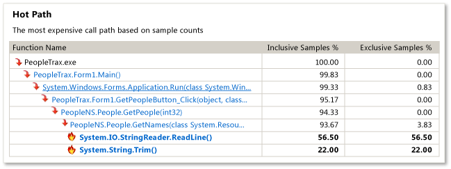
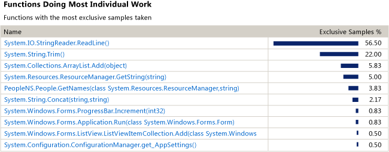
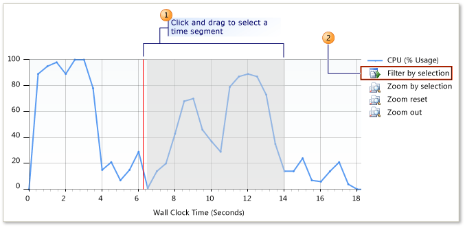

# Beginners Guide to Performance Profiling
You can use Visual Studio Profiling Tools to analyze performance issues in your application. This procedure shows how to use **Sampling** data.  
  
 **Sampling** is a statistical profiling method that shows you the functions that are doing most of the user mode work in the application. Sampling is a good place to start to look for areas to speed up your application.  
  
 At specified intervals, the **Sampling** method collects information about the functions that are executing in your application. After you finish a profiling run, the **Summary** view of the profiling data shows the most active function call tree, called the **Hot Path**, where most of the work in the application was performed. The view also lists the functions that were performing the most individual work, and provides a timeline graph you can use to focus on specific segments of the sampling session.  
  
 If **Sampling** does not give you the data that you need, other profiling tools collection methods provide different kinds of information that might be helpful to you. For more information about these other methods, see [How to: Choose Collection Methods](../vs140/how-to--choose-collection-methods.md).  
  
> [!TIP]
>  If you profile code that calls Windows functions, you should make sure that you have the most current .pdb files. Without these files, your report views will list Windows function names that are cryptic and difficult to understand. For more information about how to make sure that you have the files you need, see [How to: Reference Windows Symbol Information](../vs140/how-to--reference-windows-symbol-information.md).  
  
##   Create and run a performance session  
 To get the data that you need to analyze, you must first create a performance session and then run the session. The **Performance Wizard** lets you do both.  
  
 If you are not profiling a Windows desktop app or ASP.NET app, you must use one of the other profiling tools. See [Profiling Tools](../vs140/profiling-tools.md).  
  
#### To create and run a performance session  
  
1.  Open the solution in Visual Studio. Set the configuration to Release. (Find the **Solution Configurations** box on the toolbar, which is set to **Debug** by default. Change it to **Release**.)  
  
    > [!IMPORTANT]
    >  If you are not an administrator on the computer that you are using, you should run Visual Studio as an administrator while you are using the profiler. (Right-click the Visual Studio application icon, and then click **Run as administrator**.  
  
2.  On the **Debug** menu, click **Performance Profiler**.  
  
3.  Check the **Performance Wizard** option, and click **Start**.  
  
4.  Check the **CPU Sampling (recommended)** option and click **Finish**.  
  
5.  Your application starts and the profiler starts to collect data.  
  
6.  Exercise the functionality that might contain performance issues.  
  
7.  Close the application as you usually would.  
  
     After you finish running the application, the **Summary** view of the profiling data appears in the main Visual Studio window and an icon for the new session appears in the **Performance Explorer** window.  
  
##   Step 2: Analyze Sampling data  
 When you finish running a performance session, the **Summary** view of the profiling report appears in the main window in Visual Studio.  
  
 We recommend that you begin analyzing your data by examining the **Hot Path,** then the list of functions that are doing the most work, and finally by focusing on other functions by using the **Summary Timeline**. You can also view profiling suggestions and warnings in the **Error List** window.  
  
 Be aware that the sampling method might not give you the information that you need. For example, samples are collected only when the application is executing user mode code. Therefore, some functionality, such as input and output operations, is not captured by sampling. The Profiling Tools provide several collection methods that can enable you to focus on the important data. For more information about the other methods, see [How to: Choose Collection Methods](../vs140/how-to--choose-collection-methods.md).  
  
 Each numbered area in the figure relates to a step in the procedure.  
  
   
  
#### To analyze sampling data  
  
1.  In the **Summary** view, the **Hot Path** shows the branch of your application's call tree with the highest inclusive samples. This is the execution path that was most active when data was collected. High inclusive values can indicate that the algorithm that generates the call tree can be optimized. Find the function in your code that is lowest in the path. Notice that the path can also include system functions or functions in external modules.  
  
       
  
    1.  **Inclusive Samples** indicate how much work was done by the function and any functions called by it. High inclusive counts point to the functions that are most expensive overall.  
  
    2.  **Exclusive Samples** indicate how much work was done by the code in the function body, excluding the work done by functions that were called by it. High exclusive counts may indicate a performance bottleneck within the function itself.  
  
2.  Click the function name to display the **Function Details** view of the profiling data. The **Function Details** view presents a graphical view of the profiling data for the selected function, showing all the functions that called that function and all the functions that were called by the selected function.  
  
    -   The size of the blocks of the calling and called functions represent the relative frequency that the functions called or were called.  
  
    -   You can click the name of a calling or called function to make it the selected function of the Function Details view.  
  
    -   The lower pane of the **Function Details** windows displays the function code itself. If you examine the code and find an opportunity to optimize its performance, click the source file name to open the file in the Visual Studio editor.  
  
3.  To continue your analysis, return to the **Summary** view by selecting **Summary** from the View drop-down list. Then examine the functions in **Functions Doing the Most Individual Work**. This list displays the functions with the highest exclusive samples. The code in the function body of these functions performed significant work and you might be able to optimize it. To further analyze a particular function, , click the function name to display it in the **Function Details** view.  
  
       
  
     To continue your investigation of the profiling run, you can reanalyze a segment of the profiling data by using the timeline in the **Summary** view to show you the **Hot Path** and **Functions Doing  Most Individual Work** from a selected segment. For example, focusing on a smaller peak in the timeline might reveal expensive call trees and functions that were not shown in the analysis of the entire profiling run.  
  
     To reanalyze a segment, select a segment inside the Summary Timeline box and then click **Filter by Selection**.  
  
       
  
4.  The profiler also uses a set of rules to suggest ways of improving the profiling run and to identify possible performance problems. If an issue is found, a warning is displayed in the **Error List** window. To open the **Error List** window, on the **View** menu click **Error List**.  
  
    -   To see the function that raised a warning the **Function Details** view, double-click the warning.  
  
    -   To view detailed information about the warning, right-click the error and then click **Show Error Help**  
  
##   Step 3: Revise code and rerun a session  
 After you find and optimize one or more functions, you can repeat the profiling run and compare the data to see the difference that your changes have made to the performance of your application.  
  
#### To revise code and rerun the profiler  
  
1.  Change your code.  
  
2.  To open the **Performance Explorer**, on the **Debug** menu click **Profiler**, then **Performance Explorer** and then click **Show Performance Explorer**.  
  
3.  In the **Performance Explorer**, right-click the session that you want to rerun, and then click **Launch with Profiling.**  
  
4.  After you rerun the session, another data file is added to the **Reports** folder for the session in **Performance Explorer**. Select both the original and new profiling data, right-click the selection, and then click **Compare Performance Reports**.  
  
     A new report window opens, displaying the results of the comparison. For more information about how to use the comparison view, see [How to: Compare Profiler Data Files](../vs140/how-to--compare-performance-data-files.md).  
  
## See Also  
 [Analyzing Application Performance using Profiling Tools](../vs140/performance-explorer.md)   
 [Getting Started with Profiling Tools](../vs140/getting-started-with-performance-tools.md)   
 [Overviews (Profiling Tools)](../vs140/overviews--performance-tools-.md)