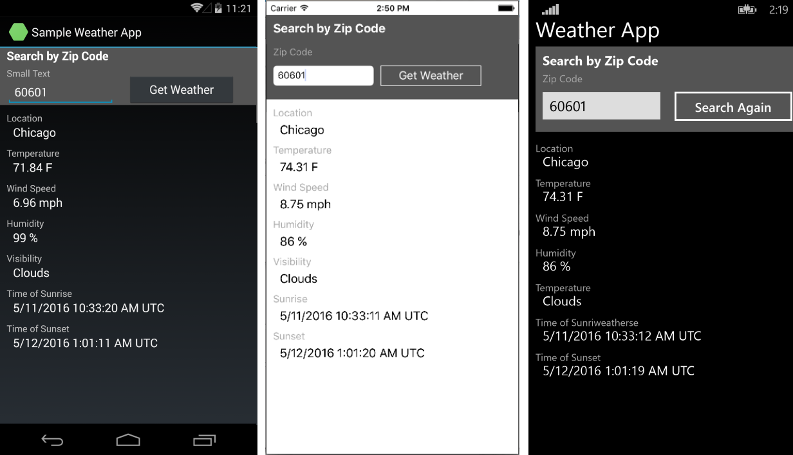
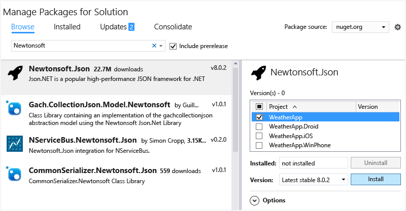
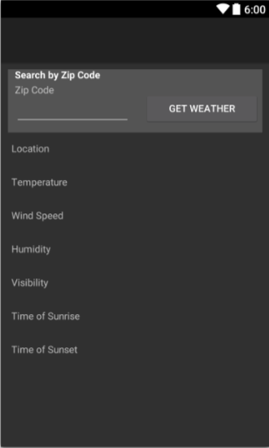
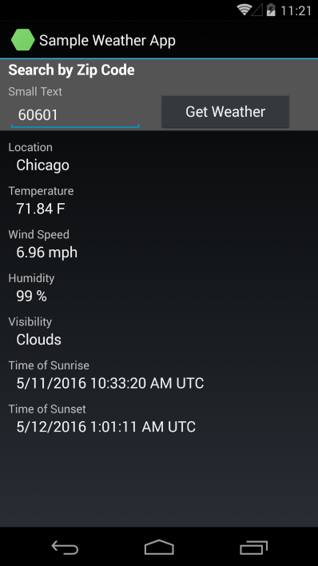
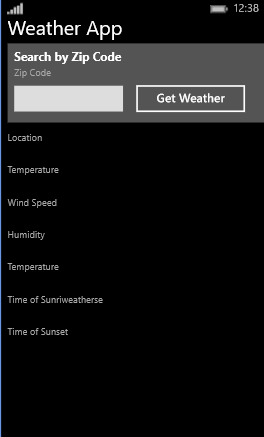
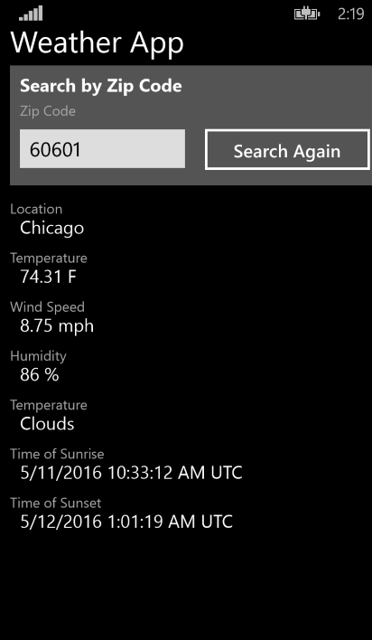

# Build apps with native UI using Xamarin in Visual Studio
Once you've done the steps in [Setup and install](../vs140/setup-and-install.md) and [Verify your Xamarin environment](../vs140/verify-your-xamarin-environment.md), this walkthrough shows you how to build a basic Xamarin app (shown below) with native UI layers. With native UI, shared code resides in a portable class library (PCL) and the individual platform projects contain the UI definitions.  
  
   
  
 You'll do these things to build it:  
  
-   [Set up your solution](#solution)  
  
-   [Write shared data service code](#dataservice)  
  
-   [Design UI for Android](#Android)  
  
-   [Design UI for Windows Phone](#Windows)  
  
-   [Take the next steps](#next)  
  
> [!TIP]
>  You can find the complete source code for this project in the [mobile-samples repository on GitHub](https://github.com/xamarin/mobile-samples/tree/master/Weather).  
  
> [!NOTE]
>  Xamarin's developer documentation also offers several walkthroughs with both Quickstart and Deep Dive sections as listed below. On all these pages, be sure that "Visual Studio" is selected in the upper right of the page to see Visual Studio-specific walkthroughs.  
>   
>  -   Xamarin apps with native UI:  
>   
>      -   [Hello, Android](https://developer.xamarin.com/guides/android/getting_started/hello,android/) (simple app with one screen)  
>     -   [Hello, Android multiscreen](https://developer.xamarin.com/guides/android/getting_started/hello,android_multiscreen/) (app with navigation between screens)  
>     -   [Android Fragments Walkthrough](http://developer.xamarin.com/guides/android/platform_features/fragments/fragments_walkthrough/) (used for master/detail screens, among other things)  
>     -   [Hello, iOS](https://developer.xamarin.com/guides/ios/getting_started/hello,_iOS/)  
>     -   [Hello, iOS Multiscreen](https://developer.xamarin.com/guides/ios/getting_started/hello,_iOS_multiscreen/)  
> -   Xamarin apps with Xamarin.Forms (shared UI)  
>   
>      -   [Hello, Xamarin.Forms](https://developer.xamarin.com/guides/cross-platform/xamarin-forms/getting-started/hello-xamarin-forms/quickstart/)  
>     -   [Hello, Xamarin.Forms Multiscreen](https://developer.xamarin.com/guides/cross-platform/xamarin-forms/getting-started/hello-xamarin-forms-multiscreen/)  
  
##  \<a name="solution">\</a> Set up your solution  
 These steps create a Xamarin solution with native UI that contains a PCL for shared code and two added NuGet packages.  
  
1.  In Visual Studio, create a new **Blank App (Native Portable)** solution and name it **WeatherApp**. You can find this template most easily by entering **Native Portable** into the search field.  
  
     If it’s not there, you might have to install Xamarin or enable the Visual Studio 2015 feature, see [Setup and install](../vs140/setup-and-install.md).  
  
2.  After clicking OK to create the solution, you’ll have a number of individual projects:  
  
    -   **WeatherApp (Portable)**: the PCL where you’ll write code that is shared across platforms, including common business logic and UI code using with Xamarin.Forms.  
  
    -   **WeatherApp.Droid**: the project that contains the native Android code. This is set as the default startup project.  
  
    -   **WeatherApp.iOS**: the project that contains the native iOS code.  
  
    -   **WeatherApp.WinPhone (Windows Phone 8.1)**: the project that contains the native Windows Phone code.  
  
     Within each native project you have access to the native designer for the corresponding platform and can implement platform specific screens.  
  
3.  Add the **Newtonsoft.Json** and NuGet package to the PCL project, which you’ll use to process information retrieved from a weather data service:  
  
    -   Right-click **Solution 'WeatherApp'** in Solution explorer and select **Manage NuGet Packages for Solution...**.  
  
         In the NuGet window, select the **Browse** tab and search for **Newtonsoft**.  
  
    -   Select **Newtonsoft.Json**.  
  
    -   On the right side of the window, check the **WeatherApp** project (this is the only project in which you need to install the package).  
  
    -   Ensure the **Version** field is set to the **Latest stable** version.  
  
    -   Click **Install**.  
  
    -     
  
4.  Repeat step 3 to find and install the **Microsoft.Net.Http** package.  
  
5.  Build your solution and verify that there are no build errors.  
  
##  \<a name="dataservice">\</a> Write shared data service code  
 The **WeatherApp (Portable)** project is where you’ll write code for the portable class library (PCL) that’s shared across all platforms. The PCL is automatically included in the app packages built by the iOS, Android, and Windows Phone projects.  
  
 The following steps then add code to the PCL to access and store data from that weather service:  
  
1.  To run this sample you must first sign up for a free API key at [http://openweathermap.org/appid](http://openweathermap.org/appid).  
  
2.  Right-click the **WeatherApp** project and select **Add > Class…**. In the **Add New Item** dialog, name the file **Weather.cs**. You’ll use this class to store data from the weather data service.  
  
3.  Replace the entire contents of **Weather.cs** with the following:  
  
<CodeContentPlaceHolder>0\</CodeContentPlaceHolder>  
4.  Add another class to the PCL project named **DataService.cs** in which you’ll use to process JSON data from the weather data service.  
  
5.  Replace the entire contents of **DataService.cs** with the following code:  
  
<CodeContentPlaceHolder>1\</CodeContentPlaceHolder>  
6.  Add a third class to the PCL named **Core** where you’ll put shared business logic, such as logic that forms a query string with a zip code, calls the weather data service, and populates an instance of the **Weather** class.  
  
7.  Replace the contents of **Core.cs** with the following:  
  
<CodeContentPlaceHolder>2\</CodeContentPlaceHolder>  
8.  Replace *YOUR KEY HERE* in the code with the API key you obtained in step 1 (it still needs quotes around it).  
  
9. Delete MyClass.cs in the PCL because we won't be using it.  
  
10. Build the **WeatherApp** PCL project to make sure the code is correct.  
  
##  \<a name="Android">\</a> Design UI for Android  
 Now, we’ll design the user interface, connect it to your shared code, and then run the app.  
  
### Design the look and feel of your app  
  
1.  In **Solution Explorer**, expand the **WeatherApp.Droid**>**Resources**>**layout** folder and open **Main.axml**. This opens the file in the visual designer. (If a Java-related error appears, see this [blog post](http://forums.xamarin.com/discussion/32365/connection-to-the-layout-renderer-failed-in-xs-5-7-and-xamarinvs-3-9).)  
  
    > [!TIP]
    >  There are many other files in the project. Exploring them is beyond the scope of this topic, but if you want to dive into the structure of an Android project a bit more, see [Part 2 Deep Dive](http://developer.xamarin.com/guides/android/getting_started/hello,android/hello,android_deepdive/) of the Hello Android topic on xamarin.com.  
  
2.  Select and delete the default button that appears in the designer.  
  
3.  Open the Toolbox with **View > Other Windows > Toolbox**.  
  
4.  From the **Toolbox**, drag a **RelativeLayout** control onto the designer. You'll use this control as a parent container for other controls.  
  
    > [!TIP]
    >  If at any time the layout doesn't seem to display correctly, save the file and switching between the **Design** and **Source** tabs to refresh.  
  
5.  In the **Properties** window, set the **background** property (in the Style group) to <CodeContentPlaceHolder>12\</CodeContentPlaceHolder>.  
  
6.  From the **Toolbox**, drag a **TextView** control onto the **RelativeLayout** control.  
  
7.  In the **Properties** window, set these properties (note: it can help to sort the list alphabetically using the sort button in the Properties window toolbar):  
  
    |Property|Value|  
    |--------------|-----------|  
    |**text**|**Search by Zip Code**|  
    |**id**|<CodeContentPlaceHolder>13\</CodeContentPlaceHolder>|  
    |**layout_marginLeft**|<CodeContentPlaceHolder>14\</CodeContentPlaceHolder>|  
    |**textColor**|<CodeContentPlaceHolder>15\</CodeContentPlaceHolder>|  
    |**textStyle**|<CodeContentPlaceHolder>16\</CodeContentPlaceHolder>|  
  
    > [!TIP]
    >  Notice that many properties don’t contain a drop-down list of values that you can select.  It can be difficult to guess what string value to use for any given property. For suggestions, try searching for the name of a property in the [R.attr](http://developer.android.com/reference/android/R.attr.html) class page.  
    >   
    >  Also, a quick web search often leads to a page on [http://stackoverflow.com/](http://stackoverflow.com/) where others have used the same property.  
  
     For reference, if you switch to **Source** view, you should see the following code for this element:  
  
<CodeContentPlaceHolder>3\</CodeContentPlaceHolder>  
8.  From the **Toolbox**, drag a **TextView** control onto the **RelativeLayout** control and position it below the ZipCodeSearchLabel control. You do this by dropping the new control on the appropriate edge of the existing control; it helps to zoom the designer in somewhat for this.  
  
9. In the **Properties** window, set these properties:  
  
    |Property|Value|  
    |--------------|-----------|  
    |**text**|**Zip Code**|  
    |**id**|<CodeContentPlaceHolder>17\</CodeContentPlaceHolder>|  
    |**layout_marginLeft**|<CodeContentPlaceHolder>18\</CodeContentPlaceHolder>|  
    |**layout_marginTop**|<CodeContentPlaceHolder>19\</CodeContentPlaceHolder>|  
  
     The code in **Source** view should look like this:  
  
<CodeContentPlaceHolder>4\</CodeContentPlaceHolder>  
10. From the **Toolbox**, drag a **Number** control onto the **RelativeLayout**, position it below the **Zip Code** label. Then set the following properties:  
  
    |Property|Value|  
    |--------------|-----------|  
    |**id**|<CodeContentPlaceHolder>20\</CodeContentPlaceHolder>|  
    |**layout_marginLeft**|<CodeContentPlaceHolder>21\</CodeContentPlaceHolder>|  
    |**layout_marginBottom**|<CodeContentPlaceHolder>22\</CodeContentPlaceHolder>|  
    |**width**|<CodeContentPlaceHolder>23\</CodeContentPlaceHolder>|  
  
     Again, the code:  
  
<CodeContentPlaceHolder>5\</CodeContentPlaceHolder>  
11. From the **Toolbox**, drag a **Button** onto the **RelativeLayout** control and position it to the right of the ZipCodeEntry control. Then set these properties:  
  
    |Property|Value|  
    |--------------|-----------|  
    |**id**|<CodeContentPlaceHolder>24\</CodeContentPlaceHolder>|  
    |**text**|**Get Weather**|  
    |**layout_marginLeft**|<CodeContentPlaceHolder>25\</CodeContentPlaceHolder>|  
    |**layout_alignBottom**|<CodeContentPlaceHolder>26\</CodeContentPlaceHolder>|  
    |**width**|<CodeContentPlaceHolder>27\</CodeContentPlaceHolder>|  
  
<CodeContentPlaceHolder>6\</CodeContentPlaceHolder>  
12. You now have enough experience to build a basic UI by using the Android designer. You can also build a UI by adding markup directly to the .asxml file of the page. To build the rest of the UI that way, switch to Source view in the designer, then past the following markup *beneath* the <CodeContentPlaceHolder>28\</CodeContentPlaceHolder> tag (yes, that's beneath the tag...these elements are not contained in the ReleativeLayout).  
  
<CodeContentPlaceHolder>7\</CodeContentPlaceHolder>  
13. Save the file and switch to **Design** view. Your UI should appear as follows:  
  
       
  
14. Open **MainActivity.cs** and delete the lines in the *OnCreate* method that refer to the default button that was removed earlier. The code should look like this when you're done:  
  
<CodeContentPlaceHolder>8\</CodeContentPlaceHolder>  
15. Build the Android project to check your work. Note that building adds control IDs to the **Resource.Designer.cs** file so that you can refer to controls by name in code.  
  
### Consume your shared code  
  
1.  Open the **MainActivity.cs** file of the **WeatherApp** project in the code editor and replace its contents with the code below. This code calls the <CodeContentPlaceHolder>29\</CodeContentPlaceHolder> method that you defined in your shared code. Then, in the UI of the app, it shows the data that is retrieved from that method.  
  
<CodeContentPlaceHolder>9\</CodeContentPlaceHolder>  
### Run the app and see how it looks  
  
1.  In **Solution Explorer**, make sure the **WeatherApp.Droid** project is set as the startup project.  
  
2.  Select an appropriate device or emulator target, then start the app by pressing the F5 key.  
  
3.  On the device or in the emulator, type a valid United States zip code into the edit box (for example: 60601), and press **Get Weather**. Weather data for that region then appears in the controls.  
  
       
  
> [!TIP]
>  The complete source code for this project is in the [mobile-samples repository on GitHub](https://github.com/xamarin/mobile-samples/tree/master/Weather).  
  
##  \<a name="Windows">\</a> Design UI for Windows Phone  
 Now we’ll design the user interface for Windows Phone, connect it to your shared code, and then run the app.  
  
### Design the look and feel of your app  
 The process of designing native Windows Phone UI in a Xamarin app is no different from any other native Windows Phone app. For this reason, we won't go into the details here of how to use the designer. For that, refer to [Creating a UI by using XAML Designer in Visual Studio](../vs140/creating-a-ui-by-using-xaml-designer-in-visual-studio.md).  
  
 Instead, simply open MainPage.xaml and replace all the XAML code with the following:  
  
<CodeContentPlaceHolder>10\</CodeContentPlaceHolder>  
 In the design view, your UI should appear as follows:  
  
   
  
### Consume your shared code  
  
1.  In the designer, select the **Get Weather** button.  
  
2.  In the **Properties** window, choose the event handler button ().  
  
     This icon appears in the top corner of the **Properties** window.  
  
3.  Next to the **Click** event, type **GetWeatherButton_Click**, and then press the ENTER key.  
  
     This generates an event handler named <CodeContentPlaceHolder>30\</CodeContentPlaceHolder>. The code editor opens and places your cursor inside of the event handler code block.  Note: if the editor doesn't open when pressing ENTER, just double-click the event name.  
  
4.  Replace that event handler with the following code.  
  
<CodeContentPlaceHolder>11\</CodeContentPlaceHolder>  
     This code calls the <CodeContentPlaceHolder>31\</CodeContentPlaceHolder> method that you defined in your shared code. This is the same method that you called in your Android app. This code also shows data retrieved from that method in the UI controls of your app.  
  
5.  In MainPage.xaml.cs, which is open, delete all the code inside the **OnNavigatedTo** method. This code simply handled the default button that was removed when we replaced the contents of MainPage.xaml.  
  
### Run the app and see how it looks  
  
1.  In **Solution Explorer**, set the **WeatherApp.WinPhone** project as the startup project.  
  
2.  Start the app by pressing the F5 key.  
  
3.  In the Windows Phone emulator, type a valid United States zip code into the edit box (for example: 60601), and press **Get Weather**. Weather data for that region then appears in the controls.  
  
       
  
> [!TIP]
>  The complete source code for this project is in the [mobile-samples repository on GitHub](https://github.com/xamarin/mobile-samples/tree/master/Weather).  
  
##  \<a name="next">\</a> Next steps  
 **Add UI for iOS to the solution**  
  
 Extend this sample by adding native UI for iOS. For this you’ll need to connect to a Mac on your local network that has Xcode and Xamarin installed. Once you do, you can use the iOS designer directly in Visual Studio. See the [mobile-samples repository on GitHub](https://github.com/xamarin/mobile-samples/tree/master/Weather) for a completed app.  
  
 Also refer to the [Hello, iOS](http://developer.xamarin.com/guides/ios/getting_started/hello,_iOS/hello,iOS_quickstart/) (xamarin.com) walkthrough. Note that on this page, be sure that "Visual Studio" is selected in the upper right corner of pages on xamarin.com so that the correct set of instructions appear.  
  
 **Add platform-specific code in a shared project**  
  
 Shared code in a PCL is platform-neutral, because the PCL is compiled once and included in each platform-specific app package. If you want to write shared code that uses conditional compilation to isolate platform-specific code, you can use a *shared* project. For more details, see [ode Sharing Options](http://developer.xamarin.com/guides/cross-platform/application_fundamentals/building_cross_platform_applications/sharing_code_options/) (xamarin.com).  
  
## See Also  
 [Xamarin Developer site](http://developer.xamarin.com/)   
 [Windows Dev Center](https://dev.windows.com/en-us)   
 [Swift and C# Quick Reference Poster](http://aka.ms/scposter)