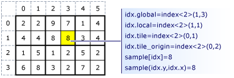

# C++ AMP Overview
C++ Accelerated Massive Parallelism (C++ AMP) accelerates execution of C++ code by taking advantage of data-parallel hardware such as a graphics processing unit (GPU) on a discrete graphics card. By using C++ AMP, you can code multi-dimensional data algorithms so that execution can be accelerated by using parallelism on heterogeneous hardware. The C++ AMP programming model includes multidimensional arrays, indexing, memory transfer, tiling, and a mathematical function library. You can use C++ AMP language extensions to control how data is moved from the CPU to the GPU and back, so that you can improve performance.  
  
## System Requirements  
  
-   [!INCLUDE[win7](../vs140/includes/win7_md.md)], [!INCLUDE[win8](../vs140/includes/win8_md.md)], [!INCLUDE[winsvr08_r2](../vs140/includes/winsvr08_r2_md.md)], or [!INCLUDE[winserver8](../vs140/includes/winserver8_md.md)]  
  
-   DirectX 11 Feature Level 11.0 or later hardware  
  
-   For debugging on the software emulator, [!INCLUDE[win8](../vs140/includes/win8_md.md)] or [!INCLUDE[winserver8](../vs140/includes/winserver8_md.md)] is required. For debugging on the hardware, you must install the drivers for your graphics card. For more information, see [Debugging GPU Code](../vs140/debugging-gpu-code.md).  
  
## Introduction  
 The following two examples illustrate the primary components of C++ AMP. Assume that you want to add the corresponding elements of two one-dimensional arrays. For example, you might want to add <CodeContentPlaceHolder>13\</CodeContentPlaceHolder> and <CodeContentPlaceHolder>14\</CodeContentPlaceHolder> to obtain <CodeContentPlaceHolder>15\</CodeContentPlaceHolder>. Without using C++ AMP, you might write the following code to add the numbers and display the results.  
  
<CodeContentPlaceHolder>0\</CodeContentPlaceHolder>  
 The important parts of the code are as follows:  
  
-   Data: The data consists of three arrays. All have the same rank (one) and length (five).  
  
-   Iteration: The first <CodeContentPlaceHolder>16\</CodeContentPlaceHolder> loop provides a mechanism for iterating through the elements in the arrays. The code that you want to execute to compute the sums is contained in the first <CodeContentPlaceHolder>17\</CodeContentPlaceHolder> block.  
  
-   Index: The <CodeContentPlaceHolder>18\</CodeContentPlaceHolder> variable accesses the individual elements of the arrays.  
  
 Using C++ AMP, you might write the following code instead.  
  
<CodeContentPlaceHolder>1\</CodeContentPlaceHolder>  
 The same basic elements are present, but C++ AMP constructs are used:  
  
-   Data: You use C++ arrays to construct three C++ AMP [array_view](../vs140/array_view-class.md) objects. You supply four values to construct an <CodeContentPlaceHolder>19\</CodeContentPlaceHolder> object: the data values, the rank, the element type, and the length of the <CodeContentPlaceHolder>20\</CodeContentPlaceHolder> object in each dimension. The rank and type are passed as type parameters. The data and length are passed as constructor parameters. In this example, the C++ array that is passed to the constructor is one-dimensional. The rank and length are used to construct the rectangular shape of the data in the <CodeContentPlaceHolder>21\</CodeContentPlaceHolder> object, and the data values are used to fill the array. The runtime library also includes the [array Class](../vs140/array-class.md), which has an interface that resembles the <CodeContentPlaceHolder>22\</CodeContentPlaceHolder> class and is discussed later in this article.  
  
-   Iteration: The [parallel_for_each Function (C++ Accelerated Massive Parallelism)](../vs140/parallel_for_each-function--c---amp-.md) provides a mechanism for iterating through the data elements, or *compute domain*. In this example, the compute domain is specified by <CodeContentPlaceHolder>23\</CodeContentPlaceHolder>. The code that you want to execute is contained in a lambda expression, or *kernel function*. The <CodeContentPlaceHolder>24\</CodeContentPlaceHolder> indicates that only the subset of the C++ language that C++ AMP can accelerate is used.  
  
-   Index: The [index Structure](../vs140/index-class.md) variable, <CodeContentPlaceHolder>25\</CodeContentPlaceHolder>, is declared with a rank of one to match the rank of the <CodeContentPlaceHolder>26\</CodeContentPlaceHolder> object. By using the index, you can access the individual elements of the <CodeContentPlaceHolder>27\</CodeContentPlaceHolder> objects.  
  
## Shaping and Indexing Data: index and extent  
 You must define the data values and declare the shape of the data before you can run the kernel code. All data is defined to be an array (rectangular), and you can define the array to have any rank (number of dimensions). The data can be any size in any of the dimensions.  
  
### index Class  
 The [index Structure](../vs140/index-class.md) specifies a location in the <CodeContentPlaceHolder>28\</CodeContentPlaceHolder> or <CodeContentPlaceHolder>29\</CodeContentPlaceHolder> object by encapsulating the offset from the origin in each dimension into one object. When you access a location in the array, you pass an <CodeContentPlaceHolder>30\</CodeContentPlaceHolder> object to the indexing operator, <CodeContentPlaceHolder>31\</CodeContentPlaceHolder>, instead of a list of integer indexes. You can access the elements in each dimension by using the [array::operator() Operator](../vs140/array--operator---operator.md) or the [array_view::operator() Operator](../vs140/array_view--operator---operator.md).  
  
 The following example creates a one-dimensional index that specifies the third element in a one-dimensional <CodeContentPlaceHolder>32\</CodeContentPlaceHolder> object. The index is used to print the third element in the <CodeContentPlaceHolder>33\</CodeContentPlaceHolder> object. The output is 3.  
  
<CodeContentPlaceHolder>2\</CodeContentPlaceHolder>  
 The following example creates a two-dimensional index that specifies the element where the row = 1 and the column = 2 in a two-dimensional <CodeContentPlaceHolder>34\</CodeContentPlaceHolder> object. The first parameter in the <CodeContentPlaceHolder>35\</CodeContentPlaceHolder> constructor is the row component, and the second parameter is the column component. The output is 6.  
  
<CodeContentPlaceHolder>3\</CodeContentPlaceHolder>  
 The following example creates a three-dimensional index that specifies the element  where the depth = 0, the row = 1, and the column = 3 in a three-dimensional <CodeContentPlaceHolder>36\</CodeContentPlaceHolder> object. Notice that the first parameter is the depth component, the second parameter is the row component, and the third parameter is the column component. The output is 8.  
  
<CodeContentPlaceHolder>4\</CodeContentPlaceHolder>  
### extent Class  
 The [extent Structure](../vs140/extent-class--c---amp-.md) specifies the length of the data in each dimension of the <CodeContentPlaceHolder>37\</CodeContentPlaceHolder> or <CodeContentPlaceHolder>38\</CodeContentPlaceHolder> object. You can create an extent and use it to create an <CodeContentPlaceHolder>39\</CodeContentPlaceHolder> or <CodeContentPlaceHolder>40\</CodeContentPlaceHolder> object. You can also retrieve the extent of an existing <CodeContentPlaceHolder>41\</CodeContentPlaceHolder> or <CodeContentPlaceHolder>42\</CodeContentPlaceHolder> object. The following example prints the length of the extent in each dimension of an <CodeContentPlaceHolder>43\</CodeContentPlaceHolder> object.  
  
<CodeContentPlaceHolder>5\</CodeContentPlaceHolder>  
 The following example creates an <CodeContentPlaceHolder>44\</CodeContentPlaceHolder> object that has the same dimensions as the object in the previous example, but this example uses an <CodeContentPlaceHolder>45\</CodeContentPlaceHolder> object instead of using explicit parameters in the <CodeContentPlaceHolder>46\</CodeContentPlaceHolder> constructor.  
  
<CodeContentPlaceHolder>6\</CodeContentPlaceHolder>  
## Moving Data to the Accelerator: array and array_view  
 Two data containers used to move data to the accelerator are defined in the runtime library. They are the [array Class](../vs140/array-class.md) and the [array_view Class](../vs140/array_view-class.md). The <CodeContentPlaceHolder>47\</CodeContentPlaceHolder> class is a container class that creates a deep copy of the data when the object is constructed. The <CodeContentPlaceHolder>48\</CodeContentPlaceHolder> class is a wrapper class that copies the data when the kernel function accesses the data. When the data is needed on the source device the data is copied back.  
  
### array Class  
 When an <CodeContentPlaceHolder>49\</CodeContentPlaceHolder> object is constructed, a deep copy of the data is created on the accelerator if you use a constructor that includes a pointer to the data set. The kernel function modifies the copy on the accelerator. When the execution of the kernel function is finished, you must copy the data back to the source data structure. The following example multiplies each element in a vector by 10. After the kernel function is finished, the [vector conversion operator](../vs140/array--operator-std--vector-_value_type--operator.md)is used to copy the data back into the vector object.  
  
<CodeContentPlaceHolder>7\</CodeContentPlaceHolder>  
### array_view Class  
 The <CodeContentPlaceHolder>50\</CodeContentPlaceHolder> has nearly the same members as the <CodeContentPlaceHolder>51\</CodeContentPlaceHolder> class, but the underlying behavior is not the same. Data passed to the <CodeContentPlaceHolder>52\</CodeContentPlaceHolder> constructor is not replicated on the GPU as it is with an <CodeContentPlaceHolder>53\</CodeContentPlaceHolder> constructor. Instead, the data is copied to the accelerator when the kernel function is executed. Therefore, if you create two <CodeContentPlaceHolder>54\</CodeContentPlaceHolder> objects that use the same data, both <CodeContentPlaceHolder>55\</CodeContentPlaceHolder> objects refer to the same memory space. When you do this, you have to synchronize any multithreaded access. The main advantage of using the <CodeContentPlaceHolder>56\</CodeContentPlaceHolder> class is that data is moved only if it is necessary.  
  
### Comparison of array and array_view  
 The following table summarizes the similarities and differences between the <CodeContentPlaceHolder>57\</CodeContentPlaceHolder> and <CodeContentPlaceHolder>58\</CodeContentPlaceHolder> classes.  
  
|Description|array class|array_view class|  
|-----------------|-----------------|-----------------------|  
|When rank is determined|At compile time.|At compile time.|  
|When extent is determined|At run time.|At run time.|  
|Shape|Rectangular.|Rectangular.|  
|Data storage|Is a data container.|Is a data wrapper.|  
|Copy|Explicit and deep copy at definition.|Implicit copy when it is accessed by the kernel function.|  
|Data retrieval|By copying the array data back to an object on the CPU thread.|By direct access of the <CodeContentPlaceHolder>59\</CodeContentPlaceHolder> object or by calling the [array_view::synchronize Method](../vs140/array_view--synchronize-method.md) to continue accessing the data on the original container.|  
  
### Shared memory with array and array_view  
 Shared memory is memory that can be accessed by both the CPU and the accelerator. The use of shared memory eliminates or significantly reduces the overhead of copying data between the CPU and the accelerator. Although the memory is shared, it cannot be accessed concurrently by both the CPU and the accelerator, and doing so causes undefined behavior.  
  
 <CodeContentPlaceHolder>60\</CodeContentPlaceHolder> objects can be used to specify fine-grained control over the use of shared memory if the associated accelerator supports it. Whether an accelerator supports shared memory is determined by the accelerator’s [supports_cpu_shared_memory](../vs140/accelerator--supports_cpu_shared_memory-data-member.md) property, which returns <CodeContentPlaceHolder>61\</CodeContentPlaceHolder> when shared memory is supported. If shared memory is supported, the default [access_type](../vs140/access_type-enumeration.md) for memory allocations on the accelerator is determined by the <CodeContentPlaceHolder>62\</CodeContentPlaceHolder> property. By default, <CodeContentPlaceHolder>63\</CodeContentPlaceHolder> and <CodeContentPlaceHolder>64\</CodeContentPlaceHolder> objects take on the same <CodeContentPlaceHolder>65\</CodeContentPlaceHolder> as the primary associated <CodeContentPlaceHolder>66\</CodeContentPlaceHolder>.  
  
 By setting the [cpu_access_type](../vs140/array--cpu_access_type-data-member.md) property of an <CodeContentPlaceHolder>67\</CodeContentPlaceHolder> explicitly, you can exercise fine-grained control over how shared memory is used, so that you can optimize the app for the hardware’s performance characteristics, based on the memory access patterns of its computation kernels. An <CodeContentPlaceHolder>68\</CodeContentPlaceHolder> reflects the same <CodeContentPlaceHolder>69\</CodeContentPlaceHolder> as the <CodeContentPlaceHolder>70\</CodeContentPlaceHolder> that it’s associated with; or, if the array_view is constructed without a data source, its <CodeContentPlaceHolder>71\</CodeContentPlaceHolder> reflects the environment that first causes it to allocate storage. That is, if it’s first accessed by the host (CPU), then it behaves as if it were created over a CPU data source and shares the <CodeContentPlaceHolder>72\</CodeContentPlaceHolder> of the <CodeContentPlaceHolder>73\</CodeContentPlaceHolder> associated by capture; however, if it's first accessed by an <CodeContentPlaceHolder>74\</CodeContentPlaceHolder>, then it behaves as if it were created over an <CodeContentPlaceHolder>75\</CodeContentPlaceHolder> created on that <CodeContentPlaceHolder>76\</CodeContentPlaceHolder> and shares the <CodeContentPlaceHolder>77\</CodeContentPlaceHolder>’s <CodeContentPlaceHolder>78\</CodeContentPlaceHolder>.  
  
 The following code example shows how to determine whether the default accelerator supports shared memory, and then creates several arrays that have different cpu_access_type configurations.  
  
<CodeContentPlaceHolder>8\</CodeContentPlaceHolder>  
## Executing Code over Data: parallel_for_each  
 The [parallel_for_each](../vs140/parallel_for_each-function--c---amp-.md) function defines the code that you want to run on the accelerator against the data in the <CodeContentPlaceHolder>79\</CodeContentPlaceHolder> or <CodeContentPlaceHolder>80\</CodeContentPlaceHolder> object. Consider the following code from the introduction of this topic.  
  
<CodeContentPlaceHolder>9\</CodeContentPlaceHolder>  
 The <CodeContentPlaceHolder>81\</CodeContentPlaceHolder> method takes two arguments, a compute domain and a lambda expression.  
  
 The *compute domain* is an <CodeContentPlaceHolder>82\</CodeContentPlaceHolder> object or a <CodeContentPlaceHolder>83\</CodeContentPlaceHolder> object that defines the set of threads to create for parallel execution. One thread is generated for each element in the compute domain. In this case, the <CodeContentPlaceHolder>84\</CodeContentPlaceHolder> object is one-dimensional and has five elements. Therefore, five threads are started.  
  
 The *lambda expression* defines the code to run on each thread. The capture clause, <CodeContentPlaceHolder>85\</CodeContentPlaceHolder>, specifies that the body of the lambda expression accesses all captured variables by value, which in this case are <CodeContentPlaceHolder>86\</CodeContentPlaceHolder>, <CodeContentPlaceHolder>87\</CodeContentPlaceHolder>, and <CodeContentPlaceHolder>88\</CodeContentPlaceHolder>. In this example, the parameter list creates a one-dimensional <CodeContentPlaceHolder>89\</CodeContentPlaceHolder> variable named <CodeContentPlaceHolder>90\</CodeContentPlaceHolder>. The value of the <CodeContentPlaceHolder>91\</CodeContentPlaceHolder> is 0 in the first thread and increases by one in each subsequent thread. The <CodeContentPlaceHolder>92\</CodeContentPlaceHolder> indicates that only the subset of the C++ language that C++ AMP can accelerate is used.  The limitations on functions that have the restrict modifier are described in [Restriction Clause (C++ Accelerated Massive Parallelism)](../vs140/restrict--c---amp-.md). For more information, see, [Lambda Expression Syntax](../vs140/lambda-expression-syntax.md).  
  
 The lambda expression can include the code to execute or it can call a separate kernel function. The kernel function must include the <CodeContentPlaceHolder>93\</CodeContentPlaceHolder> modifier. The following example is equivalent to the previous example, but it calls a separate kernel function.  
  
<CodeContentPlaceHolder>10\</CodeContentPlaceHolder>  
## Accelerating Code: Tiles and Barriers  
 You can gain additional acceleration by using tiling. Tiling divides the threads into equal rectangular subsets or *tiles*. You determine the appropriate tile size based on your data set and the algorithm that you are coding. For each thread, you have access to the *global* location of a data element relative to the whole <CodeContentPlaceHolder>94\</CodeContentPlaceHolder> or <CodeContentPlaceHolder>95\</CodeContentPlaceHolder> and access to the *local* location relative to the tile. Using the local index value simplifies your code because you don't have to write the code to translate index values from global to local. To use tiling, call the [extent::tile Method](../vs140/extent--tile-method.md) on the compute domain in the <CodeContentPlaceHolder>96\</CodeContentPlaceHolder> method, and use a  [tiled_index](../vs140/tiled_index-class.md) object in the lambda expression.  
  
 In typical applications, the elements in a tile are related in some way, and the code has to access and keep track of values across the tile. Use the [tile_static](../vs140/tile_static-keyword.md) keyword and the [tile_barrier::wait Method](../vs140/tile_barrier--wait-method.md) to accomplish this. A variable that has the <CodeContentPlaceHolder>97\</CodeContentPlaceHolder> keyword has a scope across an entire tile, and an instance of the variable is created for each tile. You must handle synchronization of tile-thread access to the variable. The [tile_barrier::wait Method](../vs140/tile_barrier--wait-method.md) stops execution of the current thread until all the threads in the tile have reached the call to <CodeContentPlaceHolder>98\</CodeContentPlaceHolder>. So you can accumulate values across the tile by using <CodeContentPlaceHolder>99\</CodeContentPlaceHolder> variables. Then you can finish any computations that require access to all the values.  
  
 The following diagram represents a two-dimensional array of sampling data that is arranged in tiles.  
  
   
  
 The following code example uses the sampling data from the previous diagram. The code replaces each value in the tile by the average of the values in the tile.  
  
<CodeContentPlaceHolder>11\</CodeContentPlaceHolder>  
## Math Libraries  
 C++ AMP includes two math libraries. The double-precision library in the [Concurrency::precise_math Namespace](../vs140/concurrency--precise_math-namespace.md) provides support for double-precision functions. It also provides support for single-precision functions, although double-precision support on the hardware is still required. It complies with the [C99 Specification (ISO/IEC 9899)](http://go.microsoft.com/fwlink/?LinkId=225887). The accelerator must support full double precision. You can determine whether it does by checking the value of the [accelerator::supports_double_precision Data Member](../vs140/accelerator--supports_double_precision-data-member.md). The fast math library,  in the [Concurrency::fast_math Namespace](../vs140/concurrency--fast_math-namespace.md), contains another set of math functions. These functions, which support only <CodeContentPlaceHolder>100\</CodeContentPlaceHolder> operands, execute more quickly but aren’t as precise as those in the double-precision math library. The functions are contained in the \<amp_math.h> header file and all are declared with <CodeContentPlaceHolder>101\</CodeContentPlaceHolder>. The functions in the \<cmath> header file are imported into both the <CodeContentPlaceHolder>102\</CodeContentPlaceHolder> and <CodeContentPlaceHolder>103\</CodeContentPlaceHolder> namespaces. The <CodeContentPlaceHolder>104\</CodeContentPlaceHolder> keyword is used to distinguish the \<cmath> version and the C++ AMP version. The following code calculates the base-10 logarithm, using the fast method, of each value that is in the compute domain.  
  
<CodeContentPlaceHolder>12\</CodeContentPlaceHolder>  
## Graphics Library  
 C++ AMP includes a graphics library that is designed for accelerated graphics programming. This library is used only on devices that support native graphics functionality. The methods are in the [Concurrency::graphics Namespace](../vs140/concurrency--graphics-namespace.md) and are contained in the \<amp_graphics.h> header file. The key components of the graphics library are:  
  
-   [texture Class](../vs140/texture-class.md): You can use the texture class to create textures from memory or from a file. Textures resemble arrays because they contain data, and they resemble containers in the Standard Template Library (STL) with respect to assignment and copy construction. For more information, see [STL Containers](../vs140/stl-containers.md). The template parameters for the <CodeContentPlaceHolder>105\</CodeContentPlaceHolder> class are the element type and the rank. The rank can be 1, 2, or 3. The element type can be one of the short vector types that are described later in this article.  
  
-   [writeonly_texture_view Class](../vs140/writeonly_texture_view-class.md): Provides write-only access to any texture.  
  
-   [Short Vector Library](assetId:///4c4f5bed-c396-493b-a238-c347563f645f): Defines a set of short vector types of length 2, 3, and 4 that are based on <CodeContentPlaceHolder>106\</CodeContentPlaceHolder>, <CodeContentPlaceHolder>107\</CodeContentPlaceHolder>, <CodeContentPlaceHolder>108\</CodeContentPlaceHolder>, <CodeContentPlaceHolder>109\</CodeContentPlaceHolder>, [norm](../vs140/norm-class.md), or [unorm](../vs140/unorm-class.md).  
  
## [!INCLUDE[win8_appname_long](../vs140/includes/win8_appname_long_md.md)] Apps  
 Like other C++ libraries, you can use C++ AMP in your [!INCLUDE[win8_appname_long](../vs140/includes/win8_appname_long_md.md)] apps. These articles describe how to include C++ AMP code in apps that is created by using C++, C#, Visual Basic, or JavaScript:  
  
-   [Using C++ AMP in Windows Store Apps](../vs140/using-c---amp-in-windows-store-apps.md)  
  
-   [Walkthrough: Creating a basic Windows Runtime component in C++ and calling it from JavaScript](http://go.microsoft.com/fwlink/p/?LinkId=249077)  
  
-   [Bing Maps Trip Optimizer, a Window Store app in JavaScript and C++](http://go.microsoft.com/fwlink/p/?LinkId=249078)  
  
-   [How to use C++ AMP from C# using the Windows Runtime](http://go.microsoft.com/fwlink/p/?LinkId=249080)  
  
-   [How to use C++ AMP from C#](http://go.microsoft.com/fwlink/p/?LinkId=249081)  
  
-   [Calling Native Functions from Managed Code](../vs140/calling-native-functions-from-managed-code.md)  
  
## C++ AMP and Concurrency Visualizer  
 The Concurrency Visualizer includes support for analyzing performance of C++ AMP code. These articles describe these features:  
  
-   [GPU Activity Graph](../vs140/gpu-activity-graph.md)  
  
-   [GPU Activity (Paging)](../vs140/gpu-activity--paging-.md)  
  
-   [GPU Activity (This Process)](../vs140/gpu-activity--this-process-.md)  
  
-   [GPU Activity (Other Processes)](../vs140/gpu-activity--other-processes-.md)  
  
-   [Channels (Threads View)](../vs140/channels--threads-view-.md)  
  
-   [Analyzing C++ AMP Code with the Concurrency Visualizer](http://go.microsoft.com/fwlink/?LinkID=253987&clcid=0x409)  
  
## Performance Recommendations  
 Modulus and division of unsigned integers have significantly better performance than modulus and division of signed integers. We recommend that you use unsigned integers when possible.  
  
## See Also  
 [C++ AMP (C++ Accelerated Massive Parallelism)](../vs140/c---amp--c---accelerated-massive-parallelism-.md)   
 [Lambda Expression Syntax](../vs140/lambda-expression-syntax.md)   
 [Reference (C++ AMP)](../vs140/reference--c---amp-.md)   
 [Parallel Programming in Native Code Blog](http://go.microsoft.com/fwlink/p/?LinkId=238472)