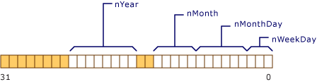
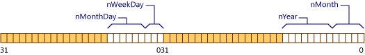

# C++ Bit Fields
Classes and structures can contain members that occupy less storage than an integral type. These members are specified as bit fields. The syntax for bit-field *member-declarator* specification follows:  
  
## Syntax  
  
<CodeContentPlaceHolder>0\</CodeContentPlaceHolder>  
## Remarks  
 The (optional) <CodeContentPlaceHolder>3\</CodeContentPlaceHolder> is the name by which the member is accessed in the program. It must be an integral type (including enumerated types). The *constant-expression* specifies the number of bits the member occupies in the structure. Anonymous bit fields — that is, bit-field members with no identifier — can be used for padding.  
  
> [!NOTE]
>  An unnamed bit field of width 0 forces alignment of the next bit field to the next <CodeContentPlaceHolder>4\</CodeContentPlaceHolder> boundary, where <CodeContentPlaceHolder>5\</CodeContentPlaceHolder> is the type of the member.  
  
 The following example declares a structure that contains bit fields:  
  
<CodeContentPlaceHolder>1\</CodeContentPlaceHolder>  
 The conceptual memory layout of an object of type <CodeContentPlaceHolder>6\</CodeContentPlaceHolder> is shown in the following figure.  
  
   
Memory Layout of Date Object  
  
 Note that <CodeContentPlaceHolder>7\</CodeContentPlaceHolder> is 8 bits long and would overflow the word boundary of the declared type, **unsigned short**. Therefore, it is begun at the beginning of a new **unsigned short**. It is not necessary that all bit fields fit in one object of the underlying type; new units of storage are allocated, according to the number of bits requested in the declaration.  
  
 **Microsoft Specific**  
  
 The ordering of data declared as bit fields is from low to high bit, as shown in the figure above.  
  
 **END Microsoft Specific**  
  
 If the declaration of a structure includes an unnamed field of length 0, as shown in the following example,  
  
<CodeContentPlaceHolder>2\</CodeContentPlaceHolder>  
 the memory layout is as shown in the following figure.  
  
   
Layout of Date Object with Zero-Length Bit Field  
  
 The underlying type of a bit field must be an integral type, as described in [Fundamental Types](../vs140/fundamental-types---c---.md).  
  
## Restrictions on bit fields  
 The following list details erroneous operations on bit fields:  
  
1.  Taking the address of a bit field.  
  
2.  Initializing a reference with a bit field.  
  
## See Also  
 [Classes and Structs](../vs140/classes-and-structs--c---.md)