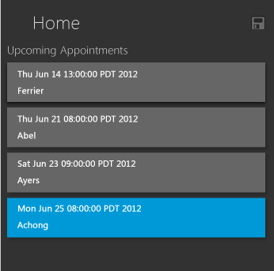
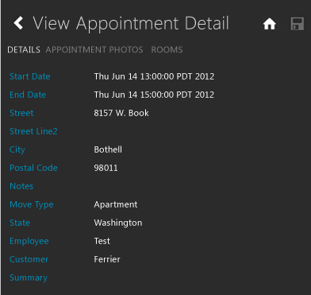
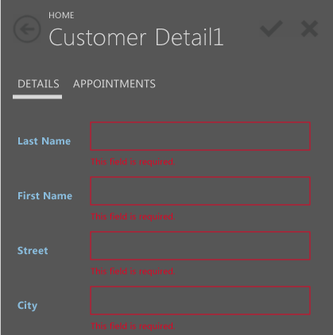

# Choosing a Screen Type for an HTML Client of a LightSwitch App
When you develop an HTML client project by using Visual Studio LightSwitch, you can create the following types of screens:  
  
## Browse Data Screen  
 Create this type of screen to display a list of records, such as a list of appointments or customers. Tapping an item in the list typically opens another screen to display or edit details for the item. This kind of screen typically acts as the home screen for an application.  
  
   
  
### View Details Screen  
 Create this type of screen to display a single record, such as information about one appointment or one customer, and any related child records. For example, you could create this kind of screen to display information such as the name and address of a customer and a list of orders for that customer. You typically launch this type of screen by using the <CodeContentPlaceHolder>0\</CodeContentPlaceHolder> method from a **Browse Data** screen.  
  
   
  
### Add/Edit Details Screen  
 Create this type of screen so that users can create or edit a single record or related child records. You typically launch this type of screen when the user taps a button on another screen.  
  
   
  
## Common Screen Set  
 The **Common Screen Set** creates a **Browse Data Screen**, **View Details Screen**, and **Add/Edit Details** screen for an entity in a single step. Common navigation between the screens is automatically enabled when you create a screen set.  
  
## See Also  
 [How to: Create an HTML Client Screen](../vs140/how-to--create-an-html-client-screen.md)   
 [How to: Create an HTML Client Dialog](../vs140/how-to--create-a-dialog-or-popup-for-a-mobile-client-of-a-lightswitch-app.md)   
 [HTML Client Applications in LightSwitch](../vs140/html-client-screens-for-lightswitch-apps.md)