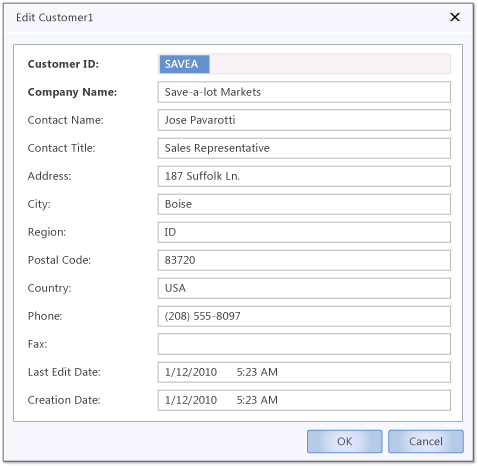
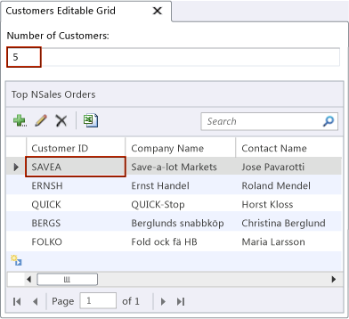
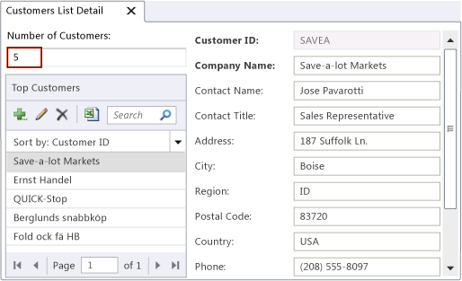
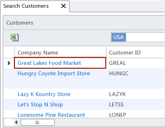

# Choosing a Screen Type
In [!INCLUDE[smb_current_short](../vs140/includes/smb_current_short_md.md)], a *screen* is a visual representation of the data in a data source. You can use any of the following screen templates as a starting point to create a screen:  
  
-   [Details Screen](#DetailsScreen)  
  
-   [Editable Grid Screen](#EditableScreen)  
  
-   [List and Details Screen](#ListDetails)  
  
-   [New Data Screen](#NewData)  
  
-   [Search Data Screen](#SearchData)  
  
##  \<a name="DetailsScreen">\</a> Details Screen  
 This screen appears when a user clicks a **Details** button on another screen. For example, you might create a screen that displays only a few fields of data. If you want the user to see more information, add a **Details** button to the screen.  
  
 The following illustration shows a screen that shows the details of a customer in the running application.  
  
   
  
  For a related video demonstration, see [How Do I: Create an Edit Details Screen in a LightSwitch Application?](http://go.microsoft.com/fwlink/?LinkID=205123).  
  
##  \<a name="EditableScreen">\</a> Editable Grid Screen  
 Use the **Editable Grid Screen** template when you want users to be able to change multiple rows at one time. By default, the editable grid screen displays all of the rows in an entity or table. A user can press Tab to move from field to field to make changes. When all the changes are made, the user can click **Save** to save them to the data source.  
  
 The following illustration shows a portion of an editable grid screen in the running application.  
  
   
  
##  \<a name="ListDetails">\</a> List and Details Screen  
 Use the **List and Details Screen** template when you want users to get an overview of the rows in a data source and also be able to read the details about any one of the rows. By default, the screen contains two areas. One of these areas contains a row for each item in the data source. The other area shows the details about the item that is selected. A user can modify the fields, and then click **Save** to save the changes to the data source.  
  
 The following illustration shows a List and Details screen in the running application.  
  
   
  
##  \<a name="NewData">\</a> New Data Screen  
 Use the **New Data Screen** template when you want users to be able to insert new rows one at a time. By default, the screen contains entries for every field of data. The labels for required fields appear as bold text. Also by default, the screen uses controls that match the underlying data fields. For example, a <CodeContentPlaceHolder>0\</CodeContentPlaceHolder> data field is represented by a **CheckBox** control on the screen, and a <CodeContentPlaceHolder>1\</CodeContentPlaceHolder> field is represented by a **DateTimePicker** control.  
  
 Users click **Save** to add the information to the data source.  
  
 The following illustration shows a portion of a new data screen in the running application.  
  
   
  
##  \<a name="SearchData">\</a> Search Data Screen  
 Use the **Search Data Screen** template when you want a user to be able to locate a row of data. By default, the screen displays a read-only grid of all the rows of data. To search for a specific entry, a user can type a term in the search box. The search returns all rows where any field matches the search term. Clicking on a result opens a **Details** screen for that record.  
  
 The following illustration shows a portion of a search screen. This example shows a portion of all customers in the USA.  
  
   
  
  For a related video demonstration, see [How Do I: Create a Search Screen in a LightSwitch Application?](http://go.microsoft.com/fwlink/?LinkID=205122).  
  
## See Also  
 [Screens: What the User Sees](../vs140/screens--the-user-interface-of-your-lightswitch-application.md)   
 [How to: Create a Screen](../vs140/how-to--create-a-silverlight-screen.md)   
 [Choosing a Screen Type](../vs140/choosing-a-screen-type.md)