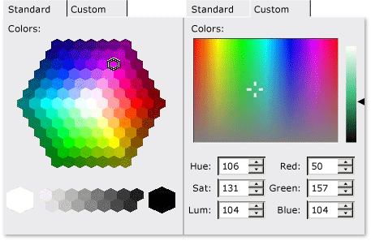

# CMFCColorPickerCtrl Class
The <CodeContentPlaceHolder>18\</CodeContentPlaceHolder> class provides functionality for a control that is used to select colors.  
  
## Syntax  
  
<CodeContentPlaceHolder>0\</CodeContentPlaceHolder>  
## Members  
  
### Public Constructors  
  
|Name|Description|  
|----------|-----------------|  
|[CMFCColorPickerCtrl::CMFCPColorPickerCtrl](#cmfccolorpickerctrl__cmfccolorpickerctrl)|Constructs a <CodeContentPlaceHolder>19\</CodeContentPlaceHolder> object.|  
  
### Public Methods  
  
|Name|Description|  
|----------|-----------------|  
|[CMFCColorPickerCtrl::GetColor](#cmfccolorpickerctrl__getcolor)|Retrieves the color that the user selects.|  
|[CMFCColorPickerCtrl::GetHLS](#cmfccolorpickerctrl__gethls)|Retrieves the hue, luminance and saturation values of the color that the user selects.|  
|[CMFCColorPickerCtrl::GetHue](#cmfccolorpickerctrl__gethue)|Retrieves the hue component of the color that the user selects.|  
|[CMFCColorPickerCtrl::GetLuminance](#cmfccolorpickerctrl__getluminance)|Retrieves the luminance component of the color that the user selects.|  
|[CMFCColorPickerCtrl::GetSaturation](#cmfccolorpickerctrl__getsaturation)|Retrieves the saturation component of the color that the user selects.|  
|[CMFCColorPickerCtrl::SelectCellHexagon](#cmfccolorpickerctrl__selectcellhexagon)|Sets the current color to the color defined by the specified RGB color components or the specified cell hexagon.|  
|[CMFCColorPickerCtrl::SetColor](#cmfccolorpickerctrl__setcolor)|Sets the current color to the specified RGB color value.|  
|[CMFCColorPickerCtrl::SetHLS](#cmfccolorpickerctrl__sethls)|Sets the current color to the specified HLS color value.|  
|[CMFCColorPickerCtrl::SetHue](#cmfccolorpickerctrl__sethue)|Changes the hue component of the currently selected color.|  
|[CMFCColorPickerCtrl::SetLuminance](#cmfccolorpickerctrl__setluminance)|Changes the luminance component of the currently selected color.|  
|[CMFCColorPickerCtrl::SetLuminanceBarWidth](#cmfccolorpickerctrl__setluminancebarwidth)|Sets the width of the luminance bar in the color picker control.|  
|[CMFCColorPickerCtrl::SetOriginalColor](#cmfccolorpickerctrl__setoriginalcolor)|Sets the initial selected color.|  
|[CMFCColorPickerCtrl::SetPalette](#cmfccolorpickerctrl__setpalette)|Sets the current color palette.|  
|[CMFCColorPickerCtrl::SetSaturation](#cmfccolorpickerctrl__setsaturation)|Changes the saturation component of the currently selected color.|  
|[CMFCColorPickerCtrl::SetType](#cmfccolorpickerctrl__settype)|Sets the type of color picker control to display.|  
  
### Protected Methods  
  
|Name|Description|  
|----------|-----------------|  
|[CMFCColorPickerCtrl::DrawCursor](#cmfccolorpickerctrl__drawcursor)|Called by the framework before a cursor that points to the selected color is displayed.|  
  
## Remarks  
 Standard colors are selected from a hexagonal color palette, and custom colors are selected from a luminance bar where colors are specified using either red/green/blue notation or hue/satuaration/luminance notation.  
  
 The following illustration depicts several <CodeContentPlaceHolder>20\</CodeContentPlaceHolder> objects.  
  
   
  
 The <CodeContentPlaceHolder>21\</CodeContentPlaceHolder> supports two pairs of styles. The HEX and HEX_GREYSCALE styles are appropriate for standard color selection. The PICKER and LUMINANCE styles are appropriate for custom color selection.  
  
 Perform the following steps to incorporate the <CodeContentPlaceHolder>22\</CodeContentPlaceHolder> control into your dialog box:  
  
1.  If you use the **ClassWizard**, insert a new button control into your dialog box template (because the <CodeContentPlaceHolder>23\</CodeContentPlaceHolder> class is inherited from the <CodeContentPlaceHolder>24\</CodeContentPlaceHolder> class).  
  
2.  Insert a member variable that is associated with the new button control into your dialog box class. Then change the variable type from <CodeContentPlaceHolder>25\</CodeContentPlaceHolder> to <CodeContentPlaceHolder>26\</CodeContentPlaceHolder>.  
  
3.  Insert the <CodeContentPlaceHolder>27\</CodeContentPlaceHolder> message handler for the dialog box class. In the handler, set the type, palette, and initial selected color of the <CodeContentPlaceHolder>28\</CodeContentPlaceHolder> control.  
  
## Example  
 The following example demonstrates how to configure a <CodeContentPlaceHolder>29\</CodeContentPlaceHolder> object by using various methods in the <CodeContentPlaceHolder>30\</CodeContentPlaceHolder> class. The example demonstrates how to set the type of the picker control, and how to set its color, hue, luminance, and saturation. The example is part of the [New Controls sample](../vs140/visual-c---samples.md).  
  
 [!code[NVC_MFC_NewControls#4](../vs140/codesnippet/CPP/cmfccolorpickerctrl-class_1.h)]  
[!code[NVC_MFC_NewControls#5](../vs140/codesnippet/CPP/cmfccolorpickerctrl-class_2.cpp)]  
  
## Inheritance Hierarchy  
 [CObject](../vs140/cobject-class.md)  
  
 [CCmdTarget](../vs140/ccmdtarget-class.md)  
  
 [CWnd](../vs140/cwnd-class.md)  
  
 [CButton](../vs140/cbutton-class.md)  
  
 [CMFCColorPickerCtrl](../vs140/cmfccolorpickerctrl-class.md)  
  
## Requirements  
 **Header:** afxcolorpickerctrl.h  
  
##  \<a name="cmfccolorpickerctrl__cmfccolorpickerctrl">\</a>  CMFCColorPickerCtrl::CMFCColorPickerCtrl  
 Constructs a <CodeContentPlaceHolder>31\</CodeContentPlaceHolder> object.  
  
<CodeContentPlaceHolder>1\</CodeContentPlaceHolder>  
### Return Value  
  
### Remarks  
  
##  \<a name="cmfccolorpickerctrl__drawcursor">\</a>  CMFCColorPickerCtrl::DrawCursor  
 Called by the framework before a cursor that points to the selected color is displayed.  
  
<CodeContentPlaceHolder>2\</CodeContentPlaceHolder>  
### Parameters  
 [in] <CodeContentPlaceHolder>32\</CodeContentPlaceHolder>  
 Pointer to a device context.  
  
 [in] <CodeContentPlaceHolder>33\</CodeContentPlaceHolder>  
 Specifies a rectangular area around the selected color.  
  
### Remarks  
 Override this method when you need to change the shape of the cursor that points to the selected color.  
  
##  \<a name="cmfccolorpickerctrl__getcolor">\</a>  CMFCColorPickerCtrl::GetColor  
 Retrieves the color that the user selects.  
  
<CodeContentPlaceHolder>3\</CodeContentPlaceHolder>  
### Return Value  
 The RGB value of the selected color.  
  
### Remarks  
  
##  \<a name="cmfccolorpickerctrl__gethls">\</a>  CMFCColorPickerCtrl::GetHLS  
 Retrieves the hue, luminance and saturation values of the color that the user selects.  
  
<CodeContentPlaceHolder>4\</CodeContentPlaceHolder>  
### Parameters  
 [out] <CodeContentPlaceHolder>34\</CodeContentPlaceHolder>  
 Pointer to a variable of type double that receives hue information.  
  
 [out] <CodeContentPlaceHolder>35\</CodeContentPlaceHolder>  
 Pointer to a variable of type double that receives luminance information.  
  
 [out] <CodeContentPlaceHolder>36\</CodeContentPlaceHolder>  
 Pointer to a variable of type double that receives saturation information.  
  
### Remarks  
  
##  \<a name="cmfccolorpickerctrl__gethue">\</a>  CMFCColorPickerCtrl::GetHue  
 Retrieves the hue component of the color that the user selects.  
  
<CodeContentPlaceHolder>5\</CodeContentPlaceHolder>  
### Return Value  
 The hue component of the selected color.  
  
### Remarks  
  
##  \<a name="cmfccolorpickerctrl__getluminance">\</a>  CMFCColorPickerCtrl::GetLuminance  
 Retrieves the luminance component of the color that the user selects.  
  
<CodeContentPlaceHolder>6\</CodeContentPlaceHolder>  
### Return Value  
 The luminance component of the selected color.  
  
### Remarks  
  
##  \<a name="cmfccolorpickerctrl__getsaturation">\</a>  CMFCColorPickerCtrl::GetSaturation  
 Retrieves the saturation value of the color that the user selects.  
  
<CodeContentPlaceHolder>7\</CodeContentPlaceHolder>  
### Return Value  
 The saturation component of the selected color.  
  
### Remarks  
  
##  \<a name="cmfccolorpickerctrl__selectcellhexagon">\</a>  CMFCColorPickerCtrl::SelectCellHexagon  
 Sets the current color to the color defined by the specified RGB color components or the specified cell hexagon.  
  
<CodeContentPlaceHolder>8\</CodeContentPlaceHolder>  
### Parameters  
 [in] <CodeContentPlaceHolder>37\</CodeContentPlaceHolder>  
 The red color component.  
  
 [in] <CodeContentPlaceHolder>38\</CodeContentPlaceHolder>  
 The green color component.  
  
 [in] <CodeContentPlaceHolder>39\</CodeContentPlaceHolder>  
 The blue color component.  
  
 [in] <CodeContentPlaceHolder>40\</CodeContentPlaceHolder>  
 The x-coordinate of the cursor, which points to a cell hexagon.  
  
 [in] <CodeContentPlaceHolder>41\</CodeContentPlaceHolder>  
 The y-coordinate of the cursor, which points to a cell hexagon.  
  
### Return Value  
 The second overload of this method always returns <CodeContentPlaceHolder>42\</CodeContentPlaceHolder>.  
  
### Remarks  
 The first overload of this method sets the current color to the color that corresponds to the color selection control's specified red, green, and blue color components.  
  
 The second overload of this method sets the current color to the color of the cell hexagon that is pointed to by the specified cursor location.  
  
##  \<a name="cmfccolorpickerctrl__setcolor">\</a>  CMFCColorPickerCtrl::SetColor  
 Sets the current color to the specified RGB color value.  
  
<CodeContentPlaceHolder>9\</CodeContentPlaceHolder>  
### Parameters  
 [in] <CodeContentPlaceHolder>43\</CodeContentPlaceHolder>  
 An RGB color value.  
  
### Remarks  
  
##  \<a name="cmfccolorpickerctrl__sethls">\</a>  CMFCColorPickerCtrl::SetHLS  
 Sets the current color to the specified HLS color value.  
  
<CodeContentPlaceHolder>10\</CodeContentPlaceHolder>  
### Parameters  
 [in] <CodeContentPlaceHolder>44\</CodeContentPlaceHolder>  
 A hue value.  
  
 [in] <CodeContentPlaceHolder>45\</CodeContentPlaceHolder>  
 A luminance value.  
  
 [in] <CodeContentPlaceHolder>46\</CodeContentPlaceHolder>  
 A saturation value.  
  
 [in] <CodeContentPlaceHolder>47\</CodeContentPlaceHolder>  
 <CodeContentPlaceHolder>48\</CodeContentPlaceHolder> to force the window to immediately update to the new color; otherwise, <CodeContentPlaceHolder>49\</CodeContentPlaceHolder>. The default is <CodeContentPlaceHolder>50\</CodeContentPlaceHolder>.  
  
### Remarks  
  
##  \<a name="cmfccolorpickerctrl__sethue">\</a>  CMFCColorPickerCtrl::SetHue  
 Changes the hue of the currently selected color.  
  
<CodeContentPlaceHolder>11\</CodeContentPlaceHolder>  
### Parameters  
 [in] <CodeContentPlaceHolder>51\</CodeContentPlaceHolder>  
 A hue value.  
  
### Remarks  
  
##  \<a name="cmfccolorpickerctrl__setluminance">\</a>  CMFCColorPickerCtrl::SetLuminance  
 Changes the luminance of the currently selected color.  
  
<CodeContentPlaceHolder>12\</CodeContentPlaceHolder>  
### Parameters  
 [in] <CodeContentPlaceHolder>52\</CodeContentPlaceHolder>  
 A luminance value.  
  
### Remarks  
  
##  \<a name="cmfccolorpickerctrl__setluminancebarwidth">\</a>  CMFCColorPickerCtrl::SetLuminanceBarWidth  
 Sets the width of the luminance bar in the color picker control.  
  
<CodeContentPlaceHolder>13\</CodeContentPlaceHolder>  
### Parameters  
 [in] <CodeContentPlaceHolder>53\</CodeContentPlaceHolder>  
 The width of the luminance bar measured in pixels.  
  
### Remarks  
 Use this method to resize the luminance bar, which is on the **Custom** tab of the color picker control. The <CodeContentPlaceHolder>54\</CodeContentPlaceHolder> parameter specifies the new width of the luminance bar. The width value is ignored if it exceeds three-fourths of the client area width.  
  
##  \<a name="cmfccolorpickerctrl__setoriginalcolor">\</a>  CMFCColorPickerCtrl::SetOriginalColor  
 Sets the initial selected color.  
  
<CodeContentPlaceHolder>14\</CodeContentPlaceHolder>  
### Parameters  
 [in] <CodeContentPlaceHolder>55\</CodeContentPlaceHolder>  
 An RGB color value.  
  
### Remarks  
 Call this method when the color picker control is initialized.  
  
##  \<a name="cmfccolorpickerctrl__setpalette">\</a>  CMFCColorPickerCtrl::SetPalette  
 Sets the current color palette.  
  
<CodeContentPlaceHolder>15\</CodeContentPlaceHolder>  
### Parameters  
 [in] <CodeContentPlaceHolder>56\</CodeContentPlaceHolder>  
 Pointer to a color palette.  
  
### Remarks  
 The color palette defines the array of colors that is presented in the color picker control.  
  
##  \<a name="cmfccolorpickerctrl__setsaturation">\</a>  CMFCColorPickerCtrl::SetSaturation  
 Changes the saturation of the currently selected color.  
  
<CodeContentPlaceHolder>16\</CodeContentPlaceHolder>  
### Parameters  
 [in] <CodeContentPlaceHolder>57\</CodeContentPlaceHolder>  
 A saturation value.  
  
### Remarks  
  
##  \<a name="cmfccolorpickerctrl__settype">\</a>  CMFCColorPickerCtrl::SetType  
 Sets the type of color picker control to display.  
  
<CodeContentPlaceHolder>17\</CodeContentPlaceHolder>  
### Parameters  
 [in] <CodeContentPlaceHolder>58\</CodeContentPlaceHolder>  
 A color picker control type.  
  
 The types are defined by the <CodeContentPlaceHolder>59\</CodeContentPlaceHolder> enumeration. The possible types are <CodeContentPlaceHolder>60\</CodeContentPlaceHolder>, <CodeContentPlaceHolder>61\</CodeContentPlaceHolder>, <CodeContentPlaceHolder>62\</CodeContentPlaceHolder> and <CodeContentPlaceHolder>63\</CodeContentPlaceHolder>. The default type is <CodeContentPlaceHolder>64\</CodeContentPlaceHolder>.  
  
### Remarks  
 To specify a color picker control type, call this method before the Windows control is created.  
  
## See Also  
 [Hierarchy Chart](../vs140/hierarchy-chart.md)   
 [Classes](../vs140/mfc-classes.md)   
 [CMFCColorDialog](../vs140/cmfccolordialog-class.md)