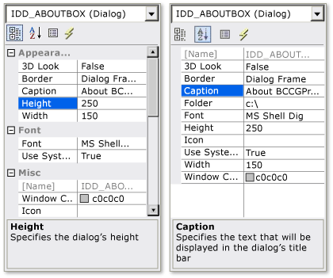

# CMFCPropertyGridCtrl Class
[!INCLUDE[cpp_fp_under_construction](../vs140/includes/cpp_fp_under_construction_md.md)]  
  
 Supports an editable property grid control that can display properties in alphabetical or hierarchical order.  
  
## Syntax  
  
<CodeContentPlaceHolder>0\</CodeContentPlaceHolder>  
## Members  
  
### Public Constructors  
  
|Name|Description|  
|----------|-----------------|  
|[CMFCPropertyGridCtrl::CMFCPropertyGridCtrl](#cmfcpropertygridctrl__cmfcpropertygridctrl)|Constructs a <CodeContentPlaceHolder>73\</CodeContentPlaceHolder> object.|  
|<CodeContentPlaceHolder>74\</CodeContentPlaceHolder>|Destructor.|  
  
### Public Methods  
  
|Name|Description|  
|----------|-----------------|  
|<CodeContentPlaceHolder>75\</CodeContentPlaceHolder>|Called by the framework to retrieve the child element or child object at a given point on the screen. (Overrides [CWnd::accHitTest](../vs140/cwnd-class.md#cwnd__acchittest).)|  
|<CodeContentPlaceHolder>76\</CodeContentPlaceHolder>|Called by the framework to retrieve the specified object's current screen location. (Overrides [CWnd::accLocation](../vs140/cwnd-class.md#cwnd__acclocation).)|  
|[CMFCPropertyGridCtrl::accSelect](#cmfcpropertygridctrl__accselect)|Called by the framework to modify the selection or move the keyboard focus of the specified object. (Overrides [CWnd::accSelect](../vs140/cwnd-class.md#cwnd__accselect).)|  
|[CMFCPropertyGridCtrl::AddProperty](#cmfcpropertygridctrl__addproperty)|Adds a new property to a property grid control.|  
|[CMFCPropertyGridCtrl::AlwaysShowUserToolTip](#cmfcpropertygridctrl__alwaysshowusertooltip)||  
|[CMFCPropertyGridCtrl::CloseColorPopup](#cmfcpropertygridctrl__closecolorpopup)|Closes the color selection dialog box.|  
|[CMFCPropertyGridCtrl::Create](#cmfcpropertygridctrl__create)|Creates a property grid control and attaches it to the property grid control object.|  
|[CMFCPropertyGridCtrl::DeleteProperty](#cmfcpropertygridctrl__deleteproperty)|Deletes the specified property from the property grid control.|  
|[CMFCPropertyGridCtrl::DrawControlBarColors](#cmfcpropertygridctrl__drawcontrolbarcolors)||  
|[CMFCPropertyGridCtrl::EnableDescriptionArea](#cmfcpropertygridctrl__enabledescriptionarea)|Enables or disables the description area that is displayed underneath the list of properties.|  
|[CMFCPropertyGridCtrl::EnableHeaderCtrl](#cmfcpropertygridctrl__enableheaderctrl)|Enables or disables the header control at the top of the property grid control.|  
|[CMFCPropertyGridCtrl::EnsureVisible](#cmfcpropertygridctrl__ensurevisible)|Scrolls a property grid control and expands property items until the specified property is visible.|  
|[CMFCPropertyGridCtrl::ExpandAll](#cmfcpropertygridctrl__expandall)|Expands or collapses all property grid control nodes.|  
|[CMFCPropertyGridCtrl::FindItemByData](#cmfcpropertygridctrl__finditembydata)|Retrieves the property that is associated with a user-defined <CodeContentPlaceHolder>77\</CodeContentPlaceHolder> value.|  
|<CodeContentPlaceHolder>78\</CodeContentPlaceHolder>|Called by the framework to retrieve the address of an <CodeContentPlaceHolder>79\</CodeContentPlaceHolder> interface for the specified child. (Overrides [CWnd::get_accChild](../vs140/cwnd-class.md#cwnd__get_accchild).)|  
|[CMFCPropertyGridCtrl::get_accChildCount](#cmfcpropertygridctrl__get_accchildcount)|Called by the framework to retrieve the number of children belonging to this object. (Overrides [CWnd::get_accChildCount](../vs140/cwnd-class.md#cwnd__get_accchildcount).)|  
|<CodeContentPlaceHolder>80\</CodeContentPlaceHolder>|Called by the framework to retrieve a string that describes the object's default action. (Overrides [CWnd::get_accDefaultAction](../vs140/cwnd-class.md#cwnd__get_accdefaultaction).)|  
|<CodeContentPlaceHolder>81\</CodeContentPlaceHolder>|Called by framework to retrieve a string that describes the visual appearance of the specified object. (Overrides [CWnd::get_accDescription](../vs140/cwnd-class.md#cwnd__get_accdescription).)|  
|[CMFCPropertyGridCtrl::get_accFocus](#cmfcpropertygridctrl__get_accfocus)|Called by the framework to retrieve the object that has the keyboard focus. (Overrides [CWnd::get_accFocus](../vs140/cwnd-class.md#cwnd__get_accfocus).)|  
|[CMFCPropertyGridCtrl::get_accHelp](#cmfcpropertygridctrl__get_acchelp)|Called by the framework to retrieve an object's <CodeContentPlaceHolder>82\</CodeContentPlaceHolder> property string. (Overrides [CWnd::get_accHelp](../vs140/cwnd-class.md#cwnd__get_acchelp).)|  
|[CMFCPropertyGridCtrl::get_accHelpTopic](#cmfcpropertygridctrl__get_acchelptopic)|Called by the framework to retrieve the full path of the <CodeContentPlaceHolder>83\</CodeContentPlaceHolder>file associated with the specified object and the identifier of the appropriate topic within that file. (Overrides [CWnd::get_accHelpTopic](../vs140/cwnd-class.md#cwnd__get_acchelptopic).)|  
|[CMFCPropertyGridCtrl::get_accKeyboardShortcut](#cmfcpropertygridctrl__get_acckeyboardshortcut)|Called by the framework to retrieve the specified object's shortcut key or access key. (Overrides [CWnd::get_accKeyboardShortcut](../vs140/cwnd-class.md#cwnd__get_acckeyboardshortcut).)|  
|<CodeContentPlaceHolder>84\</CodeContentPlaceHolder>|Called by the framework to retrieve the name of the specified object. (Overrides [CWnd::get_accName](../vs140/cwnd-class.md#cwnd__get_accname).)|  
|<CodeContentPlaceHolder>85\</CodeContentPlaceHolder>|Called by the framework to retrieve information that describes the role of the specified object. (Overrides [CWnd::get_accRole](../vs140/cwnd-class.md#cwnd__get_accrole).)|  
|[CMFCPropertyGridCtrl::get_accSelection](#cmfcpropertygridctrl__get_accselection)|Called by the framework to retrieve the selected children of this object. (Overrides [CWnd::get_accSelection](../vs140/cwnd-class.md#cwnd__get_accselection).)|  
|<CodeContentPlaceHolder>86\</CodeContentPlaceHolder>|Called by the framework to retrieve the current state of the specified object. (Overrides [CWnd::get_accState](../vs140/cwnd-class.md#cwnd__get_accstate).)|  
|<CodeContentPlaceHolder>87\</CodeContentPlaceHolder>|Called by the framework to retrieve the value of the specified object. (Overrides [CWnd::get_accValue](../vs140/cwnd-class.md#cwnd__get_accvalue).)|  
|[CMFCPropertyGridCtrl::GetBkColor](#cmfcpropertygridctrl__getbkcolor)|Retrieves the background color of the current property grid control.|  
|[CMFCPropertyGridCtrl::GetBoldFont](#cmfcpropertygridctrl__getboldfont)|Retrieves the Windows font that of text in the current property grid control in bold style.|  
|[CMFCPropertyGridCtrl::GetCurSel](#cmfcpropertygridctrl__getcursel)|Retrieves the currently selected property.|  
|[CMFCPropertyGridCtrl::GetCustomColors](#cmfcpropertygridctrl__getcustomcolors)|Retrieves the custom colors that are currently defined for property grid control elements.|  
|[CMFCPropertyGridCtrl::GetDescriptionHeight](#cmfcpropertygridctrl__getdescriptionheight)|Retrieves the height of the description area located at the bottom of the property grid control.|  
|[CMFCPropertyGridCtrl::GetDescriptionRows](#cmfcpropertygridctrl__getdescriptionrows)|Retrieves the number of rows in the description area of the current property grid control.|  
|[CMFCPropertyGridCtrl::GetHeaderCtrl](#cmfcpropertygridctrl__getheaderctrl)|Retrieves the internal [CMFCHeaderCtrl](../vs140/cmfcheaderctrl-class.md) object that the framework uses to display the current property grid control.|  
|[CMFCPropertyGridCtrl::GetHeaderHeight](#cmfcpropertygridctrl__getheaderheight)|Retrieves the height of the property grid control header.|  
|[CMFCPropertyGridCtrl::GetLeftColumnWidth](#cmfcpropertygridctrl__getleftcolumnwidth)|Retrieves the width of the left column of the current property grid control, which contains the name of each property.|  
|[CMFCPropertyGridCtrl::GetListRect](#cmfcpropertygridctrl__getlistrect)|Retrieves the bounding rectangle of the property grid control.|  
|[CMFCPropertyGridCtrl::GetProperty](#cmfcpropertygridctrl__getproperty)|Retrieves a pointer to the property object that corresponds to the specified index of a property grid control item.|  
|[CMFCPropertyGridCtrl::GetPropertyColumnWidth](#cmfcpropertygridctrl__getpropertycolumnwidth)|Retrieves the current width of the column that contains property values.|  
|[CMFCPropertyGridCtrl::GetPropertyCount](#cmfcpropertygridctrl__getpropertycount)|Retrieves the number of properties in a property grid control.|  
|[CMFCPropertyGridCtrl::GetRowHeight](#cmfcpropertygridctrl__getrowheight)|Retrieves the height of a row in the property grid control.|  
|[CMFCPropertyGridCtrl::GetScrollBarCtrl](#cmfcpropertygridctrl__getscrollbarctrl)|Retrieves a pointer to the scroll bar control in the property grid control. (Overrides [CWnd::GetScrollBarCtrl](../vs140/cwnd-class.md#cwnd__getscrollbarctrl).)|  
|[CMFCPropertyGridCtrl::GetTextColor](#cmfcpropertygridctrl__gettextcolor)|Retrieves the color of the text of property items in the current property grid control.|  
|<CodeContentPlaceHolder>88\</CodeContentPlaceHolder>|Used by the framework to obtain a pointer to the [CRuntimeClass](../vs140/cruntimeclass-structure.md) object that is associated with this class type.|  
|[CMFCPropertyGridCtrl::HitTest](#cmfcpropertygridctrl__hittest)|Retrieves a pointer to the property object that corresponds to a property grid control item if a specified point is in the item. This method also indicates the area in the property grid control that contains the point.|  
|[CMFCPropertyGridCtrl::InitHeader](#cmfcpropertygridctrl__initheader)|Initializes the internal [CMFCHeaderCtrl](../vs140/cmfcheaderctrl-class.md) object that the framework uses to display the current property grid control.|  
|[CMFCPropertyGridCtrl::IsAlphabeticMode](#cmfcpropertygridctrl__isalphabeticmode)|Indicates whether a property grid control is in alphabetic mode.|  
|[CMFCPropertyGridCtrl::IsAlwaysShowUserToolTip](#cmfcpropertygridctrl__isalwaysshowusertooltip)||  
|[CMFCPropertyGridCtrl::IsDescriptionArea](#cmfcpropertygridctrl__isdescriptionarea)|Indicates whether the description area of the property grid control is displayed.|  
|[CMFCPropertyGridCtrl::IsGroupNameFullWidth](#cmfcpropertygridctrl__isgroupnamefullwidth)|Indicates whether each property group name is displayed across the width of the current property grid control.|  
|[CMFCPropertyGridCtrl::IsHeaderCtrl](#cmfcpropertygridctrl__isheaderctrl)|Indicates whether the header control is displayed.|  
|[CMFCPropertyGridCtrl::IsMarkModifiedProperties](#cmfcpropertygridctrl__ismarkmodifiedproperties)|Indicates how the property grid control displays modified properties.|  
|[CMFCPropertyGridCtrl::IsShowDragContext](#cmfcpropertygridctrl__isshowdragcontext)|Indicates whether the framework redraws the name and value columns of the current property grid control when a user resizes the columns.|  
|[CMFCPropertyGridCtrl::IsVSDotNetLook](#cmfcpropertygridctrl__isvsdotnetlook)|Indicates whether the appearance of the property grid control is in the style that is used by VS .NET.|  
|[CMFCPropertyGridCtrl::MarkModifiedProperties](#cmfcpropertygridctrl__markmodifiedproperties)|Specifies how to display modified properties.|  
|<CodeContentPlaceHolder>89\</CodeContentPlaceHolder>|Used by class [CWinApp](../vs140/cwinapp-class.md) to translate window messages before they are dispatched to the                                         [TranslateMessage](http://msdn.microsoft.com/library/windows/desktop/ms644955) and                                         [DispatchMessage](http://msdn.microsoft.com/library/windows/desktop/ms644934) Windows functions. (Overrides [CWnd::PreTranslateMessage](../vs140/cwnd-class.md#cwnd__pretranslatemessage).)|  
|[CMFCPropertyGridCtrl::RemoveAll](#cmfcpropertygridctrl__removeall)|Removes all property objects from a property grid control.|  
|[CMFCPropertyGridCtrl::ResetOriginalValues](#cmfcpropertygridctrl__resetoriginalvalues)|Restores the original value of all properties.|  
|[CMFCPropertyGridCtrl::SetAlphabeticMode](#cmfcpropertygridctrl__setalphabeticmode)|Sets or resets alphabetical mode.|  
|[CMFCPropertyGridCtrl::SetBoolLabels](#cmfcpropertygridctrl__setboollabels)|Specifies the text of Boolean labels.|  
|[CMFCPropertyGridCtrl::SetCurSel](#cmfcpropertygridctrl__setcursel)|Selects a property in a property grid control.|  
|[CMFCPropertyGridCtrl::SetCustomColors](#cmfcpropertygridctrl__setcustomcolors)|Specifies custom colors for various property grid control elements.|  
|[CMFCPropertyGridCtrl::SetDescriptionRows](#cmfcpropertygridctrl__setdescriptionrows)|Specifies the number of rows to display in the description section of the current property grid control.|  
|[CMFCPropertyGridCtrl::SetGroupNameFullWidth](#cmfcpropertygridctrl__setgroupnamefullwidth)|Specifies whether to display the full width of the category name for a group of properties in the current property grid control.|  
|[CMFCPropertyGridCtrl::SetListDelimiter](#cmfcpropertygridctrl__setlistdelimiter)|Defines a character that will be used as a delimiter in a list of property values.|  
|[CMFCPropertyGridCtrl::SetShowDragContext](#cmfcpropertygridctrl__setshowdragcontext)|Specifies whether the framework redraws the name and value columns of the current property grid control when a user resizes the columns.|  
|[CMFCPropertyGridCtrl::SetVSDotNetLook](#cmfcpropertygridctrl__setvsdotnetlook)|Sets the appearance of the property grid control to the style that is used in VS .NET.|  
|[CMFCPropertyGridCtrl::UpdateColor](#cmfcpropertygridctrl__updatecolor)|Sets the color value of the currently selected color property.|  
  
### Protected Methods  
  
|Name|Description|  
|----------|-----------------|  
|[CMFCPropertyGridCtrl::AdjustLayout](#cmfcpropertygridctrl__adjustlayout)|Redraws the property grid control and its properties.|  
|[CMFCPropertyGridCtrl::CompareProps](#cmfcpropertygridctrl__compareprops)|Called by the property grid control to sort properties.|  
|[CMFCPropertyGridCtrl::EditItem](#cmfcpropertygridctrl__edititem)|Called by the framework when the user starts to modify a property.|  
|[CMFCPropertyGridCtrl::EndEditItem](#cmfcpropertygridctrl__endedititem)|Called by the framework when the user stops modifying a property.|  
|[CMFCPropertyGridCtrl::Init](#cmfcpropertygridctrl__init)|Called by the framework to initialize a property grid control.|  
|[CMFCPropertyGridCtrl::OnChangeSelection](#cmfcpropertygridctrl__onchangeselection)|Called by the framework when the current selection is changed.|  
|[CMFCPropertyGridCtrl::OnClickButton](#cmfcpropertygridctrl__onclickbutton)|Called by the framework when a property button is clicked.|  
|[CMFCPropertyGridCtrl::OnDrawBorder](#cmfcpropertygridctrl__ondrawborder)|Called by the framework to draw a border around a property grid control.|  
|[CMFCPropertyGridCtrl::OnDrawDescription](#cmfcpropertygridctrl__ondrawdescription)|Called by the framework to draw the description area and display the description text.|  
|[CMFCPropertyGridCtrl::OnDrawList](#cmfcpropertygridctrl__ondrawlist)|Called by the framework to display the list of properties in the property grid control.|  
|[CMFCPropertyGridCtrl::OnDrawProperty](#cmfcpropertygridctrl__ondrawproperty)|Called by the framework to display a property.|  
|[CMFCPropertyGridCtrl::OnPropertyChanged](#cmfcpropertygridctrl__onpropertychanged)|Called by the framework when the value of a property is changed.|  
|[CMFCPropertyGridCtrl::OnSelectCombo](#cmfcpropertygridctrl__onselectcombo)|Called by the framework when a property that contains a combo box control is selected.|  
|[CMFCPropertyGridCtrl::ValidateItemData](#cmfcpropertygridctrl__validateitemdata)|Called by the framework to validate property data.|  
  
## Remarks  
 The <CodeContentPlaceHolder>90\</CodeContentPlaceHolder> class displays a property grid control that contains editable properties derived from the [CMFCPropertyGridProperty](../vs140/cmfcpropertygridproperty-class.md) class. Each property can represent a type and it can contain subitems. The property grid control supports a resizable area at the bottom that can display the description of a selected property.  
  
 To use a property grid control, construct a <CodeContentPlaceHolder>91\</CodeContentPlaceHolder> object and then call the [CMFCPropertyGridCtrl::Create](#cmfcpropertygridctrl__create) method. Use the [CMFCPropertyGridCtrl::AddProperty](#cmfcpropertygridctrl__addproperty) method to add properties to the list.  
  
## Selection Properties  
 Instead of representing a value, a property item can start a dialog box that enables the user to select a color, file, or font.  
  
 The following table lists four selection property types:  
  
|Class|Description|  
|-----------|-----------------|  
|[CMFCPropertyGridProperty](../vs140/cmfcpropertygridproperty-class.md)|A general purpose property that is used to specify the value of strings, Booleans, dates and so on.|  
|[CMFCPropertyGridColorProperty](../vs140/cmfcpropertygridcolorproperty-class.md)|A property that is used to select a color value.|  
|[CMFCPropertyGridFileProperty](../vs140/cmfcpropertygridfileproperty-class.md)|A property that is used to select a file.|  
|[CMFCPropertyGridFontProperty](../vs140/cmfcpropertygridfontproperty-class.md)|A property that is used to select a font.|  
  
## Illustrations  
 The following illustrations depict a property grid control that displays properties in two ways. The first illustration displays properties hierarchically and the second displays properties alphabetically.  
  
   
  
## Example  
 The following example demonstrates how to configure a property grid control object by using various methods in the <CodeContentPlaceHolder>92\</CodeContentPlaceHolder> class. The example demonstrates how to enable the header control, enable the description area, and set the appearance of the property grid control. The example also shows how to set the alphabetic mode for the control whereby the control sorts all the properties it contains by their property name, and how to set the custom colors for various elements of the property grid control. This example is part of the [New Controls sample](../vs140/visual-c---samples.md).  
  
 [!code[NVC_MFC_NewControls#14](../vs140/codesnippet/CPP/cmfcpropertygridctrl-class_1.h)]  
[!code[NVC_MFC_NewControls#16](../vs140/codesnippet/CPP/cmfcpropertygridctrl-class_2.cpp)]  
[!code[NVC_MFC_NewControls#20](../vs140/codesnippet/CPP/cmfcpropertygridctrl-class_3.cpp)]  
[!code[NVC_MFC_NewControls#21](../vs140/codesnippet/CPP/cmfcpropertygridctrl-class_4.cpp)]  
[!code[NVC_MFC_NewControls#24](../vs140/codesnippet/CPP/cmfcpropertygridctrl-class_5.cpp)]  
  
## Inheritance Hierarchy  
 [CObject](../vs140/cobject-class.md)  
  
 [CCmdTarget](../vs140/ccmdtarget-class.md)  
  
 [CWnd](../vs140/cwnd-class.md)  
  
 [CMFCPropertyGridCtrl](../vs140/cmfcpropertygridctrl-class.md)  
  
## Requirements  
 **Header:** afxpropertygridctrl.h  
  
##  \<a name="cmfcpropertygridctrl__accselect">\</a>  CMFCPropertyGridCtrl::accSelect  
 [!INCLUDE[cpp_fp_under_construction](../vs140/includes/cpp_fp_under_construction_md.md)]  
  
<CodeContentPlaceHolder>1\</CodeContentPlaceHolder>  
### Parameters  
 [in] <CodeContentPlaceHolder>93\</CodeContentPlaceHolder>  
  [in] <CodeContentPlaceHolder>94\</CodeContentPlaceHolder>  
  
### Return Value  
  
### Remarks  
  
##  \<a name="cmfcpropertygridctrl__addproperty">\</a>  CMFCPropertyGridCtrl::AddProperty  
 Adds a new property to a property grid control.  
  
<CodeContentPlaceHolder>2\</CodeContentPlaceHolder>  
### Parameters  
 [in] <CodeContentPlaceHolder>95\</CodeContentPlaceHolder>  
 Pointer to a property.  
  
 [in] <CodeContentPlaceHolder>96\</CodeContentPlaceHolder>  
 <CodeContentPlaceHolder>97\</CodeContentPlaceHolder> to redraw the property immediately; otherwise, <CodeContentPlaceHolder>98\</CodeContentPlaceHolder>. The default value is <CodeContentPlaceHolder>99\</CodeContentPlaceHolder>.  
  
 [in] <CodeContentPlaceHolder>100\</CodeContentPlaceHolder>  
 <CodeContentPlaceHolder>101\</CodeContentPlaceHolder> to recalculate how to draw the text and value of the property, and then draw the property; <CodeContentPlaceHolder>102\</CodeContentPlaceHolder> to use existing calculations to draw the property. The default value is <CodeContentPlaceHolder>103\</CodeContentPlaceHolder>.  
  
### Return Value  
 If this method succeeds, the zero-based index of the position in the property grid control where the property is added; otherwise, -1.  
  
### Remarks  
 This method adds a pointer to the specified property to the end of the list of properties in the property grid control. Do not destroy the properties or allow them to go out of scope before the grid control is destroyed. When you are done with the property grid control, call [CMFCPropertyGridCtrl::RemoveAll](#cmfcpropertygridctrl__removeall) to delete all the added properties. The AddProperty method fails if the specified property has already been added to the list.  
  
##  \<a name="cmfcpropertygridctrl__adjustlayout">\</a>  CMFCPropertyGridCtrl::AdjustLayout  
 Redraws the property grid control and its properties.  
  
<CodeContentPlaceHolder>3\</CodeContentPlaceHolder>  
### Remarks  
 This method recalculates how to draw the entire property grid control and its properties, including images, fonts, and controls.  
  
##  \<a name="cmfcpropertygridctrl__alwaysshowusertooltip">\</a>  CMFCPropertyGridCtrl::AlwaysShowUserToolTip  
 [!INCLUDE[cpp_fp_under_construction](../vs140/includes/cpp_fp_under_construction_md.md)]  
  
<CodeContentPlaceHolder>4\</CodeContentPlaceHolder>  
### Parameters  
 [in] <CodeContentPlaceHolder>104\</CodeContentPlaceHolder>  
  
### Remarks  
  
##  \<a name="cmfcpropertygridctrl__closecolorpopup">\</a>  CMFCPropertyGridCtrl::CloseColorPopup  
 Closes the color selection dialog box.  
  
<CodeContentPlaceHolder>5\</CodeContentPlaceHolder>  
### Remarks  
 For more information about the color selection dialog box, see [CMFCPropertyGridColorProperty Class](../vs140/cmfcpropertygridcolorproperty-class.md).  
  
##  \<a name="cmfcpropertygridctrl__cmfcpropertygridctrl">\</a>  CMFCPropertyGridCtrl::CMFCPropertyGridCtrl  
 Constructs a <CodeContentPlaceHolder>105\</CodeContentPlaceHolder> object.  
  
<CodeContentPlaceHolder>6\</CodeContentPlaceHolder>  
### Return Value  
  
### Remarks  
  
##  \<a name="cmfcpropertygridctrl__compareprops">\</a>  CMFCPropertyGridCtrl::CompareProps  
 Called by the property grid control to sort properties.  
  
<CodeContentPlaceHolder>7\</CodeContentPlaceHolder>  
### Parameters  
 <CodeContentPlaceHolder>106\</CodeContentPlaceHolder>  
 A pointer to a property.  
  
 <CodeContentPlaceHolder>107\</CodeContentPlaceHolder>  
 A pointer to a property.  
  
### Return Value  
  
|Return Value|Description|  
|------------------|-----------------|  
|< 0|The name of the <CodeContentPlaceHolder>108\</CodeContentPlaceHolder> parameter is less than the name of the <CodeContentPlaceHolder>109\</CodeContentPlaceHolder> parameter.|  
|0|The name of the <CodeContentPlaceHolder>110\</CodeContentPlaceHolder> parameter is equal to the name of the <CodeContentPlaceHolder>111\</CodeContentPlaceHolder> parameter.|  
|> 0|The name of the <CodeContentPlaceHolder>112\</CodeContentPlaceHolder> object is greater than the name of the <CodeContentPlaceHolder>113\</CodeContentPlaceHolder> parameter.|  
  
### Remarks  
 By default, this method uses the [CString::Compare](../vs140/cstringt--compare.md) method to compare the <CodeContentPlaceHolder>114\</CodeContentPlaceHolder> members of the specified parameters.  
  
##  \<a name="cmfcpropertygridctrl__create">\</a>  CMFCPropertyGridCtrl::Create  
 Creates a property grid control and attaches it to the property grid control object.  
  
<CodeContentPlaceHolder>8\</CodeContentPlaceHolder>  
### Parameters  
 [in] <CodeContentPlaceHolder>115\</CodeContentPlaceHolder>  
 A bitwise combination (OR) of [window styles](../vs140/window-styles.md).  
  
 [in] <CodeContentPlaceHolder>116\</CodeContentPlaceHolder>  
 A bounding rectangle that specifies the size and position of the window, in client coordinates of <CodeContentPlaceHolder>117\</CodeContentPlaceHolder>.  
  
 [in] <CodeContentPlaceHolder>118\</CodeContentPlaceHolder>  
 Pointer to the parent window. Must not be <CodeContentPlaceHolder>119\</CodeContentPlaceHolder>.  
  
 [in] <CodeContentPlaceHolder>120\</CodeContentPlaceHolder>  
 The ID of the child window.  
  
### Return Value  
 <CodeContentPlaceHolder>121\</CodeContentPlaceHolder> if the window was created successfully; otherwise, <CodeContentPlaceHolder>122\</CodeContentPlaceHolder>.  
  
### Remarks  
 To create a property grid control, first call [CMFCPropertyGridCtrl::CMFCPropertyGridCtrl](#cmfcpropertygridctrl__cmfcpropertygridctrl) to construct a property grid object. Then call <CodeContentPlaceHolder>123\</CodeContentPlaceHolder>.  
  
### Example  
 The following example demonstrates how to use the <CodeContentPlaceHolder>124\</CodeContentPlaceHolder> method in <CodeContentPlaceHolder>125\</CodeContentPlaceHolder> class. This example is part of the [New Controls sample](../vs140/visual-c---samples.md).  
  
 [!code[NVC_MFC_NewControls#15](../vs140/codesnippet/CPP/cmfcpropertygridctrl-class_6.cpp)]  
  
##  \<a name="cmfcpropertygridctrl__deleteproperty">\</a>  CMFCPropertyGridCtrl::DeleteProperty  
 Deletes the specified property from the property grid control.  
  
<CodeContentPlaceHolder>9\</CodeContentPlaceHolder>  
### Parameters  
 [in] <CodeContentPlaceHolder>126\</CodeContentPlaceHolder>  
 Pointer to a property.  
  
 [in] <CodeContentPlaceHolder>127\</CodeContentPlaceHolder>  
 <CodeContentPlaceHolder>128\</CodeContentPlaceHolder> to redraw the property grid control; otherwise, <CodeContentPlaceHolder>129\</CodeContentPlaceHolder>. The default value is <CodeContentPlaceHolder>130\</CodeContentPlaceHolder>.  
  
 [in] <CodeContentPlaceHolder>131\</CodeContentPlaceHolder>  
 <CodeContentPlaceHolder>132\</CodeContentPlaceHolder> to recalculate how to draw all the text, images, and items in the property grid control, and then draw the control; otherwise, <CodeContentPlaceHolder>133\</CodeContentPlaceHolder>. The default value is <CodeContentPlaceHolder>134\</CodeContentPlaceHolder>.  
  
### Return Value  
 <CodeContentPlaceHolder>135\</CodeContentPlaceHolder> if this method is successful; otherwise, <CodeContentPlaceHolder>136\</CodeContentPlaceHolder>.  
  
### Remarks  
 Use this method to delete a property, and any sub-items, from the property grid control.  
  
##  \<a name="cmfcpropertygridctrl__drawcontrolbarcolors">\</a>  CMFCPropertyGridCtrl::DrawControlBarColors  
 [!INCLUDE[cpp_fp_under_construction](../vs140/includes/cpp_fp_under_construction_md.md)]  
  
<CodeContentPlaceHolder>10\</CodeContentPlaceHolder>  
### Return Value  
  
### Remarks  
  
##  \<a name="cmfcpropertygridctrl__edititem">\</a>  CMFCPropertyGridCtrl::EditItem  
 Called by the framework when the user starts to modify a property.  
  
<CodeContentPlaceHolder>11\</CodeContentPlaceHolder>  
### Parameters  
 [in] <CodeContentPlaceHolder>137\</CodeContentPlaceHolder>  
 Pointer to a property.  
  
 [in] <CodeContentPlaceHolder>138\</CodeContentPlaceHolder>  
 The point on the property grid control that the user clicked to begin the edit operation. The point is in the client coordinates of the control. The default value is <CodeContentPlaceHolder>139\</CodeContentPlaceHolder>.  
  
### Return Value  
 <CodeContentPlaceHolder>140\</CodeContentPlaceHolder> if method is successful; otherwise, <CodeContentPlaceHolder>141\</CodeContentPlaceHolder>.  
  
### Remarks  
  
##  \<a name="cmfcpropertygridctrl__enabledescriptionarea">\</a>  CMFCPropertyGridCtrl::EnableDescriptionArea  
 Enables or disables the description area that is displayed underneath the list of properties in the property grid control.  
  
<CodeContentPlaceHolder>12\</CodeContentPlaceHolder>  
### Parameters  
 [in] <CodeContentPlaceHolder>142\</CodeContentPlaceHolder>  
 <CodeContentPlaceHolder>143\</CodeContentPlaceHolder> to enable the description area; <CodeContentPlaceHolder>144\</CodeContentPlaceHolder> to disable the description area. The default value is <CodeContentPlaceHolder>145\</CodeContentPlaceHolder>.  
  
### Remarks  
 The description area is displayed at the bottom of the property grid control. By default, the description area is disabled and not visible.  
  
##  \<a name="cmfcpropertygridctrl__enableheaderctrl">\</a>  CMFCPropertyGridCtrl::EnableHeaderCtrl  
 Enables or disables the header control at the top of the property grid control.  
  
<CodeContentPlaceHolder>13\</CodeContentPlaceHolder>  
### Parameters  
 [in] <CodeContentPlaceHolder>146\</CodeContentPlaceHolder>  
 <CodeContentPlaceHolder>147\</CodeContentPlaceHolder> to enable the header control; <CodeContentPlaceHolder>148\</CodeContentPlaceHolder> to disable the header control. The default value is <CodeContentPlaceHolder>149\</CodeContentPlaceHolder>.  
  
 [in] <CodeContentPlaceHolder>150\</CodeContentPlaceHolder>  
 The title of the left column of the header control. The default value is **Property**.  
  
 [in] <CodeContentPlaceHolder>151\</CodeContentPlaceHolder>  
 The title of the right column of the header control. The default value is **Value**.  
  
##  \<a name="cmfcpropertygridctrl__endedititem">\</a>  CMFCPropertyGridCtrl::EndEditItem  
 Called by the framework when the user finishes modifying a property.  
  
<CodeContentPlaceHolder>14\</CodeContentPlaceHolder>  
### Parameters  
 [in] <CodeContentPlaceHolder>152\</CodeContentPlaceHolder>  
 <CodeContentPlaceHolder>153\</CodeContentPlaceHolder> to specify that the modified property data must be validated when the edit operation is complete; otherwise, <CodeContentPlaceHolder>154\</CodeContentPlaceHolder>. The default value is <CodeContentPlaceHolder>155\</CodeContentPlaceHolder>.  
  
### Return Value  
 <CodeContentPlaceHolder>156\</CodeContentPlaceHolder> if the edit operation ends successfully; <CodeContentPlaceHolder>157\</CodeContentPlaceHolder> if the modified property data is not valid or if the editing operation should continue.  
  
### Remarks  
  
##  \<a name="cmfcpropertygridctrl__ensurevisible">\</a>  CMFCPropertyGridCtrl::EnsureVisible  
 Scrolls a property grid control and expands property items until the specified property is visible.  
  
<CodeContentPlaceHolder>15\</CodeContentPlaceHolder>  
### Parameters  
 [in] <CodeContentPlaceHolder>158\</CodeContentPlaceHolder>  
 Pointer to a property.  
  
 [in] <CodeContentPlaceHolder>159\</CodeContentPlaceHolder>  
 <CodeContentPlaceHolder>160\</CodeContentPlaceHolder> to expand parent items to make the specified property visible; otherwise, <CodeContentPlaceHolder>161\</CodeContentPlaceHolder>. The default is <CodeContentPlaceHolder>162\</CodeContentPlaceHolder>.  
  
### Remarks  
  
##  \<a name="cmfcpropertygridctrl__expandall">\</a>  CMFCPropertyGridCtrl::ExpandAll  
 Expands or collapses all property grid control nodes.  
  
<CodeContentPlaceHolder>16\</CodeContentPlaceHolder>  
### Parameters  
 [in] <CodeContentPlaceHolder>163\</CodeContentPlaceHolder>  
 <CodeContentPlaceHolder>164\</CodeContentPlaceHolder> to expand all nodes; <CodeContentPlaceHolder>165\</CodeContentPlaceHolder> to collapse all nodes. The default value is <CodeContentPlaceHolder>166\</CodeContentPlaceHolder>.  
  
### Remarks  
  
##  \<a name="cmfcpropertygridctrl__finditembydata">\</a>  CMFCPropertyGridCtrl::FindItemByData  
 Retrieves the property that is associated with a user-defined <CodeContentPlaceHolder>167\</CodeContentPlaceHolder> value.  
  
<CodeContentPlaceHolder>17\</CodeContentPlaceHolder>  
### Parameters  
 [in] <CodeContentPlaceHolder>168\</CodeContentPlaceHolder>  
 A <CodeContentPlaceHolder>169\</CodeContentPlaceHolder> value.  
  
 [in] <CodeContentPlaceHolder>170\</CodeContentPlaceHolder>  
 <CodeContentPlaceHolder>171\</CodeContentPlaceHolder> to search property sub-items; otherwise, <CodeContentPlaceHolder>172\</CodeContentPlaceHolder>. The default value is <CodeContentPlaceHolder>173\</CodeContentPlaceHolder>.  
  
### Return Value  
 A pointer to the associated property object if this method succeeds; otherwise, <CodeContentPlaceHolder>174\</CodeContentPlaceHolder>.  
  
### Remarks  
 Use the [CMFCPropertyGridCtrl::CMFCPropertyGridCtrl](#cmfcpropertygridctrl__cmfcpropertygridctrl) constructor or [CMFCPropertyGridProperty::SetData](../vs140/cmfcpropertygridproperty-class.md#cmfcpropertygridproperty__setdata) method to associate a <CodeContentPlaceHolder>175\</CodeContentPlaceHolder> with a property.  
  
##  \<a name="cmfcpropertygridctrl__get_accchildcount">\</a>  CMFCPropertyGridCtrl::get_accChildCount  
 [!INCLUDE[cpp_fp_under_construction](../vs140/includes/cpp_fp_under_construction_md.md)]  
  
<CodeContentPlaceHolder>18\</CodeContentPlaceHolder>  
### Parameters  
 [in] <CodeContentPlaceHolder>176\</CodeContentPlaceHolder>  
  
### Return Value  
  
### Remarks  
  
##  \<a name="cmfcpropertygridctrl__get_accfocus">\</a>  CMFCPropertyGridCtrl::get_accFocus  
 [!INCLUDE[cpp_fp_under_construction](../vs140/includes/cpp_fp_under_construction_md.md)]  
  
<CodeContentPlaceHolder>19\</CodeContentPlaceHolder>  
### Parameters  
 [in] <CodeContentPlaceHolder>177\</CodeContentPlaceHolder>  
  
### Return Value  
  
### Remarks  
  
##  \<a name="cmfcpropertygridctrl__get_acchelp">\</a>  CMFCPropertyGridCtrl::get_accHelp  
 [!INCLUDE[cpp_fp_under_construction](../vs140/includes/cpp_fp_under_construction_md.md)]  
  
<CodeContentPlaceHolder>20\</CodeContentPlaceHolder>  
### Parameters  
 [in] <CodeContentPlaceHolder>178\</CodeContentPlaceHolder>  
  [in] <CodeContentPlaceHolder>179\</CodeContentPlaceHolder>  
  
### Return Value  
  
### Remarks  
  
##  \<a name="cmfcpropertygridctrl__get_acchelptopic">\</a>  CMFCPropertyGridCtrl::get_accHelpTopic  
 [!INCLUDE[cpp_fp_under_construction](../vs140/includes/cpp_fp_under_construction_md.md)]  
  
<CodeContentPlaceHolder>21\</CodeContentPlaceHolder>  
### Parameters  
 [in] <CodeContentPlaceHolder>180\</CodeContentPlaceHolder>  
  [in] <CodeContentPlaceHolder>181\</CodeContentPlaceHolder>  
  [in] <CodeContentPlaceHolder>182\</CodeContentPlaceHolder>  
  
### Return Value  
  
### Remarks  
  
##  \<a name="cmfcpropertygridctrl__get_acckeyboardshortcut">\</a>  CMFCPropertyGridCtrl::get_accKeyboardShortcut  
 [!INCLUDE[cpp_fp_under_construction](../vs140/includes/cpp_fp_under_construction_md.md)]  
  
<CodeContentPlaceHolder>22\</CodeContentPlaceHolder>  
### Parameters  
 [in] <CodeContentPlaceHolder>183\</CodeContentPlaceHolder>  
  [in] <CodeContentPlaceHolder>184\</CodeContentPlaceHolder>  
  
### Return Value  
  
### Remarks  
  
##  \<a name="cmfcpropertygridctrl__get_accselection">\</a>  CMFCPropertyGridCtrl::get_accSelection  
 [!INCLUDE[cpp_fp_under_construction](../vs140/includes/cpp_fp_under_construction_md.md)]  
  
<CodeContentPlaceHolder>23\</CodeContentPlaceHolder>  
### Parameters  
 [in] <CodeContentPlaceHolder>185\</CodeContentPlaceHolder>  
  
### Return Value  
  
### Remarks  
  
##  \<a name="cmfcpropertygridctrl__getbkcolor">\</a>  CMFCPropertyGridCtrl::GetBkColor  
 Retrieves the background color of the current property grid control.  
  
<CodeContentPlaceHolder>24\</CodeContentPlaceHolder>  
### Return Value  
 An RGB color value.  
  
### Remarks  
 This method retrieves the color that the framework uses to draw the background of the current property grid control. The [CMFCPropertyGridCtrl::GetTextColor](#cmfcpropertygridctrl__gettextcolor) method retrieves the foreground color.  
  
##  \<a name="cmfcpropertygridctrl__getboldfont">\</a>  CMFCPropertyGridCtrl::GetBoldFont  
 Retrieves the Windows font that is used to draw text in the current property grid control in bold style.  
  
<CodeContentPlaceHolder>25\</CodeContentPlaceHolder>  
### Return Value  
 A reference to a [CFont](../vs140/cfont-class.md) object that describes the characteristics of a bold font.  
  
##  \<a name="cmfcpropertygridctrl__getcursel">\</a>  CMFCPropertyGridCtrl::GetCurSel  
 Retrieves the currently selected property.  
  
<CodeContentPlaceHolder>26\</CodeContentPlaceHolder>  
### Return Value  
 A pointer to the property object that corresponds to the selected item in the property grid control.  
  
### Remarks  
  
##  \<a name="cmfcpropertygridctrl__getcustomcolors">\</a>  CMFCPropertyGridCtrl::GetCustomColors  
 Retrieves the custom colors that are currently defined for property grid control elements.  
  
<CodeContentPlaceHolder>27\</CodeContentPlaceHolder>  
### Parameters  
 [out] <CodeContentPlaceHolder>186\</CodeContentPlaceHolder>  
 The background color of property values.  
  
 [out] <CodeContentPlaceHolder>187\</CodeContentPlaceHolder>  
 The color of property names and property value text.  
  
 [out] <CodeContentPlaceHolder>188\</CodeContentPlaceHolder>  
 The background color of a property group.  
  
 [out] <CodeContentPlaceHolder>189\</CodeContentPlaceHolder>  
 The color of text in the property group.  
  
 [out] <CodeContentPlaceHolder>190\</CodeContentPlaceHolder>  
 The background color of the description area.  
  
 [out] <CodeContentPlaceHolder>191\</CodeContentPlaceHolder>  
 The color of text in the description area.  
  
 [out] <CodeContentPlaceHolder>192\</CodeContentPlaceHolder>  
 The color of lines that are drawn between properties.  
  
### Remarks  
 Use the [CMFCPropertyGridCtrl::SetCustomColors](#cmfcpropertygridctrl__setcustomcolors) method to set custom colors.  
  
##  \<a name="cmfcpropertygridctrl__getdescriptionheight">\</a>  CMFCPropertyGridCtrl::GetDescriptionHeight  
 Retrieves the height of the description area, which is located at the bottom of the property grid control.  
  
<CodeContentPlaceHolder>28\</CodeContentPlaceHolder>  
### Return Value  
 The height of the description area, in pixels.  
  
### Remarks  
 The height of the description area is calculated automatically and is set to 1/4 the height of the property grid control.  
  
 Use the [CMFCPropertyGridCtrl::EnableDescriptionArea](#cmfcpropertygridctrl__enabledescriptionarea) method to display or hide the description area. Use the [CMFCPropertyGridCtrl::IsDescriptionArea](#cmfcpropertygridctrl__isdescriptionarea) method to determine whether the description area is displayed or hidden.  
  
##  \<a name="cmfcpropertygridctrl__getdescriptionrows">\</a>  CMFCPropertyGridCtrl::GetDescriptionRows  
 Retrieves the number of rows in the description area of the current property grid control.  
  
<CodeContentPlaceHolder>29\</CodeContentPlaceHolder>  
### Return Value  
 The number of rows in the description area of the current property grid control.  
  
### Remarks  
 The [CMFCPropertyGridCtrl::CMFCPropertyGridCtrl](#cmfcpropertygridctrl__cmfcpropertygridctrl) constructor initializes the description area to 3 rows.  
  
##  \<a name="cmfcpropertygridctrl__getheaderctrl">\</a>  CMFCPropertyGridCtrl::GetHeaderCtrl  
 Retrieves the internal [CMFCHeaderCtrl](../vs140/cmfcheaderctrl-class.md) object that the framework uses to display the current property grid control.  
  
<CodeContentPlaceHolder>30\</CodeContentPlaceHolder>  
### Return Value  
 A reference to a <CodeContentPlaceHolder>193\</CodeContentPlaceHolder> object.  
  
##  \<a name="cmfcpropertygridctrl__getheaderheight">\</a>  CMFCPropertyGridCtrl::GetHeaderHeight  
 Retrieves the height of the header of a property grid control.  
  
<CodeContentPlaceHolder>31\</CodeContentPlaceHolder>  
### Return Value  
 The height of the header, in pixels.  
  
### Remarks  
  
##  \<a name="cmfcpropertygridctrl__getleftcolumnwidth">\</a>  CMFCPropertyGridCtrl::GetLeftColumnWidth  
 Retrieves of the width of the left column of the current property grid control, which contains the name of each property.  
  
<CodeContentPlaceHolder>32\</CodeContentPlaceHolder>  
### Return Value  
 The width of the name column.  
  
### Remarks  
 The right column of a property grid control contains the value of each property.  
  
##  \<a name="cmfcpropertygridctrl__getlistrect">\</a>  CMFCPropertyGridCtrl::GetListRect  
 Retrieves the bounding rectangle of the property grid control.  
  
<CodeContentPlaceHolder>33\</CodeContentPlaceHolder>  
### Return Value  
 The bounding rectangle of the property grid control. This rectange does not include the description area and header.  
  
### Remarks  
  
##  \<a name="cmfcpropertygridctrl__getproperty">\</a>  CMFCPropertyGridCtrl::GetProperty  
 Retrieves a pointer to the property object that corresponds to the specified index of an item in a property grid control.  
  
<CodeContentPlaceHolder>34\</CodeContentPlaceHolder>  
### Parameters  
 [in] <CodeContentPlaceHolder>194\</CodeContentPlaceHolder>  
 The zero-based index of a property grid control item.  
  
 This method asserts if the <CodeContentPlaceHolder>195\</CodeContentPlaceHolder> parameter is less than zero or greater than or equal to the number of properties.  
  
### Return Value  
 A pointer to the property object that corresponds to the specified index if this method is successful; otherwise, <CodeContentPlaceHolder>196\</CodeContentPlaceHolder>.  
  
### Remarks  
  
##  \<a name="cmfcpropertygridctrl__getpropertycolumnwidth">\</a>  CMFCPropertyGridCtrl::GetPropertyColumnWidth  
 Retrieves the current width of the column that contains property values.  
  
<CodeContentPlaceHolder>35\</CodeContentPlaceHolder>  
### Return Value  
 The current width of the column that contains property values.  
  
### Remarks  
 The column on the right in the property grid control contains the property values. A customer can use the split box of the property grid control to change the width of the values column.  
  
##  \<a name="cmfcpropertygridctrl__getpropertycount">\</a>  CMFCPropertyGridCtrl::GetPropertyCount  
 Retrieves the number of properties in a property grid control.  
  
<CodeContentPlaceHolder>36\</CodeContentPlaceHolder>  
### Return Value  
 The number of properties.  
  
### Remarks  
  
##  \<a name="cmfcpropertygridctrl__getrowheight">\</a>  CMFCPropertyGridCtrl::GetRowHeight  
 Retrieves the height of a row in the property grid control.  
  
<CodeContentPlaceHolder>37\</CodeContentPlaceHolder>  
### Return Value  
 The height of a row.  
  
### Remarks  
 The height of a row is equal to the current font height plus 4 pixels.  
  
##  \<a name="cmfcpropertygridctrl__getscrollbarctrl">\</a>  CMFCPropertyGridCtrl::GetScrollBarCtrl  
 Retrieves a pointer to the scroll bar control in the property grid control.  
  
<CodeContentPlaceHolder>38\</CodeContentPlaceHolder>  
### Parameters  
 [in] <CodeContentPlaceHolder>197\</CodeContentPlaceHolder>  
 The orientation of the scroll bar, which must be <CodeContentPlaceHolder>198\</CodeContentPlaceHolder>.  
  
### Return Value  
 A pointer to a scroll bar object, or <CodeContentPlaceHolder>199\</CodeContentPlaceHolder> if there is no scroll bar or the scroll bar orientation is <CodeContentPlaceHolder>200\</CodeContentPlaceHolder>.  
  
### Remarks  
 Use this method to gain direct access to the vertical scroll bar control.  
  
##  \<a name="cmfcpropertygridctrl__gettextcolor">\</a>  CMFCPropertyGridCtrl::GetTextColor  
 Retrieves the color that is used to draw the text of property items in the current property grid control.  
  
<CodeContentPlaceHolder>39\</CodeContentPlaceHolder>  
### Return Value  
 An RGB color value.  
  
### Remarks  
 This method retrieves the color that the framework uses to draw the foreground of the current property grid control. The [CMFCPropertyGridCtrl::GetBkColor](#cmfcpropertygridctrl__getbkcolor) method retrieves the background color.  
  
##  \<a name="cmfcpropertygridctrl__hittest">\</a>  CMFCPropertyGridCtrl::HitTest  
 Retrieves a pointer to the property object that corresponds to a property grid control item if a specified point is in the item. This method also indicates the area in the property grid control that contains the point.  
  
<CodeContentPlaceHolder>40\</CodeContentPlaceHolder>  
### Parameters  
 [in] <CodeContentPlaceHolder>201\</CodeContentPlaceHolder>  
 A point, in client coordinates.  
  
 [in, out] <CodeContentPlaceHolder>202\</CodeContentPlaceHolder>  
 A pointer to a <CodeContentPlaceHolder>203\</CodeContentPlaceHolder> variable. When this method returns, the variable indicates the *property area* that contains the specified point. For more information about a property area, see Remarks.  
  
 [in] <CodeContentPlaceHolder>204\</CodeContentPlaceHolder>  
 <CodeContentPlaceHolder>205\</CodeContentPlaceHolder> to test only the property area; <CodeContentPlaceHolder>206\</CodeContentPlaceHolder> to test the *description area* if the specified point is not in the property area. The default value is <CodeContentPlaceHolder>207\</CodeContentPlaceHolder>. For more information about the description area, see Remarks.  
  
### Return Value  
 If the <CodeContentPlaceHolder>208\</CodeContentPlaceHolder> parameter is <CodeContentPlaceHolder>209\</CodeContentPlaceHolder> and the specified point is in a property area, the return value is a pointer to the corresponding property object. In addition, the <CodeContentPlaceHolder>210\</CodeContentPlaceHolder> parameter is set to the particular area that contains the specified point. Otherwise, the return value is <CodeContentPlaceHolder>211\</CodeContentPlaceHolder> and the <CodeContentPlaceHolder>212\</CodeContentPlaceHolder> parameter is not modified.  
  
 If the <CodeContentPlaceHolder>213\</CodeContentPlaceHolder> parameter is <CodeContentPlaceHolder>214\</CodeContentPlaceHolder>, the return value is always <CodeContentPlaceHolder>215\</CodeContentPlaceHolder>. However, if the specified point is in the description area, the <CodeContentPlaceHolder>216\</CodeContentPlaceHolder> parameter is set to <CodeContentPlaceHolder>217\</CodeContentPlaceHolder>.  
  
### Remarks  
 The term *property area* refers to any one of the name, value, or expand box areas of a property grid control item. The *description area* is the zone at the bottom of a property grid control. When you click a property grid control item, the description area displays a description of the corresponding property.  
  
 This method sets the value of the variable that the <CodeContentPlaceHolder>218\</CodeContentPlaceHolder> parameter points to. The following table lists the possible values and corresponding areas.  
  
|Value|Area|  
|-----------|----------|  
|<CodeContentPlaceHolder>219\</CodeContentPlaceHolder>|Property expand box control.|  
|<CodeContentPlaceHolder>220\</CodeContentPlaceHolder>|Property name.|  
|<CodeContentPlaceHolder>221\</CodeContentPlaceHolder>|Property value.|  
|<CodeContentPlaceHolder>222\</CodeContentPlaceHolder>|Property grid control description area.|  
  
##  \<a name="cmfcpropertygridctrl__init">\</a>  CMFCPropertyGridCtrl::Init  
 Called by the framework to initialize a property grid control.  
  
<CodeContentPlaceHolder>41\</CodeContentPlaceHolder>  
### Remarks  
  
##  \<a name="cmfcpropertygridctrl__initheader">\</a>  CMFCPropertyGridCtrl::InitHeader  
 Initializes the internal [CMFCHeaderCtrl](../vs140/cmfcheaderctrl-class.md) object that the framework uses to display the current property grid control.  
  
<CodeContentPlaceHolder>42\</CodeContentPlaceHolder>  
##  \<a name="cmfcpropertygridctrl__isalphabeticmode">\</a>  CMFCPropertyGridCtrl::IsAlphabeticMode  
 Indicates whether a property grid control is in alphabetic mode.  
  
<CodeContentPlaceHolder>43\</CodeContentPlaceHolder>  
### Return Value  
 <CodeContentPlaceHolder>223\</CodeContentPlaceHolder> if the property grid control is in alphabetic mode; otherwise <CodeContentPlaceHolder>224\</CodeContentPlaceHolder>.  
  
### Remarks  
 When the property grid control is in alphabetic mode, all properties are sorted alphabetically by their names. Otherwise, properties are grouped under their parent nodes.  
  
 Use the [CMFCPropertyGridCtrl::SetAlphabeticMode](#cmfcpropertygridctrl__setalphabeticmode) method to enable or disable alphabetic mode.  
  
##  \<a name="cmfcpropertygridctrl__isalwaysshowusertooltip">\</a>  CMFCPropertyGridCtrl::IsAlwaysShowUserToolTip  
 [!INCLUDE[cpp_fp_under_construction](../vs140/includes/cpp_fp_under_construction_md.md)]  
  
<CodeContentPlaceHolder>44\</CodeContentPlaceHolder>  
### Return Value  
  
### Remarks  
  
##  \<a name="cmfcpropertygridctrl__isdescriptionarea">\</a>  CMFCPropertyGridCtrl::IsDescriptionArea  
 Indicates whether the description area of the property grid control is displayed.  
  
<CodeContentPlaceHolder>45\</CodeContentPlaceHolder>  
### Return Value  
 <CodeContentPlaceHolder>225\</CodeContentPlaceHolder> if the description area is displayed; otherwise, <CodeContentPlaceHolder>226\</CodeContentPlaceHolder>.  
  
### Remarks  
 Use the [CMFCPropertyGridCtrl::EnableDescriptionArea](#cmfcpropertygridctrl__enabledescriptionarea) method to hide or display the description area.  
  
##  \<a name="cmfcpropertygridctrl__isgroupnamefullwidth">\</a>  CMFCPropertyGridCtrl::IsGroupNameFullWidth  
 Indicates whether each property group name is displayed across the width of the current property grid control.  
  
<CodeContentPlaceHolder>46\</CodeContentPlaceHolder>  
### Return Value  
 <CodeContentPlaceHolder>227\</CodeContentPlaceHolder> if group names are displayed across the width of the property grid control; <CodeContentPlaceHolder>228\</CodeContentPlaceHolder> if group names are truncated by the right (value) column of the control.  
  
### Remarks  
 A *group* is a collection of related properties in a property grid control. If the control is displayed hierarchically, the *group name* is displayed as a category title in the row above the group.  
  
##  \<a name="cmfcpropertygridctrl__isheaderctrl">\</a>  CMFCPropertyGridCtrl::IsHeaderCtrl  
 Indicates whether the header control is displayed.  
  
<CodeContentPlaceHolder>47\</CodeContentPlaceHolder>  
### Return Value  
 <CodeContentPlaceHolder>229\</CodeContentPlaceHolder> if the header control is displayed; otherwise <CodeContentPlaceHolder>230\</CodeContentPlaceHolder>.  
  
### Remarks  
 Use the [CMFCPropertyGridCtrl::EnableHeaderCtrl](#cmfcpropertygridctrl__enableheaderctrl) method to hide or display the header control.  
  
##  \<a name="cmfcpropertygridctrl__ismarkmodifiedproperties">\</a>  CMFCPropertyGridCtrl::IsMarkModifiedProperties  
 Indicates how the property grid control displays modified properties.  
  
<CodeContentPlaceHolder>48\</CodeContentPlaceHolder>  
### Return Value  
 <CodeContentPlaceHolder>231\</CodeContentPlaceHolder> if bold style is used to display modified properties; <CodeContentPlaceHolder>232\</CodeContentPlaceHolder> if regular style is used to display modified properties.  
  
### Remarks  
  
##  \<a name="cmfcpropertygridctrl__isshowdragcontext">\</a>  CMFCPropertyGridCtrl::IsShowDragContext  
 Indicates whether the framework redraws the name and value columns of the current property grid control when a user resizes the columns.  
  
<CodeContentPlaceHolder>49\</CodeContentPlaceHolder>  
### Return Value  
 <CodeContentPlaceHolder>233\</CodeContentPlaceHolder> if the framework redraws the name and value columns during a resize operation; <CodeContentPlaceHolder>234\</CodeContentPlaceHolder> if the framework redraws the columns after the drag operation is completed.  
  
### Remarks  
 The user can resize the name and value columns of a property grid control by dragging the split bar that is between the columns. If the drag context is displayed, the name and value columns are resized as long as the user drags the split bar. Otherwise, the split bar moves but the columns are not redrawn until the drag operation is completed.  
  
##  \<a name="cmfcpropertygridctrl__isvsdotnetlook">\</a>  CMFCPropertyGridCtrl::IsVSDotNetLook  
 Indicates whether the appearance of the property grid control is in the style of [!INCLUDE[vsprvslong](../vs140/includes/vsprvslong_md.md)].  
  
<CodeContentPlaceHolder>50\</CodeContentPlaceHolder>  
### Return Value  
 <CodeContentPlaceHolder>235\</CodeContentPlaceHolder> if the property grid control is in the style of [!INCLUDE[vsprvslong](../vs140/includes/vsprvslong_md.md)]; otherwise, <CodeContentPlaceHolder>236\</CodeContentPlaceHolder>.  
  
### Remarks  
 Use the [CMFCPropertyGridCtrl::SetVSDotNetLook](#cmfcpropertygridctrl__setvsdotnetlook) method to set the property grid control to the style of [!INCLUDE[vsprvslong](../vs140/includes/vsprvslong_md.md)].  
  
##  \<a name="cmfcpropertygridctrl__markmodifiedproperties">\</a>  CMFCPropertyGridCtrl::MarkModifiedProperties  
 Specifies how to display modified properties.  
  
<CodeContentPlaceHolder>51\</CodeContentPlaceHolder>  
### Parameters  
 [in] <CodeContentPlaceHolder>237\</CodeContentPlaceHolder>  
 <CodeContentPlaceHolder>238\</CodeContentPlaceHolder> to display modified properties in bold style; <CodeContentPlaceHolder>239\</CodeContentPlaceHolder> to display modified properties in regular style. The default value is <CodeContentPlaceHolder>240\</CodeContentPlaceHolder>.  
  
 [in] <CodeContentPlaceHolder>241\</CodeContentPlaceHolder>  
 <CodeContentPlaceHolder>242\</CodeContentPlaceHolder> to redraw the property grid control immediately; otherwise, <CodeContentPlaceHolder>243\</CodeContentPlaceHolder>. The default value is <CodeContentPlaceHolder>244\</CodeContentPlaceHolder>.  
  
### Remarks  
  
##  \<a name="cmfcpropertygridctrl__onchangeselection">\</a>  CMFCPropertyGridCtrl::OnChangeSelection  
 Called by the framework when the current selection is changed.  
  
<CodeContentPlaceHolder>52\</CodeContentPlaceHolder>  
### Parameters  
  
|Parameter|Description|  
|---------------|-----------------|  
|[in] <CodeContentPlaceHolder>245\</CodeContentPlaceHolder>|Pointer to the newly selected property.|  
|[in] <CodeContentPlaceHolder>246\</CodeContentPlaceHolder>|Pointer to the previously selected property.|  
  
### Remarks  
 The default implementation of this method does nothing.  
  
##  \<a name="cmfcpropertygridctrl__onclickbutton">\</a>  CMFCPropertyGridCtrl::OnClickButton  
 Called by the framework when a property button is clicked.  
  
<CodeContentPlaceHolder>53\</CodeContentPlaceHolder>  
### Parameters  
 [in] <CodeContentPlaceHolder>247\</CodeContentPlaceHolder>  
 A point, in client coordinates.  
  
### Remarks  
 By default, this method updates the current property value.  
  
##  \<a name="cmfcpropertygridctrl__ondrawborder">\</a>  CMFCPropertyGridCtrl::OnDrawBorder  
 Called by the framework to draw a border around a property grid control.  
  
<CodeContentPlaceHolder>54\</CodeContentPlaceHolder>  
### Parameters  
 [in] <CodeContentPlaceHolder>248\</CodeContentPlaceHolder>  
 A pointer to a device context.  
  
### Remarks  
  
##  \<a name="cmfcpropertygridctrl__ondrawdescription">\</a>  CMFCPropertyGridCtrl::OnDrawDescription  
 Called by the framework to draw the description area and display the description text.  
  
<CodeContentPlaceHolder>55\</CodeContentPlaceHolder>  
### Parameters  
 [in] <CodeContentPlaceHolder>249\</CodeContentPlaceHolder>  
 A pointer to a device context.  
  
 [in] <CodeContentPlaceHolder>250\</CodeContentPlaceHolder>  
 A rectangle that specifies where to draw the description area.  
  
### Remarks  
 Use the [CMFCPropertyGridCtrl::EnableDescriptionArea](#cmfcpropertygridctrl__enabledescriptionarea) method to display the description area.  
  
##  \<a name="cmfcpropertygridctrl__ondrawlist">\</a>  CMFCPropertyGridCtrl::OnDrawList  
 Called by the framework to display the list of properties in the property grid control.  
  
<CodeContentPlaceHolder>56\</CodeContentPlaceHolder>  
### Parameters  
 [in] <CodeContentPlaceHolder>251\</CodeContentPlaceHolder>  
 A pointer to a device context.  
  
### Remarks  
  
##  \<a name="cmfcpropertygridctrl__ondrawproperty">\</a>  CMFCPropertyGridCtrl::OnDrawProperty  
 Called by the framework to display a property.  
  
<CodeContentPlaceHolder>57\</CodeContentPlaceHolder>  
### Parameters  
 [in] <CodeContentPlaceHolder>252\</CodeContentPlaceHolder>  
 A pointer to a device context.  
  
 [in] <CodeContentPlaceHolder>253\</CodeContentPlaceHolder>  
 A pointer to a property object.  
  
### Return Value  
 <CodeContentPlaceHolder>254\</CodeContentPlaceHolder> if this method is successful; otherwise, <CodeContentPlaceHolder>255\</CodeContentPlaceHolder>.  
  
### Remarks  
  
##  \<a name="cmfcpropertygridctrl__onpropertychanged">\</a>  CMFCPropertyGridCtrl::OnPropertyChanged  
 Called by the framework when the value of a property is changed.  
  
<CodeContentPlaceHolder>58\</CodeContentPlaceHolder>  
### Parameters  
 [in] <CodeContentPlaceHolder>256\</CodeContentPlaceHolder>  
 A pointer to a property object whose value has changed.  
  
### Remarks  
 By default, this method sends the [AFX_WM_PROPERTY_CHANGED](../vs140/afx-messages.md) message to the owner of the property grid control.  
  
##  \<a name="cmfcpropertygridctrl__onselectcombo">\</a>  CMFCPropertyGridCtrl::OnSelectCombo  
 Called by the framework when a property that contains a combo box control is selected.  
  
<CodeContentPlaceHolder>59\</CodeContentPlaceHolder>  
### Remarks  
  
##  \<a name="cmfcpropertygridctrl__removeall">\</a>  CMFCPropertyGridCtrl::RemoveAll  
 Removes all property objects from a property grid control.  
  
<CodeContentPlaceHolder>60\</CodeContentPlaceHolder>  
### Remarks  
  
##  \<a name="cmfcpropertygridctrl__resetoriginalvalues">\</a>  CMFCPropertyGridCtrl::ResetOriginalValues  
 Restores the original values of all properties.  
  
<CodeContentPlaceHolder>61\</CodeContentPlaceHolder>  
### Parameters  
 [in] <CodeContentPlaceHolder>257\</CodeContentPlaceHolder>  
 <CodeContentPlaceHolder>258\</CodeContentPlaceHolder> to redraw the property list; otherwise, <CodeContentPlaceHolder>259\</CodeContentPlaceHolder>. The default value is <CodeContentPlaceHolder>260\</CodeContentPlaceHolder>.  
  
### Remarks  
  
##  \<a name="cmfcpropertygridctrl__setalphabeticmode">\</a>  CMFCPropertyGridCtrl::SetAlphabeticMode  
 Sets or resets alphabetic mode.  
  
<CodeContentPlaceHolder>62\</CodeContentPlaceHolder>  
### Parameters  
 [in] <CodeContentPlaceHolder>261\</CodeContentPlaceHolder>  
 <CodeContentPlaceHolder>262\</CodeContentPlaceHolder> to set alphabetic mode; <CodeContentPlaceHolder>263\</CodeContentPlaceHolder> reset alphabetic mode. The default value is <CodeContentPlaceHolder>264\</CodeContentPlaceHolder>.  
  
### Remarks  
 When the property grid control is in alphabetic mode, the control sorts all the properties it contains by their property name.  
  
##  \<a name="cmfcpropertygridctrl__setboollabels">\</a>  CMFCPropertyGridCtrl::SetBoolLabels  
 Specifies the text of Boolean labels.  
  
<CodeContentPlaceHolder>63\</CodeContentPlaceHolder>  
### Parameters  
 [in] <CodeContentPlaceHolder>265\</CodeContentPlaceHolder>  
 The text string to display for the Boolean value of true.  
  
 [in] <CodeContentPlaceHolder>266\</CodeContentPlaceHolder>  
 The text string to display for the Boolean value of false.  
  
### Remarks  
  
##  \<a name="cmfcpropertygridctrl__setcursel">\</a>  CMFCPropertyGridCtrl::SetCurSel  
 Selects a property in a property grid control.  
  
<CodeContentPlaceHolder>64\</CodeContentPlaceHolder>  
### Parameters  
 [in] <CodeContentPlaceHolder>267\</CodeContentPlaceHolder>  
 A pointer to a property object.  
  
 [in] <CodeContentPlaceHolder>268\</CodeContentPlaceHolder>  
 <CodeContentPlaceHolder>269\</CodeContentPlaceHolder> to redraw the property grid control immediately; otherwise, <CodeContentPlaceHolder>270\</CodeContentPlaceHolder>. The default value is <CodeContentPlaceHolder>271\</CodeContentPlaceHolder>.  
  
### Remarks  
 Use this method to cancel the selection of the current item in the property grid control and then select the item that corresponds to the specified property.  
  
##  \<a name="cmfcpropertygridctrl__setcustomcolors">\</a>  CMFCPropertyGridCtrl::SetCustomColors  
 Specifies custom colors for various elements of the property grid control.  
  
<CodeContentPlaceHolder>65\</CodeContentPlaceHolder>  
### Parameters  
 [in] <CodeContentPlaceHolder>272\</CodeContentPlaceHolder>  
 The background color of property values.  
  
 [in] <CodeContentPlaceHolder>273\</CodeContentPlaceHolder>  
 The color of property names and property value text.  
  
 [in] <CodeContentPlaceHolder>274\</CodeContentPlaceHolder>  
 The background color of a property group.  
  
 [in] <CodeContentPlaceHolder>275\</CodeContentPlaceHolder>  
 The new text color of property group.  
  
 [in] <CodeContentPlaceHolder>276\</CodeContentPlaceHolder>  
 The background color of the description area.  
  
 [in] <CodeContentPlaceHolder>277\</CodeContentPlaceHolder>  
 The color of text in the description area.  
  
 [in] <CodeContentPlaceHolder>278\</CodeContentPlaceHolder>  
 The color of lines that are drawn between properties.  
  
### Remarks  
 For any parameter, specify the <CodeContentPlaceHolder>279\</CodeContentPlaceHolder> color value to use the default color for that element of the property grid control.  
  
 To customize the appearance of a specific property, derive a class from the [CMFCPropertyGridProperty](../vs140/cmfcpropertygridproperty-class.md) class and then override the [CMFCPropertyGridProperty::OnDrawName](../vs140/cmfcpropertygridproperty-class.md#cmfcpropertygridproperty__ondrawname), [CMFCPropertyGridProperty::OnDrawValue](../vs140/cmfcpropertygridproperty-class.md#cmfcpropertygridproperty__ondrawvalue), [CMFCPropertyGridProperty::OnDrawExpandBox](../vs140/cmfcpropertygridproperty-class.md#cmfcpropertygridproperty__ondrawexpandbox), and [CMFCPropertyGridProperty::OnDrawButton](../vs140/cmfcpropertygridproperty-class.md#cmfcpropertygridproperty__ondrawbutton) methods.  
  
##  \<a name="cmfcpropertygridctrl__setdescriptionrows">\</a>  CMFCPropertyGridCtrl::SetDescriptionRows  
 Specifies the number of rows to display in the description section of the current property grid control.  
  
<CodeContentPlaceHolder>66\</CodeContentPlaceHolder>  
### Parameters  
 [in] <CodeContentPlaceHolder>280\</CodeContentPlaceHolder>  
 The number of rows to display in the property description.  
  
##  \<a name="cmfcpropertygridctrl__setgroupnamefullwidth">\</a>  CMFCPropertyGridCtrl::SetGroupNameFullWidth  
 Specifies whether to display the full width of the category name for a group of properties in the current property grid control.  
  
<CodeContentPlaceHolder>67\</CodeContentPlaceHolder>  
### Parameters  
 [in] <CodeContentPlaceHolder>281\</CodeContentPlaceHolder>  
 <CodeContentPlaceHolder>282\</CodeContentPlaceHolder> to display the complete width of the category name regardless of the width of the property name column. <CodeContentPlaceHolder>283\</CodeContentPlaceHolder> to limit the width of the category name to the width of the property name column. The default value is <CodeContentPlaceHolder>284\</CodeContentPlaceHolder>.  
  
 [in] <CodeContentPlaceHolder>285\</CodeContentPlaceHolder>  
 <CodeContentPlaceHolder>286\</CodeContentPlaceHolder> to update the property grid control immediately; <CodeContentPlaceHolder>287\</CodeContentPlaceHolder> to update the control when the next redraw event occurs. The default value is <CodeContentPlaceHolder>288\</CodeContentPlaceHolder>.  
  
### Remarks  
 The property grid control consists of a resizable *property name* column and a *property value* column. The end of the name column is also the start of the value column. To resize the columns, drag the border between the columns.  
  
 The terms *group name* and *category name* are used interchangeably in this method. The category name is displayed on a row that heads a set of related properties and values. This method specifies whether the width of the property name column also specifies the width of the displayed category name.  
  
##  \<a name="cmfcpropertygridctrl__setlistdelimiter">\</a>  CMFCPropertyGridCtrl::SetListDelimiter  
 Defines a character that is used as a delimiter in a list of property values.  
  
<CodeContentPlaceHolder>68\</CodeContentPlaceHolder>  
### Parameters  
 [in] <CodeContentPlaceHolder>289\</CodeContentPlaceHolder>  
 A character to serve as a delimiter.  
  
### Remarks  
 Use this method to define a delimiter character in a list of property values that are used in the [CMFCPropertyGridProperty::CMFCPropertyGridProperty](../vs140/cmfcpropertygridproperty-class.md#cmfcpropertygridproperty__cmfcpropertygridproperty) constructor. In that constructor, set the <CodeContentPlaceHolder>290\</CodeContentPlaceHolder> parameter to <CodeContentPlaceHolder>291\</CodeContentPlaceHolder>.  
  
 By default, the [CMFCPropertyGridCtrl::CMFCPropertyGridCtrl](#cmfcpropertygridctrl__cmfcpropertygridctrl) constructor sets the delimiter character to comma (',').  
  
##  \<a name="cmfcpropertygridctrl__setshowdragcontext">\</a>  CMFCPropertyGridCtrl::SetShowDragContext  
 Specifies whether the framework redraws the name and value columns of the current property grid control when a user resizes the columns.  
  
<CodeContentPlaceHolder>69\</CodeContentPlaceHolder>  
### Parameters  
 [in] <CodeContentPlaceHolder>292\</CodeContentPlaceHolder>  
 <CodeContentPlaceHolder>293\</CodeContentPlaceHolder> to redraw the name and value columns during a resize operation; <CodeContentPlaceHolder>294\</CodeContentPlaceHolder> to redraw the columns after the drag operation is completed. The default value is <CodeContentPlaceHolder>295\</CodeContentPlaceHolder>.  
  
### Remarks  
 The user can resize the name and value columns of a property grid control by dragging the split bar that is between the columns. If the drag context is displayed, the name and value columns are resized as long as the user drags the split bar. Otherwise, the split bar moves but the columns are not redrawn until the drag operation is completed.  
  
##  \<a name="cmfcpropertygridctrl__setvsdotnetlook">\</a>  CMFCPropertyGridCtrl::SetVSDotNetLook  
 Sets the appearance of the property grid control to the style that is used in [!INCLUDE[vsprvslong](../vs140/includes/vsprvslong_md.md)].  
  
<CodeContentPlaceHolder>70\</CodeContentPlaceHolder>  
### Parameters  
 [in] <CodeContentPlaceHolder>296\</CodeContentPlaceHolder>  
 <CodeContentPlaceHolder>297\</CodeContentPlaceHolder> to set the property grid control to the style that is used in [!INCLUDE[vsprvslong](../vs140/includes/vsprvslong_md.md)]; otherwise, <CodeContentPlaceHolder>298\</CodeContentPlaceHolder>. The default value is <CodeContentPlaceHolder>299\</CodeContentPlaceHolder>.  
  
### Remarks  
  
##  \<a name="cmfcpropertygridctrl__updatecolor">\</a>  CMFCPropertyGridCtrl::UpdateColor  
 Sets the color value of the currently selected color property.  
  
<CodeContentPlaceHolder>71\</CodeContentPlaceHolder>  
### Parameters  
 [in] <CodeContentPlaceHolder>300\</CodeContentPlaceHolder>  
 An RGB color value.  
  
### Remarks  
 This method asserts in debug mode if the currently selected property of the property grid control is not a color property.  
  
##  \<a name="cmfcpropertygridctrl__validateitemdata">\</a>  CMFCPropertyGridCtrl::ValidateItemData  
 Called by the framework to validate property data.  
  
<CodeContentPlaceHolder>72\</CodeContentPlaceHolder>  
### Parameters  
  
|Parameter|Description|  
|---------------|-----------------|  
|[in] <CodeContentPlaceHolder>301\</CodeContentPlaceHolder>|Pointer to a property. This parameter is not used.|  
  
### Return Value  
 Always <CodeContentPlaceHolder>302\</CodeContentPlaceHolder>.  
  
### Remarks  
 The [CMFCPropertyGridCtrl::EndEditItem](#cmfcpropertygridctrl__endedititem) method calls this method to validate data. By default, this method does not use its <CodeContentPlaceHolder>303\</CodeContentPlaceHolder> parameter and its return value is always <CodeContentPlaceHolder>304\</CodeContentPlaceHolder>.  
  
 If you override this method, return <CodeContentPlaceHolder>305\</CodeContentPlaceHolder> if the specified property data is valid. Otherwise, return <CodeContentPlaceHolder>306\</CodeContentPlaceHolder>, in which case the framework does not update the property.  
  
## See Also  
 [Hierarchy Chart](../vs140/hierarchy-chart.md)   
 [Classes](../vs140/mfc-classes.md)