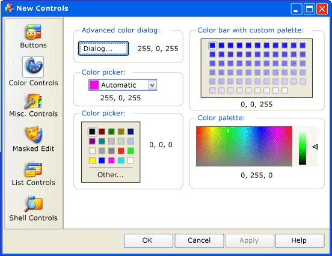
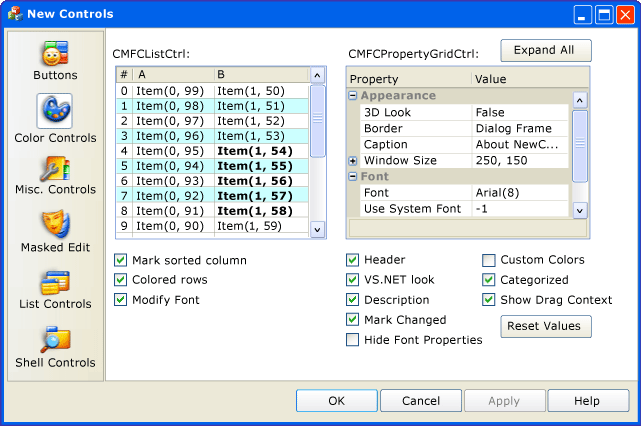
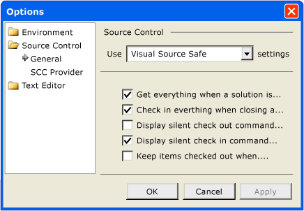

# CMFCPropertySheet Class
The <CodeContentPlaceHolder>18\</CodeContentPlaceHolder> class supports a property sheet where each property page is denoted by a page tab, a toolbar button, a tree control node, or a list item.  
  
## Syntax  
  
<CodeContentPlaceHolder>0\</CodeContentPlaceHolder>  
## Members  
  
### Public Constructors  
  
|Name|Description|  
|----------|-----------------|  
|[CMFCPropertySheet::CMFCPropertySheet](#cmfcpropertysheet__cmfcpropertysheet)|Constructs a <CodeContentPlaceHolder>19\</CodeContentPlaceHolder> object.|  
|<CodeContentPlaceHolder>20\</CodeContentPlaceHolder>|Destructor.|  
  
### Public Methods  
  
|Name|Description|  
|----------|-----------------|  
|[CMFCPropertySheet::AddPage](#cmfcpropertysheet__addpage)|Adds a page to the property sheet.|  
|[CMFCPropertySheet::AddPageToTree](#cmfcpropertysheet__addpagetotree)|Adds a new property page to the tree control.|  
|[CMFCPropertySheet::AddTreeCategory](#cmfcpropertysheet__addtreecategory)|Adds a new node to the tree control.|  
|[CMFCPropertySheet::EnablePageHeader](#cmfcpropertysheet__enablepageheader)|Reserves space at the top of each page to draw a custom header.|  
|[CMFCPropertySheet::GetHeaderHeight](#cmfcpropertysheet__getheaderheight)|Retrieves the height of the current header.|  
|[CMFCPropertySheet::GetLook](#cmfcpropertysheet__getlook)|Retrieves an enumeration value that specifies the appearance of the current property sheet.|  
|[CMFCPropertySheet::GetNavBarWidth](#cmfcpropertysheet__getnavbarwidth)|Retries the width of the navigation bar in pixels.|  
|[CMFCPropertySheet::GetTab](#cmfcpropertysheet__gettab)|Retrieves the internal tab control object that supports the current property sheet control.|  
|<CodeContentPlaceHolder>21\</CodeContentPlaceHolder>|Used by the framework to obtain a pointer to the [CRuntimeClass](../vs140/cruntimeclass-structure.md) object that is associated with this class type.|  
|[CMFCPropertySheet::InitNavigationControl](#cmfcpropertysheet__initnavigationcontrol)|Initializes the appearance of the current property sheet control.|  
|[CMFCPropertySheet::OnActivatePage](#cmfcpropertysheet__onactivatepage)|Called by the framework when a property page is enabled.|  
|[CMFCPropertySheet::OnDrawPageHeader](#cmfcpropertysheet__ondrawpageheader)|Called by the framework to draw a custom property page header.|  
|<CodeContentPlaceHolder>22\</CodeContentPlaceHolder>|Handles the                                         [WM_INITDIALOG](http://msdn.microsoft.com/library/windows/desktop/ms645428) message. (Overrides [CPropertySheet::OnInitDialog](../vs140/cpropertysheet-class.md#cpropertysheet__oninitdialog).)|  
|[CMFCPropertySheet::OnRemoveTreePage](#cmfcpropertysheet__onremovetreepage)|Called by the framework to remove a property page from a tree control.|  
|<CodeContentPlaceHolder>23\</CodeContentPlaceHolder>|Translates window messages before they are dispatched to the                                         [TranslateMessage](http://msdn.microsoft.com/library/windows/desktop/ms644955) and                                         [DispatchMessage](http://msdn.microsoft.com/library/windows/desktop/ms644934) Windows functions. (Overrides <CodeContentPlaceHolder>24\</CodeContentPlaceHolder>.)|  
|[CMFCPropertySheet::RemoveCategory](#cmfcpropertysheet__removecategory)|Removes a node from the tree control.|  
|[CMFCPropertySheet::RemovePage](#cmfcpropertysheet__removepage)|Removes a property page from the property sheet.|  
|[CMFCPropertySheet::SetIconsList](#cmfcpropertysheet__seticonslist)|Specifies the list of images that are used in the navigation control of the Outlook pane.|  
|[CMFCPropertySheet::SetLook](#cmfcpropertysheet__setlook)|Specifies the appearance of the property sheet.|  
  
## Remarks  
 The <CodeContentPlaceHolder>25\</CodeContentPlaceHolder> class represents property sheets, also known as tab dialog boxes. The <CodeContentPlaceHolder>26\</CodeContentPlaceHolder> class can display a property page in a variety of ways.  
  
 Perform the following steps to use the <CodeContentPlaceHolder>27\</CodeContentPlaceHolder> class in your application:  
  
1.  Derive a class from the <CodeContentPlaceHolder>28\</CodeContentPlaceHolder> class and name the class, for example, CMyPropertySheet.  
  
2.  Construct a [CMFCPropertyPage](../vs140/cmfcpropertypage-class.md) object for each property page.  
  
3.  Call the [CMFCPropertySheet::SetLook](#cmfcpropertysheet__setlook) method in the CMyPropertySheet constructor. A parameter of that method specifies that property pages shall be displayed either as tabs along the top or left of the property sheet; tabs in the style of a Microsoft OneNote property sheet; buttons on a Microsoft Outlook toolbar control; nodes on a tree control; or as a list of items on the left side of the property sheet.  
  
4.  If you create a property sheet in the style of a Microsoft Outlook toolbar, call the [SetIconsList](#cmfcpropertysheet__seticonslist) method to associate an image list together with the property pages.  
  
5.  Call the [CMFCPropertySheet::AddPage](#cmfcpropertysheet__addpage) method for each property page.  
  
6.  Create a <CodeContentPlaceHolder>29\</CodeContentPlaceHolder> control and call its <CodeContentPlaceHolder>30\</CodeContentPlaceHolder> method.  
  
## Illustrations  
 The following illustration depicts a property sheet that is in the style of an embedded Microsoft Outlook toolbar. The Outlook toolbar appears on the left side of the property sheet.  
  
   
  
 The following illustration depicts a property sheet that contains a [CMFCPropertyGridCtrl Class](../vs140/cmfcpropertygridctrl-class.md) object. That object is a property sheet in the style of a standard common controls property sheet.  
  
   
  
 The following illustration depicts a property sheet that is in the style of a tree control.  
  
   
  
## Inheritance Hierarchy  
 [CObject](../vs140/cobject-class.md)  
  
 [CCmdTarget](../vs140/ccmdtarget-class.md)  
  
 [CWnd](../vs140/cwnd-class.md)  
  
 [CPropertySheet](../vs140/cpropertysheet-class.md)  
  
 [CMFCPropertySheet](../vs140/cmfcpropertysheet-class.md)  
  
## Requirements  
 **Header:** afxpropertysheet.h  
  
##  \<a name="cmfcpropertysheet__addpage">\</a>  CMFCPropertySheet::AddPage  
 Adds a page to the property sheet.  
  
<CodeContentPlaceHolder>1\</CodeContentPlaceHolder>  
### Parameters  
 [in] <CodeContentPlaceHolder>31\</CodeContentPlaceHolder>  
 Pointer to a page object. This parameter cannot be <CodeContentPlaceHolder>32\</CodeContentPlaceHolder>.  
  
### Remarks  
 This method adds the specified property page as the rightmost tab in the property sheet. Therefore, use this method to add pages in left-to-right order.  
  
 If the property sheet is in the style of Microsoft Outlook, the framework displays a list of navigation buttons at the left of the property sheet. After this method adds a property page, it adds a corresponding button to the list. To display a property page, click its corresponding button. For more information about styles of property sheets, see [CMFCPropertySheet::SetLook](#cmfcpropertysheet__setlook).  
  
##  \<a name="cmfcpropertysheet__addpagetotree">\</a>  CMFCPropertySheet::AddPageToTree  
 Adds a new property page to the tree control.  
  
<CodeContentPlaceHolder>2\</CodeContentPlaceHolder>  
### Parameters  
 [in] <CodeContentPlaceHolder>33\</CodeContentPlaceHolder>  
 Pointer to a parent tree node, or <CodeContentPlaceHolder>34\</CodeContentPlaceHolder> to associate the specified page with the top-level node. Call the [CMFCPropertySheet::AddTreeCategory](#cmfcpropertysheet__addtreecategory) method to obtain this pointer.  
  
 [in] <CodeContentPlaceHolder>35\</CodeContentPlaceHolder>  
 Pointer to a property page object.  
  
 [in] <CodeContentPlaceHolder>36\</CodeContentPlaceHolder>  
 Zero-based index of an icon, or -1 if no icon is used. The icon is displayed next to the tree control property page when the page is not selected. The default value is -1.  
  
 [in] <CodeContentPlaceHolder>37\</CodeContentPlaceHolder>  
 Zero-based index of an icon, or -1 if no icon is used. The icon is displayed next to the tree control property page when the page is selected. The default value is -1.  
  
### Remarks  
 This method adds a property page as a leaf of a tree control. To add a property page, create a <CodeContentPlaceHolder>38\</CodeContentPlaceHolder> object, call the [CMFCPropertySheet::SetLook](#cmfcpropertysheet__setlook) method with the <CodeContentPlaceHolder>39\</CodeContentPlaceHolder> parameter set to <CodeContentPlaceHolder>40\</CodeContentPlaceHolder>, and then use this method to add the property page.  
  
##  \<a name="cmfcpropertysheet__addtreecategory">\</a>  CMFCPropertySheet::AddTreeCategory  
 Adds a new node to the tree control.  
  
<CodeContentPlaceHolder>3\</CodeContentPlaceHolder>  
### Parameters  
 [in] <CodeContentPlaceHolder>41\</CodeContentPlaceHolder>  
 The name of the node.  
  
 [in] <CodeContentPlaceHolder>42\</CodeContentPlaceHolder>  
 Zero-based index of an icon, or -1 if no icon is used. The icon is displayed next to the tree control property page when the page is not selected. The default value is -1.  
  
 [in] <CodeContentPlaceHolder>43\</CodeContentPlaceHolder>  
 Zero-based index of an icon, or -1 if no icon is used. The icon is displayed next to the tree control property page when the page is selected. The default value is -1.  
  
 [in] <CodeContentPlaceHolder>44\</CodeContentPlaceHolder>  
 Pointer to a parent tree node, or <CodeContentPlaceHolder>45\</CodeContentPlaceHolder> to associate the specified page with the top-level node. Set this parameter with the [CMFCPropertySheet::AddTreeCategory](#cmfcpropertysheet__addtreecategory) method.  
  
### Return Value  
 A pointer to the new node in the tree control.  
  
### Remarks  
 Use this method to add a new node, which is also referred to as a category, to the tree control. To add a node, create a <CodeContentPlaceHolder>46\</CodeContentPlaceHolder> object, call the [CMFCPropertySheet::SetLook](#cmfcpropertysheet__setlook) method with the <CodeContentPlaceHolder>47\</CodeContentPlaceHolder> parameter set to <CodeContentPlaceHolder>48\</CodeContentPlaceHolder>, and then use this method to add the node.  
  
 Use the return value of this method in subsequent calls to [CMFCPropertySheet::AddPageToTree](#cmfcpropertysheet__addpagetotree) and [CMFCPropertySheet::AddTreeCategory](#cmfcpropertysheet__addtreecategory).  
  
##  \<a name="cmfcpropertysheet__cmfcpropertysheet">\</a>  CMFCPropertySheet::CMFCPropertySheet  
 Constructs a <CodeContentPlaceHolder>49\</CodeContentPlaceHolder> object.  
  
<CodeContentPlaceHolder>4\</CodeContentPlaceHolder>  
### Parameters  
 [in] <CodeContentPlaceHolder>50\</CodeContentPlaceHolder>  
 A string that contains the property sheet caption. Cannot be <CodeContentPlaceHolder>51\</CodeContentPlaceHolder>.  
  
 [in] <CodeContentPlaceHolder>52\</CodeContentPlaceHolder>  
 A resource ID that contains the property sheet caption.  
  
 [in] <CodeContentPlaceHolder>53\</CodeContentPlaceHolder>  
 Pointer to the parent window of the property sheet, or <CodeContentPlaceHolder>54\</CodeContentPlaceHolder> if the parent window is the main window of the application. The default value is <CodeContentPlaceHolder>55\</CodeContentPlaceHolder>.  
  
 [in] <CodeContentPlaceHolder>56\</CodeContentPlaceHolder>  
 The zero-based index of the top property page. The default value is 0.  
  
### Remarks  
 For more information, see the parameters for the [CPropertySheet::CPropertySheet](../vs140/cpropertysheet-class.md#cpropertysheet__cpropertysheet) constructor.  
  
##  \<a name="cmfcpropertysheet__enablepageheader">\</a>  CMFCPropertySheet::EnablePageHeader  
 Reserves space at the top of each page to draw a custom header.  
  
<CodeContentPlaceHolder>5\</CodeContentPlaceHolder>  
### Parameters  
 [in] <CodeContentPlaceHolder>57\</CodeContentPlaceHolder>  
 The height of the header, in pixels.  
  
### Remarks  
 To use the value of the <CodeContentPlaceHolder>58\</CodeContentPlaceHolder> parameter to draw a custom header, override the [CMFCPropertySheet::OnDrawPageHeader](#cmfcpropertysheet__ondrawpageheader) method.  
  
##  \<a name="cmfcpropertysheet__getheaderheight">\</a>  CMFCPropertySheet::GetHeaderHeight  
 Retrieves the height of the current header.  
  
<CodeContentPlaceHolder>6\</CodeContentPlaceHolder>  
### Return Value  
 The height of the header, in pixels.  
  
### Remarks  
 Call the [CMFCPropertySheet::EnablePageHeader](#cmfcpropertysheet__enablepageheader) method before you call this method.  
  
##  \<a name="cmfcpropertysheet__getlook">\</a>  CMFCPropertySheet::GetLook  
 Retrieves an enumeration value that specifies the appearance of the current property sheet.  
  
<CodeContentPlaceHolder>7\</CodeContentPlaceHolder>  
### Return Value  
 One of the enumeration values that specifies the appearance of the property sheet. For a list of possible values, see the enumeration table in the Remarks section of [CMFCPropertySheet::SetLook](#cmfcpropertysheet__setlook).  
  
##  \<a name="cmfcpropertysheet__getnavbarwidth">\</a>  CMFCPropertySheet::GetNavBarWidth  
 Gets the width of the navigation bar.  
  
<CodeContentPlaceHolder>8\</CodeContentPlaceHolder>  
### Return Value  
 The width of the navigation bar in pixels.  
  
##  \<a name="cmfcpropertysheet__gettab">\</a>  CMFCPropertySheet::GetTab  
 Retrieves the internal tab control object that supports the current property sheet control.  
  
<CodeContentPlaceHolder>9\</CodeContentPlaceHolder>  
### Return Value  
 An internal tab control object.  
  
### Remarks  
 You can set a property sheet so that it appears in different styles, such as a tree control, a list of navigation buttons, or a set of tabbed pages.  
  
 Before you call this method, call the [CMFCPropertySheet::SetLook](#cmfcpropertysheet__setlook) method to set the appearance of the property sheet control. Then call the [CMFCPropertySheet::InitNavigationControl](#cmfcpropertysheet__initnavigationcontrol) method to initialize the internal tab control object. Use this method to retrieve the tab control object and then use that object to work with the tabs on the property sheet.  
  
 This method asserts in debug mode if the property sheet control is not set to appear in the style of Microsoft OneNote.  
  
##  \<a name="cmfcpropertysheet__initnavigationcontrol">\</a>  CMFCPropertySheet::InitNavigationControl  
 Initializes the appearance of the current property sheet control.  
  
<CodeContentPlaceHolder>10\</CodeContentPlaceHolder>  
### Return Value  
 A pointer to the window of the property sheet control.  
  
### Remarks  
 A property sheet control can appear in several different forms, such as a set of tabbed pages, a tree control, or a list of navigation buttons. Use the [CMFCPropertySheet::SetLook](#cmfcpropertysheet__setlook) method to specify the appearance of the property sheet control.  
  
##  \<a name="cmfcpropertysheet__onactivatepage">\</a>  CMFCPropertySheet::OnActivatePage  
 Called by the framework when a property page is enabled.  
  
<CodeContentPlaceHolder>11\</CodeContentPlaceHolder>  
### Parameters  
 [in] <CodeContentPlaceHolder>59\</CodeContentPlaceHolder>  
 Pointer to a property page object that represents the enabled property page.  
  
### Remarks  
 By default, this method ensures that the enabled property page is scrolled into view. If the style of the current property sheet contains a Microsoft Outlook pane, this method sets the corresponding Outlook button to the checked state.  
  
##  \<a name="cmfcpropertysheet__ondrawpageheader">\</a>  CMFCPropertySheet::OnDrawPageHeader  
 Called by the framework to draw the header for a custom property page.  
  
<CodeContentPlaceHolder>12\</CodeContentPlaceHolder>  
### Parameters  
 [in] <CodeContentPlaceHolder>60\</CodeContentPlaceHolder>  
 Pointer to a device context.  
  
 [in] <CodeContentPlaceHolder>61\</CodeContentPlaceHolder>  
 The zero-based property page number.  
  
 [in] <CodeContentPlaceHolder>62\</CodeContentPlaceHolder>  
 A bounding rectangle that specifies where to draw the header.  
  
### Remarks  
 By default, this method does nothing. If you override this method, call the [CMFCPropertySheet::EnablePageHeader](#cmfcpropertysheet__enablepageheader) method before the framework calls this method.  
  
##  \<a name="cmfcpropertysheet__onremovetreepage">\</a>  CMFCPropertySheet::OnRemoveTreePage  
 Called by the framework to remove a property page from a tree control.  
  
<CodeContentPlaceHolder>13\</CodeContentPlaceHolder>  
### Parameters  
 [in] <CodeContentPlaceHolder>63\</CodeContentPlaceHolder>  
 Pointer to a property page object that represents the property page to remove.  
  
### Return Value  
 <CodeContentPlaceHolder>64\</CodeContentPlaceHolder> if this method is successful; otherwise, <CodeContentPlaceHolder>65\</CodeContentPlaceHolder>.  
  
##  \<a name="cmfcpropertysheet__removecategory">\</a>  CMFCPropertySheet::RemoveCategory  
 Removes a node from the tree control.  
  
<CodeContentPlaceHolder>14\</CodeContentPlaceHolder>  
### Parameters  
 [in] <CodeContentPlaceHolder>66\</CodeContentPlaceHolder>  
 Pointer to a category (node) to remove.  
  
### Remarks  
 Use this method to remove a node, which is also referred to as a category, from a tree control. Use the [CMFCPropertySheet::AddTreeCategory](#cmfcpropertysheet__addtreecategory) method to add a node to a tree control.  
  
##  \<a name="cmfcpropertysheet__removepage">\</a>  CMFCPropertySheet::RemovePage  
 Removes a property page from the property sheet.  
  
<CodeContentPlaceHolder>15\</CodeContentPlaceHolder>  
### Parameters  
 [in] <CodeContentPlaceHolder>67\</CodeContentPlaceHolder>  
 Pointer to property page object that represents the property page to remove. Cannot be <CodeContentPlaceHolder>68\</CodeContentPlaceHolder>.  
  
 [in] <CodeContentPlaceHolder>69\</CodeContentPlaceHolder>  
 Zero-based index of the page to remove.  
  
### Remarks  
 This method removes the specified property page and destroys its associated window. The property page object that the <CodeContentPlaceHolder>70\</CodeContentPlaceHolder> parameter specifies is not destroyed until the [CMFCPropertySheet](../vs140/cmfcpropertysheet-class.md) window is closed.  
  
##  \<a name="cmfcpropertysheet__seticonslist">\</a>  CMFCPropertySheet::SetIconsList  
 Specifies the list of images that are used in the navigation control of the Outlook pane.  
  
<CodeContentPlaceHolder>16\</CodeContentPlaceHolder>  
### Parameters  
 [in] <CodeContentPlaceHolder>71\</CodeContentPlaceHolder>  
 The resource ID of an image list.  
  
 [in] <CodeContentPlaceHolder>72\</CodeContentPlaceHolder>  
 The width, in pixels, of icons in the image list.  
  
 [in] <CodeContentPlaceHolder>73\</CodeContentPlaceHolder>  
 The transparent image color. The parts of the image that are this color will be transparent. The default value is the color magenta, RGB(255,0,255).  
  
 [in] <CodeContentPlaceHolder>74\</CodeContentPlaceHolder>  
 A handle to an existing image list.  
  
### Return Value  
 In the first method overload syntax, <CodeContentPlaceHolder>75\</CodeContentPlaceHolder> if this method is successful; otherwise, <CodeContentPlaceHolder>76\</CodeContentPlaceHolder>.  
  
### Remarks  
 If the property sheet is in the style of Microsoft Outlook, the framework displays a list of navigation buttons, called the Outlook pane control, at the left of the property sheet. Use this method to set the image list to be used by the Outlook pane control.  
  
 For more information about the methods that support this method, see [CImageList::Create](../vs140/cimagelist-class.md#cimagelist__create) and [CImageList::Add](../vs140/cimagelist-class.md#cimagelist__add). For more information about how to set the style of a property sheet, see [CMFCPropertySheet::SetLook](#cmfcpropertysheet__setlook).  
  
##  \<a name="cmfcpropertysheet__setlook">\</a>  CMFCPropertySheet::SetLook  
 Specifies the appearance of the property sheet.  
  
<CodeContentPlaceHolder>17\</CodeContentPlaceHolder>  
### Parameters  
 [in] <CodeContentPlaceHolder>77\</CodeContentPlaceHolder>  
 One of the enumeration values that specifies the appearance of the property sheet. The default style for a property sheet is <CodeContentPlaceHolder>78\</CodeContentPlaceHolder>. For more information, see the table in the Remarks section of this topic.  
  
 [in] <CodeContentPlaceHolder>79\</CodeContentPlaceHolder>  
 The width of the navigation control, in pixels. The default value is 100.  
  
### Remarks  
 To display a property sheet in a style other than the default, call this method before you create the property sheet window.  
  
 The following table lists the enumeration values that can be specified in the <CodeContentPlaceHolder>80\</CodeContentPlaceHolder> parameter.  
  
|Value|Description|  
|-----------|-----------------|  
|<CodeContentPlaceHolder>81\</CodeContentPlaceHolder>|(Default) Displays a tab for each property page. Tabs are displayed at the top of the property sheet and are stacked if there are more tabs than will fit in a single row.|  
|<CodeContentPlaceHolder>82\</CodeContentPlaceHolder>|Displays a list of navigation buttons, in the style of the Microsoft Outlook bar, at the left side of the property sheet. Each button in the list corresponds to a property page. The framework displays scroll arrows if there are more buttons than will fit in the visible area of the list.|  
|<CodeContentPlaceHolder>83\</CodeContentPlaceHolder>|Displays a tree control at the left side of the property sheet. Each parent or child node of the tree control corresponds to a property page. The framework displays scroll arrows if there are more nodes than will fit in the visible area of the tree control.|  
|<CodeContentPlaceHolder>84\</CodeContentPlaceHolder>|Displays a tab, in the style of Microsoft OneNote, for each property page. The framework displays tabs at the top of the property sheet and scroll arrows if there are more tabs than will fit in a single row.|  
|<CodeContentPlaceHolder>85\</CodeContentPlaceHolder>|Displays a list at the left side of the property sheet. Each list item corresponds to a property page. The framework displays scroll arrows if there are more list items than will fit in the visible area of the list.|  
  
## See Also  
 [Hierarchy Chart](../vs140/hierarchy-chart.md)   
 [Classes](../vs140/mfc-classes.md)   
 [CMFCPropertyPage](../vs140/cmfcpropertypage-class.md)   
 [CMFCOutlookBar](../vs140/cmfcoutlookbar-class.md)