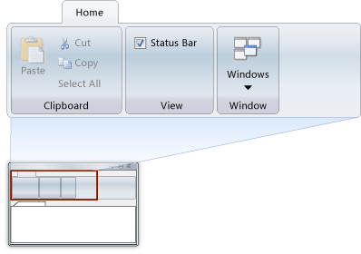

# CMFCRibbonCategory Class
The <CodeContentPlaceHolder>63\</CodeContentPlaceHolder> class implements a ribbon tab that contains a group of [ribbon panels](../vs140/cmfcribbonpanel-class.md).  
  
## Syntax  
  
<CodeContentPlaceHolder>0\</CodeContentPlaceHolder>  
## Members  
  
### Protected Constructors  
  
|Name|Description|  
|----------|-----------------|  
|[CMFCRibbonCategory::CMFCRibbonCategory](#cmfcribboncategory__cmfcribboncategory)|The constructor.|  
  
### Public Methods  
  
|Name|Description|  
|----------|-----------------|  
|[CMFCRibbonCategory::AddHidden](#cmfcribboncategory__addhidden)|Adds a hidden element to the ribbon category.|  
|[CMFCRibbonCategory::AddPanel](#cmfcribboncategory__addpanel)|Adds a new panel to the ribbon category.|  
|[CMFCRibbonCategory::CopyFrom](#cmfcribboncategory__copyfrom)||  
|[CMFCRibbonCategory::FindByData](#cmfcribboncategory__findbydata)||  
|[CMFCRibbonCategory::FindByID](#cmfcribboncategory__findbyid)||  
|[CMFCRibbonCategory::FindPanelWithElem](#cmfcribboncategory__findpanelwithelem)||  
|[CMFCRibbonCategory::GetContextID](#cmfcribboncategory__getcontextid)|Returns the context ID of the ribbon category.|  
|[CMFCRibbonCategory::GetData](#cmfcribboncategory__getdata)|Returns the user-defined data that is associated with the ribbon category.|  
|[CMFCRibbonCategory::GetDroppedDown](#cmfcribboncategory__getdroppeddown)||  
|[CMFCRibbonCategory::GetElements](#cmfcribboncategory__getelements)||  
|[CMFCRibbonCategory::GetElementsByID](#cmfcribboncategory__getelementsbyid)||  
|[CMFCRibbonCategory::GetFirstVisibleElement](#cmfcribboncategory__getfirstvisibleelement)|Obtain a first visible element that belong to the ribbon category.|  
|[CMFCRibbonCategory::GetFocused](#cmfcribboncategory__getfocused)|Returns a focused element.|  
|[CMFCRibbonCategory::GetHighlighted](#cmfcribboncategory__gethighlighted)|Returns a highlighted element.|  
|[CMFCRibbonCategory::GetImageCount](#cmfcribboncategory__getimagecount)||  
|[CMFCRibbonCategory::GetImageSize](#cmfcribboncategory__getimagesize)||  
|[CMFCRibbonCategory::GetItemIDsList](#cmfcribboncategory__getitemidslist)||  
|[CMFCRibbonCategory::GetLastVisibleElement](#cmfcribboncategory__getlastvisibleelement)|Obtain a last visible element that belong to the ribbon category|  
|[CMFCRibbonCategory::GetLargeImages](#cmfcribboncategory__getlargeimages)|Returns a reference to the list of large images that the ribbon category uses.|  
|[CMFCRibbonCategory::GetMaxHeight](#cmfcribboncategory__getmaxheight)||  
|[CMFCRibbonCategory::GetName](#cmfcribboncategory__getname)||  
|[CMFCRibbonCategory::GetPanel](#cmfcribboncategory__getpanel)|Returns a pointer to the ribbon panel that is located at the specified index.|  
|[CMFCRibbonCategory::GetPanelCount](#cmfcribboncategory__getpanelcount)|Returns the number of ribbon panels in the ribbon category.|  
|[CMFCRibbonCategory::GetPanelFromPoint](#cmfcribboncategory__getpanelfrompoint)||  
|[CMFCRibbonCategory::GetPanelIndex](#cmfcribboncategory__getpanelindex)|Returns the index of the specified ribbon panel.|  
|[CMFCRibbonCategory::GetParentButton](#cmfcribboncategory__getparentbutton)||  
|[CMFCRibbonCategory::GetParentMenuBar](#cmfcribboncategory__getparentmenubar)||  
|[CMFCRibbonCategory::GetParentRibbonBar](#cmfcribboncategory__getparentribbonbar)||  
|[CMFCRibbonCategory::GetRect](#cmfcribboncategory__getrect)||  
|[CMFCRibbonCategory::GetSmallImages](#cmfcribboncategory__getsmallimages)|Returns a reference to the list of small images that the category uses.|  
|[CMFCRibbonCategory::GetTabColor](#cmfcribboncategory__gettabcolor)|Returns the current color of the ribbon category tab.|  
|[CMFCRibbonCategory::GetTabRect](#cmfcribboncategory__gettabrect)||  
|[CMFCRibbonCategory::GetTextTopLine](#cmfcribboncategory__gettexttopline)||  
|[CMFCRibbonCategory::GetVisibleElements](#cmfcribboncategory__getvisibleelements)|Obtain all visible elements that belong to the ribbon category.|  
|[CMFCRibbonCategory::HighlightPanel](#cmfcribboncategory__highlightpanel)||  
|[CMFCRibbonCategory::HitTest](#cmfcribboncategory__hittest)||  
|[CMFCRibbonCategory::HitTestEx](#cmfcribboncategory__hittestex)||  
|[CMFCRibbonCategory::HitTestScrollButtons](#cmfcribboncategory__hittestscrollbuttons)||  
|[CMFCRibbonCategory::IsActive](#cmfcribboncategory__isactive)||  
|[CMFCRibbonCategory::IsVisible](#cmfcribboncategory__isvisible)|Determines whether the ribbon category is visible.|  
|[CMFCRibbonCategory::IsWindows7Look](#cmfcribboncategory__iswindows7look)|Indicates whether the parent ribbon has Windows 7-style look (small rectangular application button)|  
|[CMFCRibbonCategory::NotifyControlCommand](#cmfcribboncategory__notifycontrolcommand)||  
|[CMFCRibbonCategory::OnCancelMode](#cmfcribboncategory__oncancelmode)||  
|[CMFCRibbonCategory::OnDraw](#cmfcribboncategory__ondraw)||  
|[CMFCRibbonCategory::OnDrawImage](#cmfcribboncategory__ondrawimage)||  
|[CMFCRibbonCategory::OnDrawMenuBorder](#cmfcribboncategory__ondrawmenuborder)||  
|[CMFCRibbonCategory::OnKey](#cmfcribboncategory__onkey)|Called by the framework when a user presses a keyboard button.|  
|[CMFCRibbonCategory::OnLButtonDown](#cmfcribboncategory__onlbuttondown)||  
|[CMFCRibbonCategory::OnLButtonUp](#cmfcribboncategory__onlbuttonup)||  
|[CMFCRibbonCategory::OnMouseMove](#cmfcribboncategory__onmousemove)||  
|[CMFCRibbonCategory::OnRTLChanged](#cmfcribboncategory__onrtlchanged)||  
|[CMFCRibbonCategory::OnScrollHorz](#cmfcribboncategory__onscrollhorz)||  
|[CMFCRibbonCategory::OnUpdateCmdUI](#cmfcribboncategory__onupdatecmdui)||  
|[CMFCRibbonCategory::RecalcLayout](#cmfcribboncategory__recalclayout)||  
|[CMFCRibbonCategory::RemovePanel](#cmfcribboncategory__removepanel)||  
|[CMFCRibbonCategory::ReposPanels](#cmfcribboncategory__repospanels)||  
|[CMFCRibbonCategory::SetCollapseOrder](#cmfcribboncategory__setcollapseorder)|Defines the collapse order of the ribbon panels that are present in the ribbon category.|  
|[CMFCRibbonCategory::SetData](#cmfcribboncategory__setdata)|Stores the user defined data in the ribbon category.|  
|[CMFCRibbonCategory::SetKeys](#cmfcribboncategory__setkeys)|Assigns a keytip to the ribbon category.|  
|[CMFCRibbonCategory::SetName](#cmfcribboncategory__setname)||  
|[CMFCRibbonCategory::SetTabColor](#cmfcribboncategory__settabcolor)|Sets the color of the ribbon category.|  
  
## Remarks  
 Typically, you create a ribbon category indirectly by calling [CMFCRibbonBar::AddCategory](../vs140/cmfcribbonbar-class.md#cmfcribbonbar__addcategory), which returns a pointer to the newly created ribbon category. You add panels to the category by calling [CMFCRibbonCategory::AddPanel](#cmfcribboncategory__addpanel).  
  
 The <CodeContentPlaceHolder>64\</CodeContentPlaceHolder> class draws ribbon categories. It is derived from [CMFCRibbonBaseElement](../vs140/cmfcribbonbaseelement-class.md).  
  
 This following example demonstrates how to create a ribbon category and add a panel to it.  
  
 <CodeContentPlaceHolder>65\</CodeContentPlaceHolder>  
  
 <CodeContentPlaceHolder>66\</CodeContentPlaceHolder>  
  
 <CodeContentPlaceHolder>67\</CodeContentPlaceHolder>  
  
 <CodeContentPlaceHolder>68\</CodeContentPlaceHolder>  
  
 <CodeContentPlaceHolder>69\</CodeContentPlaceHolder>  
  
 <CodeContentPlaceHolder>70\</CodeContentPlaceHolder>  
  
 <CodeContentPlaceHolder>71\</CodeContentPlaceHolder>  
  
 <CodeContentPlaceHolder>72\</CodeContentPlaceHolder>  
  
 <CodeContentPlaceHolder>73\</CodeContentPlaceHolder>  
  
 The following diagram shows a figure of the Home category from the RibbonApp sample application.  
  
   
  
## Inheritance Hierarchy  
 [CObject](../vs140/cobject-class.md)  
  
 [CMFCRibbonCategory](../vs140/cmfcribboncategory-class.md)  
  
## Requirements  
 **Header:** afxribboncategory.h  
  
##  \<a name="cmfcribboncategory__addhidden">\</a>  CMFCRibbonCategory::AddHidden  
 Adds the specified ribbon element to the array of ribbon elements that are displayed on the customization dialog box.  
  
<CodeContentPlaceHolder>1\</CodeContentPlaceHolder>  
### Parameters  
 [in] <CodeContentPlaceHolder>74\</CodeContentPlaceHolder>  
 Pointer to a ribbon element.  
  
### Remarks  
 Ribbon elements on the customization dialog box are the commands that you can add to the quick access toolbar.  
  
##  \<a name="cmfcribboncategory__addpanel">\</a>  CMFCRibbonCategory::AddPanel  
 Creates a ribbon panel for the ribbon category.  
  
<CodeContentPlaceHolder>2\</CodeContentPlaceHolder>  
### Parameters  
 [in] <CodeContentPlaceHolder>75\</CodeContentPlaceHolder>  
 Pointer to the name of the new ribbon panel.  
  
 [in] <CodeContentPlaceHolder>76\</CodeContentPlaceHolder>  
 Handle to the default icon for the new ribbon panel.  
  
 [in] <CodeContentPlaceHolder>77\</CodeContentPlaceHolder>  
 Pointer to runtime class information for a custom ribbon panel.  
  
### Return Value  
 Pointer to the new ribbon panel if the method was successful; otherwise <CodeContentPlaceHolder>78\</CodeContentPlaceHolder> if the panel was not created.  
  
### Remarks  
 If you want to create a custom ribbon panel, you must specify its runtime class information in <CodeContentPlaceHolder>79\</CodeContentPlaceHolder>. The custom ribbon panel class must be derived from the <CodeContentPlaceHolder>80\</CodeContentPlaceHolder> class.  
  
 The default icon for the ribbon panel is displayed when there is insufficient space to display the ribbon elements.  
  
### Example  
 The following example demonstrates how to use the <CodeContentPlaceHolder>81\</CodeContentPlaceHolder> method in the <CodeContentPlaceHolder>82\</CodeContentPlaceHolder> class.  
  
 [!code[NVC_MFC_RibbonApp#10](../vs140/codesnippet/CPP/cmfcribboncategory-class_1.cpp)]  
  
##  \<a name="cmfcribboncategory__cmfcribboncategory">\</a>  CMFCRibbonCategory::CMFCRibbonCategory  
 Constructs and initializes a [CMFCRibbonCategory](../vs140/cmfcribboncategory-class.md) object.  
  
<CodeContentPlaceHolder>3\</CodeContentPlaceHolder>  
### Parameters  
 [in] <CodeContentPlaceHolder>83\</CodeContentPlaceHolder>  
 Pointer to the parent ribbon bar of the ribbon category.  
  
 [in] <CodeContentPlaceHolder>84\</CodeContentPlaceHolder>  
 Name of the ribbon category.  
  
 [in] <CodeContentPlaceHolder>85\</CodeContentPlaceHolder>  
 Resource ID of the image list for small images that are used by ribbon elements in the ribbon category.  
  
 [in] <CodeContentPlaceHolder>86\</CodeContentPlaceHolder>  
 Resource ID of the image list for large images that are used by ribbon elements in the ribbon category.  
  
 [in] <CodeContentPlaceHolder>87\</CodeContentPlaceHolder>  
 Default size of small images for ribbon elements in the ribbon category.  
  
 [in] <CodeContentPlaceHolder>88\</CodeContentPlaceHolder>  
 Default size of large images for ribbon elements in the ribbon category.  
  
##  \<a name="cmfcribboncategory__copyfrom">\</a>  CMFCRibbonCategory::CopyFrom  
 Copies the state of the specified [CMFCRibbonCategory](../vs140/cmfcribboncategory-class.md) to the current [CMFCRibbonCategory](../vs140/cmfcribboncategory-class.md) object.  
  
<CodeContentPlaceHolder>4\</CodeContentPlaceHolder>  
### Parameters  
 [in] <CodeContentPlaceHolder>89\</CodeContentPlaceHolder>  
 The source [CMFCRibbonCategory](../vs140/cmfcribboncategory-class.md) object.  
  
### Remarks  
  
##  \<a name="cmfcribboncategory__findbydata">\</a>  CMFCRibbonCategory::FindByData  
 Retrieves the ribbon element associated with the specified data.  
  
<CodeContentPlaceHolder>5\</CodeContentPlaceHolder>  
### Parameters  
 [in] <CodeContentPlaceHolder>90\</CodeContentPlaceHolder>  
 The data associated with a ribbon element.  
  
 [in] <CodeContentPlaceHolder>91\</CodeContentPlaceHolder>  
 <CodeContentPlaceHolder>92\</CodeContentPlaceHolder> to include quick access ribbon elements in the search; <CodeContentPlaceHolder>93\</CodeContentPlaceHolder> to exclude quick access ribbon elements in the search.  
  
### Return Value  
 Pointer to a ribbon element if the method was successful; otherwise <CodeContentPlaceHolder>94\</CodeContentPlaceHolder>.  
  
### Remarks  
  
##  \<a name="cmfcribboncategory__findbyid">\</a>  CMFCRibbonCategory::FindByID  
 Retrieves the ribbon element associated with the specified command ID.  
  
<CodeContentPlaceHolder>6\</CodeContentPlaceHolder>  
### Parameters  
 [in] <CodeContentPlaceHolder>95\</CodeContentPlaceHolder>  
 Command ID associated with a ribbon element.  
  
 [in] <CodeContentPlaceHolder>96\</CodeContentPlaceHolder>  
 <CodeContentPlaceHolder>97\</CodeContentPlaceHolder> to include quick access ribbon elements in the search; <CodeContentPlaceHolder>98\</CodeContentPlaceHolder> to exclude quick access ribbon elements in the search.  
  
### Return Value  
 Pointer to a ribbon element if the method was successful; otherwise <CodeContentPlaceHolder>99\</CodeContentPlaceHolder>.  
  
### Remarks  
  
##  \<a name="cmfcribboncategory__findpanelwithelem">\</a>  CMFCRibbonCategory::FindPanelWithElem  
 Retrieves the ribbon panel that contains the specified ribbon element.  
  
<CodeContentPlaceHolder>7\</CodeContentPlaceHolder>  
### Parameters  
 [in] <CodeContentPlaceHolder>100\</CodeContentPlaceHolder>  
 Pointer to a ribbon element.  
  
### Return Value  
 Pointer to a ribbon panel if the method was successful; otherwise <CodeContentPlaceHolder>101\</CodeContentPlaceHolder>.  
  
### Remarks  
  
##  \<a name="cmfcribboncategory__getcontextid">\</a>  CMFCRibbonCategory::GetContextID  
 Retrieves the context ID of the ribbon category.  
  
<CodeContentPlaceHolder>8\</CodeContentPlaceHolder>  
### Return Value  
 Context ID of the ribbon category.  
  
### Remarks  
 The context ID is 0 if the ribbon category is not a context ribbon category.  
  
##  \<a name="cmfcribboncategory__getdata">\</a>  CMFCRibbonCategory::GetData  
 Retrieves the user-defined data that is associated with the ribbon category.  
  
<CodeContentPlaceHolder>9\</CodeContentPlaceHolder>  
### Return Value  
 The user-defined data that is associated with the ribbon category.  
  
##  \<a name="cmfcribboncategory__getdroppeddown">\</a>  CMFCRibbonCategory::GetDroppedDown  
 Retrieves a pointer to the ribbon element that currently has its pop-up menu displayed.  
  
<CodeContentPlaceHolder>10\</CodeContentPlaceHolder>  
### Return Value  
 Pointer to a ribbon element if the method was successful; otherwise <CodeContentPlaceHolder>102\</CodeContentPlaceHolder>.  
  
### Remarks  
  
##  \<a name="cmfcribboncategory__getelements">\</a>  CMFCRibbonCategory::GetElements  
 Retrieves all ribbon elements in the ribbon category.  
  
<CodeContentPlaceHolder>11\</CodeContentPlaceHolder>  
### Parameters  
 [in, out] <CodeContentPlaceHolder>103\</CodeContentPlaceHolder>  
 Reference to a [CArray](../vs140/carray-class.md) of ribbon elements.  
  
### Remarks  
 Ribbon elements that are designed for use on the quick access toolbar are included in the array.  
  
##  \<a name="cmfcribboncategory__getelementsbyid">\</a>  CMFCRibbonCategory::GetElementsByID  
 Retrieves all ribbon elements that are associated with the specified command ID.  
  
<CodeContentPlaceHolder>12\</CodeContentPlaceHolder>  
### Parameters  
 [in] <CodeContentPlaceHolder>104\</CodeContentPlaceHolder>  
 Command ID associated with a ribbon element.  
  
 [in, out] <CodeContentPlaceHolder>105\</CodeContentPlaceHolder>  
 Reference to a [CArray](../vs140/carray-class.md) of ribbon elements.  
  
### Remarks  
 Ribbon elements that are designed for use on the quick access toolbar are included in the array.  
  
##  \<a name="cmfcribboncategory__getfirstvisibleelement">\</a>  CMFCRibbonCategory::GetFirstVisibleElement  
 Retrieves the first visible element that belongs to the ribbon category.  
  
<CodeContentPlaceHolder>13\</CodeContentPlaceHolder>  
### Return Value  
 Pointer to the first visible element; may be <CodeContentPlaceHolder>106\</CodeContentPlaceHolder> if category does not have any visible elements.  
  
### Remarks  
  
##  \<a name="cmfcribboncategory__getfocused">\</a>  CMFCRibbonCategory::GetFocused  
 Returns a focused element.  
  
<CodeContentPlaceHolder>14\</CodeContentPlaceHolder>  
### Return Value  
 A pointer to a focused element or <CodeContentPlaceHolder>107\</CodeContentPlaceHolder>.  
  
### Remarks  
  
##  \<a name="cmfcribboncategory__gethighlighted">\</a>  CMFCRibbonCategory::GetHighlighted  
 Returns a highlighted element.  
  
<CodeContentPlaceHolder>15\</CodeContentPlaceHolder>  
### Return Value  
 A pointer to a highlighted element or <CodeContentPlaceHolder>108\</CodeContentPlaceHolder> if no elements are highlighted.  
  
### Remarks  
  
##  \<a name="cmfcribboncategory__getimagecount">\</a>  CMFCRibbonCategory::GetImageCount  
 Retrieves the number of images in the specified image list that is contained in the ribbon category.  
  
<CodeContentPlaceHolder>16\</CodeContentPlaceHolder>  
### Parameters  
 [in] <CodeContentPlaceHolder>109\</CodeContentPlaceHolder>  
 <CodeContentPlaceHolder>110\</CodeContentPlaceHolder> for the number of images in the large image list; <CodeContentPlaceHolder>111\</CodeContentPlaceHolder> for the number of images in the small image list.  
  
### Return Value  
 The number of images in the specified image list.  
  
### Remarks  
  
##  \<a name="cmfcribboncategory__getimagesize">\</a>  CMFCRibbonCategory::GetImageSize  
 Retrieves the size of an image in the specified image list that is contained in the ribbon category.  
  
<CodeContentPlaceHolder>17\</CodeContentPlaceHolder>  
### Parameters  
 [in] <CodeContentPlaceHolder>112\</CodeContentPlaceHolder>  
 <CodeContentPlaceHolder>113\</CodeContentPlaceHolder> for the size of large images; <CodeContentPlaceHolder>114\</CodeContentPlaceHolder> for the size of small images.  
  
### Return Value  
 The size of an image in the specified image list.  
  
### Remarks  
 The size retrieved includes the global image scale factor.  
  
##  \<a name="cmfcribboncategory__getitemidslist">\</a>  CMFCRibbonCategory::GetItemIDsList  
 Retrieves the command IDs for the ribbon elements that are contained in the ribbon category.  
  
<CodeContentPlaceHolder>18\</CodeContentPlaceHolder>  
### Parameters  
 [out] <CodeContentPlaceHolder>115\</CodeContentPlaceHolder>  
 The list of command IDs for the ribbon elements in the ribbon category.  
  
 [in] <CodeContentPlaceHolder>116\</CodeContentPlaceHolder>  
 <CodeContentPlaceHolder>117\</CodeContentPlaceHolder> to exclude ribbon elements displayed on the ribbon panels in the ribbon category; <CodeContentPlaceHolder>118\</CodeContentPlaceHolder> to include all ribbon elements in the ribbon category.  
  
### Remarks  
  
##  \<a name="cmfcribboncategory__getlargeimages">\</a>  CMFCRibbonCategory::GetLargeImages  
 Retrieves the list of large images that are contained in the ribbon category.  
  
<CodeContentPlaceHolder>19\</CodeContentPlaceHolder>  
### Return Value  
 The list of large images that are contained in the ribbon category.  
  
##  \<a name="cmfcribboncategory__getlastvisibleelement">\</a>  CMFCRibbonCategory::GetLastVisibleElement  
 Retrieves the last visible element that belongs to the ribbon category.  
  
<CodeContentPlaceHolder>20\</CodeContentPlaceHolder>  
### Return Value  
 Pointer to the last visible element; may be <CodeContentPlaceHolder>119\</CodeContentPlaceHolder> if the category does not have any visible elements.  
  
### Remarks  
  
##  \<a name="cmfcribboncategory__getmaxheight">\</a>  CMFCRibbonCategory::GetMaxHeight  
 Retrieves the maximum height of the ribbon panels that are contained in the ribbon category.  
  
<CodeContentPlaceHolder>21\</CodeContentPlaceHolder>  
### Parameters  
 [in] <CodeContentPlaceHolder>120\</CodeContentPlaceHolder>  
 Pointer to a device context for the ribbon panels.  
  
### Return Value  
 The maximum height of the ribbon panels that are contained in the ribbon category.  
  
### Remarks  
 The value retrieved includes the height of the top and bottom margins for the ribbon panels.  
  
##  \<a name="cmfcribboncategory__getname">\</a>  CMFCRibbonCategory::GetName  
 Retrieves the name of the ribbon category.  
  
<CodeContentPlaceHolder>22\</CodeContentPlaceHolder>  
### Return Value  
 The name of the ribbon category.  
  
### Remarks  
  
##  \<a name="cmfcribboncategory__getpanel">\</a>  CMFCRibbonCategory::GetPanel  
 Returns a pointer to the ribbon panel that is located at the specified index.  
  
<CodeContentPlaceHolder>23\</CodeContentPlaceHolder>  
### Parameters  
 [in] <CodeContentPlaceHolder>121\</CodeContentPlaceHolder>  
 The zero-based index of a ribbon panel.  
  
### Return Value  
 Pointer to the ribbon panel that is located at the specified index.  
  
### Remarks  
 An exception is thrown if <CodeContentPlaceHolder>122\</CodeContentPlaceHolder> is out of range.  
  
##  \<a name="cmfcribboncategory__getpanelcount">\</a>  CMFCRibbonCategory::GetPanelCount  
 Returns the number of ribbon panels in the ribbon category.  
  
<CodeContentPlaceHolder>24\</CodeContentPlaceHolder>  
### Return Value  
 The number of ribbon panels in the ribbon category.  
  
##  \<a name="cmfcribboncategory__getpanelfrompoint">\</a>  CMFCRibbonCategory::GetPanelFromPoint  
 Retrieves a pointer to a ribbon panel if the specified point is located in it.  
  
<CodeContentPlaceHolder>25\</CodeContentPlaceHolder>  
### Parameters  
 [in] <CodeContentPlaceHolder>123\</CodeContentPlaceHolder>  
 The x and y coordinates of the pointer, relative to the upper-left corner of the window.  
  
### Return Value  
 Pointer to a ribbon panel if the method was successful; otherwise <CodeContentPlaceHolder>124\</CodeContentPlaceHolder>.  
  
### Remarks  
 Only ribbon panels that are contained in the ribbon category are tested.  
  
##  \<a name="cmfcribboncategory__getpanelindex">\</a>  CMFCRibbonCategory::GetPanelIndex  
 Retrieves the zero-based index of the specified ribbon panel.  
  
<CodeContentPlaceHolder>26\</CodeContentPlaceHolder>  
### Parameters  
 [in] <CodeContentPlaceHolder>125\</CodeContentPlaceHolder>  
 Pointer to a ribbon panel.  
  
### Return Value  
 Zero-based index of the specified ribbon panel if the method was successful; otherwise -1.  
  
### Remarks  
 Only ribbon panels that are contained in the ribbon category are searched.  
  
##  \<a name="cmfcribboncategory__getparentbutton">\</a>  CMFCRibbonCategory::GetParentButton  
 Retrieves the parent ribbon element of the ribbon category.  
  
<CodeContentPlaceHolder>27\</CodeContentPlaceHolder>  
### Return Value  
 Returns a pointer to the parent ribbon element, or <CodeContentPlaceHolder>126\</CodeContentPlaceHolder> if there is no parent element.  
  
### Remarks  
  
##  \<a name="cmfcribboncategory__getparentmenubar">\</a>  CMFCRibbonCategory::GetParentMenuBar  
 Returns a pointer to the parent menu bar of the <CodeContentPlaceHolder>127\</CodeContentPlaceHolder> object.  
  
<CodeContentPlaceHolder>28\</CodeContentPlaceHolder>  
### Return Value  
 Returns the contents of the <CodeContentPlaceHolder>128\</CodeContentPlaceHolder> protected member.  
  
### Remarks  
  
##  \<a name="cmfcribboncategory__getparentribbonbar">\</a>  CMFCRibbonCategory::GetParentRibbonBar  
 Retrieves the parent ribbon bar for the ribbon category.  
  
<CodeContentPlaceHolder>29\</CodeContentPlaceHolder>  
### Return Value  
 Pointer to the parent ribbon bar for the ribbon category.  
  
### Remarks  
  
##  \<a name="cmfcribboncategory__getrect">\</a>  CMFCRibbonCategory::GetRect  
 Retrieves the display rectangle for the ribbon category.  
  
<CodeContentPlaceHolder>30\</CodeContentPlaceHolder>  
### Return Value  
 The display rectangle for the ribbon category.  
  
### Remarks  
 The display rectangle for the ribbon category does not include the category tab.  
  
##  \<a name="cmfcribboncategory__getsmallimages">\</a>  CMFCRibbonCategory::GetSmallImages  
 Retrieves the list of small images that are contained in the ribbon category.  
  
<CodeContentPlaceHolder>31\</CodeContentPlaceHolder>  
### Return Value  
 The list of small images that are contained in the ribbon category.  
  
##  \<a name="cmfcribboncategory__gettabcolor">\</a>  CMFCRibbonCategory::GetTabColor  
 Returns the current color of the ribbon category tab.  
  
<CodeContentPlaceHolder>32\</CodeContentPlaceHolder>  
### Return Value  
 The current color of the ribbon category tab.  
  
### Remarks  
 The returned value can be one of the following enumerated values:  
  
-   AFX_CategoryColor_Red  
  
-   AFX_CategoryColor_Orange  
  
-   AFX_CategoryColor_Yellow  
  
-   AFX_CategoryColor_Green  
  
-   AFX_CategoryColor_Blue  
  
-   AFX_CategoryColor_Indigo  
  
-   AFX_CategoryColor_Violet  
  
##  \<a name="cmfcribboncategory__gettabrect">\</a>  CMFCRibbonCategory::GetTabRect  
 Retrieves the display rectangle for the ribbon category tab.  
  
<CodeContentPlaceHolder>33\</CodeContentPlaceHolder>  
### Return Value  
 The display rectangle for the ribbon category tab.  
  
### Remarks  
  
##  \<a name="cmfcribboncategory__gettexttopline">\</a>  CMFCRibbonCategory::GetTextTopLine  
 Retrieves the vertical location of text on ribbon buttons in the ribbon category that display large images.  
  
<CodeContentPlaceHolder>34\</CodeContentPlaceHolder>  
### Return Value  
 The vertical location of text, in pixels, on ribbon buttons that display large images.  
  
### Remarks  
  
##  \<a name="cmfcribboncategory__getvisibleelements">\</a>  CMFCRibbonCategory::GetVisibleElements  
 Retrieves all visible elements that belong to the ribbon category.  
  
<CodeContentPlaceHolder>35\</CodeContentPlaceHolder>  
### Parameters  
 <CodeContentPlaceHolder>129\</CodeContentPlaceHolder>  
 Array of all visible elements.  
  
### Remarks  
  
##  \<a name="cmfcribboncategory__highlightpanel">\</a>  CMFCRibbonCategory::HighlightPanel  
 Highlights the specified ribbon panel.  
  
<CodeContentPlaceHolder>36\</CodeContentPlaceHolder>  
### Parameters  
 [in] <CodeContentPlaceHolder>130\</CodeContentPlaceHolder>  
 Pointer to the ribbon panel to highlight.  
  
 [in] <CodeContentPlaceHolder>131\</CodeContentPlaceHolder>  
 The x and y coordinates of the pointer, relative to the upper-left corner of the window.  
  
### Return Value  
 Pointer to the previously highlighted ribbon panel; otherwise <CodeContentPlaceHolder>132\</CodeContentPlaceHolder> if no ribbon panel is highlighted when this method is invoked.  
  
### Remarks  
 For more information about highlighting a ribbon panel, see [CMFCRibbonPanel::Highlight](../vs140/cmfcribbonpanel-class.md#cmfcribbonpanel__highlight).  
  
##  \<a name="cmfcribboncategory__hittest">\</a>  CMFCRibbonCategory::HitTest  
 Retrieves a pointer to a ribbon element if the specified point is located in it.  
  
<CodeContentPlaceHolder>37\</CodeContentPlaceHolder>  
### Parameters  
 [in] <CodeContentPlaceHolder>133\</CodeContentPlaceHolder>  
 The x and y coordinates of the mouse pointer, relative to the upper-left corner of the window.  
  
 [in] <CodeContentPlaceHolder>134\</CodeContentPlaceHolder>  
 <CodeContentPlaceHolder>135\</CodeContentPlaceHolder> to test the ribbon panel caption; <CodeContentPlaceHolder>136\</CodeContentPlaceHolder> to exclude the ribbon panel caption.  
  
### Return Value  
 Pointer to a ribbon element if the method was successful; otherwise <CodeContentPlaceHolder>137\</CodeContentPlaceHolder>.  
  
### Remarks  
 Only ribbon elements that are contained in the ribbon category are tested.  
  
##  \<a name="cmfcribboncategory__hittestex">\</a>  CMFCRibbonCategory::HitTestEx  
 Retrieves the zero-based index of a ribbon element if the specified point is located in it.  
  
<CodeContentPlaceHolder>38\</CodeContentPlaceHolder>  
### Parameters  
 [in] <CodeContentPlaceHolder>138\</CodeContentPlaceHolder>  
 The x and y coordinates of the mouse pointer, relative to the upper-left corner of the window.  
  
### Return Value  
 Zero-based index of a ribbon element if the method was successful; otherwise -1.  
  
### Remarks  
 Only ribbon elements that are contained in the ribbon category are tested.  
  
##  \<a name="cmfcribboncategory__hittestscrollbuttons">\</a>  CMFCRibbonCategory::HitTestScrollButtons  
 If a point falls within a ribbon category’s left or right scroll button, returns a pointer to that button.  
  
<CodeContentPlaceHolder>39\</CodeContentPlaceHolder>  
### Parameters  
 [in] <CodeContentPlaceHolder>139\</CodeContentPlaceHolder>  
 The point to test.  
  
### Return Value  
 If <CodeContentPlaceHolder>140\</CodeContentPlaceHolder> falls within the bounding rectangle of either the left or the right scroll button of the ribbon category, returns a pointer to that button, or otherwise, returns <CodeContentPlaceHolder>141\</CodeContentPlaceHolder>.  
  
### Remarks  
  
##  \<a name="cmfcribboncategory__isactive">\</a>  CMFCRibbonCategory::IsActive  
 Indicates whether the ribbon category is the active category on the ribbon bar.  
  
<CodeContentPlaceHolder>40\</CodeContentPlaceHolder>  
### Return Value  
 <CodeContentPlaceHolder>142\</CodeContentPlaceHolder> if the ribbon category is the active category; otherwise <CodeContentPlaceHolder>143\</CodeContentPlaceHolder>.  
  
### Remarks  
 The active ribbon category displays its ribbon panels.  
  
##  \<a name="cmfcribboncategory__isvisible">\</a>  CMFCRibbonCategory::IsVisible  
 Indicates whether the ribbon category is visible.  
  
<CodeContentPlaceHolder>41\</CodeContentPlaceHolder>  
### Return Value  
 <CodeContentPlaceHolder>144\</CodeContentPlaceHolder> if the ribbon category is visible; otherwise <CodeContentPlaceHolder>145\</CodeContentPlaceHolder>.  
  
### Remarks  
 Ribbon categories that are visible display a category tab.  
  
##  \<a name="cmfcribboncategory__iswindows7look">\</a>  CMFCRibbonCategory::IsWindows7Look  
 Indicates whether the parent ribbon has Windows 7 look (small rectangular application button).  
  
<CodeContentPlaceHolder>42\</CodeContentPlaceHolder>  
### Return Value  
 <CodeContentPlaceHolder>146\</CodeContentPlaceHolder> if the parent ribbon has Windows 7 look; otherwise <CodeContentPlaceHolder>147\</CodeContentPlaceHolder>.  
  
### Remarks  
  
##  \<a name="cmfcribboncategory__notifycontrolcommand">\</a>  CMFCRibbonCategory::NotifyControlCommand  
 Delivers a WM_NOTIFY command message to all <CodeContentPlaceHolder>148\</CodeContentPlaceHolder> elements in the <CodeContentPlaceHolder>149\</CodeContentPlaceHolder> until the message is handled.  
  
<CodeContentPlaceHolder>43\</CodeContentPlaceHolder>  
### Parameters  
 [in] <CodeContentPlaceHolder>150\</CodeContentPlaceHolder>  
 <CodeContentPlaceHolder>151\</CodeContentPlaceHolder> if this command originated from an accelerator, or <CodeContentPlaceHolder>152\</CodeContentPlaceHolder> otherwise.  
  
 [in] <CodeContentPlaceHolder>153\</CodeContentPlaceHolder>  
 The notification code.  
  
 [in] <CodeContentPlaceHolder>154\</CodeContentPlaceHolder>  
 The WPARAM field of the message.  
  
 [in] <CodeContentPlaceHolder>155\</CodeContentPlaceHolder>  
 The LPARAM field of the message.  
  
### Return Value  
 Returns <CodeContentPlaceHolder>156\</CodeContentPlaceHolder> if the message was handled, or <CodeContentPlaceHolder>157\</CodeContentPlaceHolder> if not.  
  
### Remarks  
  
##  \<a name="cmfcribboncategory__oncancelmode">\</a>  CMFCRibbonCategory::OnCancelMode  
 Invokes cancel mode in all the <CodeContentPlaceHolder>158\</CodeContentPlaceHolder> elements of the <CodeContentPlaceHolder>159\</CodeContentPlaceHolder>.  
  
<CodeContentPlaceHolder>44\</CodeContentPlaceHolder>  
### Remarks  
  
##  \<a name="cmfcribboncategory__ondraw">\</a>  CMFCRibbonCategory::OnDraw  
 Called by the framework to draw the ribbon category.  
  
<CodeContentPlaceHolder>45\</CodeContentPlaceHolder>  
### Parameters  
 [in] <CodeContentPlaceHolder>160\</CodeContentPlaceHolder>  
 Pointer to a device context for the ribbon category.  
  
### Remarks  
  
##  \<a name="cmfcribboncategory__ondrawimage">\</a>  CMFCRibbonCategory::OnDrawImage  
 Called by the framework to draw the specified image on the ribbon category.  
  
<CodeContentPlaceHolder>46\</CodeContentPlaceHolder>  
### Parameters  
 [in] <CodeContentPlaceHolder>161\</CodeContentPlaceHolder>  
 Pointer to a device context for the image.  
  
 [in] <CodeContentPlaceHolder>162\</CodeContentPlaceHolder>  
 Display rectangle for the image.  
  
 [in] <CodeContentPlaceHolder>163\</CodeContentPlaceHolder>  
 Pointer to the ribbon element that contains the image.  
  
 [in] <CodeContentPlaceHolder>164\</CodeContentPlaceHolder>  
 <CodeContentPlaceHolder>165\</CodeContentPlaceHolder> if the image is the large size; <CodeContentPlaceHolder>166\</CodeContentPlaceHolder> if the image is the small size.  
  
 [in] <CodeContentPlaceHolder>167\</CodeContentPlaceHolder>  
 Zero-based index of the image in the image array that is contained in the ribbon category.  
  
 [in] <CodeContentPlaceHolder>168\</CodeContentPlaceHolder>  
 <CodeContentPlaceHolder>169\</CodeContentPlaceHolder> to center the image in the display rectangle; <CodeContentPlaceHolder>170\</CodeContentPlaceHolder> to draw the image in the upper-left corner of the display rectangle.  
  
### Return Value  
 <CodeContentPlaceHolder>171\</CodeContentPlaceHolder> if the method was successful; otherwise <CodeContentPlaceHolder>172\</CodeContentPlaceHolder>.  
  
### Remarks  
  
##  \<a name="cmfcribboncategory__ondrawmenuborder">\</a>  CMFCRibbonCategory::OnDrawMenuBorder  
 Called by the framework to draw the border of a popup menu.  
  
<CodeContentPlaceHolder>47\</CodeContentPlaceHolder>  
### Parameters  
 [in] <CodeContentPlaceHolder>173\</CodeContentPlaceHolder>  
 This parameter is not used.  
  
 [in] <CodeContentPlaceHolder>174\</CodeContentPlaceHolder>  
 This parameter is not used.  
  
### Remarks  
 By default this method does nothing. Override this method to draw the border of a popup menu.  
  
##  \<a name="cmfcribboncategory__onkey">\</a>  CMFCRibbonCategory::OnKey  
 Called by the framework when a user presses a keyboard button.  
  
<CodeContentPlaceHolder>48\</CodeContentPlaceHolder>  
### Parameters  
 <CodeContentPlaceHolder>175\</CodeContentPlaceHolder>  
 The virtual key code for the key that a user pressed.  
  
### Remarks  
  
##  \<a name="cmfcribboncategory__onlbuttondown">\</a>  CMFCRibbonCategory::OnLButtonDown  
 Called by the framework to retrieve the ribbon element under the specified point when the user presses the left mouse button.  
  
<CodeContentPlaceHolder>49\</CodeContentPlaceHolder>  
### Parameters  
 [in] <CodeContentPlaceHolder>176\</CodeContentPlaceHolder>  
 The x and y coordinates of the mouse pointer, relative to the upper-left corner of the window.  
  
### Return Value  
 Pointer to a ribbon element if the method was successful; otherwise <CodeContentPlaceHolder>177\</CodeContentPlaceHolder>.  
  
### Remarks  
  
##  \<a name="cmfcribboncategory__onlbuttonup">\</a>  CMFCRibbonCategory::OnLButtonUp  
 Called by the framework when the user releases the left mouse button and the pointer is over the ribbon category.  
  
<CodeContentPlaceHolder>50\</CodeContentPlaceHolder>  
### Parameters  
 [in] <CodeContentPlaceHolder>178\</CodeContentPlaceHolder>  
 The x and y coordinates of the pointer, relative to the upper-left corner of the window.  
  
### Remarks  
  
##  \<a name="cmfcribboncategory__onmousemove">\</a>  CMFCRibbonCategory::OnMouseMove  
 Called by the framework when the pointer moves on the ribbon bar in order to update the ribbon category display.  
  
<CodeContentPlaceHolder>51\</CodeContentPlaceHolder>  
### Parameters  
 [in] <CodeContentPlaceHolder>179\</CodeContentPlaceHolder>  
 The x and y coordinates of the pointer, relative to the upper-left corner of the window.  
  
### Remarks  
  
##  \<a name="cmfcribboncategory__onrtlchanged">\</a>  CMFCRibbonCategory::OnRTLChanged  
 Called by the framework when the layout changes direction.  
  
<CodeContentPlaceHolder>52\</CodeContentPlaceHolder>  
### Parameters  
 [in] <CodeContentPlaceHolder>180\</CodeContentPlaceHolder>  
 <CodeContentPlaceHolder>181\</CodeContentPlaceHolder> if the layout is right-to-left; <CodeContentPlaceHolder>182\</CodeContentPlaceHolder> if the layout is left-to-right.  
  
### Remarks  
 This method adjusts the layout of all ribbon panels and ribbon elements that are contained in the ribbon category.  
  
##  \<a name="cmfcribboncategory__onscrollhorz">\</a>  CMFCRibbonCategory::OnScrollHorz  
 Scrolls the ribbon category in the horizontal direction.  
  
<CodeContentPlaceHolder>53\</CodeContentPlaceHolder>  
### Parameters  
 [in] <CodeContentPlaceHolder>183\</CodeContentPlaceHolder>  
 <CodeContentPlaceHolder>184\</CodeContentPlaceHolder> to scroll to the left; <CodeContentPlaceHolder>185\</CodeContentPlaceHolder> to scroll to the right.  
  
 [in] <CodeContentPlaceHolder>186\</CodeContentPlaceHolder>  
 The scroll distance in pixels.  
  
### Return Value  
 <CodeContentPlaceHolder>187\</CodeContentPlaceHolder> if the ribbon category moved in a horizontal direction; otherwise <CodeContentPlaceHolder>188\</CodeContentPlaceHolder>.  
  
### Remarks  
  
##  \<a name="cmfcribboncategory__onupdatecmdui">\</a>  CMFCRibbonCategory::OnUpdateCmdUI  
 Calls the <CodeContentPlaceHolder>189\</CodeContentPlaceHolder> member function in each of the <CodeContentPlaceHolder>190\</CodeContentPlaceHolder> elements of the <CodeContentPlaceHolder>191\</CodeContentPlaceHolder> to enable or disable the user-interface elements in them.  
  
<CodeContentPlaceHolder>54\</CodeContentPlaceHolder>  
### Parameters  
 [in] <CodeContentPlaceHolder>192\</CodeContentPlaceHolder>  
 Pointer to the <CodeContentPlaceHolder>193\</CodeContentPlaceHolder> object that specifies which user-interface elements are to be enabled and which are to be disabled.  
  
 [in] <CodeContentPlaceHolder>194\</CodeContentPlaceHolder>  
 Pointer to the window that controls the enabling or disabling of the user-interface elements.  
  
 [in] <CodeContentPlaceHolder>195\</CodeContentPlaceHolder>  
 <CodeContentPlaceHolder>196\</CodeContentPlaceHolder> to disable the user-interface item if no handler is defined in a message map; otherwise, <CodeContentPlaceHolder>197\</CodeContentPlaceHolder>.  
  
### Remarks  
  
##  \<a name="cmfcribboncategory__recalclayout">\</a>  CMFCRibbonCategory::RecalcLayout  
 Adjusts the layout of all controls on the ribbon category.  
  
<CodeContentPlaceHolder>55\</CodeContentPlaceHolder>  
### Parameters  
 [in] <CodeContentPlaceHolder>198\</CodeContentPlaceHolder>  
 Pointer to a device context for the ribbon category.  
  
### Remarks  
  
##  \<a name="cmfcribboncategory__removepanel">\</a>  CMFCRibbonCategory::RemovePanel  
 Removes a ribbon panel from the ribbon category.  
  
<CodeContentPlaceHolder>56\</CodeContentPlaceHolder>  
### Parameters  
 [in] <CodeContentPlaceHolder>199\</CodeContentPlaceHolder>  
 The index number of the panel to remove. Obtained by calling the [GetPanelIndex()](#cmfcribboncategory__getpanelindex) method.  
  
 [in] <CodeContentPlaceHolder>200\</CodeContentPlaceHolder>  
 <CodeContentPlaceHolder>201\</CodeContentPlaceHolder> to delete the panel object from memory; <CodeContentPlaceHolder>202\</CodeContentPlaceHolder> to remove the panel object without deleting it.  
  
### Return Value  
 <CodeContentPlaceHolder>203\</CodeContentPlaceHolder> if the method was successful; otherwise, <CodeContentPlaceHolder>204\</CodeContentPlaceHolder>.  
  
##  \<a name="cmfcribboncategory__repospanels">\</a>  CMFCRibbonCategory::ReposPanels  
 Adjusts the layout of all controls on the ribbon panels that are contained in the ribbon category.  
  
<CodeContentPlaceHolder>57\</CodeContentPlaceHolder>  
### Parameters  
 [in] <CodeContentPlaceHolder>205\</CodeContentPlaceHolder>  
 Pointer to a device context for the ribbon panels that are contained in the ribbon category.  
  
### Remarks  
  
##  \<a name="cmfcribboncategory__setcollapseorder">\</a>  CMFCRibbonCategory::SetCollapseOrder  
 Defines the order in which the ribbon panels of the ribbon category collapse.  
  
<CodeContentPlaceHolder>58\</CodeContentPlaceHolder>  
### Parameters  
 [in] <CodeContentPlaceHolder>206\</CodeContentPlaceHolder>  
 Specifies the collapse order. The array contains zero-based indexes of ribbon panels.  
  
### Remarks  
 The library defines the collapse order. However, you can customize this behavior by providing the category with the list of indexes that specifies the collapse order.  
  
 When the category detects that it has to collapse a ribbon panel, it looks for the next element in the specified list. If the list is empty, or you have not specified enough elements, then the category uses the internal algorithm.  
  
 For example, the category has three ribbon panels and can be collapsed several times until all panels are in the fully collapsed state. You can set the following collapse order: 0, 0, 2, 2. In this case, the category will collapse the panel 0 two times, the panel 2 two times. The panel that has the index of 1 remains uncollapsed.  
  
### Example  
 The following example demonstrates how to use the <CodeContentPlaceHolder>207\</CodeContentPlaceHolder> method in the <CodeContentPlaceHolder>208\</CodeContentPlaceHolder> class. The example shows how to construct an array for the collapse order, and how to set the collapse order to the ribbon category.  
  
 [!code[NVC_MFC_RibbonApp#13](../vs140/codesnippet/CPP/cmfcribboncategory-class_2.cpp)]  
  
##  \<a name="cmfcribboncategory__setdata">\</a>  CMFCRibbonCategory::SetData  
 Sets the user-defined data to be associated with the ribbon category.  
  
<CodeContentPlaceHolder>59\</CodeContentPlaceHolder>  
### Parameters  
 [in] <CodeContentPlaceHolder>209\</CodeContentPlaceHolder>  
 The user-defined data.  
  
##  \<a name="cmfcribboncategory__setkeys">\</a>  CMFCRibbonCategory::SetKeys  
 Assigns a keytip to the ribbon category.  
  
<CodeContentPlaceHolder>60\</CodeContentPlaceHolder>  
### Parameters  
 [in] <CodeContentPlaceHolder>210\</CodeContentPlaceHolder>  
 The keytip text.  
  
### Remarks  
 Keytips are displayed when the user presses the Alt key or the F10 key.  
  
##  \<a name="cmfcribboncategory__setname">\</a>  CMFCRibbonCategory::SetName  
 Assigns a name and keytip to the ribbon category.  
  
<CodeContentPlaceHolder>61\</CodeContentPlaceHolder>  
### Parameters  
 [in] <CodeContentPlaceHolder>211\</CodeContentPlaceHolder>  
 The name and keytip of the ribbon category.  
  
### Remarks  
 To set the keytip for the ribbon category, append a newline escape sequence followed by the keytip characters to <CodeContentPlaceHolder>212\</CodeContentPlaceHolder>.  
  
##  \<a name="cmfcribboncategory__settabcolor">\</a>  CMFCRibbonCategory::SetTabColor  
 Sets the color of the ribbon category.  
  
<CodeContentPlaceHolder>62\</CodeContentPlaceHolder>  
### Parameters  
 [in] <CodeContentPlaceHolder>213\</CodeContentPlaceHolder>  
 Specifies the new color of the ribbon category.  
  
### Remarks  
 Color can be one of the following values:  
  
-   AFX_CategoryColor_None  
  
-   AFX_CategoryColor_Red  
  
-   AFX_CategoryColor_Orange  
  
-   AFX_CategoryColor_Yellow  
  
-   AFX_CategoryColor_Green  
  
-   AFX_CategoryColor_Blue  
  
-   AFX_CategoryColor_Indigo  
  
-   AFX_CategoryColor_Violet  
  
## See Also  
 [Hierarchy Chart](../vs140/hierarchy-chart.md)   
 [Classes](../vs140/mfc-classes.md)   
 [CObject](../vs140/cobject-class.md)