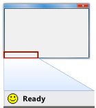

# CMFCStatusBar Class
The <CodeContentPlaceHolder>34\</CodeContentPlaceHolder> class implements a status bar similar to the <CodeContentPlaceHolder>35\</CodeContentPlaceHolder> class. However, the <CodeContentPlaceHolder>36\</CodeContentPlaceHolder> class has features not offered by the <CodeContentPlaceHolder>37\</CodeContentPlaceHolder> class, such as the ability to display images, animations, and progress bars; and the ability to respond to mouse double-clicks.  
  
## Syntax  
  
<CodeContentPlaceHolder>0\</CodeContentPlaceHolder>  
## Members  
  
### Public Methods  
  
|Name|Description|  
|----------|-----------------|  
|[CMFCStatusBar::CalcFixedLayout](#cmfcstatusbar__calcfixedlayout)|(Overrides [CBasePane::CalcFixedLayout](../vs140/cbasepane-class.md#cbasepane__calcfixedlayout).)|  
|[CMFCStatusBar::CommandToIndex](#cmfcstatusbar__commandtoindex)||  
|[CMFCStatusBar::Create](#cmfcstatusbar__create)|Creates a control bar and attaches it to the [CPane](../vs140/cpane-class.md) object. (Overrides [CPane::Create](../vs140/cpane-class.md#cpane__create).)|  
|[CMFCStatusBar::CreateEx](#cmfcstatusbar__createex)|Creates a control bar and attaches it to the [CPane](../vs140/cpane-class.md) object. (Overrides [CPane::CreateEx](../vs140/cpane-class.md#cpane__createex).)|  
|[CMFCStatusBar::DoesAllowDynInsertBefore](#cmfcstatusbar__doesallowdyninsertbefore)|Determines whether another pane can be dynamically inserted between this pane and the parent frame. (Overrides [CBasePane::DoesAllowDynInsertBefore](../vs140/cbasepane-class.md#cbasepane__doesallowdyninsertbefore).)|  
|[CMFCStatusBar::EnablePaneDoubleClick](#cmfcstatusbar__enablepanedoubleclick)|Enables or disables the handling of mouse double-clicks on the status bar.|  
|[CMFCStatusBar::EnablePaneProgressBar](#cmfcstatusbar__enablepaneprogressbar)|Displays a progress bar on the specified pane.|  
|[CMFCStatusBar::GetCount](#cmfcstatusbar__getcount)|Returns the number of panes on the status bar.|  
|[CMFCStatusBar::GetDrawExtendedArea](#cmfcstatusbar__getdrawextendedarea)||  
|[CMFCStatusBar::GetExtendedArea](#cmfcstatusbar__getextendedarea)||  
|[CMFCStatusBar::GetItemID](#cmfcstatusbar__getitemid)||  
|[CMFCStatusBar::GetItemRect](#cmfcstatusbar__getitemrect)||  
|[CMFCStatusBar::GetPaneInfo](#cmfcstatusbar__getpaneinfo)||  
|[CMFCStatusBar::GetPaneProgress](#cmfcstatusbar__getpaneprogress)||  
|[CMFCStatusBar::GetPaneStyle](#cmfcstatusbar__getpanestyle)|Returns the pane style. (Overrides [CBasePane::GetPaneStyle](../vs140/cbasepane-class.md#cbasepane__getpanestyle).)|  
|[CMFCStatusBar::GetPaneText](#cmfcstatusbar__getpanetext)||  
|[CMFCStatusBar::GetPaneWidth](#cmfcstatusbar__getpanewidth)|Returns the width, in pixels, of the specified pane of the status bar.|  
|[CMFCStatusBar::GetTipText](#cmfcstatusbar__gettiptext)|Returns the tool tip text for the specified pane of the status bar.|  
|[CMFCStatusBar::InvalidatePaneContent](#cmfcstatusbar__invalidatepanecontent)|Invalidates the specified pane and redraws its content.|  
|[CMFCStatusBar::PreCreateWindow](#cmfcstatusbar__precreatewindow)|Called by the framework before the creation of the Windows window attached to this <CodeContentPlaceHolder>38\</CodeContentPlaceHolder> object. (Overrides [CWnd::PreCreateWindow](../vs140/cwnd-class.md#cwnd__precreatewindow).)|  
|[CMFCStatusBar::SetDrawExtendedArea](#cmfcstatusbar__setdrawextendedarea)||  
|[CMFCStatusBar::SetIndicators](#cmfcstatusbar__setindicators)||  
|[CMFCStatusBar::SetPaneAnimation](#cmfcstatusbar__setpaneanimation)|Assigns an animation to the specified pane.|  
|[CMFCStatusBar::SetPaneBackgroundColor](#cmfcstatusbar__setpanebackgroundcolor)|Sets the background color for the specified pane of the status bar.|  
|[CMFCStatusBar::SetPaneIcon](#cmfcstatusbar__setpaneicon)|Sets the indicator icon for the specified pane of the status bar.|  
|[CMFCStatusBar::SetPaneInfo](#cmfcstatusbar__setpaneinfo)||  
|[CMFCStatusBar::SetPaneProgress](#cmfcstatusbar__setpaneprogress)|Sets the current progress of the progress bar for the specified pane of the status bar.|  
|[CMFCStatusBar::SetPaneStyle](#cmfcstatusbar__setpanestyle)|Sets the style of the pane. (Overrides [CBasePane::SetPaneStyle](../vs140/cbasepane-class.md#cbasepane__setpanestyle).)|  
|[CMFCStatusBar::SetPaneText](#cmfcstatusbar__setpanetext)||  
|[CMFCStatusBar::SetPaneTextColor](#cmfcstatusbar__setpanetextcolor)|Sets the text color for the specified pane of the status bar.|  
|[CMFCStatusBar::SetPaneWidth](#cmfcstatusbar__setpanewidth)|Sets the width in pixels of the specified pane of the status bar.|  
|[CMFCStatusBar::SetTipText](#cmfcstatusbar__settiptext)|Sets the tool tip text for the specified pane of the status bar.|  
  
### Protected Methods  
  
|Name|Description|  
|----------|-----------------|  
|[CMFCStatusBar::OnDrawPane](#cmfcstatusbar__ondrawpane)|Called by the framework when it redraws the pane of the status bar.|  
  
## Remarks  
 The following diagram shows a figure of the status bar from [Status Bar Demo sample](../vs140/visual-c---samples.md) application.  
  
   
  
## Example  
 The following example demonstrates the local variables that the application uses to call various methods in the <CodeContentPlaceHolder>39\</CodeContentPlaceHolder> class. These variables are declared in StatusBarDemoView.h. The main frame is declared in MainFrm.h, the document is declared in StatusBarDemoDoc.h, and the view is declared in StatusBarDemoView.h. This code snippet is part of the [Status Bar Demo sample](../vs140/visual-c---samples.md).  
  
 [!code[NVC_MFC_StatusBarDemo#9](../vs140/codesnippet/CPP/cmfcstatusbar-class_1.h)]  
  
## Example  
 The following example demonstrates how to get a reference to <CodeContentPlaceHolder>40\</CodeContentPlaceHolder> object by introducing the <CodeContentPlaceHolder>41\</CodeContentPlaceHolder> method in MainFrm.h and then calling this method from the <CodeContentPlaceHolder>42\</CodeContentPlaceHolder> method in StatusBarDemoView.h. This code snippet is part of the [Status Bar Demo sample](../vs140/visual-c---samples.md).  
  
 [!code[NVC_MFC_StatusBarDemo#7](../vs140/codesnippet/CPP/cmfcstatusbar-class_2.h)]  
[!code[NVC_MFC_StatusBarDemo#8](../vs140/codesnippet/CPP/cmfcstatusbar-class_3.h)]  
  
## Example  
 The following example demonstrates how to call various methods in the <CodeContentPlaceHolder>43\</CodeContentPlaceHolder> class in StatusBarDemoView.cpp. The constants are declared in MainFrm.h. The example shows how to set the icon, set the tooltip text of the status bar pane, display a progress bar on the specified pane, assign an animation to the specified pane, set the text and the width of the status bar pane, and set the current progress indicator of the progress bar for the status bar pane. This code snippet is part of the [Status Bar Demo sample](../vs140/visual-c---samples.md).  
  
 [!code[NVC_MFC_StatusBarDemo#6](../vs140/codesnippet/CPP/cmfcstatusbar-class_4.h)]  
[!code[NVC_MFC_StatusBarDemo#1](../vs140/codesnippet/CPP/cmfcstatusbar-class_5.cpp)]  
[!code[NVC_MFC_StatusBarDemo#2](../vs140/codesnippet/CPP/cmfcstatusbar-class_6.cpp)]  
[!code[NVC_MFC_StatusBarDemo#3](../vs140/codesnippet/CPP/cmfcstatusbar-class_7.cpp)]  
[!code[NVC_MFC_StatusBarDemo#4](../vs140/codesnippet/CPP/cmfcstatusbar-class_8.cpp)]  
[!code[NVC_MFC_StatusBarDemo#5](../vs140/codesnippet/CPP/cmfcstatusbar-class_9.cpp)]  
  
## Inheritance Hierarchy  
 [CObject](../vs140/cobject-class.md)  
  
 [CCmdTarget](../vs140/ccmdtarget-class.md)  
  
 [CWnd](../vs140/cwnd-class.md)  
  
 [CBasePane](../vs140/cbasepane-class.md)  
  
 [CPane](../vs140/cpane-class.md)  
  
 [CMFCStatusBar](../vs140/cmfcstatusbar-class.md)  
  
## Requirements  
 **Header:** afxstatusbar.h  
  
##  \<a name="cmfcstatusbar__calcfixedlayout">\</a>  CMFCStatusBar::CalcFixedLayout  
 [!INCLUDE[cpp_fp_under_construction](../vs140/includes/cpp_fp_under_construction_md.md)]  
  
<CodeContentPlaceHolder>1\</CodeContentPlaceHolder>  
### Parameters  
 [in] <CodeContentPlaceHolder>44\</CodeContentPlaceHolder>  
  [in] <CodeContentPlaceHolder>45\</CodeContentPlaceHolder>  
  
### Return Value  
  
### Remarks  
  
##  \<a name="cmfcstatusbar__commandtoindex">\</a>  CMFCStatusBar::CommandToIndex  
 [!INCLUDE[cpp_fp_under_construction](../vs140/includes/cpp_fp_under_construction_md.md)]  
  
<CodeContentPlaceHolder>2\</CodeContentPlaceHolder>  
### Parameters  
 [in] <CodeContentPlaceHolder>46\</CodeContentPlaceHolder>  
  
### Return Value  
  
### Remarks  
  
##  \<a name="cmfcstatusbar__create">\</a>  CMFCStatusBar::Create  
 [!INCLUDE[cpp_fp_under_construction](../vs140/includes/cpp_fp_under_construction_md.md)]  
  
<CodeContentPlaceHolder>3\</CodeContentPlaceHolder>  
### Parameters  
 [in] <CodeContentPlaceHolder>47\</CodeContentPlaceHolder>  
  [in] <CodeContentPlaceHolder>48\</CodeContentPlaceHolder>  
  [in] <CodeContentPlaceHolder>49\</CodeContentPlaceHolder>  
  
### Return Value  
  
### Remarks  
  
##  \<a name="cmfcstatusbar__createex">\</a>  CMFCStatusBar::CreateEx  
 [!INCLUDE[cpp_fp_under_construction](../vs140/includes/cpp_fp_under_construction_md.md)]  
  
<CodeContentPlaceHolder>4\</CodeContentPlaceHolder>  
### Parameters  
 [in] <CodeContentPlaceHolder>50\</CodeContentPlaceHolder>  
  [in] <CodeContentPlaceHolder>51\</CodeContentPlaceHolder>  
  [in] <CodeContentPlaceHolder>52\</CodeContentPlaceHolder>  
  [in] <CodeContentPlaceHolder>53\</CodeContentPlaceHolder>  
  
### Return Value  
  
### Remarks  
  
##  \<a name="cmfcstatusbar__doesallowdyninsertbefore">\</a>  CMFCStatusBar::DoesAllowDynInsertBefore  
 [!INCLUDE[cpp_fp_under_construction](../vs140/includes/cpp_fp_under_construction_md.md)]  
  
<CodeContentPlaceHolder>5\</CodeContentPlaceHolder>  
### Return Value  
  
### Remarks  
  
##  \<a name="cmfcstatusbar__enablepanedoubleclick">\</a>  CMFCStatusBar::EnablePaneDoubleClick  
 Enables or disables the handling of mouse double-clicks on the status bar.  
  
<CodeContentPlaceHolder>6\</CodeContentPlaceHolder>  
### Parameters  
 [in] <CodeContentPlaceHolder>54\</CodeContentPlaceHolder>  
 If <CodeContentPlaceHolder>55\</CodeContentPlaceHolder>, enable the processing of the mouse double-click. Otherwise disable the processing of the mouse double-click.  
  
### Remarks  
 If the status bar is enabled to process double clicks, Windows sends the <CodeContentPlaceHolder>56\</CodeContentPlaceHolder> notification together with a resource ID to the owner of the status bar every time that the user double clicks on the status bar pane.  
  
##  \<a name="cmfcstatusbar__enablepaneprogressbar">\</a>  CMFCStatusBar::EnablePaneProgressBar  
 Display a progress bar on the specified pane.  
  
<CodeContentPlaceHolder>7\</CodeContentPlaceHolder>  
### Parameters  
 [in] <CodeContentPlaceHolder>57\</CodeContentPlaceHolder>  
 Specifies the index of the pane whose progress bar to enable.  
  
 [in] <CodeContentPlaceHolder>58\</CodeContentPlaceHolder>  
 Specifies the maximum value for the progress bar.  
  
 [in] <CodeContentPlaceHolder>59\</CodeContentPlaceHolder>  
 Specifies whether the progress bar should display the current progress value.  
  
 [in] <CodeContentPlaceHolder>60\</CodeContentPlaceHolder>  
 Specifies the background color of the progress bar.  
  
 [in] <CodeContentPlaceHolder>61\</CodeContentPlaceHolder>  
 Specifies the secondary color of the progress bar background. Use different value than <CodeContentPlaceHolder>62\</CodeContentPlaceHolder> to fill by a color blended into a gradient.  
  
 [in] <CodeContentPlaceHolder>63\</CodeContentPlaceHolder>  
 Specifies the color of the text of the progress bar.  
  
### Remarks  
 If you want to disable the progress bar call <CodeContentPlaceHolder>64\</CodeContentPlaceHolder> with <CodeContentPlaceHolder>65\</CodeContentPlaceHolder> set to -1. By default <CodeContentPlaceHolder>66\</CodeContentPlaceHolder> is set to 100. Therefore, you do not need any additional calculations to display progress as percentage.  
  
 You should pass different values for <CodeContentPlaceHolder>67\</CodeContentPlaceHolder> and <CodeContentPlaceHolder>68\</CodeContentPlaceHolder> so that the background color of the progress bar displays a color blended into a gradient. .  
  
 To set the current progress, call the [SetPaneProgress](#cmfcstatusbar__setpaneprogress) method.  
  
##  \<a name="cmfcstatusbar__getcount">\</a>  CMFCStatusBar::GetCount  
 Retrieves the number of panes in the status bar.  
  
<CodeContentPlaceHolder>8\</CodeContentPlaceHolder>  
### Return Value  
 The number of panes in the status bar.  
  
##  \<a name="cmfcstatusbar__getdrawextendedarea">\</a>  CMFCStatusBar::GetDrawExtendedArea  
 [!INCLUDE[cpp_fp_under_construction](../vs140/includes/cpp_fp_under_construction_md.md)]  
  
<CodeContentPlaceHolder>9\</CodeContentPlaceHolder>  
### Return Value  
  
### Remarks  
  
##  \<a name="cmfcstatusbar__getextendedarea">\</a>  CMFCStatusBar::GetExtendedArea  
 [!INCLUDE[cpp_fp_under_construction](../vs140/includes/cpp_fp_under_construction_md.md)]  
  
<CodeContentPlaceHolder>10\</CodeContentPlaceHolder>  
### Parameters  
 [in] <CodeContentPlaceHolder>69\</CodeContentPlaceHolder>  
  
### Return Value  
  
### Remarks  
  
##  \<a name="cmfcstatusbar__getitemid">\</a>  CMFCStatusBar::GetItemID  
 [!INCLUDE[cpp_fp_under_construction](../vs140/includes/cpp_fp_under_construction_md.md)]  
  
<CodeContentPlaceHolder>11\</CodeContentPlaceHolder>  
### Parameters  
 [in] <CodeContentPlaceHolder>70\</CodeContentPlaceHolder>  
  
### Return Value  
  
### Remarks  
  
##  \<a name="cmfcstatusbar__getitemrect">\</a>  CMFCStatusBar::GetItemRect  
 [!INCLUDE[cpp_fp_under_construction](../vs140/includes/cpp_fp_under_construction_md.md)]  
  
<CodeContentPlaceHolder>12\</CodeContentPlaceHolder>  
### Parameters  
 [in] <CodeContentPlaceHolder>71\</CodeContentPlaceHolder>  
  [in] <CodeContentPlaceHolder>72\</CodeContentPlaceHolder>  
  
### Remarks  
  
##  \<a name="cmfcstatusbar__getpaneinfo">\</a>  CMFCStatusBar::GetPaneInfo  
 [!INCLUDE[cpp_fp_under_construction](../vs140/includes/cpp_fp_under_construction_md.md)]  
  
<CodeContentPlaceHolder>13\</CodeContentPlaceHolder>  
### Parameters  
 [in] <CodeContentPlaceHolder>73\</CodeContentPlaceHolder>  
  [in] <CodeContentPlaceHolder>74\</CodeContentPlaceHolder>  
  [in] <CodeContentPlaceHolder>75\</CodeContentPlaceHolder>  
  [in] <CodeContentPlaceHolder>76\</CodeContentPlaceHolder>  
  
### Remarks  
  
##  \<a name="cmfcstatusbar__getpaneprogress">\</a>  CMFCStatusBar::GetPaneProgress  
 [!INCLUDE[cpp_fp_under_construction](../vs140/includes/cpp_fp_under_construction_md.md)]  
  
<CodeContentPlaceHolder>14\</CodeContentPlaceHolder>  
### Parameters  
 [in] <CodeContentPlaceHolder>77\</CodeContentPlaceHolder>  
  
### Return Value  
  
### Remarks  
  
##  \<a name="cmfcstatusbar__getpanestyle">\</a>  CMFCStatusBar::GetPaneStyle  
 [!INCLUDE[cpp_fp_under_construction](../vs140/includes/cpp_fp_under_construction_md.md)]  
  
<CodeContentPlaceHolder>15\</CodeContentPlaceHolder>  
### Parameters  
 [in] <CodeContentPlaceHolder>78\</CodeContentPlaceHolder>  
  
### Return Value  
  
### Remarks  
  
##  \<a name="cmfcstatusbar__getpanetext">\</a>  CMFCStatusBar::GetPaneText  
 [!INCLUDE[cpp_fp_under_construction](../vs140/includes/cpp_fp_under_construction_md.md)]  
  
<CodeContentPlaceHolder>16\</CodeContentPlaceHolder>  
### Parameters  
 [in] <CodeContentPlaceHolder>79\</CodeContentPlaceHolder>  
  [in] <CodeContentPlaceHolder>80\</CodeContentPlaceHolder>  
  
### Return Value  
  
### Remarks  
  
##  \<a name="cmfcstatusbar__getpanewidth">\</a>  CMFCStatusBar::GetPaneWidth  
 Retrieves the width of the pane of a status bar.  
  
<CodeContentPlaceHolder>17\</CodeContentPlaceHolder>  
### Parameters  
 [in] <CodeContentPlaceHolder>81\</CodeContentPlaceHolder>  
 Specifies the index of the status bar pane.  
  
### Return Value  
 The width of the status bar pane that <CodeContentPlaceHolder>82\</CodeContentPlaceHolder> specifies; otherwise, zero if a status-bar pane does not exist.  
  
##  \<a name="cmfcstatusbar__gettiptext">\</a>  CMFCStatusBar::GetTipText  
 Retrieve the tooltip text of a status bar's pane.  
  
<CodeContentPlaceHolder>18\</CodeContentPlaceHolder>  
### Parameters  
 [in] <CodeContentPlaceHolder>83\</CodeContentPlaceHolder>  
 Specifies the index of the pane for which to retrieve tool tip text.  
  
### Return Value  
 The tooltip text of the status-bar pane that <CodeContentPlaceHolder>84\</CodeContentPlaceHolder> specifies. Otherwise, the empty string if a status bar pane does not exist for the specified <CodeContentPlaceHolder>85\</CodeContentPlaceHolder> or if its tooltip text is empty.  
  
##  \<a name="cmfcstatusbar__invalidatepanecontent">\</a>  CMFCStatusBar::InvalidatePaneContent  
 Invalidate the status bar pane and redraw its content.  
  
<CodeContentPlaceHolder>19\</CodeContentPlaceHolder>  
### Parameters  
 [in] <CodeContentPlaceHolder>86\</CodeContentPlaceHolder>  
 Specifies the index of the pane whose content is to be invalidated and redrawn.  
  
### Remarks  
 When the status bar is invalidated, it is marked for redrawing. Windows redraws it when the <CodeContentPlaceHolder>87\</CodeContentPlaceHolder> method sends a <CodeContentPlaceHolder>88\</CodeContentPlaceHolder> message to the <CodeContentPlaceHolder>89\</CodeContentPlaceHolder> method.  
  
##  \<a name="cmfcstatusbar__ondrawpane">\</a>  CMFCStatusBar::OnDrawPane  
 Redraw the pane of the status bar.  
  
<CodeContentPlaceHolder>20\</CodeContentPlaceHolder>  
### Parameters  
 [in] <CodeContentPlaceHolder>90\</CodeContentPlaceHolder>  
 A pointer to a device context for drawing.  
  
 [in] <CodeContentPlaceHolder>91\</CodeContentPlaceHolder>  
 A pointer to a <CodeContentPlaceHolder>92\</CodeContentPlaceHolder> structure that contains the information about the pane to be redrawn.  
  
### Remarks  
 By default, <CodeContentPlaceHolder>93\</CodeContentPlaceHolder> redraws the pane by using the device context <CodeContentPlaceHolder>94\</CodeContentPlaceHolder> according to the pane's style and content.  
  
 Override this method in a <CodeContentPlaceHolder>95\</CodeContentPlaceHolder>-derived class to customize the appearance of a pane.  
  
##  \<a name="cmfcstatusbar__precreatewindow">\</a>  CMFCStatusBar::PreCreateWindow  
 [!INCLUDE[cpp_fp_under_construction](../vs140/includes/cpp_fp_under_construction_md.md)]  
  
<CodeContentPlaceHolder>21\</CodeContentPlaceHolder>  
### Parameters  
 [in] <CodeContentPlaceHolder>96\</CodeContentPlaceHolder>  
  
### Return Value  
  
### Remarks  
  
##  \<a name="cmfcstatusbar__setdrawextendedarea">\</a>  CMFCStatusBar::SetDrawExtendedArea  
 [!INCLUDE[cpp_fp_under_construction](../vs140/includes/cpp_fp_under_construction_md.md)]  
  
<CodeContentPlaceHolder>22\</CodeContentPlaceHolder>  
### Parameters  
 [in] <CodeContentPlaceHolder>97\</CodeContentPlaceHolder>  
  
### Remarks  
  
##  \<a name="cmfcstatusbar__setindicators">\</a>  CMFCStatusBar::SetIndicators  
 [!INCLUDE[cpp_fp_under_construction](../vs140/includes/cpp_fp_under_construction_md.md)]  
  
<CodeContentPlaceHolder>23\</CodeContentPlaceHolder>  
### Parameters  
 [in] <CodeContentPlaceHolder>98\</CodeContentPlaceHolder>  
  [in] <CodeContentPlaceHolder>99\</CodeContentPlaceHolder>  
  
### Return Value  
  
### Remarks  
  
##  \<a name="cmfcstatusbar__setpaneanimation">\</a>  CMFCStatusBar::SetPaneAnimation  
 Assigns an animation to the specified pane.  
  
<CodeContentPlaceHolder>24\</CodeContentPlaceHolder>  
### Parameters  
 [in] <CodeContentPlaceHolder>100\</CodeContentPlaceHolder>  
 Specifies the index of the pane to which you want to assign to it an animation.  
  
 [in] <CodeContentPlaceHolder>101\</CodeContentPlaceHolder>  
 Specifies a handle to the image list that holds the animation frames.  
  
 [in] <CodeContentPlaceHolder>102\</CodeContentPlaceHolder>  
 Specifies the frame rate, in milliseconds, for the animation.  
  
 [in] <CodeContentPlaceHolder>103\</CodeContentPlaceHolder>  
 If <CodeContentPlaceHolder>104\</CodeContentPlaceHolder>, update the pane content immediately. Otherwise, the pane content is updated when it is invalidated.  
  
### Remarks  
 If you want to disable the current animation, call <CodeContentPlaceHolder>105\</CodeContentPlaceHolder> with <CodeContentPlaceHolder>106\</CodeContentPlaceHolder> set to <CodeContentPlaceHolder>107\</CodeContentPlaceHolder>.  
  
##  \<a name="cmfcstatusbar__setpanebackgroundcolor">\</a>  CMFCStatusBar::SetPaneBackgroundColor  
 Sets the background color of the status bar pane.  
  
<CodeContentPlaceHolder>25\</CodeContentPlaceHolder>  
### Parameters  
 [in] <CodeContentPlaceHolder>108\</CodeContentPlaceHolder>  
 Specifies the index of the pane for which to set a new background color.  
  
 [in] <CodeContentPlaceHolder>109\</CodeContentPlaceHolder>  
 Specifies the new background color.  
  
 [in] <CodeContentPlaceHolder>110\</CodeContentPlaceHolder>  
 If <CodeContentPlaceHolder>111\</CodeContentPlaceHolder>, update the pane content immediately. Otherwise, do not update the pane content until the pane is invalidated by another method.  
  
##  \<a name="cmfcstatusbar__setpaneicon">\</a>  CMFCStatusBar::SetPaneIcon  
 Set the icon of the status bar pane.  
  
<CodeContentPlaceHolder>26\</CodeContentPlaceHolder>  
### Parameters  
 [in] <CodeContentPlaceHolder>112\</CodeContentPlaceHolder>  
 Specifies the index of the pane for which to set the image.  
  
 [in] <CodeContentPlaceHolder>113\</CodeContentPlaceHolder>  
 Specifies a handle to the icon to be set as the pane image.  
  
 [in] <CodeContentPlaceHolder>114\</CodeContentPlaceHolder>  
 Specifies whether to update the pane content immediately.  
  
 [in] <CodeContentPlaceHolder>115\</CodeContentPlaceHolder>  
 Specifies a handle to the bitmap to be set as the pane image.  
  
 [in] <CodeContentPlaceHolder>116\</CodeContentPlaceHolder>  
 Specifies the transparent color of the bitmap that the <CodeContentPlaceHolder>117\</CodeContentPlaceHolder> indicates.  
  
### Remarks  
 You can pass either <CodeContentPlaceHolder>118\</CodeContentPlaceHolder> or <CodeContentPlaceHolder>119\</CodeContentPlaceHolder> together with the transparent color to set the pane's image. If you do not want to display the image any longer, pass the <CodeContentPlaceHolder>120\</CodeContentPlaceHolder> value as the image handle.  
  
 If there is any running animation that [SetPaneAnimation](#cmfcstatusbar__setpaneanimation) has set, the animation will be stopped.  
  
##  \<a name="cmfcstatusbar__setpaneinfo">\</a>  CMFCStatusBar::SetPaneInfo  
 [!INCLUDE[cpp_fp_under_construction](../vs140/includes/cpp_fp_under_construction_md.md)]  
  
<CodeContentPlaceHolder>27\</CodeContentPlaceHolder>  
### Parameters  
 [in] <CodeContentPlaceHolder>121\</CodeContentPlaceHolder>  
  [in] <CodeContentPlaceHolder>122\</CodeContentPlaceHolder>  
  [in] <CodeContentPlaceHolder>123\</CodeContentPlaceHolder>  
  [in] <CodeContentPlaceHolder>124\</CodeContentPlaceHolder>  
  
### Remarks  
  
##  \<a name="cmfcstatusbar__setpaneprogress">\</a>  CMFCStatusBar::SetPaneProgress  
 Set the current progress indicator of the progress bar for the specified pane.  
  
<CodeContentPlaceHolder>28\</CodeContentPlaceHolder>  
### Parameters  
 [in] <CodeContentPlaceHolder>125\</CodeContentPlaceHolder>  
 Specifies the index of the pane for which to update the progress indicator.  
  
 [in] <CodeContentPlaceHolder>126\</CodeContentPlaceHolder>  
 Specifies the current value of the progress indicator.  
  
 [in] <CodeContentPlaceHolder>127\</CodeContentPlaceHolder>  
 Specifies whether the pane should be updated immediately.  
  
### Remarks  
 Call this method when you want to update the progress indicator for the progress bar in the specified pane.  
  
 To use this function for the given pane, you must call [EnablePaneProgressBar](#cmfcstatusbar__enablepaneprogressbar) first.  
  
##  \<a name="cmfcstatusbar__setpanestyle">\</a>  CMFCStatusBar::SetPaneStyle  
 [!INCLUDE[cpp_fp_under_construction](../vs140/includes/cpp_fp_under_construction_md.md)]  
  
<CodeContentPlaceHolder>29\</CodeContentPlaceHolder>  
### Parameters  
 [in] <CodeContentPlaceHolder>128\</CodeContentPlaceHolder>  
  [in] <CodeContentPlaceHolder>129\</CodeContentPlaceHolder>  
  
### Remarks  
  
##  \<a name="cmfcstatusbar__setpanetext">\</a>  CMFCStatusBar::SetPaneText  
 [!INCLUDE[cpp_fp_under_construction](../vs140/includes/cpp_fp_under_construction_md.md)]  
  
<CodeContentPlaceHolder>30\</CodeContentPlaceHolder>  
### Parameters  
 [in] <CodeContentPlaceHolder>130\</CodeContentPlaceHolder>  
  [in] <CodeContentPlaceHolder>131\</CodeContentPlaceHolder>  
  [in] <CodeContentPlaceHolder>132\</CodeContentPlaceHolder>  
  
### Return Value  
  
### Remarks  
  
##  \<a name="cmfcstatusbar__setpanetextcolor">\</a>  CMFCStatusBar::SetPaneTextColor  
 Sets the text color of the specified pane.  
  
<CodeContentPlaceHolder>31\</CodeContentPlaceHolder>  
### Parameters  
 [in] <CodeContentPlaceHolder>133\</CodeContentPlaceHolder>  
 Specifies the index of the pane to which you want to assign a new text color.  
  
 [in] <CodeContentPlaceHolder>134\</CodeContentPlaceHolder>  
 Specifies the text color.  
  
 [in] <CodeContentPlaceHolder>135\</CodeContentPlaceHolder>  
 If <CodeContentPlaceHolder>136\</CodeContentPlaceHolder>, update the pane content immediately. Otherwise, do not update the pane content until the pane is invalidated by another method.  
  
##  \<a name="cmfcstatusbar__setpanewidth">\</a>  CMFCStatusBar::SetPaneWidth  
 Set the width of the status bar pane.  
  
<CodeContentPlaceHolder>32\</CodeContentPlaceHolder>  
### Parameters  
 [in] <CodeContentPlaceHolder>137\</CodeContentPlaceHolder>  
 The index of the status bar pane for which to set a new width.  
  
 [in] <CodeContentPlaceHolder>138\</CodeContentPlaceHolder>  
 The new width of the status bar pane, in pixels.  
  
##  \<a name="cmfcstatusbar__settiptext">\</a>  CMFCStatusBar::SetTipText  
 Set the tooltip text of a status bar pane.  
  
<CodeContentPlaceHolder>33\</CodeContentPlaceHolder>  
### Parameters  
 [in] <CodeContentPlaceHolder>139\</CodeContentPlaceHolder>  
 The index of the pane to which you want to assign the tooltip text.  
  
 [in] <CodeContentPlaceHolder>140\</CodeContentPlaceHolder>  
 The new tooltip text.  
  
## See Also  
 [Hierarchy Chart](../vs140/hierarchy-chart.md)   
 [Classes](../vs140/mfc-classes.md)   
 [CPane](../vs140/cpane-class.md)   
 [CStatusBar](../vs140/cstatusbar-class.md)