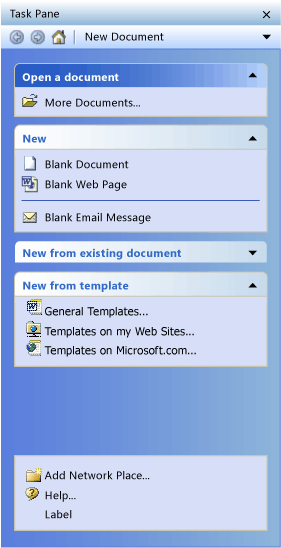
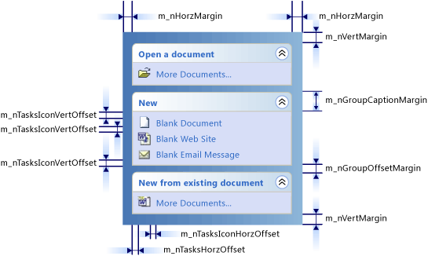

# CMFCTasksPane Class
[!INCLUDE[cpp_fp_under_construction](../vs140/includes/cpp_fp_under_construction_md.md)]  
  
 The <CodeContentPlaceHolder>95\</CodeContentPlaceHolder> class implements a list of clickable items (tasks).  
  
## Syntax  
  
<CodeContentPlaceHolder>0\</CodeContentPlaceHolder>  
## Members  
  
### Public Constructors  
  
|Name|Description|  
|----------|-----------------|  
|[CMFCTasksPane::CMFCTasksPane](#cmfctaskspane__cmfctaskspane)|Constructs a <CodeContentPlaceHolder>96\</CodeContentPlaceHolder> object.|  
  
### Public Methods  
  
|Name|Description|  
|----------|-----------------|  
|[CMFCTasksPane::AddGroup](#cmfctaskspane__addgroup)|Adds a new group of tasks to the task pane control.|  
|[CMFCTasksPane::AddLabel](#cmfctaskspane__addlabel)|Adds a new static label into the specified task group.|  
|[CMFCTasksPane::AddMRUFilesList](#cmfctaskspane__addmrufileslist)|Adds tasks specified by a Most Recently Used (MRU) file list into a group.|  
|[CMFCTasksPane::AddPage](#cmfctaskspane__addpage)|Adds a new page to the task pane.|  
|[CMFCTasksPane::AddSeparator](#cmfctaskspane__addseparator)||  
|[CMFCTasksPane::AddTask](#cmfctaskspane__addtask)|Adds a new task to the specified task group.|  
|[CMFCTasksPane::AddWindow](#cmfctaskspane__addwindow)|Adds a child window to the task pane.|  
|[CMFCTasksPane::CollapseAllGroups](#cmfctaskspane__collapseallgroups)||  
|[CMFCTasksPane::CollapseGroup](#cmfctaskspane__collapsegroup)|Programmatically collapses a group.|  
|[CMFCTasksPane::CreateDefaultMiniframe](#cmfctaskspane__createdefaultminiframe)|(Overrides [CPane::CreateDefaultMiniframe](../vs140/cpane-class.md#cpane__createdefaultminiframe).)|  
|[CMFCTasksPane::CreateMenu](#cmfctaskspane__createmenu)|Called by the framework to create a menu for the **Other Tasks Panes** menu button.|  
|[CMFCTasksPane::EnableAnimation](#cmfctaskspane__enableanimation)|Enables or disables animation while collapsing or expanding task groups.|  
|[CMFCTasksPane::EnableGroupCollapse](#cmfctaskspane__enablegroupcollapse)|Specifies whether tasks groups can be collapsed.|  
|[CMFCTasksPane::EnableHistoryMenuButtons](#cmfctaskspane__enablehistorymenubuttons)|Enables or disables drop-down menus in **Next** and **Previous** navigation buttons.|  
|[CMFCTasksPane::EnableNavigationToolbar](#cmfctaskspane__enablenavigationtoolbar)|Enables or disables the navigation toolbar.|  
|[CMFCTasksPane::EnableOffsetCustomControls](#cmfctaskspane__enableoffsetcustomcontrols)||  
|[CMFCTasksPane::EnableScrollButtons](#cmfctaskspane__enablescrollbuttons)|Enables scroll buttons instead of a scrollbar.|  
|[CMFCTasksPane::EnableWrapLabels](#cmfctaskspane__enablewraplabels)|Enables or disables word wrapping for labels.|  
|[CMFCTasksPane::EnableWrapTasks](#cmfctaskspane__enablewraptasks)|Enables or disables word wrapping for tasks.|  
|[CMFCTasksPane::GetActivePage](#cmfctaskspane__getactivepage)|Returns the zero-based index for the active page.|  
|[CMFCTasksPane::GetGroupCaptionHeight](#cmfctaskspane__getgroupcaptionheight)|Returns the height of the group captions.|  
|[CMFCTasksPane::GetGroupCaptionHorzOffset](#cmfctaskspane__getgroupcaptionhorzoffset)|Returns the current offset of a group caption from the left and right edges of the task pane.|  
|[CMFCTasksPane::GetGroupCaptionVertOffset](#cmfctaskspane__getgroupcaptionvertoffset)|Returns the current offset of a group caption from the top and bottom edges of the task pane.|  
|[CMFCTasksPane::GetGroupCount](#cmfctaskspane__getgroupcount)|Returns the total number of groups.|  
|[CMFCTasksPane::GetGroupLocation](#cmfctaskspane__getgrouplocation)|Returns the internal group index for a given group.|  
|[CMFCTasksPane::GetGroupVertOffset](#cmfctaskspane__getgroupvertoffset)|Returns the vertical offset of a group.|  
|[CMFCTasksPane::GetHorzMargin](#cmfctaskspane__gethorzmargin)|Returns the horizontal spacing between a task pane and the edges of the client area.|  
|[CMFCTasksPane::GetNextPages](#cmfctaskspane__getnextpages)||  
|[CMFCTasksPane::GetPageByGroup](#cmfctaskspane__getpagebygroup)|Retrieves the page index for a specified group.|  
|[CMFCTasksPane::GetPagesCount](#cmfctaskspane__getpagescount)|Returns the number of pages.|  
|[CMFCTasksPane::GetPreviousPages](#cmfctaskspane__getpreviouspages)||  
|[CMFCTasksPane::GetScrollBarCtrl](#cmfctaskspane__getscrollbarctrl)|(Overrides [CWnd::GetScrollBarCtrl](../vs140/cwnd-class.md#cwnd__getscrollbarctrl).)|  
|[CMFCTasksPane::GetTask](#cmfctaskspane__gettask)|Retrieves a task.|  
|[CMFCTasksPane::GetTaskCount](#cmfctaskspane__gettaskcount)|Returns the number of task items in a specified group.|  
|[CMFCTasksPane::GetTaskGroup](#cmfctaskspane__gettaskgroup)|Returns a task group for a given group index.|  
|[CMFCTasksPane::GetTaskLocation](#cmfctaskspane__gettasklocation)|Returns the group and the index for a given task.|  
|[CMFCTasksPane::GetTasksHorzOffset](#cmfctaskspane__gettaskshorzoffset)|Returns the horizontal offset of tasks from the left and right edges of their parent groups.|  
|[CMFCTasksPane::GetTasksIconHorzOffset](#cmfctaskspane__gettasksiconhorzoffset)||  
|[CMFCTasksPane::GetTasksIconVertOffset](#cmfctaskspane__gettasksiconvertoffset)||  
|[CMFCTasksPane::GetVertMargin](#cmfctaskspane__getvertmargin)|Returns the vertical spacing between a task pane and the edges of the client area.|  
|[CMFCTasksPane::IsAccessibilityCompatible](#cmfctaskspane__isaccessibilitycompatible)|(Overrides <CodeContentPlaceHolder>97\</CodeContentPlaceHolder>.)|  
|[CMFCTasksPane::IsAnimationEnabled](#cmfctaskspane__isanimationenabled)|Indicates whether animation is enabled.|  
|[CMFCTasksPane::IsBackButtonEnabled](#cmfctaskspane__isbackbuttonenabled)|Indicates whether the back button is enabled.|  
|[CMFCTasksPane::IsForwardButtonEnabled](#cmfctaskspane__isforwardbuttonenabled)|Indicates whether the forward button is enabled.|  
|[CMFCTasksPane::IsGroupCollapseEnabled](#cmfctaskspane__isgroupcollapseenabled)||  
|[CMFCTasksPane::IsHistoryMenuButtonsEnabled](#cmfctaskspane__ishistorymenubuttonsenabled)|Indicates whether the **Next** and **Previous** navigation buttons have drop-down menus.|  
|[CMFCTasksPane::IsNavigationToolbarEnabled](#cmfctaskspane__isnavigationtoolbarenabled)|Indicates whether the navigation toolbar is enabled.|  
|[CMFCTasksPane::IsToolBox](#cmfctaskspane__istoolbox)||  
|[CMFCTasksPane::IsWrapLabelsEnabled](#cmfctaskspane__iswraplabelsenabled)|Indicates whether the task pane wraps words in labels.|  
|[CMFCTasksPane::IsWrapTasksEnabled](#cmfctaskspane__iswraptasksenabled)|Indicates whether the task pane wraps words in tasks.|  
|[CMFCTasksPane::LoadState](#cmfctaskspane__loadstate)|(Overrides [CDockablePane::LoadState](assetId:///96110136-4f46-4764-8a76-3b4abaf77917).)|  
|[CMFCTasksPane::OnCancel](#cmfctaskspane__oncancel)||  
|[CMFCTasksPane::OnClickTask](#cmfctaskspane__onclicktask)|Called by the framework when the user clicks an item in the task pane.|  
|[CMFCTasksPane::OnOK](#cmfctaskspane__onok)||  
|[CMFCTasksPane::OnPressBackButton](#cmfctaskspane__onpressbackbutton)|Called by the framework when the user clicks the back button.|  
|[CMFCTasksPane::OnPressForwardButton](#cmfctaskspane__onpressforwardbutton)|Called by the framework when the user clicks the forward navigation button.|  
|[CMFCTasksPane::OnPressHomeButton](#cmfctaskspane__onpresshomebutton)|Called by the framework when the user clicks the home navigation button|  
|[CMFCTasksPane::OnPressOtherButton](#cmfctaskspane__onpressotherbutton)||  
|[CMFCTasksPane::OnSetAccData](#cmfctaskspane__onsetaccdata)|(Overrides [CBasePane::OnSetAccData](../vs140/cbasepane-class.md#cbasepane__onsetaccdata).)|  
|[CMFCTasksPane::OnUpdateCmdUI](#cmfctaskspane__onupdatecmdui)|(Overrides [CDockablePane::OnUpdateCmdUI](assetId:///5dd61606-1c12-40d4-b024-f3839aa5e2e0).)|  
|[CMFCTasksPane::PreTranslateMessage](#cmfctaskspane__pretranslatemessage)|(Overrides [CDockablePane::PreTranslateMessage](assetId:///49a242cc-b158-400e-9e01-0345ec9c3ffd).)|  
|[CMFCTasksPane::RecalcLayout](#cmfctaskspane__recalclayout)|(Overrides [CPane::RecalcLayout](../vs140/cpane-class.md#cpane__recalclayout).)|  
|[CMFCTasksPane::RemoveAllGroups](#cmfctaskspane__removeallgroups)|Removes all groups on the specified page.|  
|[CMFCTasksPane::RemoveAllPages](#cmfctaskspane__removeallpages)|Removes all pages from the task pane except the default (first) page.|  
|[CMFCTasksPane::RemoveAllTasks](#cmfctaskspane__removealltasks)|Removes all tasks from the group.|  
|[CMFCTasksPane::RemoveGroup](#cmfctaskspane__removegroup)|Removes a group.|  
|[CMFCTasksPane::RemovePage](#cmfctaskspane__removepage)|Removes a specified page from the task pane.|  
|[CMFCTasksPane::RemoveTask](#cmfctaskspane__removetask)|Removes a task from a task group.|  
|[CMFCTasksPane::SaveState](#cmfctaskspane__savestate)|(Overrides [CDockablePane::SaveState](assetId:///c5c24249-8d0d-46cb-96d9-9f5c6dc191db).)|  
|[CMFCTasksPane::Serialize](#cmfctaskspane__serialize)|(Overrides [CDockablePane::Serialize](assetId:///09787e59-e446-4e76-894b-206d303dcfd6).)|  
|[CMFCTasksPane::SetActivePage](#cmfctaskspane__setactivepage)|Activates a specified page in the task pane.|  
|[CMFCTasksPane::SetCaption](#cmfctaskspane__setcaption)|Sets the caption name of a task pane.|  
|[CMFCTasksPane::SetGroupCaptionHeight](#cmfctaskspane__setgroupcaptionheight)|Sets the height of a group caption.|  
|[CMFCTasksPane::SetGroupCaptionHorzOffset](#cmfctaskspane__setgroupcaptionhorzoffset)|Sets the horizontal offset of a group caption.|  
|[CMFCTasksPane::SetGroupCaptionVertOffset](#cmfctaskspane__setgroupcaptionvertoffset)|Sets the vertical offset of a group caption.|  
|[CMFCTasksPane::SetGroupName](#cmfctaskspane__setgroupname)|Sets a group name.|  
|[CMFCTasksPane::SetGroupTextColor](#cmfctaskspane__setgrouptextcolor)|Sets the text color for a group caption.|  
|[CMFCTasksPane::SetGroupVertOffset](#cmfctaskspane__setgroupvertoffset)|Sets the vertical offset for a group.|  
|[CMFCTasksPane::SetHorzMargin](#cmfctaskspane__sethorzmargin)|Sets the horizontal spacing between a task pane and the edges of the client area.|  
|[CMFCTasksPane::SetIconsList](#cmfctaskspane__seticonslist)|Sets the image list associated with tasks.|  
|[CMFCTasksPane::SetPageCaption](#cmfctaskspane__setpagecaption)|Sets the caption text for a task pane page.|  
|[CMFCTasksPane::SetTaskName](#cmfctaskspane__settaskname)|Sets the name for a task.|  
|[CMFCTasksPane::SetTasksIconHorzOffset](#cmfctaskspane__settasksiconhorzoffset)||  
|[CMFCTasksPane::SetTasksIconVertOffset](#cmfctaskspane__settasksiconvertoffset)||  
|[CMFCTasksPane::SetTaskTextColor](#cmfctaskspane__settasktextcolor)|Sets the text color for a task.|  
|[CMFCTasksPane::SetTasksHorzOffset](#cmfctaskspane__settaskshorzoffset)|Sets the horizontal offset of tasks from the left and right edges of their parent groups.|  
|[CMFCTasksPane::SetVertMargin](#cmfctaskspane__setvertmargin)|Sets the vertical spacing between a task pane and the edges of the client area.|  
|[CMFCTasksPane::SetWindowHeight](#cmfctaskspane__setwindowheight)|Sets the height for a window.|  
|[CMFCTasksPane::ShowCommandMessageString](#cmfctaskspane__showcommandmessagestring)||  
|[CMFCTasksPane::ShowTask](#cmfctaskspane__showtask)|Shows or hides a task.|  
|[CMFCTasksPane::ShowTaskByCmdId](#cmfctaskspane__showtaskbycmdid)|Shows or hides a task based on its command ID.|  
|[CMFCTasksPane::Update](#cmfctaskspane__update)|Updates the GUI elements that belong to a task pane.|  
  
### Protected Methods  
  
|Name|Description|  
|----------|-----------------|  
|[CMFCTasksPane::OnActivateTasksPanePage](#cmfctaskspane__onactivatetaskspanepage)|Called by the framework when a new task pane page is activated.|  
  
## Remarks  
 The <CodeContentPlaceHolder>98\</CodeContentPlaceHolder> class implements the following functionality:  
  
-   Items can be grouped and each item grouping can have an associated caption.  
  
-   Item groupings can be collapsed or expanded.  
  
-   An icon can be assigned to each item in the task pane.  
  
-   Individual items can be associated with a command ID which executes when a user clicks the item. When the click occurs, the <CodeContentPlaceHolder>99\</CodeContentPlaceHolder> message is sent to the owner of the task pane control.  
  
 To use the <CodeContentPlaceHolder>100\</CodeContentPlaceHolder> control in your application, follow these steps:  
  
1.  Embed a <CodeContentPlaceHolder>101\</CodeContentPlaceHolder> object into the main frame window class.  
  
2.  When processing the <CodeContentPlaceHolder>102\</CodeContentPlaceHolder> message, call the <CodeContentPlaceHolder>103\</CodeContentPlaceHolder> method. You can use the regular [CControlBar](../vs140/ccontrolbar-class.md) styles. For more information, see <CodeContentPlaceHolder>104\</CodeContentPlaceHolder>.  
  
3.  Call the [CMFCTasksPane::AddGroup](#cmfctaskspane__addgroup) method to add various groups.  
  
4.  Call the [CMFCTasksPane::AddTask](#cmfctaskspane__addtask), [CMFCTasksPane::AddLabel](#cmfctaskspane__addlabel) or [CMFCTasksPane::AddMRUFilesList](#cmfctaskspane__addmrufileslist) member functions to add new items (tasks) to each group.  
  
5.  Call [CMFCTasksPane::EnableGroupCollapse](#cmfctaskspane__enablegroupcollapse) to specify whether item groups can collapse.  
  
 The following illustration shows a typical task pane control. The first group is a *special* group and its caption is a darker color. The third group is collapsed. The last group is aligned to the bottom of the task pane and has no caption, and the last task in the group is a simple label:  
  
   
  
 You can customize the appearance of the task pane by adjusting various margins and offsets. The following illustration clarifies the meaning of these variables:  
  
   
  
## Example  
 The following example demonstrates how to construct a <CodeContentPlaceHolder>105\</CodeContentPlaceHolder> object and use various methods in the <CodeContentPlaceHolder>106\</CodeContentPlaceHolder> class. The example shows how to enable the collapsing of task groups, enable the drop-down menus on the **Next** and **Previous** navigation buttons, enable the scroll buttons instead of a scroll bar, enable the word wrapping for the text in labels, set the caption name of the task pane, set the text color for a group caption, and set the horizontal and vertical margins.  
  
 [!code[NVC_MFC_RibbonApp#28](../vs140/codesnippet/CPP/cmfctaskspane-class_1.cpp)]  
  
## Inheritance Hierarchy  
 [CObject](../vs140/cobject-class.md) [CCmdTarget](../vs140/ccmdtarget-class.md) [CWnd](../vs140/cwnd-class.md)  
  
 [CBasePane](../vs140/cbasepane-class.md) [CPane](../vs140/cpane-class.md) [CDockablePane](../vs140/cdockablepane-class.md)  
  
 [CMFCTasksPane](../vs140/cmfctaskspane-class.md)  
  
## Requirements  
 **Header:** afxTasksPane.h  
  
##  \<a name="cmfctaskspane__addgroup">\</a>  CMFCTasksPane::AddGroup  
 Adds a new group of tasks to the task pane control.  
  
<CodeContentPlaceHolder>1\</CodeContentPlaceHolder>  
### Parameters  
 [in] <CodeContentPlaceHolder>107\</CodeContentPlaceHolder>  
 Specifies the zero-based page index.  
  
 [in] <CodeContentPlaceHolder>108\</CodeContentPlaceHolder>  
 Specifies the group name.  
  
 [in] <CodeContentPlaceHolder>109\</CodeContentPlaceHolder>  
 <CodeContentPlaceHolder>110\</CodeContentPlaceHolder> to create the group at the bottom of the task pane control; otherwise, <CodeContentPlaceHolder>111\</CodeContentPlaceHolder>.  
  
 [in] <CodeContentPlaceHolder>112\</CodeContentPlaceHolder>  
 <CodeContentPlaceHolder>113\</CodeContentPlaceHolder> to mark this group as a *special* group; otherwise, <CodeContentPlaceHolder>114\</CodeContentPlaceHolder>. For more information about special groups, see the Remarks section of [CMFCTasksPane Class](../vs140/cmfctaskspane-class.md).  
  
 [in] <CodeContentPlaceHolder>115\</CodeContentPlaceHolder>  
 Specifies the icon to display in the group caption.  
  
### Return Value  
 The zero-based index of the group in the internal list of groups that the class maintains.  
  
### Remarks  
 Call this method to create a group of tasks and to add that group to the task pane control.  
  
 The framework displays task groups at the top of the task pane control or at the bottom. The framework can display only one group at the bottom; this group must be added last.  
  
##  \<a name="cmfctaskspane__addlabel">\</a>  CMFCTasksPane::AddLabel  
 Adds a label to the specified task group.  
  
<CodeContentPlaceHolder>2\</CodeContentPlaceHolder>  
### Parameters  
 [in] <CodeContentPlaceHolder>116\</CodeContentPlaceHolder>  
 Specifies the index of the group where the label is added.  
  
 [in] <CodeContentPlaceHolder>117\</CodeContentPlaceHolder>  
 Specifies the name of the label.  
  
 [in] <CodeContentPlaceHolder>118\</CodeContentPlaceHolder>  
 Specifies the icon to display next to the label. The framework stores icons in a list of images. This parameter is an index into that list.  
  
 [in] <CodeContentPlaceHolder>119\</CodeContentPlaceHolder>  
 <CodeContentPlaceHolder>120\</CodeContentPlaceHolder> to display the label in bold text; otherwise, <CodeContentPlaceHolder>121\</CodeContentPlaceHolder>.  
  
### Return Value  
 The zero-based index of the group where the label was added, or -1 if the group specified by <CodeContentPlaceHolder>122\</CodeContentPlaceHolder> does not exist.  
  
### Remarks  
 The framework handles tasks and labels differently. When a user clicks on a task, the framework executes a command. When a user clicks on a label, no command is executed. For more information, see [CMFCTasksPane::AddTask](#cmfctaskspane__addtask).  
  
##  \<a name="cmfctaskspane__addmrufileslist">\</a>  CMFCTasksPane::AddMRUFilesList  
 Adds a task for each file stored in a Most Recently Used (MRU) files list into a group.  
  
<CodeContentPlaceHolder>3\</CodeContentPlaceHolder>  
### Parameters  
 [in] <CodeContentPlaceHolder>123\</CodeContentPlaceHolder>  
 Specifies the index of a group. This method adds the MRU files list to the group specified by this parameter.  
  
 [in] <CodeContentPlaceHolder>124\</CodeContentPlaceHolder>  
 Specifies the number of files to display in the MRU files list.  
  
### Return Value  
 The zero-based index of the group where the MRU files list was added, or -1 if the group specified by <CodeContentPlaceHolder>125\</CodeContentPlaceHolder> does not exist.  
  
##  \<a name="cmfctaskspane__addpage">\</a>  CMFCTasksPane::AddPage  
 Adds a page to the task pane.  
  
<CodeContentPlaceHolder>4\</CodeContentPlaceHolder>  
### Parameters  
 [in] <CodeContentPlaceHolder>126\</CodeContentPlaceHolder>  
 Specifies the label for the page.  
  
### Return Value  
 The zero-based index of the new page.  
  
##  \<a name="cmfctaskspane__addseparator">\</a>  CMFCTasksPane::AddSeparator  
 [!INCLUDE[cpp_fp_under_construction](../vs140/includes/cpp_fp_under_construction_md.md)]  
  
<CodeContentPlaceHolder>5\</CodeContentPlaceHolder>  
### Parameters  
 [in] <CodeContentPlaceHolder>127\</CodeContentPlaceHolder>  
  
### Return Value  
  
### Remarks  
  
##  \<a name="cmfctaskspane__addtask">\</a>  CMFCTasksPane::AddTask  
 Adds a task to the specified task group.  
  
<CodeContentPlaceHolder>6\</CodeContentPlaceHolder>  
### Parameters  
 [in] <CodeContentPlaceHolder>128\</CodeContentPlaceHolder>  
 Specifies the group index where the task is added.  
  
 [in] <CodeContentPlaceHolder>129\</CodeContentPlaceHolder>  
 Specifies the name of the task.  
  
 [in] <CodeContentPlaceHolder>130\</CodeContentPlaceHolder>  
 Specifies the icon to display next to the task. The framework stores icons in a list of images. This parameter is an index into that list.  
  
 [in] <CodeContentPlaceHolder>131\</CodeContentPlaceHolder>  
 Specifies the command ID of the command to execute when the user clicks the task. The task is treated as a label if <CodeContentPlaceHolder>132\</CodeContentPlaceHolder> is 0.  
  
 [in] <CodeContentPlaceHolder>133\</CodeContentPlaceHolder>  
 Specifies the user-defined data to be associated with the task.  
  
### Return Value  
 The zero-based index of the group where the task was added, or -1 if the group specified by <CodeContentPlaceHolder>134\</CodeContentPlaceHolder> does not exist.  
  
##  \<a name="cmfctaskspane__addwindow">\</a>  CMFCTasksPane::AddWindow  
 Adds a child window to the task pane.  
  
<CodeContentPlaceHolder>7\</CodeContentPlaceHolder>  
### Parameters  
 [in] <CodeContentPlaceHolder>135\</CodeContentPlaceHolder>  
 Specifies the group index where the window is added.  
  
 [in] <CodeContentPlaceHolder>136\</CodeContentPlaceHolder>  
 Specifies the handle of the window to add.  
  
 [in] <CodeContentPlaceHolder>137\</CodeContentPlaceHolder>  
 Specifies the height of the window.  
  
 [in] <CodeContentPlaceHolder>138\</CodeContentPlaceHolder>  
 <CodeContentPlaceHolder>139\</CodeContentPlaceHolder> to destroy the window when the task is removed; otherwise, <CodeContentPlaceHolder>140\</CodeContentPlaceHolder>.  
  
 [in] <CodeContentPlaceHolder>141\</CodeContentPlaceHolder>  
 Specifies the user-defined data associated with the task.  
  
### Return Value  
 The zero-based index of the group where the window was added, or -1 if the group specified by <CodeContentPlaceHolder>142\</CodeContentPlaceHolder> does not exist.  
  
### Remarks  
 Call this method to add a control to a task pane. For example, you can add an edit control that functions like a search bar.  
  
##  \<a name="cmfctaskspane__cmfctaskspane">\</a>  CMFCTasksPane::CMFCTasksPane  
 Constructs a [CMFCTasksPane](../vs140/cmfctaskspane-class.md) object.  
  
<CodeContentPlaceHolder>8\</CodeContentPlaceHolder>  
##  \<a name="cmfctaskspane__collapseallgroups">\</a>  CMFCTasksPane::CollapseAllGroups  
 [!INCLUDE[cpp_fp_under_construction](../vs140/includes/cpp_fp_under_construction_md.md)]  
  
<CodeContentPlaceHolder>9\</CodeContentPlaceHolder>  
### Parameters  
 [in] <CodeContentPlaceHolder>143\</CodeContentPlaceHolder>  
  [in] <CodeContentPlaceHolder>144\</CodeContentPlaceHolder>  
  
### Remarks  
  
##  \<a name="cmfctaskspane__collapsegroup">\</a>  CMFCTasksPane::CollapseGroup  
 Collapses or expands a group.  
  
<CodeContentPlaceHolder>10\</CodeContentPlaceHolder>  
### Parameters  
 [in] <CodeContentPlaceHolder>145\</CodeContentPlaceHolder>  
 Specifies the group to collapse.  
  
 [in] <CodeContentPlaceHolder>146\</CodeContentPlaceHolder>  
 <CodeContentPlaceHolder>147\</CodeContentPlaceHolder> to collapse the group; <CodeContentPlaceHolder>148\</CodeContentPlaceHolder> to expand the group.  
  
 [in] <CodeContentPlaceHolder>149\</CodeContentPlaceHolder>  
 Specifies the zero-based index of the group to collapse in the internal list of groups.  
  
### Return Value  
 <CodeContentPlaceHolder>150\</CodeContentPlaceHolder> if the group collapses or expands successfully; otherwise, <CodeContentPlaceHolder>151\</CodeContentPlaceHolder>.  
  
### Remarks  
 A collapsed group shows only the group caption; the list of tasks is hidden.  
  
##  \<a name="cmfctaskspane__createdefaultminiframe">\</a>  CMFCTasksPane::CreateDefaultMiniframe  
 [!INCLUDE[cpp_fp_under_construction](../vs140/includes/cpp_fp_under_construction_md.md)]  
  
<CodeContentPlaceHolder>11\</CodeContentPlaceHolder>  
### Parameters  
 [in] <CodeContentPlaceHolder>152\</CodeContentPlaceHolder>  
  
### Return Value  
  
### Remarks  
  
##  \<a name="cmfctaskspane__createmenu">\</a>  CMFCTasksPane::CreateMenu  
 Creates a menu that appears when a user clicks the **Other Tasks Panes** menu button.  
  
<CodeContentPlaceHolder>12\</CodeContentPlaceHolder>  
### Return Value  
 A handle to the new menu.  
  
### Remarks  
 Override this method in a derived class to customize the menu for a task pane.  
  
 The pop-up menu  that this method creates contains the list of pages in the task pane. The menu displays a check mark next to the active page.  
  
##  \<a name="cmfctaskspane__enableanimation">\</a>  CMFCTasksPane::EnableAnimation  
 Enables or disables the animation that occurs when a task group expands or collapses.  
  
<CodeContentPlaceHolder>13\</CodeContentPlaceHolder>  
### Parameters  
 [in] <CodeContentPlaceHolder>153\</CodeContentPlaceHolder>  
 <CodeContentPlaceHolder>154\</CodeContentPlaceHolder> to enable the animation that occurs when a task group expands or collapses; otherwise, <CodeContentPlaceHolder>155\</CodeContentPlaceHolder>.  
  
### Remarks  
 By default, the animation that occurs when a task group expands or collapses is enabled.  
  
##  \<a name="cmfctaskspane__enablegroupcollapse">\</a>  CMFCTasksPane::EnableGroupCollapse  
 Specifies whether a user can collapse task groups.  
  
<CodeContentPlaceHolder>14\</CodeContentPlaceHolder>  
### Parameters  
 [in] <CodeContentPlaceHolder>156\</CodeContentPlaceHolder>  
 <CodeContentPlaceHolder>157\</CodeContentPlaceHolder> if users can collapse task groups; otherwise, <CodeContentPlaceHolder>158\</CodeContentPlaceHolder>.  
  
### Remarks  
 A task group that is collapsed displays only the group caption; the list of tasks is hidden.  
  
##  \<a name="cmfctaskspane__enablehistorymenubuttons">\</a>  CMFCTasksPane::EnableHistoryMenuButtons  
 Enables drop-down menus on the **Next** and **Previous** navigation buttons.  
  
<CodeContentPlaceHolder>15\</CodeContentPlaceHolder>  
### Parameters  
 [in] <CodeContentPlaceHolder>159\</CodeContentPlaceHolder>  
 <CodeContentPlaceHolder>160\</CodeContentPlaceHolder> to enable drop-down menus on the **Next** and **Previous** navigation buttons; otherwise, <CodeContentPlaceHolder>161\</CodeContentPlaceHolder>.  
  
### Remarks  
 By default, the drop-down menus on the **Next** and **Previous** buttons are disabled.  
  
 The menus contain the history of tasks pages that the user used.  
  
##  \<a name="cmfctaskspane__enablenavigationtoolbar">\</a>  CMFCTasksPane::EnableNavigationToolbar  
 Enables or disables the navigation toolbar.  
  
<CodeContentPlaceHolder>16\</CodeContentPlaceHolder>  
### Parameters  
 [in] <CodeContentPlaceHolder>162\</CodeContentPlaceHolder>  
 <CodeContentPlaceHolder>163\</CodeContentPlaceHolder> to enable the navigation toolbar; otherwise, <CodeContentPlaceHolder>164\</CodeContentPlaceHolder>.  
  
 [in] <CodeContentPlaceHolder>165\</CodeContentPlaceHolder>  
 Specifies the resource ID of the bitmap that contains the images to display on the toolbar.  
  
 [in] <CodeContentPlaceHolder>166\</CodeContentPlaceHolder>  
 Specifies the size of a toolbar image.  
  
 [in] <CodeContentPlaceHolder>167\</CodeContentPlaceHolder>  
 Specifies the size of a toolbar button.  
  
### Remarks  
 The navigation toolbar is a toolbar that the framework displays at the top of the task pane. The navigation toolbar contains the **Back**, **Forward**, and **Home** navigation buttons and a menu button that contains the list of available pages.  
  
 By default, the framework does not display the navigation toolbar. If the navigation toolbar is not displayed, the navigation buttons are located on the caption of the docking bar.  
  
##  \<a name="cmfctaskspane__enableoffsetcustomcontrols">\</a>  CMFCTasksPane::EnableOffsetCustomControls  
 [!INCLUDE[cpp_fp_under_construction](../vs140/includes/cpp_fp_under_construction_md.md)]  
  
<CodeContentPlaceHolder>17\</CodeContentPlaceHolder>  
### Parameters  
 [in] <CodeContentPlaceHolder>168\</CodeContentPlaceHolder>  
  
### Remarks  
  
##  \<a name="cmfctaskspane__enablescrollbuttons">\</a>  CMFCTasksPane::EnableScrollButtons  
 Enables scroll buttons instead of a scroll bar.  
  
<CodeContentPlaceHolder>18\</CodeContentPlaceHolder>  
### Parameters  
 [in] <CodeContentPlaceHolder>169\</CodeContentPlaceHolder>  
 <CodeContentPlaceHolder>170\</CodeContentPlaceHolder> to display scroll buttons in the task pane instead of a scroll bar; otherwise, <CodeContentPlaceHolder>171\</CodeContentPlaceHolder>.  
  
### Remarks  
 By default, the framework displays scroll buttons in the task pane.  
  
##  \<a name="cmfctaskspane__enablewraplabels">\</a>  CMFCTasksPane::EnableWrapLabels  
 Enables or disables word wrapping for the text in labels.  
  
<CodeContentPlaceHolder>19\</CodeContentPlaceHolder>  
### Parameters  
 [in] <CodeContentPlaceHolder>172\</CodeContentPlaceHolder>  
 <CodeContentPlaceHolder>173\</CodeContentPlaceHolder> to wrap the text in labels that appear on the task pane; otherwise, <CodeContentPlaceHolder>174\</CodeContentPlaceHolder>.  
  
### Remarks  
 By default, the framework does not wrap the text in labels. When word wrapping is enabled, the text in labels can appear in multiple lines. The label can include line breaking markers such as <CodeContentPlaceHolder>175\</CodeContentPlaceHolder> and the underline marker <CodeContentPlaceHolder>176\</CodeContentPlaceHolder>.  
  
##  \<a name="cmfctaskspane__enablewraptasks">\</a>  CMFCTasksPane::EnableWrapTasks  
 Enables or disables word wrapping for the text in tasks.  
  
<CodeContentPlaceHolder>20\</CodeContentPlaceHolder>  
### Parameters  
 [in] <CodeContentPlaceHolder>177\</CodeContentPlaceHolder>  
 <CodeContentPlaceHolder>178\</CodeContentPlaceHolder> to wrap tasks in the task pane; otherwise, <CodeContentPlaceHolder>179\</CodeContentPlaceHolder>.  
  
### Remarks  
 By default, word wrapping for tasks is disabled.  
  
##  \<a name="cmfctaskspane__getactivepage">\</a>  CMFCTasksPane::GetActivePage  
 Returns the zero-based index for the active page.  
  
<CodeContentPlaceHolder>21\</CodeContentPlaceHolder>  
### Return Value  
 The zero-based index of the active page.  
  
##  \<a name="cmfctaskspane__getgroupcaptionheight">\</a>  CMFCTasksPane::GetGroupCaptionHeight  
 Returns the height of the group caption.  
  
<CodeContentPlaceHolder>22\</CodeContentPlaceHolder>  
### Return Value  
 The height of the group caption, in pixels.  
  
##  \<a name="cmfctaskspane__getgroupcaptionhorzoffset">\</a>  CMFCTasksPane::GetGroupCaptionHorzOffset  
 Returns the horizontal offset of a group caption.  
  
<CodeContentPlaceHolder>23\</CodeContentPlaceHolder>  
### Return Value  
 The horizontal offset of a group caption. The horizontal offset is the distance in pixels from the left or right edge of the task pane.  
  
##  \<a name="cmfctaskspane__getgroupcaptionvertoffset">\</a>  CMFCTasksPane::GetGroupCaptionVertOffset  
 Returns the vertical offset of a group caption.  
  
<CodeContentPlaceHolder>24\</CodeContentPlaceHolder>  
### Return Value  
 The vertical offset of a group caption from the top and bottom edges of the task pane.  
  
### Remarks  
 The default value for the vertical offset is 7 pixels.  
  
##  \<a name="cmfctaskspane__getgroupcount">\</a>  CMFCTasksPane::GetGroupCount  
 Returns the total number of groups.  
  
<CodeContentPlaceHolder>25\</CodeContentPlaceHolder>  
### Return Value  
 The total number of groups in the task pane.  
  
##  \<a name="cmfctaskspane__getgrouplocation">\</a>  CMFCTasksPane::GetGroupLocation  
 Returns the internal group index for the specified group.  
  
<CodeContentPlaceHolder>26\</CodeContentPlaceHolder>  
### Parameters  
 [in] <CodeContentPlaceHolder>180\</CodeContentPlaceHolder>  
 Specifies the task group whose location is retrieved.  
  
 [out] <CodeContentPlaceHolder>181\</CodeContentPlaceHolder>  
 Contains the zero-based index of the task group.  
  
### Return Value  
 <CodeContentPlaceHolder>182\</CodeContentPlaceHolder> if the task group was found; otherwise, <CodeContentPlaceHolder>183\</CodeContentPlaceHolder>.  
  
##  \<a name="cmfctaskspane__getgroupvertoffset">\</a>  CMFCTasksPane::GetGroupVertOffset  
 Returns the vertical offset of a group.  
  
<CodeContentPlaceHolder>27\</CodeContentPlaceHolder>  
### Return Value  
 The vertical offset of a group, in pixels.  
  
##  \<a name="cmfctaskspane__gethorzmargin">\</a>  CMFCTasksPane::GetHorzMargin  
 Returns the horizontal spacing between a task pane and the edge of the client area.  
  
<CodeContentPlaceHolder>28\</CodeContentPlaceHolder>  
### Return Value  
 The horizontal spacing between a task pane and the edge of the client area.  
  
### Remarks  
 The default spacing between a task pane and the edge of the client area is 12 pixels.  
  
##  \<a name="cmfctaskspane__getnextpages">\</a>  CMFCTasksPane::GetNextPages  
 [!INCLUDE[cpp_fp_under_construction](../vs140/includes/cpp_fp_under_construction_md.md)]  
  
<CodeContentPlaceHolder>29\</CodeContentPlaceHolder>  
### Parameters  
 [in] <CodeContentPlaceHolder>184\</CodeContentPlaceHolder>  
  
### Remarks  
  
##  \<a name="cmfctaskspane__getpagebygroup">\</a>  CMFCTasksPane::GetPageByGroup  
 Retrieves the page index for a specified group.  
  
<CodeContentPlaceHolder>30\</CodeContentPlaceHolder>  
### Parameters  
 [in] <CodeContentPlaceHolder>185\</CodeContentPlaceHolder>  
 Specifies the zero-based index of the task group.  
  
 [out] <CodeContentPlaceHolder>186\</CodeContentPlaceHolder>  
 Contains the page index for the specified group. If the task group only contains a default page, the returned value is 0.  
  
### Return Value  
 <CodeContentPlaceHolder>187\</CodeContentPlaceHolder> if the group <CodeContentPlaceHolder>188\</CodeContentPlaceHolder> exists; otherwise, <CodeContentPlaceHolder>189\</CodeContentPlaceHolder>.  
  
##  \<a name="cmfctaskspane__getpagescount">\</a>  CMFCTasksPane::GetPagesCount  
 Returns the number of pages.  
  
<CodeContentPlaceHolder>31\</CodeContentPlaceHolder>  
### Return Value  
 The number of pages in the task pane.  
  
##  \<a name="cmfctaskspane__getpreviouspages">\</a>  CMFCTasksPane::GetPreviousPages  
 [!INCLUDE[cpp_fp_under_construction](../vs140/includes/cpp_fp_under_construction_md.md)]  
  
<CodeContentPlaceHolder>32\</CodeContentPlaceHolder>  
### Parameters  
 [in] <CodeContentPlaceHolder>190\</CodeContentPlaceHolder>  
  
### Remarks  
  
##  \<a name="cmfctaskspane__getscrollbarctrl">\</a>  CMFCTasksPane::GetScrollBarCtrl  
 [!INCLUDE[cpp_fp_under_construction](../vs140/includes/cpp_fp_under_construction_md.md)]  
  
<CodeContentPlaceHolder>33\</CodeContentPlaceHolder>  
### Parameters  
 [in] <CodeContentPlaceHolder>191\</CodeContentPlaceHolder>  
  
### Return Value  
  
### Remarks  
  
##  \<a name="cmfctaskspane__gettask">\</a>  CMFCTasksPane::GetTask  
 Retrieves a task.  
  
<CodeContentPlaceHolder>34\</CodeContentPlaceHolder>  
### Parameters  
 [in] <CodeContentPlaceHolder>192\</CodeContentPlaceHolder>  
 Specifies the zero-based index of the group that contains the task.  
  
 [in] <CodeContentPlaceHolder>193\</CodeContentPlaceHolder>  
 Specifies the zero-based index of the task in the list specified by <CodeContentPlaceHolder>194\</CodeContentPlaceHolder>.  
  
### Return Value  
 The task at the specified index.  
  
##  \<a name="cmfctaskspane__gettaskcount">\</a>  CMFCTasksPane::GetTaskCount  
 Returns the number of tasks in a specified group.  
  
<CodeContentPlaceHolder>35\</CodeContentPlaceHolder>  
### Parameters  
 [in] <CodeContentPlaceHolder>195\</CodeContentPlaceHolder>  
 Specifies the index of the task group.  
  
### Return Value  
 The number of tasks in the specified group, or 0 if <CodeContentPlaceHolder>196\</CodeContentPlaceHolder> is invalid.  
  
##  \<a name="cmfctaskspane__gettaskgroup">\</a>  CMFCTasksPane::GetTaskGroup  
 Returns a task group for a specified group index.  
  
<CodeContentPlaceHolder>36\</CodeContentPlaceHolder>  
### Parameters  
 [in] <CodeContentPlaceHolder>197\</CodeContentPlaceHolder>  
 Specifies the zero-based index of the group to retrieve.  
  
### Return Value  
 The task group at the specified index.  
  
##  \<a name="cmfctaskspane__gettasklocation">\</a>  CMFCTasksPane::GetTaskLocation  
 Returns the group and the index for a specified task.  
  
<CodeContentPlaceHolder>37\</CodeContentPlaceHolder>  
### Parameters  
 [in] <CodeContentPlaceHolder>198\</CodeContentPlaceHolder>  
 Specifies the command ID of the task to find.  
  
 [out] <CodeContentPlaceHolder>199\</CodeContentPlaceHolder>  
 Contains the group index of the task.  
  
 [out] <CodeContentPlaceHolder>200\</CodeContentPlaceHolder>  
 Contains the index of the task in the task group.  
  
 [in] <CodeContentPlaceHolder>201\</CodeContentPlaceHolder>  
 Specifies the window associated with the task.  
  
 [in] <CodeContentPlaceHolder>202\</CodeContentPlaceHolder>  
 Specifies the task to find.  
  
### Return Value  
 <CodeContentPlaceHolder>203\</CodeContentPlaceHolder> if the task location was found; <CodeContentPlaceHolder>204\</CodeContentPlaceHolder> if the specified task does not exist.  
  
### Remarks  
 This method retrieves the group index and task index for the specified task. If the method returns <CodeContentPlaceHolder>205\</CodeContentPlaceHolder>, <CodeContentPlaceHolder>206\</CodeContentPlaceHolder> and <CodeContentPlaceHolder>207\</CodeContentPlaceHolder> are set to -1.  
  
##  \<a name="cmfctaskspane__gettaskshorzoffset">\</a>  CMFCTasksPane::GetTasksHorzOffset  
 Returns the horizontal offset of tasks.  
  
<CodeContentPlaceHolder>38\</CodeContentPlaceHolder>  
### Return Value  
 The horizontal offset of tasks from the left and right edges of their parent groups.  
  
### Remarks  
 The default horizontal offset of tasks is 12 pixels.  
  
##  \<a name="cmfctaskspane__gettasksiconhorzoffset">\</a>  CMFCTasksPane::GetTasksIconHorzOffset  
 [!INCLUDE[cpp_fp_under_construction](../vs140/includes/cpp_fp_under_construction_md.md)]  
  
<CodeContentPlaceHolder>39\</CodeContentPlaceHolder>  
### Return Value  
  
### Remarks  
  
##  \<a name="cmfctaskspane__gettasksiconvertoffset">\</a>  CMFCTasksPane::GetTasksIconVertOffset  
 [!INCLUDE[cpp_fp_under_construction](../vs140/includes/cpp_fp_under_construction_md.md)]  
  
<CodeContentPlaceHolder>40\</CodeContentPlaceHolder>  
### Return Value  
  
### Remarks  
  
##  \<a name="cmfctaskspane__getvertmargin">\</a>  CMFCTasksPane::GetVertMargin  
 Returns the vertical margin between a task pane and the edges of the client area.  
  
<CodeContentPlaceHolder>41\</CodeContentPlaceHolder>  
### Return Value  
 The vertical margin between a task pane and the edges of the client area.  
  
### Remarks  
 The vertical margin is the space between a task pane and the edges of the client area. The default value of the vertical margin is 12 pixels.  
  
##  \<a name="cmfctaskspane__isaccessibilitycompatible">\</a>  CMFCTasksPane::IsAccessibilityCompatible  
 [!INCLUDE[cpp_fp_under_construction](../vs140/includes/cpp_fp_under_construction_md.md)]  
  
<CodeContentPlaceHolder>42\</CodeContentPlaceHolder>  
### Return Value  
  
### Remarks  
  
##  \<a name="cmfctaskspane__isanimationenabled">\</a>  CMFCTasksPane::IsAnimationEnabled  
 Indicates whether animation is enabled.  
  
<CodeContentPlaceHolder>43\</CodeContentPlaceHolder>  
### Return Value  
 <CodeContentPlaceHolder>208\</CodeContentPlaceHolder> if the animation that occurs when a user expands or collapses a group is enabled; otherwise, <CodeContentPlaceHolder>209\</CodeContentPlaceHolder>.  
  
### Remarks  
 Call [CMFCTasksPane::EnableAnimation](#cmfctaskspane__enableanimation) to enable or disable animation.  
  
##  \<a name="cmfctaskspane__isbackbuttonenabled">\</a>  CMFCTasksPane::IsBackButtonEnabled  
 Indicates whether the back button is enabled.  
  
<CodeContentPlaceHolder>44\</CodeContentPlaceHolder>  
### Return Value  
 <CodeContentPlaceHolder>210\</CodeContentPlaceHolder> if the back button is enabled; otherwise, <CodeContentPlaceHolder>211\</CodeContentPlaceHolder>.  
  
### Remarks  
 When a user clicks the back button, the framework displays the previous task page.  
  
##  \<a name="cmfctaskspane__isforwardbuttonenabled">\</a>  CMFCTasksPane::IsForwardButtonEnabled  
 Indicates whether the forward button is enabled.  
  
<CodeContentPlaceHolder>45\</CodeContentPlaceHolder>  
### Return Value  
 <CodeContentPlaceHolder>212\</CodeContentPlaceHolder> if the forward button is enabled; otherwise, <CodeContentPlaceHolder>213\</CodeContentPlaceHolder>.  
  
### Remarks  
 The forward button enables forward navigation in the history of task pages.  
  
##  \<a name="cmfctaskspane__isgroupcollapseenabled">\</a>  CMFCTasksPane::IsGroupCollapseEnabled  
 [!INCLUDE[cpp_fp_under_construction](../vs140/includes/cpp_fp_under_construction_md.md)]  
  
<CodeContentPlaceHolder>46\</CodeContentPlaceHolder>  
### Return Value  
  
### Remarks  
  
##  \<a name="cmfctaskspane__ishistorymenubuttonsenabled">\</a>  CMFCTasksPane::IsHistoryMenuButtonsEnabled  
 Indicates whether the **Next** and **Previous** navigation buttons have drop-down menus.  
  
<CodeContentPlaceHolder>47\</CodeContentPlaceHolder>  
### Return Value  
 <CodeContentPlaceHolder>214\</CodeContentPlaceHolder> if the **Next** and **Previous** navigation buttons have drop-down menus; otherwise, <CodeContentPlaceHolder>215\</CodeContentPlaceHolder>.  
  
##  \<a name="cmfctaskspane__isnavigationtoolbarenabled">\</a>  CMFCTasksPane::IsNavigationToolbarEnabled  
 Indicates whether the navigation toolbar is enabled.  
  
<CodeContentPlaceHolder>48\</CodeContentPlaceHolder>  
### Return Value  
 <CodeContentPlaceHolder>216\</CodeContentPlaceHolder> if the navigation toolbar is enabled; otherwise, <CodeContentPlaceHolder>217\</CodeContentPlaceHolder>.  
  
##  \<a name="cmfctaskspane__istoolbox">\</a>  CMFCTasksPane::IsToolBox  
 [!INCLUDE[cpp_fp_under_construction](../vs140/includes/cpp_fp_under_construction_md.md)]  
  
<CodeContentPlaceHolder>49\</CodeContentPlaceHolder>  
### Return Value  
  
### Remarks  
  
##  \<a name="cmfctaskspane__iswraplabelsenabled">\</a>  CMFCTasksPane::IsWrapLabelsEnabled  
 Indicates whether the task pane wraps words in labels.  
  
<CodeContentPlaceHolder>50\</CodeContentPlaceHolder>  
### Return Value  
 <CodeContentPlaceHolder>218\</CodeContentPlaceHolder> if words in labels are wrapped; otherwise, <CodeContentPlaceHolder>219\</CodeContentPlaceHolder>.  
  
##  \<a name="cmfctaskspane__iswraptasksenabled">\</a>  CMFCTasksPane::IsWrapTasksEnabled  
 Specifies whether the framework wraps the task string.  
  
<CodeContentPlaceHolder>51\</CodeContentPlaceHolder>  
### Return Value  
 <CodeContentPlaceHolder>220\</CodeContentPlaceHolder> if the task string is wrapped; otherwise, <CodeContentPlaceHolder>221\</CodeContentPlaceHolder>.  
  
##  \<a name="cmfctaskspane__loadstate">\</a>  CMFCTasksPane::LoadState  
 [!INCLUDE[cpp_fp_under_construction](../vs140/includes/cpp_fp_under_construction_md.md)]  
  
<CodeContentPlaceHolder>52\</CodeContentPlaceHolder>  
### Parameters  
 [in] <CodeContentPlaceHolder>222\</CodeContentPlaceHolder>  
  [in] <CodeContentPlaceHolder>223\</CodeContentPlaceHolder>  
  [in] <CodeContentPlaceHolder>224\</CodeContentPlaceHolder>  
  
### Return Value  
  
### Remarks  
  
##  \<a name="cmfctaskspane__onactivatetaskspanepage">\</a>  CMFCTasksPane::OnActivateTasksPanePage  
 Called by the framework when it makes a task pane page active.  
  
<CodeContentPlaceHolder>53\</CodeContentPlaceHolder>  
### Remarks  
 Override this method in a derived class to customize the appearance of the task pane page.  
  
##  \<a name="cmfctaskspane__oncancel">\</a>  CMFCTasksPane::OnCancel  
 [!INCLUDE[cpp_fp_under_construction](../vs140/includes/cpp_fp_under_construction_md.md)]  
  
<CodeContentPlaceHolder>54\</CodeContentPlaceHolder>  
### Remarks  
  
##  \<a name="cmfctaskspane__onclicktask">\</a>  CMFCTasksPane::OnClickTask  
 Called by the framework when the user clicks an item in the task pane.  
  
<CodeContentPlaceHolder>55\</CodeContentPlaceHolder>  
### Parameters  
 [in] <CodeContentPlaceHolder>225\</CodeContentPlaceHolder>  
 Specifies the zero-based index of the group that contains the clicked task.  
  
 [in] <CodeContentPlaceHolder>226\</CodeContentPlaceHolder>  
 Specifies the zero-based index of the clicked task.  
  
 [in] <CodeContentPlaceHolder>227\</CodeContentPlaceHolder>  
 Specifies the command ID associated with the task.  
  
 [in] <CodeContentPlaceHolder>228\</CodeContentPlaceHolder>  
 Contains user-defined data associated with the clicked task.  
  
### Remarks  
 The framework calls this method when a user clicks a task. By default, the framework checks the command ID associated with the clicked task and, if it is not zero, sends the <CodeContentPlaceHolder>229\</CodeContentPlaceHolder> message to the owner of the task pane control.  
  
 Override this method in a derived class to execute custom code when a task is clicked.  
  
##  \<a name="cmfctaskspane__onok">\</a>  CMFCTasksPane::OnOK  
 [!INCLUDE[cpp_fp_under_construction](../vs140/includes/cpp_fp_under_construction_md.md)]  
  
<CodeContentPlaceHolder>56\</CodeContentPlaceHolder>  
### Remarks  
  
##  \<a name="cmfctaskspane__onpressbackbutton">\</a>  CMFCTasksPane::OnPressBackButton  
 Called by the framework when the user clicks the back button.  
  
<CodeContentPlaceHolder>57\</CodeContentPlaceHolder>  
### Remarks  
 By default, the framework displays the previously viewed page.  
  
 Override this method in a derived class to execute custom code when the user clicks the back button.  
  
##  \<a name="cmfctaskspane__onpressforwardbutton">\</a>  CMFCTasksPane::OnPressForwardButton  
 Called by the framework when the user clicks the forward navigation button.  
  
<CodeContentPlaceHolder>58\</CodeContentPlaceHolder>  
### Remarks  
 By default, the framework displays the page that the user viewed before clicking the **Back** button.  
  
 Override this method in a derived class to execute custom code when the user clicks the forward button.  
  
##  \<a name="cmfctaskspane__onpresshomebutton">\</a>  CMFCTasksPane::OnPressHomeButton  
 Called by the framework when the user clicks the home navigation button.  
  
<CodeContentPlaceHolder>59\</CodeContentPlaceHolder>  
### Remarks  
 By default, the framework displays the default page for the task group.  
  
 Override this method in a derived class to execute custom code when the user clicks the home navigation button.  
  
##  \<a name="cmfctaskspane__onpressotherbutton">\</a>  CMFCTasksPane::OnPressOtherButton  
 [!INCLUDE[cpp_fp_under_construction](../vs140/includes/cpp_fp_under_construction_md.md)]  
  
<CodeContentPlaceHolder>60\</CodeContentPlaceHolder>  
### Parameters  
 [in] <CodeContentPlaceHolder>230\</CodeContentPlaceHolder>  
  [in] <CodeContentPlaceHolder>231\</CodeContentPlaceHolder>  
  
### Remarks  
  
##  \<a name="cmfctaskspane__onsetaccdata">\</a>  CMFCTasksPane::OnSetAccData  
 [!INCLUDE[cpp_fp_under_construction](../vs140/includes/cpp_fp_under_construction_md.md)]  
  
<CodeContentPlaceHolder>61\</CodeContentPlaceHolder>  
### Parameters  
 [in] <CodeContentPlaceHolder>232\</CodeContentPlaceHolder>  
  
### Return Value  
  
### Remarks  
  
##  \<a name="cmfctaskspane__onupdatecmdui">\</a>  CMFCTasksPane::OnUpdateCmdUI  
 [!INCLUDE[cpp_fp_under_construction](../vs140/includes/cpp_fp_under_construction_md.md)]  
  
<CodeContentPlaceHolder>62\</CodeContentPlaceHolder>  
### Parameters  
 [in] <CodeContentPlaceHolder>233\</CodeContentPlaceHolder>  
  [in] <CodeContentPlaceHolder>234\</CodeContentPlaceHolder>  
  
### Remarks  
  
##  \<a name="cmfctaskspane__pretranslatemessage">\</a>  CMFCTasksPane::PreTranslateMessage  
 [!INCLUDE[cpp_fp_under_construction](../vs140/includes/cpp_fp_under_construction_md.md)]  
  
<CodeContentPlaceHolder>63\</CodeContentPlaceHolder>  
### Parameters  
 [in] <CodeContentPlaceHolder>235\</CodeContentPlaceHolder>  
  
### Return Value  
  
### Remarks  
  
##  \<a name="cmfctaskspane__recalclayout">\</a>  CMFCTasksPane::RecalcLayout  
 [!INCLUDE[cpp_fp_under_construction](../vs140/includes/cpp_fp_under_construction_md.md)]  
  
<CodeContentPlaceHolder>64\</CodeContentPlaceHolder>  
### Parameters  
 [in] <CodeContentPlaceHolder>236\</CodeContentPlaceHolder>  
  
### Remarks  
  
##  \<a name="cmfctaskspane__removeallgroups">\</a>  CMFCTasksPane::RemoveAllGroups  
 Removes all groups on the specified page.  
  
<CodeContentPlaceHolder>65\</CodeContentPlaceHolder>  
### Parameters  
 [in] <CodeContentPlaceHolder>237\</CodeContentPlaceHolder>  
 Specifies the zero-based index of the page.  
  
### Remarks  
 Removes all groups on the page specified by <CodeContentPlaceHolder>238\</CodeContentPlaceHolder>, or all groups if there is only a default page.  
  
##  \<a name="cmfctaskspane__removeallpages">\</a>  CMFCTasksPane::RemoveAllPages  
 Removes all pages from the task pane except the default (first) page.  
  
<CodeContentPlaceHolder>66\</CodeContentPlaceHolder>  
##  \<a name="cmfctaskspane__removealltasks">\</a>  CMFCTasksPane::RemoveAllTasks  
 Removes all tasks from the specified group.  
  
<CodeContentPlaceHolder>67\</CodeContentPlaceHolder>  
### Parameters  
 [in] <CodeContentPlaceHolder>239\</CodeContentPlaceHolder>  
 Specifies the zero-based index of the group.  
  
##  \<a name="cmfctaskspane__removegroup">\</a>  CMFCTasksPane::RemoveGroup  
 Removes a group.  
  
<CodeContentPlaceHolder>68\</CodeContentPlaceHolder>  
### Parameters  
 [in] <CodeContentPlaceHolder>240\</CodeContentPlaceHolder>  
 Specifies the zero-based index of the group to remove.  
  
### Remarks  
 This method removes a single group. To remove all groups, call [CMFCTasksPane::RemoveAllGroups](#cmfctaskspane__removeallgroups) instead.  
  
 When the framework removes a group, all tasks and user windows associated with it are destroyed.  
  
##  \<a name="cmfctaskspane__removepage">\</a>  CMFCTasksPane::RemovePage  
 Removes a specified page from the task pane.  
  
<CodeContentPlaceHolder>69\</CodeContentPlaceHolder>  
### Parameters  
 [in] <CodeContentPlaceHolder>241\</CodeContentPlaceHolder>  
 Specifies the zero-based index of the page to remove.  
  
##  \<a name="cmfctaskspane__removetask">\</a>  CMFCTasksPane::RemoveTask  
 Removes a task from a task group.  
  
<CodeContentPlaceHolder>70\</CodeContentPlaceHolder>  
### Parameters  
 [in] <CodeContentPlaceHolder>242\</CodeContentPlaceHolder>  
 Specifies the zero-based index of the task group that contains the task to remove.  
  
 [in] <CodeContentPlaceHolder>243\</CodeContentPlaceHolder>  
 Specifies the zero-based index of the task to remove.  
  
 [in] <CodeContentPlaceHolder>244\</CodeContentPlaceHolder>  
 <CodeContentPlaceHolder>245\</CodeContentPlaceHolder> to redraw the task pane; otherwise, <CodeContentPlaceHolder>246\</CodeContentPlaceHolder>.  
  
### Return Value  
 <CodeContentPlaceHolder>247\</CodeContentPlaceHolder> if the function succeeds; <CodeContentPlaceHolder>248\</CodeContentPlaceHolder> if <CodeContentPlaceHolder>249\</CodeContentPlaceHolder> or <CodeContentPlaceHolder>250\</CodeContentPlaceHolder> is invalid.  
  
##  \<a name="cmfctaskspane__savestate">\</a>  CMFCTasksPane::SaveState  
 [!INCLUDE[cpp_fp_under_construction](../vs140/includes/cpp_fp_under_construction_md.md)]  
  
<CodeContentPlaceHolder>71\</CodeContentPlaceHolder>  
### Parameters  
 [in] <CodeContentPlaceHolder>251\</CodeContentPlaceHolder>  
  [in] <CodeContentPlaceHolder>252\</CodeContentPlaceHolder>  
  [in] <CodeContentPlaceHolder>253\</CodeContentPlaceHolder>  
  
### Return Value  
  
### Remarks  
  
##  \<a name="cmfctaskspane__serialize">\</a>  CMFCTasksPane::Serialize  
 [!INCLUDE[cpp_fp_under_construction](../vs140/includes/cpp_fp_under_construction_md.md)]  
  
<CodeContentPlaceHolder>72\</CodeContentPlaceHolder>  
### Parameters  
 [in] <CodeContentPlaceHolder>254\</CodeContentPlaceHolder>  
  
### Remarks  
  
##  \<a name="cmfctaskspane__setactivepage">\</a>  CMFCTasksPane::SetActivePage  
 Makes the specified page in the task pane active.  
  
<CodeContentPlaceHolder>73\</CodeContentPlaceHolder>  
### Parameters  
 [in] <CodeContentPlaceHolder>255\</CodeContentPlaceHolder>  
 Specifies the zero-based index of the page to display.  
  
### Remarks  
 This method asserts if the <CodeContentPlaceHolder>256\</CodeContentPlaceHolder> is invalid.  
  
##  \<a name="cmfctaskspane__setcaption">\</a>  CMFCTasksPane::SetCaption  
 Sets the caption name of a task pane.  
  
<CodeContentPlaceHolder>74\</CodeContentPlaceHolder>  
### Parameters  
 [in] <CodeContentPlaceHolder>257\</CodeContentPlaceHolder>  
 Specifies the caption name.  
  
### Remarks  
 If a task pane has multiple pages, the default page has the caption that was set by using this function.  
  
##  \<a name="cmfctaskspane__setgroupcaptionheight">\</a>  CMFCTasksPane::SetGroupCaptionHeight  
 Sets the height of a group caption.  
  
<CodeContentPlaceHolder>75\</CodeContentPlaceHolder>  
### Parameters  
 [in] <CodeContentPlaceHolder>258\</CodeContentPlaceHolder>  
 Specifies the caption height.  
  
### Remarks  
 Call this method to customize the margins of the task pane elements.  
  
 If <CodeContentPlaceHolder>259\</CodeContentPlaceHolder> is -1, the framework determines the margin value by using the visual manager ( <CodeContentPlaceHolder>260\</CodeContentPlaceHolder>). The default caption height is 25 pixels.  
  
##  \<a name="cmfctaskspane__setgroupcaptionhorzoffset">\</a>  CMFCTasksPane::SetGroupCaptionHorzOffset  
 Sets the horizontal offset of a group caption.  
  
<CodeContentPlaceHolder>76\</CodeContentPlaceHolder>  
### Parameters  
 [in] <CodeContentPlaceHolder>261\</CodeContentPlaceHolder>  
 Specifies the horizontal offset of the group caption.  
  
##  \<a name="cmfctaskspane__setgroupcaptionvertoffset">\</a>  CMFCTasksPane::SetGroupCaptionVertOffset  
 Sets the vertical offset of a group caption.  
  
<CodeContentPlaceHolder>77\</CodeContentPlaceHolder>  
### Parameters  
 [in] <CodeContentPlaceHolder>262\</CodeContentPlaceHolder>  
 Specifies the vertical offset, in pixels, of the group caption.  
  
##  \<a name="cmfctaskspane__setgroupname">\</a>  CMFCTasksPane::SetGroupName  
 Sets a group name.  
  
<CodeContentPlaceHolder>78\</CodeContentPlaceHolder>  
### Parameters  
 [in] <CodeContentPlaceHolder>263\</CodeContentPlaceHolder>  
 Specifies the zero-based index of the group.  
  
 [in] <CodeContentPlaceHolder>264\</CodeContentPlaceHolder>  
 Specifies the name of the group.  
  
### Return Value  
 <CodeContentPlaceHolder>265\</CodeContentPlaceHolder> if the group name was successfully set; otherwise, <CodeContentPlaceHolder>266\</CodeContentPlaceHolder>.  
  
##  \<a name="cmfctaskspane__setgrouptextcolor">\</a>  CMFCTasksPane::SetGroupTextColor  
 Sets the text color for a group caption.  
  
<CodeContentPlaceHolder>79\</CodeContentPlaceHolder>  
### Parameters  
 [in] <CodeContentPlaceHolder>267\</CodeContentPlaceHolder>  
 Specifies the zero-based index of the group.  
  
 [in] <CodeContentPlaceHolder>268\</CodeContentPlaceHolder>  
 Specifies the text color.  
  
 [in] <CodeContentPlaceHolder>269\</CodeContentPlaceHolder>  
 Specifies the text color for the highlighted group. If -1, the default highlight color is used.  
  
### Return Value  
 <CodeContentPlaceHolder>270\</CodeContentPlaceHolder> if the group text color was successfully changed; otherwise, <CodeContentPlaceHolder>271\</CodeContentPlaceHolder>.  
  
##  \<a name="cmfctaskspane__setgroupvertoffset">\</a>  CMFCTasksPane::SetGroupVertOffset  
 Sets the vertical offset for a group.  
  
<CodeContentPlaceHolder>80\</CodeContentPlaceHolder>  
### Parameters  
 [in] <CodeContentPlaceHolder>272\</CodeContentPlaceHolder>  
 Specifies the vertical offset.  
  
### Remarks  
 The vertical offset is the distance between a task group and the border of the task pane.  
  
 Call this method to customize the margins of task pane elements. If <CodeContentPlaceHolder>273\</CodeContentPlaceHolder> is -1, the framework determines the margin value by using the visual manager ( <CodeContentPlaceHolder>274\</CodeContentPlaceHolder>). The default offset is 15 pixels.  
  
##  \<a name="cmfctaskspane__sethorzmargin">\</a>  CMFCTasksPane::SetHorzMargin  
 Sets the horizontal margin.  
  
<CodeContentPlaceHolder>81\</CodeContentPlaceHolder>  
### Parameters  
 [in] <CodeContentPlaceHolder>275\</CodeContentPlaceHolder>  
 Specifies the margin, in pixels.  
  
### Remarks  
 The horizontal margin is the distance between a task pane and the top or bottom edge of the client area.  
  
 If n is -1, and the framework determines the margin value by using the visual manager ( <CodeContentPlaceHolder>276\</CodeContentPlaceHolder>). The default horizontal margin is 12 pixels.  
  
##  \<a name="cmfctaskspane__seticonslist">\</a>  CMFCTasksPane::SetIconsList  
 Sets the image list.  
  
<CodeContentPlaceHolder>82\</CodeContentPlaceHolder>  
### Parameters  
 [in] <CodeContentPlaceHolder>277\</CodeContentPlaceHolder>  
 Specifies the resource ID of the image list.  
  
 [in] <CodeContentPlaceHolder>278\</CodeContentPlaceHolder>  
 Specifies the size of icons in the image list.  
  
 [in] <CodeContentPlaceHolder>279\</CodeContentPlaceHolder>  
 Specifies the transparent color.  
  
 [in] <CodeContentPlaceHolder>280\</CodeContentPlaceHolder>  
 Specifies the image list that contains the icons for the task pane.  
  
### Remarks  
 The framework stores icons in an image list. Tasks are associated with icons that are stored in that list.  
  
 This method associates an image list with the task pane control. To set the icon for a task when you call [CMFCTasksPane::AddTask](#cmfctaskspane__addtask), set <CodeContentPlaceHolder>281\</CodeContentPlaceHolder> to the appropriate zero-based index in this image list.  
  
##  \<a name="cmfctaskspane__setpagecaption">\</a>  CMFCTasksPane::SetPageCaption  
 Sets the caption text for a task pane page.  
  
<CodeContentPlaceHolder>83\</CodeContentPlaceHolder>  
### Parameters  
 [in] <CodeContentPlaceHolder>282\</CodeContentPlaceHolder>  
 Specifies the zero-based index of the page.  
  
 [in] <CodeContentPlaceHolder>283\</CodeContentPlaceHolder>  
 Specifies the caption text to display on the page.  
  
### Remarks  
 If a task pane has multiple pages, the default page has the caption that was set by using this method.  
  
##  \<a name="cmfctaskspane__settaskname">\</a>  CMFCTasksPane::SetTaskName  
 Sets the name for a task.  
  
<CodeContentPlaceHolder>84\</CodeContentPlaceHolder>  
### Parameters  
 [in] <CodeContentPlaceHolder>284\</CodeContentPlaceHolder>  
 Specifies the zero-based index of the task group.  
  
 [in] <CodeContentPlaceHolder>285\</CodeContentPlaceHolder>  
 Specifies the zero-based index of the task.  
  
 [in] <CodeContentPlaceHolder>286\</CodeContentPlaceHolder>  
 Specifies the task name.  
  
### Return Value  
 <CodeContentPlaceHolder>287\</CodeContentPlaceHolder> if the task name was successfully set; otherwise, <CodeContentPlaceHolder>288\</CodeContentPlaceHolder>.  
  
##  \<a name="cmfctaskspane__settaskshorzoffset">\</a>  CMFCTasksPane::SetTasksHorzOffset  
 Sets the horizontal offset for tasks.  
  
<CodeContentPlaceHolder>85\</CodeContentPlaceHolder>  
### Parameters  
 [in] <CodeContentPlaceHolder>289\</CodeContentPlaceHolder>  
 Specifies the horizontal offset.  
  
### Remarks  
 The horizontal offset is the distance in pixels from the left and right edges of a group.  
  
 If <CodeContentPlaceHolder>290\</CodeContentPlaceHolder> is -1, this method sets the horizontal offset to the value returned by the <CodeContentPlaceHolder>291\</CodeContentPlaceHolder> method.  
  
 The default horizontal offset is 12 pixels.  
  
##  \<a name="cmfctaskspane__settasksiconhorzoffset">\</a>  CMFCTasksPane::SetTasksIconHorzOffset  
 [!INCLUDE[cpp_fp_under_construction](../vs140/includes/cpp_fp_under_construction_md.md)]  
  
<CodeContentPlaceHolder>86\</CodeContentPlaceHolder>  
### Parameters  
 [in] <CodeContentPlaceHolder>292\</CodeContentPlaceHolder>  
  
### Remarks  
  
##  \<a name="cmfctaskspane__settasksiconvertoffset">\</a>  CMFCTasksPane::SetTasksIconVertOffset  
 [!INCLUDE[cpp_fp_under_construction](../vs140/includes/cpp_fp_under_construction_md.md)]  
  
<CodeContentPlaceHolder>87\</CodeContentPlaceHolder>  
### Parameters  
 [in] <CodeContentPlaceHolder>293\</CodeContentPlaceHolder>  
  
### Remarks  
  
##  \<a name="cmfctaskspane__settasktextcolor">\</a>  CMFCTasksPane::SetTaskTextColor  
 Sets the text color for a task.  
  
<CodeContentPlaceHolder>88\</CodeContentPlaceHolder>  
### Parameters  
 [in] <CodeContentPlaceHolder>294\</CodeContentPlaceHolder>  
 Specifies the zero-based index of the task group that contains the task.  
  
 [in] <CodeContentPlaceHolder>295\</CodeContentPlaceHolder>  
 Specifies the zero-based index of the task.  
  
 [in] <CodeContentPlaceHolder>296\</CodeContentPlaceHolder>  
 Specifies the text color for the task.  
  
 [in] <CodeContentPlaceHolder>297\</CodeContentPlaceHolder>  
 Specifies the text color for the highlighted group. If -1, this method uses the default highlight color.  
  
### Return Value  
 <CodeContentPlaceHolder>298\</CodeContentPlaceHolder> if the text color for the task was successfully set; otherwise, <CodeContentPlaceHolder>299\</CodeContentPlaceHolder>.  
  
##  \<a name="cmfctaskspane__setvertmargin">\</a>  CMFCTasksPane::SetVertMargin  
 Sets the vertical margin.  
  
<CodeContentPlaceHolder>89\</CodeContentPlaceHolder>  
### Parameters  
 [in] <CodeContentPlaceHolder>300\</CodeContentPlaceHolder>  
 Specifies the vertical margin to set.  
  
### Remarks  
 The vertical margin is the distance between a task pane and the vertical edges of the client area.  
  
 If <CodeContentPlaceHolder>301\</CodeContentPlaceHolder> is -1, the framework determines the margin value by using  the visual manager ( <CodeContentPlaceHolder>302\</CodeContentPlaceHolder>). The default margin is 12 pixels.  
  
##  \<a name="cmfctaskspane__setwindowheight">\</a>  CMFCTasksPane::SetWindowHeight  
 Sets the height for a window control.  
  
<CodeContentPlaceHolder>90\</CodeContentPlaceHolder>  
### Parameters  
 [in] <CodeContentPlaceHolder>303\</CodeContentPlaceHolder>  
 Specifies the zero-based index of the group that contains the window control.  
  
 [in] <CodeContentPlaceHolder>304\</CodeContentPlaceHolder>  
 Specifies the handle to the window control.  
  
 [in] <CodeContentPlaceHolder>305\</CodeContentPlaceHolder>  
 Specifies the height to set.  
  
### Return Value  
 <CodeContentPlaceHolder>306\</CodeContentPlaceHolder> if the height of the window control was successfully set; <CodeContentPlaceHolder>307\</CodeContentPlaceHolder> if <CodeContentPlaceHolder>308\</CodeContentPlaceHolder> is invalid or if <CodeContentPlaceHolder>309\</CodeContentPlaceHolder> does not exist.  
  
### Remarks  
 Call [CMFCTasksPane::AddWindow](#cmfctaskspane__addwindow) to add tasks with window controls.  
  
##  \<a name="cmfctaskspane__showcommandmessagestring">\</a>  CMFCTasksPane::ShowCommandMessageString  
 [!INCLUDE[cpp_fp_under_construction](../vs140/includes/cpp_fp_under_construction_md.md)]  
  
<CodeContentPlaceHolder>91\</CodeContentPlaceHolder>  
### Parameters  
 [in] <CodeContentPlaceHolder>310\</CodeContentPlaceHolder>  
  
### Remarks  
  
##  \<a name="cmfctaskspane__showtask">\</a>  CMFCTasksPane::ShowTask  
 Shows or hides a task.  
  
<CodeContentPlaceHolder>92\</CodeContentPlaceHolder>  
### Parameters  
 [in] <CodeContentPlaceHolder>311\</CodeContentPlaceHolder>  
 Specifies the zero-based index of the group.  
  
 [in] <CodeContentPlaceHolder>312\</CodeContentPlaceHolder>  
 Specifies the zero-based index of the task to show or hide.  
  
 [in] <CodeContentPlaceHolder>313\</CodeContentPlaceHolder>  
 <CodeContentPlaceHolder>314\</CodeContentPlaceHolder> to show the task; <CodeContentPlaceHolder>315\</CodeContentPlaceHolder> to hide the task.  
  
 [in] <CodeContentPlaceHolder>316\</CodeContentPlaceHolder>  
 <CodeContentPlaceHolder>317\</CodeContentPlaceHolder> to redraw the task pane; otherwise, <CodeContentPlaceHolder>318\</CodeContentPlaceHolder>.  
  
### Return Value  
 <CodeContentPlaceHolder>319\</CodeContentPlaceHolder> if the task was successfully shown or hidden; <CodeContentPlaceHolder>320\</CodeContentPlaceHolder> if the specified group or task does not exist.  
  
### Remarks  
 Use [CMFCTasksPane::ShowTaskByCmdId](#cmfctaskspane__showtaskbycmdid) to show or hide a task based on its command ID.  
  
##  \<a name="cmfctaskspane__showtaskbycmdid">\</a>  CMFCTasksPane::ShowTaskByCmdId  
 Shows or hides a task based on its command ID.  
  
<CodeContentPlaceHolder>93\</CodeContentPlaceHolder>  
### Parameters  
 [in] <CodeContentPlaceHolder>321\</CodeContentPlaceHolder>  
 Specifies the command ID of the task to show or hide.  
  
 [in] <CodeContentPlaceHolder>322\</CodeContentPlaceHolder>  
 <CodeContentPlaceHolder>323\</CodeContentPlaceHolder> to show the task; <CodeContentPlaceHolder>324\</CodeContentPlaceHolder> to hide the task.  
  
 [in] <CodeContentPlaceHolder>325\</CodeContentPlaceHolder>  
 <CodeContentPlaceHolder>326\</CodeContentPlaceHolder> to redraw the task pane; otherwise, <CodeContentPlaceHolder>327\</CodeContentPlaceHolder>.  
  
### Return Value  
 <CodeContentPlaceHolder>328\</CodeContentPlaceHolder> if the task was successfully shown or hidden; <CodeContentPlaceHolder>329\</CodeContentPlaceHolder> if a task with the specified command ID does not exist.  
  
### Remarks  
 Use [CMFCTasksPane::ShowTask](#cmfctaskspane__showtask) to show or hide a task based on its command ID.  
  
##  \<a name="cmfctaskspane__update">\</a>  CMFCTasksPane::Update  
 Refreshes all of the controls in a task pane.  
  
<CodeContentPlaceHolder>94\</CodeContentPlaceHolder>  
### Remarks  
 This method updates the task pane caption, adjusts the scroll bar, repositions all tasks, and redraws all of the task pane controls.  
  
 Override this method in a derived class to execute custom code when the framework refreshes the task pane.  
  
## See Also  
 [Hierarchy Chart](../vs140/hierarchy-chart.md)   
 [Classes](../vs140/mfc-classes.md)   
 [CMFCTasksPaneTaskGroup Class](../vs140/cmfctaskspanetaskgroup-class.md)   
 [CMFCTasksPaneTask Class](../vs140/cmfctaskspanetask-class.md)   
 [CMFCOutlookBar](../vs140/cmfcoutlookbar-class.md)   
 [CMFCVisualManager](../vs140/cmfcvisualmanager-class.md)