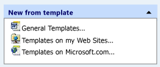

# CMFCTasksPaneTask Class
The <CodeContentPlaceHolder>13\</CodeContentPlaceHolder> class is a helper class that represents tasks for the task pane control ( [CMFCTasksPane](../vs140/cmfctaskspane-class.md)). The task object represents an item in the task group ( [CMFCTasksPaneTaskGroup](../vs140/cmfctaskspanetaskgroup-class.md)). Each task can have a command that the framework executes when a user clicks on the task and an icon that appears to the left of the task name.  
  
## Syntax  
  
<CodeContentPlaceHolder>0\</CodeContentPlaceHolder>  
## Members  
  
### Public Constructors  
  
|Name|Description|  
|----------|-----------------|  
|[CMFCTasksPaneTask::CMFCTasksPaneTask](#cmfctaskspanetask__cmfctaskspanetask)|Creates and initializes a <CodeContentPlaceHolder>14\</CodeContentPlaceHolder> object.|  
|<CodeContentPlaceHolder>15\</CodeContentPlaceHolder>|Destructor.|  
  
### Public Methods  
  
|Name|Description|  
|----------|-----------------|  
|[CMFCTasksPaneTask::SetACCData](#cmfctaskspanetask__setaccdata)|Determines the accessibility data for the current task.|  
  
### Data Members  
  
|Name|Description|  
|----------|-----------------|  
|[CMFCTasksPaneTask::m_bAutoDestroyWindow](#cmfctaskspanetask__m_bautodestroywindow)|Determines whether the task window is automatically destroyed.|  
|[CMFCTasksPaneTask::m_bIsBold;](#cmfctaskspanetask__m_bisbold)|Determines whether the framework draws a task label in bold text.|  
|[CMFCTasksPaneTask::m_dwUserData](#cmfctaskspanetask__m_dwuserdata)|Contains user-defined data that the framework associates with the task. Set to zero if the task has no associated data.|  
|[CMFCTasksPaneTask::m_hwndTask](#cmfctaskspanetask__m_hwndtask)|A handle to the task window.|  
|[CMFCTasksPaneTask::m_nIcon](#cmfctaskspanetask__m_nicon)|The index in the image list of the image that the framework displays next to the task.|  
|[CMFCTasksPaneTask::m_nWindowHeight](#cmfctaskspanetask__m_nwindowheight)|The height of the task window. If the task has no task window, this value is zero.|  
|[CMFCTasksPaneTask::m_pGroup](#cmfctaskspanetask__m_pgroup)|A pointer to the <CodeContentPlaceHolder>16\</CodeContentPlaceHolder> that this task belongs to.|  
|[CMFCTasksPaneTask::m_rect](#cmfctaskspanetask__m_rect)|Specifies the bounding rectangle of the task.|  
|[CMFCTasksPaneTask::m_strName](#cmfctaskspanetask__m_strname)|The name of the task.|  
|[CMFCTasksPaneTask::m_uiCommandID](#cmfctaskspanetask__m_uicommandid)|Specifies the command ID of the command that the framework executes when the user clicks the task. If this value is not a valid command ID, the task is treated as a simple label.|  
  
## Remarks  
 The following illustration shows a task group that contains three tasks:  
  
   
  
> [!NOTE]
>  If a task does not have a valid command ID, it is treated as a simple label.  
  
## Inheritance Hierarchy  
 [CObject](../vs140/cobject-class.md)  
  
 [CMFCTasksPaneTask](../vs140/cmfctaskspanetask-class.md)  
  
## Requirements  
 **Header:** afxTasksPane.h  
  
##  \<a name="cmfctaskspanetask__cmfctaskspanetask">\</a>  CMFCTasksPaneTask::CMFCTasksPaneTask  
 Creates and initializes a <CodeContentPlaceHolder>17\</CodeContentPlaceHolder> object.  
  
<CodeContentPlaceHolder>1\</CodeContentPlaceHolder>  
### Parameters  
 <CodeContentPlaceHolder>18\</CodeContentPlaceHolder>  
 Specifies the [CMFCTasksPaneTaskGroup](../vs140/cmfctaskspanetaskgroup-class.md) to which the task belongs.  
  
 <CodeContentPlaceHolder>19\</CodeContentPlaceHolder>  
 Specifies the name of the task.  
  
 <CodeContentPlaceHolder>20\</CodeContentPlaceHolder>  
 Specifies the index of the task's image in the image list.  
  
 <CodeContentPlaceHolder>21\</CodeContentPlaceHolder>  
 Specifies the command ID of the command that is executed when the task is clicked.  
  
 <CodeContentPlaceHolder>22\</CodeContentPlaceHolder>  
 User-defined data.  
  
 <CodeContentPlaceHolder>23\</CodeContentPlaceHolder>  
 Specifies the handle to the task window.  
  
 <CodeContentPlaceHolder>24\</CodeContentPlaceHolder>  
 If <CodeContentPlaceHolder>25\</CodeContentPlaceHolder>, the task window will be destroyed automatically.  
  
 <CodeContentPlaceHolder>26\</CodeContentPlaceHolder>  
 Specifies the height of the task window.  
  
### Remarks  
  
##  \<a name="cmfctaskspanetask__m_bautodestroywindow">\</a>  CMFCTasksPaneTask::m_bAutoDestroyWindow  
 Determines whether the task window is automatically destroyed.  
  
<CodeContentPlaceHolder>2\</CodeContentPlaceHolder>  
### Remarks  
 Set to <CodeContentPlaceHolder>27\</CodeContentPlaceHolder> to specify that the task window ( [CMFCTasksPaneTask::m_hwndTask](#cmfctaskspanetask__m_hwndtask)) should be destroyed automatically; otherwise, <CodeContentPlaceHolder>28\</CodeContentPlaceHolder>.  
  
##  \<a name="cmfctaskspanetask__m_bisbold">\</a>  CMFCTasksPaneTask::m_bIsBold  
 Determines whether a task label is drawn in bold text.  
  
<CodeContentPlaceHolder>3\</CodeContentPlaceHolder>  
### Remarks  
 Set this member to <CodeContentPlaceHolder>29\</CodeContentPlaceHolder> to display bold text for the task label.  
  
##  \<a name="cmfctaskspanetask__m_dwuserdata">\</a>  CMFCTasksPaneTask::m_dwUserData  
 Contains user-defined data that is associated with the task. Set to zero if no data is associated with the task.  
  
<CodeContentPlaceHolder>4\</CodeContentPlaceHolder>  
### Remarks  
  
##  \<a name="cmfctaskspanetask__m_hwndtask">\</a>  CMFCTasksPaneTask::m_hwndTask  
 A handle to the task window.  
  
<CodeContentPlaceHolder>5\</CodeContentPlaceHolder>  
### Remarks  
 To add a task window, call [CMFCTasksPane::AddWindow](../vs140/cmfctaskspane-class.md#cmfctaskspane__addwindow).  
  
##  \<a name="cmfctaskspanetask__m_nicon">\</a>  CMFCTasksPaneTask::m_nIcon  
 The index position in an image list that identifies an image that is displayed next to the specified task.  
  
<CodeContentPlaceHolder>6\</CodeContentPlaceHolder>  
### Remarks  
 The image list is set by [CMFCTasksPane::SetIconsList](../vs140/cmfctaskspane-class.md#cmfctaskspane__seticonslist).  
  
 Set <CodeContentPlaceHolder>30\</CodeContentPlaceHolder> to -1 if you want to display the task without an image.  
  
##  \<a name="cmfctaskspanetask__m_nwindowheight">\</a>  CMFCTasksPaneTask::m_nWindowHeight  
 The height of the task window. If the task has no task window, this value is zero.  
  
<CodeContentPlaceHolder>7\</CodeContentPlaceHolder>  
### Remarks  
  
##  \<a name="cmfctaskspanetask__m_pgroup">\</a>  CMFCTasksPaneTask::m_pGroup  
 Pointer to the [CMFCTasksPaneTaskGroup](../vs140/cmfctaskspanetaskgroup-class.md) to which this task belongs.  
  
<CodeContentPlaceHolder>8\</CodeContentPlaceHolder>  
### Remarks  
 Every task must have a parent group. You add groups to a task pane by calling [CMFCTasksPane::AddGroup](../vs140/cmfctaskspane-class.md#cmfctaskspane__addgroup).  
  
##  \<a name="cmfctaskspanetask__m_rect">\</a>  CMFCTasksPaneTask::m_rect  
 Specifies the bounding rectangle of the task.  
  
<CodeContentPlaceHolder>9\</CodeContentPlaceHolder>  
### Remarks  
 This value is calculated by the framework when the task is drawn.  
  
##  \<a name="cmfctaskspanetask__m_strname">\</a>  CMFCTasksPaneTask::m_strName  
 The name of the task.  
  
<CodeContentPlaceHolder>10\</CodeContentPlaceHolder>  
### Remarks  
  
##  \<a name="cmfctaskspanetask__m_uicommandid">\</a>  CMFCTasksPaneTask::m_uiCommandID  
 Specifies the command ID of the command that is executed when the user clicks the task. If this value is not a valid command ID, the task is treated as a simple label.  
  
<CodeContentPlaceHolder>11\</CodeContentPlaceHolder>  
### Remarks  
  
##  \<a name="cmfctaskspanetask__setaccdata">\</a>  CMFCTasksPaneTask::SetACCData  
 Determines the accessibility data for the current task.  
  
<CodeContentPlaceHolder>12\</CodeContentPlaceHolder>  
### Parameters  
 [in] <CodeContentPlaceHolder>31\</CodeContentPlaceHolder>  
 Represents the parent window of the current task.  
  
 [out] <CodeContentPlaceHolder>32\</CodeContentPlaceHolder>  
 An object of type <CodeContentPlaceHolder>33\</CodeContentPlaceHolder> that is populated with the accessibility data of the current task.  
  
### Return Value  
 <CodeContentPlaceHolder>34\</CodeContentPlaceHolder> if the <CodeContentPlaceHolder>35\</CodeContentPlaceHolder> parameter was successfully populated with the accessibility data of the current task; otherwise, <CodeContentPlaceHolder>36\</CodeContentPlaceHolder>.  
  
## See Also  
 [Hierarchy Chart](../vs140/hierarchy-chart.md)   
 [Classes](../vs140/mfc-classes.md)   
 [CObject Class](../vs140/cobject-class.md)