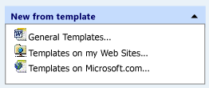

# CMFCTasksPaneTaskGroup Class
The <CodeContentPlaceHolder>10\</CodeContentPlaceHolder> class is a helper class used by the [CMFCTasksPane](../vs140/cmfctaskspane-class.md) control. Objects of type <CodeContentPlaceHolder>11\</CodeContentPlaceHolder> represent a *task group*. The task group is a list of items that the framework displays in a separate box that has a collapse button. The box can have an optional caption (group name). If a group is collapsed, the list of tasks is not visible.  
  
## Syntax  
  
<CodeContentPlaceHolder>0\</CodeContentPlaceHolder>  
## Members  
  
### Public Constructors  
  
|Name|Description|  
|----------|-----------------|  
|[CMFCTasksPaneTaskGroup::CMFCTasksPaneTaskGroup](#cmfctaskspanetaskgroup__cmfctaskspanetaskgroup)|Constructs a <CodeContentPlaceHolder>12\</CodeContentPlaceHolder> object.|  
|<CodeContentPlaceHolder>13\</CodeContentPlaceHolder>|Destructor.|  
  
### Public Methods  
  
|Name|Description|  
|----------|-----------------|  
|[CMFCTasksPaneTaskGroup::SetACCData](#cmfctaskspanetaskgroup__setaccdata)|Determines the accessibility data for the current task group.|  
  
### Data Members  
  
|Name|Description|  
|----------|-----------------|  
|[CMFCTasksPaneTaskGroup::m_bIsBottom](#cmfctaskspanetaskgroup__m_bisbottom)|Determines whether the task group is aligned to the bottom of the task pane control.|  
|[CMFCTasksPaneTaskGroup::m_bIsCollapsed](#cmfctaskspanetaskgroup__m_biscollapsed)|Determines whether the task group is collapsed.|  
|[CMFCTasksPaneTaskGroup::m_bIsSpecial](#cmfctaskspanetaskgroup__m_bisspecial)|Determines whether the task group is *special.* The framework displays special captions in a different color.|  
|[CMFCTasksPaneTaskGroup::m_lstTasks](#cmfctaskspanetaskgroup__m_lsttasks)|Contains the internal list of tasks.|  
|[CMFCTasksPaneTaskGroup::m_rect](#cmfctaskspanetaskgroup__m_rect)|Specifies the bounding rectangle of the group caption.|  
|[CMFCTasksPaneTaskGroup::m_rectGroup](#cmfctaskspanetaskgroup__m_rectgroup)|Specifies the bounding rectangle of the group.|  
|[CMFCTasksPaneTaskGroup::m_strName](#cmfctaskspanetaskgroup__m_strname)|Specifies the name of the group.|  
  
## Remarks  
 The following illustration shows an expanded task group:  
  
   
  
 The following illustration shows a collapsed task group:  
  
   
  
 The following illustration shows a task group without a caption:  
  
   
  
 The following illustration shows two task groups. The first task group is marked as special by setting the <CodeContentPlaceHolder>14\</CodeContentPlaceHolder> flag to <CodeContentPlaceHolder>15\</CodeContentPlaceHolder>, while the second task group is not special. Note how the caption for the first task group is darker than the second task group:  
  
   
  
## Inheritance Hierarchy  
 [CObject](../vs140/cobject-class.md)  
  
 [CMFCTasksPaneTaskGroup](../vs140/cmfctaskspanetaskgroup-class.md)  
  
## Requirements  
 **Header:** afxTasksPane.h  
  
##  \<a name="cmfctaskspanetaskgroup__cmfctaskspanetaskgroup">\</a>  CMFCTasksPaneTaskGroup::CMFCTasksPaneTaskGroup  
 Constructs a <CodeContentPlaceHolder>16\</CodeContentPlaceHolder> object.  
  
<CodeContentPlaceHolder>1\</CodeContentPlaceHolder>  
### Parameters  
 <CodeContentPlaceHolder>17\</CodeContentPlaceHolder>  
 Specifies the name of the group in the group caption.  
  
 <CodeContentPlaceHolder>18\</CodeContentPlaceHolder>  
 Specifies whether the group is aligned to the bottom of the task pane control.  
  
 <CodeContentPlaceHolder>19\</CodeContentPlaceHolder>  
 Specifies whether the group is designated as *special* and thus, whether the group caption is filled with a different color.  
  
 <CodeContentPlaceHolder>20\</CodeContentPlaceHolder>  
 Specifies whether the group is collapsed.  
  
 <CodeContentPlaceHolder>21\</CodeContentPlaceHolder>  
 Specifies the property page that this task group belongs to.  
  
 <CodeContentPlaceHolder>22\</CodeContentPlaceHolder>  
 Specifies the icon that displays in the group caption.  
  
### Remarks  
  
##  \<a name="cmfctaskspanetaskgroup__m_bisbottom">\</a>  CMFCTasksPaneTaskGroup::m_bIsBottom  
 Determines whether the task group is aligned to the bottom of the task pane control.  
  
<CodeContentPlaceHolder>2\</CodeContentPlaceHolder>  
### Remarks  
 Only one group can be aligned to the bottom of the task pane control. This task group must be added last. For more information, see [CMFCTasksPane::AddGroup](../vs140/cmfctaskspane-class.md#cmfctaskspane__addgroup).  
  
##  \<a name="cmfctaskspanetaskgroup__m_biscollapsed">\</a>  CMFCTasksPaneTaskGroup::m_bIsCollapsed  
 Determines whether the task group is collapsed.  
  
<CodeContentPlaceHolder>3\</CodeContentPlaceHolder>  
### Remarks  
 You can enable or disable the ability to collapse groups on the task pane by calling [CMFCTasksPane::EnableGroupCollapse](../vs140/cmfctaskspane-class.md#cmfctaskspane__enablegroupcollapse).  
  
##  \<a name="cmfctaskspanetaskgroup__m_bisspecial">\</a>  CMFCTasksPaneTaskGroup::m_bIsSpecial  
 Determines whether the task group is *special* and whether the caption for a special task group should be identified by a different color.  
  
<CodeContentPlaceHolder>4\</CodeContentPlaceHolder>  
### Remarks  
 If your application is using the Windows XP visual theme and <CodeContentPlaceHolder>23\</CodeContentPlaceHolder> is <CodeContentPlaceHolder>24\</CodeContentPlaceHolder>, the framework calls <CodeContentPlaceHolder>25\</CodeContentPlaceHolder> with the <CodeContentPlaceHolder>26\</CodeContentPlaceHolder> flag. If <CodeContentPlaceHolder>27\</CodeContentPlaceHolder> is <CodeContentPlaceHolder>28\</CodeContentPlaceHolder>, the framework calls <CodeContentPlaceHolder>29\</CodeContentPlaceHolder> with the <CodeContentPlaceHolder>30\</CodeContentPlaceHolder> flag.  
  
##  \<a name="cmfctaskspanetaskgroup__m_lsttasks">\</a>  CMFCTasksPaneTaskGroup::m_lstTasks  
 Contains the internal list of tasks.  
  
<CodeContentPlaceHolder>5\</CodeContentPlaceHolder>  
### Remarks  
 To fill this list, call [CMFCTasksPane::AddTask](../vs140/cmfctaskspane-class.md#cmfctaskspane__addtask).  
  
##  \<a name="cmfctaskspanetaskgroup__m_rect">\</a>  CMFCTasksPaneTaskGroup::m_rect  
 Specifies the bounding rectangle of the group caption.  
  
<CodeContentPlaceHolder>6\</CodeContentPlaceHolder>  
### Remarks  
 This value is automatically calculated by the framework.  
  
##  \<a name="cmfctaskspanetaskgroup__m_rectgroup">\</a>  CMFCTasksPaneTaskGroup::m_rectGroup  
 Specifies the bounding rectangle of the group.  
  
<CodeContentPlaceHolder>7\</CodeContentPlaceHolder>  
### Remarks  
 This value is calculated automatically by the framework.  
  
##  \<a name="cmfctaskspanetaskgroup__m_strname">\</a>  CMFCTasksPaneTaskGroup::m_strName  
 Specifies the name of the group.  
  
<CodeContentPlaceHolder>8\</CodeContentPlaceHolder>  
### Remarks  
 If this value is empty, the group caption is not displayed and the group cannot be collapsed.  
  
##  \<a name="cmfctaskspanetaskgroup__setaccdata">\</a>  CMFCTasksPaneTaskGroup::SetACCData  
 Determines the accessibility data for the current task group.  
  
<CodeContentPlaceHolder>9\</CodeContentPlaceHolder>  
### Parameters  
 [in] <CodeContentPlaceHolder>31\</CodeContentPlaceHolder>  
 Represents the parent window of the current task group.  
  
 [out] <CodeContentPlaceHolder>32\</CodeContentPlaceHolder>  
 An object of type <CodeContentPlaceHolder>33\</CodeContentPlaceHolder> that is populated with the accessibility data of the current task group.  
  
### Return Value  
 <CodeContentPlaceHolder>34\</CodeContentPlaceHolder> if the <CodeContentPlaceHolder>35\</CodeContentPlaceHolder> parameter was successfully populated with the accessibility data of the current task group; otherwise, <CodeContentPlaceHolder>36\</CodeContentPlaceHolder>.  
  
## See Also  
 [Hierarchy Chart](../vs140/hierarchy-chart.md)   
 [Classes](../vs140/mfc-classes.md)   
 [CMFCTasksPane Class](../vs140/cmfctaskspane-class.md)   
 [CMFCTasksPaneTask Class](../vs140/cmfctaskspanetask-class.md)   
 [CMFCOutlookBar](../vs140/cmfcoutlookbar-class.md)   
 [CObject Class](../vs140/cobject-class.md)