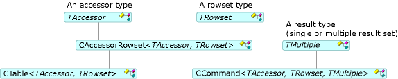

# Commands and Tables
Commands and tables allow you to access rowsets; that is, open rowsets, execute commands, and bind columns. The [CCommand](../vs140/ccommand-class.md) and [CTable](../vs140/ctable-class.md) classes instantiate the command and table objects, respectively. These classes derive from [CAccessorRowset](../vs140/caccessorrowset-class.md) as shown in the following figure.  
  
   
Command and Table Classes  
  
 In the previous table, <CodeContentPlaceHolder>0\</CodeContentPlaceHolder> can be any accessor type listed in [Accessor Types](../vs140/accessors-and-rowsets.md). *TRowset* can be any rowset type listed in [Rowset Types](../vs140/accessors-and-rowsets.md). *TMultiple* specifies the result type (a single or multiple result set).  
  
 The [ATL OLE DB Consumer Wizard](../vs140/atl-ole-db-consumer-wizard.md) lets you specify whether you want a command or table object.  
  
-   For data sources without commands, you can use the <CodeContentPlaceHolder>1\</CodeContentPlaceHolder> class. You generally use it for simple rowsets that specify no parameters and require no multiple results. This simple class opens a table on a data source using a table name that you specify.  
  
-   For data sources that support commands, you can use the <CodeContentPlaceHolder>2\</CodeContentPlaceHolder> class instead. To execute a command, call [Open](../vs140/ccommand--open.md) on this class. As an alternative, you can call <CodeContentPlaceHolder>3\</CodeContentPlaceHolder> to prepare a command that you want to execute more than once.  
  
     **CCommand** has three template arguments: an accessor type, a rowset type, and a result type (<CodeContentPlaceHolder>4\</CodeContentPlaceHolder>, by default, or <CodeContentPlaceHolder>5\</CodeContentPlaceHolder>). If you specify <CodeContentPlaceHolder>6\</CodeContentPlaceHolder>, the <CodeContentPlaceHolder>7\</CodeContentPlaceHolder> class supports the **IMultipleResults** interface and handles multiple rowsets. The [DBVIEWER](assetId:///07620f99-c347-4d09-9ebc-2459e8049832) sample shows how to handle the multiple results.  
  
## See Also  
 [OLE DB Consumer Templates](../vs140/ole-db-consumer-templates--c---.md)