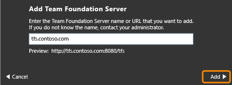
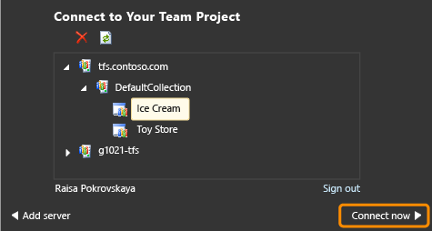
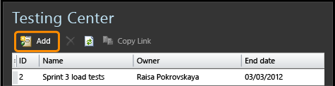
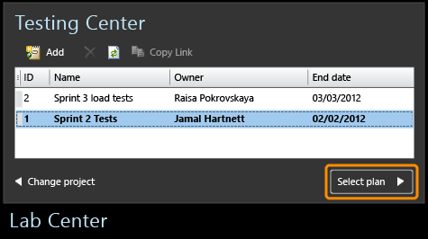

# Connect Microsoft Test Manager to your team project and test plan
Use Microsoft Test Manager (MTM) to help you test the application you built. MTM stores your test plans and results on Team Foundation Server (TFS).  
  
### Connect Microsoft Test Manager to your Team Project and Test Plan  
  
1.  If you don’t have MTM, download and install [Microsoft Visual Studio Test Professional](http://www.microsoft.com/visualstudio/eng/downloads).  
  
     Don’t have a team project? [Set up a team project](assetId:///2fee2b45-55f1-4b7c-ab10-8be80eb283f1)  
  
2.  Connect to TFS and choose your team project.  
  
       
  
       
  
3.  Create a new test plan, unless there’s already a plan you want to use. Typically, you create a separate test plan for each sprint.  
  
       
  
4.  Select a plan.  
  
       
  
 If you want to connect to a different team project or test plan later, choose **Home**.   
  
 Signed in with the wrong user name? Choose **Home**, **Change project**, **Sign out**.  
  
## Try this next  
 [Exploratory testing](../vs140/exploratory-testing-using-microsoft-test-manager.md)  
  
 [Plan Manual Tests](../vs140/plan-manual-tests-with-microsoft-test-manager.md)