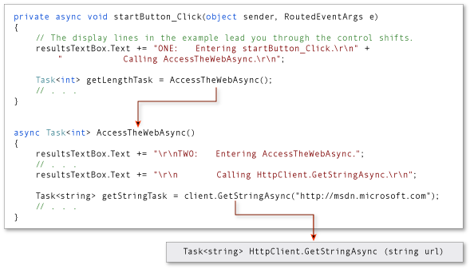

# Control Flow in Async Programs (Visual Basic)
You can write and maintain asynchronous programs more easily by using the <CodeContentPlaceHolder>14\</CodeContentPlaceHolder> and <CodeContentPlaceHolder>15\</CodeContentPlaceHolder> keywords. However, the results might surprise you if you don't understand how your program operates. This topic traces the flow of control through a simple async program to show you when control moves from one method to another and what information is transferred each time.  
  
> [!NOTE]
>  The <CodeContentPlaceHolder>16\</CodeContentPlaceHolder> and <CodeContentPlaceHolder>17\</CodeContentPlaceHolder> keywords were introduced in Visual Studio 2012.  
  
 In general, you mark methods that contain asynchronous code with the [Async (Visual Basic)](../vs140/async--visual-basic-.md) modifier. In a method that's marked with an async modifier, you can use an [Await (Visual Basic)](../vs140/await-operator--visual-basic-.md) operator to specify where the method pauses to wait for a called asynchronous process to complete. For more information, see [Asynchronous Programming with Async and Await (Visual Basic)](../vs140/asynchronous-programming-with-async-and-await--visual-basic-.md).  
  
 The following example uses async methods to download the contents of a specified website as a string and to display the length of the string. The example contains the following two methods.  
  
-   <CodeContentPlaceHolder>18\</CodeContentPlaceHolder>, which calls <CodeContentPlaceHolder>19\</CodeContentPlaceHolder> and displays the result.  
  
-   <CodeContentPlaceHolder>20\</CodeContentPlaceHolder>, which downloads the contents of a website as a string and returns the length of the string. <CodeContentPlaceHolder>21\</CodeContentPlaceHolder> uses an asynchronous \<xref:System.Net.Http.HttpClient*> method, \<xref:System.Net.Http.HttpClient.GetStringAsync(System.String)>, to download the contents.  
  
 Numbered display lines appear at strategic points throughout the program to help you understand how the program runs and to explain what happens at each point that is marked. The display lines are labeled "ONE" through "SIX." The labels represent the order in which the program reaches these lines of code.  
  
 The following code shows an outline of the program.  
  
<CodeContentPlaceHolder>0\</CodeContentPlaceHolder>  
 Each of the labeled locations, "ONE" through "SIX," displays information about the current state of the program. The following output is produced.  
  
<CodeContentPlaceHolder>1\</CodeContentPlaceHolder>  
## Set Up the Program  
 You can download the code that this topic uses from MSDN, or you can build it yourself.  
  
> [!NOTE]
>  To run the example, you must have Visual Studio 2012 or newer and  the .NET Framework 4.5 or newer installed on your computer.  
  
### Download the Program  
 You can download the application for this topic from [Async Sample: Control Flow in Async Programs](http://go.microsoft.com/fwlink/?LinkId=255285). The following steps open and run the program.  
  
1.  Unzip the downloaded file, and then start Visual Studio.  
  
2.  On the menu bar, choose **File**, **Open**, **Project/Solution**.  
  
3.  Navigate to the folder that holds the unzipped sample code, open the solution (.sln) file, and then choose the F5 key to build and run the project.  
  
### Build the Program Yourself  
 The following Windows Presentation Foundation (WPF) project contains the code example for this topic.  
  
 To run the project, perform the following steps:  
  
1.  Start Visual Studio.  
  
2.  On the menu bar, choose **File**, **New**, **Project**.  
  
     The **New Project** dialog box opens.  
  
3.  In the **Installed Templates** pane, choose **Visual Basic**, and then choose **WPF Application** from the list of project types.  
  
4.  Enter <CodeContentPlaceHolder>22\</CodeContentPlaceHolder> as the name of the project, and then choose the **OK** button.  
  
     The new project appears in **Solution Explorer**.  
  
5.  In the Visual Studio Code Editor, choose the **MainWindow.xaml** tab.  
  
     If the tab isn’t visible, open the shortcut menu for MainWindow.xaml in **Solution Explorer**, and then choose **View Code**.  
  
6.  In the **XAML** view of MainWindow.xaml, replace the code with the following code.  
  
<CodeContentPlaceHolder>2\</CodeContentPlaceHolder>  
     A simple window that contains a text box and a button appears in the **Design** view of MainWindow.xaml.  
  
7.  Add a reference for \<xref:System.Net.Http*>.  
  
8.  In **Solution Explorer**, open the shortcut menu for MainWindow.xaml.vb, and then choose **View Code**.  
  
9. In MainWindow.xaml.vb , replace the code with the following code.  
  
<CodeContentPlaceHolder>3\</CodeContentPlaceHolder>  
10. Choose the F5 key to run the program, and then choose the **Start** button.  
  
     The following output should appear.  
  
<CodeContentPlaceHolder>4\</CodeContentPlaceHolder>  
## Trace the Program  
  
### Steps ONE and TWO  
 The first two display lines trace the path as <CodeContentPlaceHolder>23\</CodeContentPlaceHolder> calls <CodeContentPlaceHolder>24\</CodeContentPlaceHolder>, and <CodeContentPlaceHolder>25\</CodeContentPlaceHolder> calls the asynchronous \<xref:System.Net.Http.HttpClient*> method \<xref:System.Net.Http.HttpClient.GetStringAsync(System.String)>. The following image outlines the calls from method to method.  
  
   
  
 The return type of both <CodeContentPlaceHolder>26\</CodeContentPlaceHolder> and <CodeContentPlaceHolder>27\</CodeContentPlaceHolder> is <xref:System.Threading.Tasks.Task<CodeContentPlaceHolder>28\</CodeContentPlaceHolder>AccessTheWebAsync<CodeContentPlaceHolder>29\</CodeContentPlaceHolder>GetStringAsync<CodeContentPlaceHolder>30\</CodeContentPlaceHolder>Await<CodeContentPlaceHolder>31\</CodeContentPlaceHolder>AccessTheWebAsync<CodeContentPlaceHolder>32\</CodeContentPlaceHolder>client.GetStringAsync<CodeContentPlaceHolder>33\</CodeContentPlaceHolder>AccessTheWebAsync<CodeContentPlaceHolder>34\</CodeContentPlaceHolder>client.GetStringAsync<CodeContentPlaceHolder>35\</CodeContentPlaceHolder>client.GetStringAsync<CodeContentPlaceHolder>36\</CodeContentPlaceHolder>getStringTask<CodeContentPlaceHolder>37\</CodeContentPlaceHolder>AccessTheWebAsync<CodeContentPlaceHolder>38\</CodeContentPlaceHolder>client.GetStringAsync<CodeContentPlaceHolder>39\</CodeContentPlaceHolder>client.GetStringAsync<CodeContentPlaceHolder>40\</CodeContentPlaceHolder>AccessTheWebAsync<CodeContentPlaceHolder>41\</CodeContentPlaceHolder>client.GetStringAsync<CodeContentPlaceHolder>42\</CodeContentPlaceHolder>client.GetStringAsync<CodeContentPlaceHolder>43\</CodeContentPlaceHolder>AccessTheWebAsync<CodeContentPlaceHolder>44\</CodeContentPlaceHolder>getStringTask<CodeContentPlaceHolder>45\</CodeContentPlaceHolder>client.GetStringAsync<CodeContentPlaceHolder>46\</CodeContentPlaceHolder>getStringTask<CodeContentPlaceHolder>47\</CodeContentPlaceHolder>getStringTask<CodeContentPlaceHolder>48\</CodeContentPlaceHolder>AccessTheWebAsync<CodeContentPlaceHolder>49\</CodeContentPlaceHolder>client.GetStringAsync<CodeContentPlaceHolder>50\</CodeContentPlaceHolder>AccessTheWebAsync<CodeContentPlaceHolder>51\</CodeContentPlaceHolder>startButton_Click<CodeContentPlaceHolder>52\</CodeContentPlaceHolder>getStringTask<CodeContentPlaceHolder>53\</CodeContentPlaceHolder>Dim urlContents As String = Await client.GetStringAsync("http://msdn.microsoft.com")<CodeContentPlaceHolder>54\</CodeContentPlaceHolder>AccessTheWebAsync<CodeContentPlaceHolder>55\</CodeContentPlaceHolder>Task(Of Integer)<CodeContentPlaceHolder>56\</CodeContentPlaceHolder>AccessTheWebAsync<CodeContentPlaceHolder>57\</CodeContentPlaceHolder>startButton_Click<CodeContentPlaceHolder>58\</CodeContentPlaceHolder>getStringTask<CodeContentPlaceHolder>59\</CodeContentPlaceHolder>AccessTheWebAsync<CodeContentPlaceHolder>60\</CodeContentPlaceHolder>AccessTheWebAsync<CodeContentPlaceHolder>61\</CodeContentPlaceHolder>getLengthTask<CodeContentPlaceHolder>62\</CodeContentPlaceHolder>AccessTheWebAsync<CodeContentPlaceHolder>63\</CodeContentPlaceHolder>startButton_Click<CodeContentPlaceHolder>64\</CodeContentPlaceHolder>getLengthTask<CodeContentPlaceHolder>65\</CodeContentPlaceHolder>startButton_Click<CodeContentPlaceHolder>66\</CodeContentPlaceHolder>getLengthTask<CodeContentPlaceHolder>67\</CodeContentPlaceHolder>startButton_Click<CodeContentPlaceHolder>68\</CodeContentPlaceHolder>AccessTheWebAsync<CodeContentPlaceHolder>69\</CodeContentPlaceHolder>AccessTheWebAsync<CodeContentPlaceHolder>70\</CodeContentPlaceHolder>getLengthTask<CodeContentPlaceHolder>71\</CodeContentPlaceHolder>startButton_Click<CodeContentPlaceHolder>72\</CodeContentPlaceHolder>getLengthTask<CodeContentPlaceHolder>73\</CodeContentPlaceHolder>client.GetStringAsync<CodeContentPlaceHolder>74\</CodeContentPlaceHolder>AccessTheWebAsync<CodeContentPlaceHolder>75\</CodeContentPlaceHolder>urlContents.Length<CodeContentPlaceHolder>76\</CodeContentPlaceHolder>AccessTheWebAsync<CodeContentPlaceHolder>77\</CodeContentPlaceHolder>getLengthTask<CodeContentPlaceHolder>78\</CodeContentPlaceHolder>startButton_Click<CodeContentPlaceHolder>79\</CodeContentPlaceHolder>client.GetStringAsync<CodeContentPlaceHolder>80\</CodeContentPlaceHolder>getStringTask<CodeContentPlaceHolder>81\</CodeContentPlaceHolder>AccessTheWebAsync<CodeContentPlaceHolder>82\</CodeContentPlaceHolder>startButton_Click<CodeContentPlaceHolder>83\</CodeContentPlaceHolder>AccessTheWebAsync<CodeContentPlaceHolder>84\</CodeContentPlaceHolder>startButton_Async<CodeContentPlaceHolder>85\</CodeContentPlaceHolder>startButton_Async<CodeContentPlaceHolder>86\</CodeContentPlaceHolder>getLengthTask<CodeContentPlaceHolder>87\</CodeContentPlaceHolder>AccessTheWebAsync<CodeContentPlaceHolder>88\</CodeContentPlaceHolder>contentLength<CodeContentPlaceHolder>89\</CodeContentPlaceHolder>AccessTheWebAsync<CodeContentPlaceHolder>90\</CodeContentPlaceHolder>startButton_Click`.  
  
   
  
## See Also  
 [Asynchronous Programming with Async and Await (Visual Basic)](../vs140/asynchronous-programming-with-async-and-await--visual-basic-.md)   
 [Async Return Types (Visual Basic)](../vs140/async-return-types--visual-basic-.md)   
 [Walkthrough: Accessing the Web by Using Async and Await (Visual Basic)](../vs140/walkthrough--accessing-the-web-by-using-async-and-await--visual-basic-.md)   
 [Async Sample: Control Flow in Async Programs (C# and Visual Basic)](http://go.microsoft.com/fwlink/?LinkId=255285)