# Cordova Sample App with O365 Outlook Services and Ionic
In this tutorial, you’ll learn how to create a mail, calendar and contact client using O365 Outlook services and the Ionic framework. This app allows users to access their mail, calendar and contact through O365 Outlook services API. This sample uses JavaScript code, but you can also write your Cordova app in TypeScript.  
  
 In this tutorial, you’ll follow these steps:  
  
1.  [Create a project](#Create)  
  
2.  [Add the Ionic Framework to your project](#Ionic)  
  
3.  [Add NProgress to your project](#NProgress)  
  
4.  [Add O365 services to your app](#O365)  
  
5.  [Set permissions](#Permissions) to O365 mail, calendar and contact tenet to grant appropriate access to your app  
  
6.  [Create the app folder structure](#FolderStructure), UI routing, and layout using Ionic controls  
  
7.  [Acquire an access token](#AccessToken) and get the Outlook services client using AngularJS factory  
  
8.  [Use O365 API to fetch Outlook service data](#OutlookServices):  
  
    -   For the Mail app, mails flagged as important, unread mails and All mails  
  
    -   For the Calendar app, today's meeting (event start date equals today), tomorrow's meeting (event start date equals tomorrow) and all events with start date greater or equal to today  
  
    -   For the Contacts app, all contacts  
  
9. [Use O365 API to create and delete data](#Delete):  
  
    -   Delete mail, calendar event  
  
    -   Create new calendar event, contact  
  
10. [Run the app](#Run)  
  
 The following screenshot shows the running Calendar app when completed.  
  
 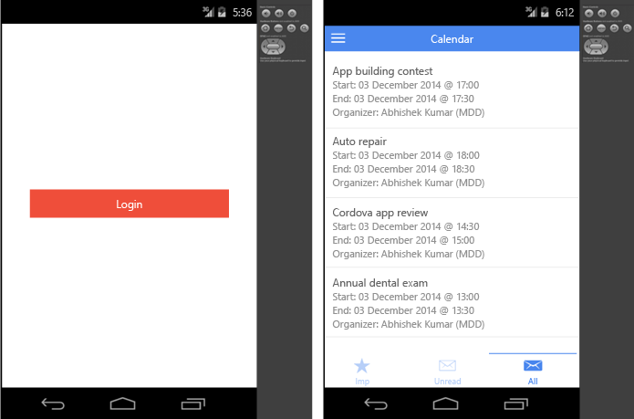  
  
 The following screenshot shows the running Mail app when completed.  
  
   
  
 The following screenshot shows the running Contacts app when completed.  
  
 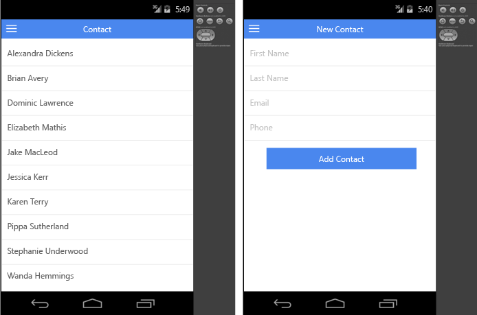  
  
## Prerequisites  
 Before you can create a new project, make sure that you’ve met all system requirements and installed the Visual Studio Tools for Apache Cordova extension for Visual Studio. For more information, see [Install Visual Studio Tools for Apache Cordova](../vs140/install-visual-studio-tools-for-apache-cordova.md)  
  
##  \<a name="Create">\</a> Create a project  
 Create a new Cordova project in Visual Studio by choosing **File**, **New Project**, **JavaScript**, **Apache Cordova Apps**, and then **Blank App** template.  
  
##  \<a name="Ionic">\</a> Add the Ionic Framework to your project  
  
#### To add the Ionic Framework  
  
1.  From the Ionic framework [website](http://ionicframework.com/), choose **Download beta**.  
  
2.  Extract the zip file.  
  
3.  Create a new folder named lib under your Cordova project in Solution Explorer in Visual Studio, and then copy the extracted content under lib folder.  
  
     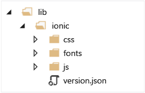  
  
4.  Update the script references.  
  
     In index.html, add the following Ionic references in the \<head> element, after the Cordova and platformOverrides script references.  
  
<CodeContentPlaceHolder>0\</CodeContentPlaceHolder>  
     In index.html, add following ionic CSS reference.  
  
<CodeContentPlaceHolder>1\</CodeContentPlaceHolder>  
##  \<a name="NProgress">\</a> Add NProgress to your project  
 NProgress will be used to show a progress bar while fetching mail, calendar and contacts from O365.  
  
#### To add Nprogress to your project  
  
1.  From the NProgress [website](http://ricostacruz.com/nprogress/), choose **Download**.  
  
2.  Extract the zip file.  
  
3.  Create a folder named nprogress under the lib folder in Solution Explorer and copy nprogress.js into the folder.  
  
     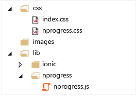  
  
4.  Copy nprogress.css under the css folder  
  
5.  In index.html, add the following NProgress references in the \<head> element.  
  
<CodeContentPlaceHolder>2\</CodeContentPlaceHolder>  
##  \<a name="O365">\</a> Add O365 services to your app  
 Sign up for an Office 365 Developer Site and set up Azure Active Directory access for your Developer Site by following instructions at [Setup your Office 365 development environment](https://msdn.microsoft.com/office/office365/howto/setup-development-environment).  
  
 Once you have set up your Developer Site, follow these steps to add and configure Office 365 APIs using the Services Manager in Visual Studio.  
  
#### To add and configure Office 365 APIs  
  
1.  Download and install the [Office 365 API tools](https://visualstudiogallery.msdn.microsoft.com/a15b85e6-69a7-4fdf-adda-a38066bb5155) from the Visual Studio Gallery.  
  
2.  From the shortcut menu of the project node, choose **Add**, and then choose **Connected Service**.  
  
3.  At the top of the Services Manager dialog box, choose the Office 365 link, and then choose Register your app.  
  
     Sign in with a tenant administrator account for your Office 365 developer organization.  
  
     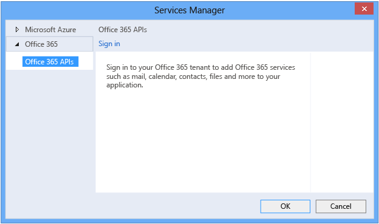  
  
##  \<a name="Permissions">\</a> Set permissions for O365 mail, calendar and contact tenet to grant appropriate access to app  
 After you sign in to O365 account you will see a list of O365 services like mail, calendar, contacts, and files under your tenant account. Select the service that you want to use in your app and set the permission you want your app to access, as specified below for each app.  
  
### Mail app  
 Select **Mail** and click the **Permissions...** link in the right pane. Then choose to read and write to user's mail because the app will need to perform read and delete mail operations. Similarly, if you want the app to send mail, then select mail as a user option.  
  
 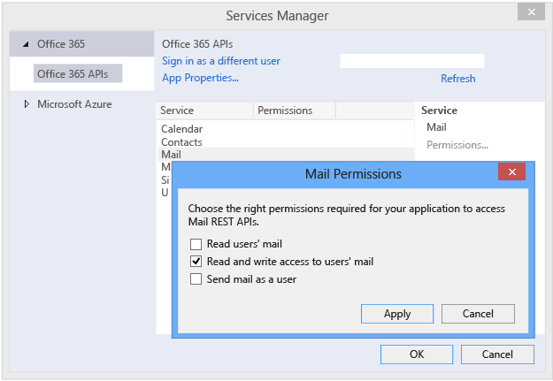  
  
### Calendar app  
 Select **Calendar** and click the **Permissions...** link in the right pane, and then select **have full access to users' calendar**. Similarly, if you want to give only read access to the app, then select **Read users' calendar**.  
  
 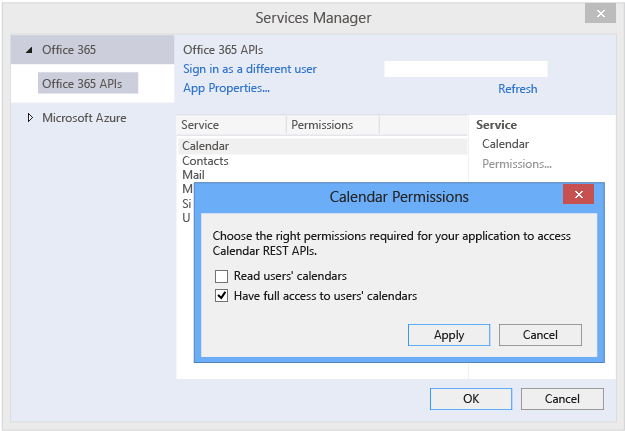  
  
### Contact app  
 Select **Contact** and click the **Permissions...** link in the right pane, and then select **have full access to users' contact**. Similarly, if you want to give only read access to app, select **Read users' contact**.  
  
 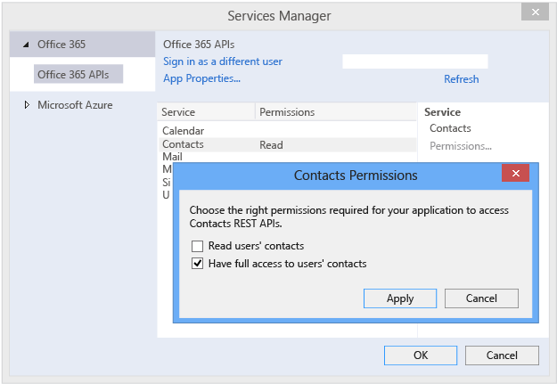  
  
### Apply changes and update references  
  
##### To apply changes and update references  
  
1.  Click **Apply** and **Ok** to set the permissions and add the O365 API to your project.  
  
     Services Manager adds the services folder to your project.  
  
     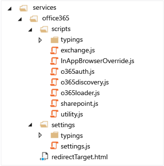  
  
2.  In index.html, add the following O365 references in the \<head> element.  
  
<CodeContentPlaceHolder>3\</CodeContentPlaceHolder>  
##  \<a name="FolderStructure">\</a> Create app folder structure, UI routing and layout using Ionic controls and navigation  
 Follow these steps to structure the app UI and the JavaScript code.  
  
 Create a folder named **app** under project root node. The app folder will contain files specific to the app. Each UI component that fetches and binds data to the UI will have a corresponding controller (following the UI with code behind pattern). For example, mail-list.html will show a list control to display user's mails, and mail-list-ctrl.js will contain code to fetch user's mail using the O365 API.  
  
 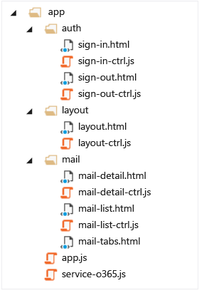  
  
 Here are some details about the folders and files in the project.  
  
-   The **auth** folder contains UI and code for signing-in and sign-out.  
  
-   The **layout** folder contains UI to display app content and navigation like ion-pane, ion-side-menus, ion-nav-bar and code to bind the user name.  
  
-   app.js contains UI routing to navigate to different pages.  
  
-   service-o365.js contains utility functions to get the access token, create the Outlook services client object, signout, and get the user name. This is implemented as an AngularJS factory so that these functions can be exposed as utility function across different pages.  
  
 Use AngularJS routing to navigate to different pages. For example, here is the routing for the Mail app.  
  
<CodeContentPlaceHolder>4\</CodeContentPlaceHolder>  
 For app layout (menu, nav-bar), use the Ionic side-menu and pane.  
  
<CodeContentPlaceHolder>5\</CodeContentPlaceHolder>  
 Use the Ionic tab to show different content in separate tabs. For example, use the Ionic controls below to create a mail tab page to show important mails, unread mails, and all mails under different tabs.  
  
<CodeContentPlaceHolder>6\</CodeContentPlaceHolder>  
 The following illustration shows the mail tab page.  
  
 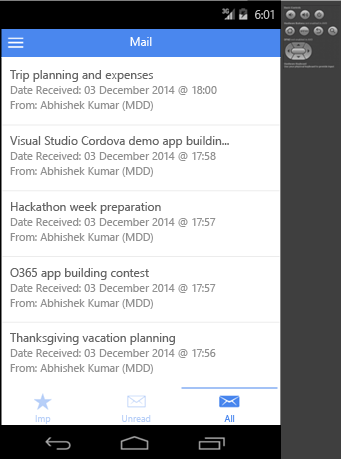  
  
##  \<a name="AccessToken">\</a> Acquire an access token and get the Outlook services client using AngularJS factory  
 Create an AngularJS factory to expose the O365 API to acquire an access token, create the Outlook services client, logout, and to perform other utility functions that are used by different controllers in the app.  
  
 Here is the code to acquire an access token.  
  
<CodeContentPlaceHolder>7\</CodeContentPlaceHolder>  
 Here is the code to create an Outlook services client object.  
  
<CodeContentPlaceHolder>8\</CodeContentPlaceHolder>  
 Here is the complete AngularJS factory code to expose the O365 API.  
  
<CodeContentPlaceHolder>9\</CodeContentPlaceHolder>  
##  \<a name="OutlookServices">\</a> Use Outlook client object to access O365 services like mail, calendar and contact  
 You can use the Outlook client object to perform read and write operations on mail, calendar and contacts.  
  
### Use Outlook client object to read mail, calendar and contacts  
 The following code reads all mail flagged as important.  
  
<CodeContentPlaceHolder>10\</CodeContentPlaceHolder>  
 The following code reads all the events with a start date equal to today.  
  
<CodeContentPlaceHolder>11\</CodeContentPlaceHolder>  
 The following code reads all contacts.  
  
<CodeContentPlaceHolder>12\</CodeContentPlaceHolder>  
###  \<a name="Delete">\</a> Use Outlook client object to delete mail and calendar event  
 The Outlook client object can be used to delete mail. To delete mail, get the mail that you want to delete using mail ID and then call <CodeContentPlaceHolder>17\</CodeContentPlaceHolder> on the mail object to delete the particular mail.  
  
> [!NOTE]
>  <CodeContentPlaceHolder>18\</CodeContentPlaceHolder> permanently deletes the mail. To move the mail to Deleted Items, use <CodeContentPlaceHolder>19\</CodeContentPlaceHolder> instead.  
  
 Here is the code to delete mail.  
  
<CodeContentPlaceHolder>13\</CodeContentPlaceHolder>  
 Here is the code to delete an event.  
  
<CodeContentPlaceHolder>14\</CodeContentPlaceHolder>  
### Use Outlook client object to create new contact and calendar event  
 The Outlook client object can be used to create new contacts, calendar event, and to send mail.  
  
 Here is the code to add a new calendar event.  
  
<CodeContentPlaceHolder>15\</CodeContentPlaceHolder>  
 Here is the code to add a new contact.  
  
<CodeContentPlaceHolder>16\</CodeContentPlaceHolder>  
##  \<a name="Run">\</a> Run the app  
 Select **Android** as the target OS and deploy either to the Android Emulator or to an Android device.  
  
> [!NOTE]
>  Ripple is not currently supported for O365 authentication.  
  
 Press F5 to run the app.  
  
 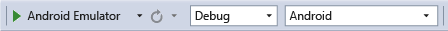  
  
 For more details on running the Cordova app across different platforms, see [Deploy and Run Your App Built with Visual Studio Tools for Apache Cordova](https://msdn.microsoft.com/library/dn757049.aspx).  
  
## Give it a try  
 The complete application is available on [Github](https://github.com/OfficeDev). Please download and try the sample apps and let us know what you think. We would like to hear your opinions about the new O365 APIs and the Cordova tooling support in Visual Studio!  
  
|App|Description|  
|---------|-----------------|  
|[Cordova calendar app](https://github.com/OfficeDev/Cordova-Calendar-App-Code-Sample)|Sample Cordova app created using Ionic that demonstrates the use of O365 Calendar API to read, filter, delete, and add events. It categorizes the events in three groups: (1) today’s event, (2) tomorrow’s event and (3) all events with start date >= today.|  
|[Cordova mail app](https://github.com/OfficeDev/Cordova-Mail-App-Code-Sample)|Sample Cordova app created using Ionic that demonstrates the use of O365 Mail API to read, filter, and delete mail. It categorizes the user mails in three groups: (1) important, (2) unread, and (3) all mails.|  
|[Cordova contact app](https://github.com/OfficeDev/Cordova-Contact-App-Code-Sample)|Sample Cordova app created using Ionic that demonstrates the use of O365 Contact API to read and add contacts.|  
  
  [Get the Visual Studio Tools for Apache Cordova](http://aka.ms/mchm38) or [learn more](https://www.visualstudio.com/cordova-vs.aspx)