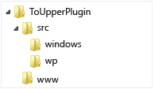
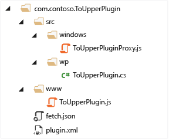
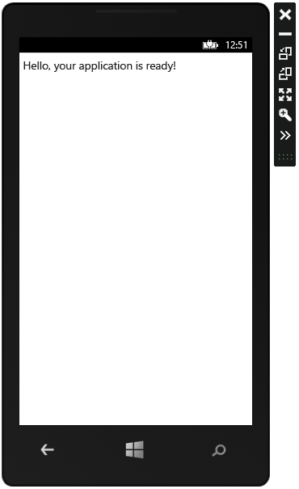
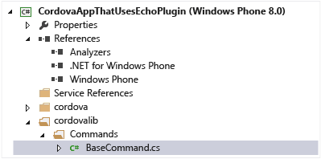
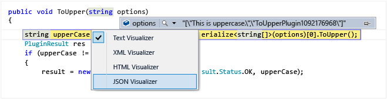
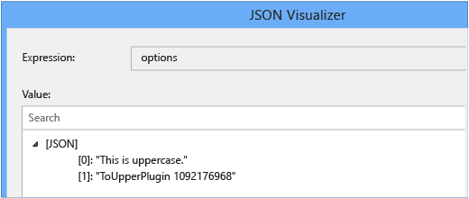

# Create a Cordova plugin for Windows and Windows Phone
[!INCLUDE[cordova_header](../vs140/includes/cordova_header_md.md)]  
  
 A Cordova plugin is a cross-platform library that accesses native code and device capabilities through a JavaScript interface. When required, the plugin also updates the platform manifest to enable device capabilities. In this tutorial, you will create a Cordova plugin for Windows Phone, <CodeContentPlaceHolder>18\</CodeContentPlaceHolder>, add it to a Cordova app, and call the plugin method from the app. The plugin has one method, <CodeContentPlaceHolder>19\</CodeContentPlaceHolder>, that converts a string to uppercase. The plugin supports both Windows Phone 8 and Windows Phone (Universal). The Windows Phone 8 plugin uses C# and the Windows Phone (Universal) plugin uses JavaScript.  
  
 The tutorial assumes you have some familiarity with Cordova plugins. For an introduction to plugins, see [Manage Plugins for Apps Built with Visual Studio Tools for Apache Cordova](../vs140/manage-plugins-for-apps-built-with-visual-studio-tools-for-apache-cordova.md) and [Apache Cordova Overview](http://cordova.apache.org/docs/en/4.0.0/guide_overview_index.md.html#Overview).  
  
 The early sections of the tutorial take you straight through the process with little detail. The later sections explain the code in more detail and will help you create, configure, debug, and deploy your own plugins.  
  
 The [Windows Phone Plugin Generator](http://download.microsoft.com/download/5/B/4/5B433693-63A4-4509-A6F5-17A892A7D59E/PluginSourceAndApp.zip) download includes the code for this tutorial and an app that generates a simple plugin.  
  
-   [Create the Cordova plugin](#CreateCordova)  
  
-   [Add the plugin to the Cordova project](#AddPlugin)  
  
-   [Call the plugin from your app](#CallPlugin)  
  
-   [Run the app with your plugin](#RunTheApp)  
  
-   [Creating a plugin method for Windows Phone 8](#CreatingMethod)  
  
-   [Creating a plugin method for Windows Phone 8 (Universal)](#CreatingUniversal)  
  
-   [Configuring the plugin.xml file](#ConfiguringXML)  
  
-   [Creating the JavaScript plugin interface file](#CreatingInterface)  
  
-   [Calling plugin methods from your app](#CallingPlugins)  
  
-   [How to remove a local plugin from your app](#RemovePlugin)  
  
-   [Developing and debugging the plugin code](#DebugPlugin)  
  
-   [Troubleshooting](#Troubleshooting)  
  
-   [Next steps](#NextSteps)  
  
##  \<a name="CreateCordova">\</a> Create the Cordova plugin  
 The <CodeContentPlaceHolder>20\</CodeContentPlaceHolder> plugin needs four files.  
  
-   A native C# file that contains the plugin methods for Windows Phone 8.  
  
-   A native JavaScript file that contains the plugin methods for Windows Phone (Universal).  
  
-   A JavaScript file that calls <CodeContentPlaceHolder>21\</CodeContentPlaceHolder>. This file is the bridge between the JavaScript code in your app and the native code in your plugin.  
  
-   An XML file that describes your plugin, defines the supported platforms, and specifies the locations of the C# file and the JavaScript file.  
  
### Create folders  
 You start by creating the following folder and file structure. While this is not the only folder structure you can use, it is the structure that many plugins follow. The folder structure looks like this:  
  
   
  
1.  Create a root folder for your plugin and name it <CodeContentPlaceHolder>22\</CodeContentPlaceHolder>.  
  
2.  In the <CodeContentPlaceHolder>23\</CodeContentPlaceHolder> folder, create a folder named <CodeContentPlaceHolder>24\</CodeContentPlaceHolder>.  
  
3.  In the <CodeContentPlaceHolder>25\</CodeContentPlaceHolder> folder, create a folder named <CodeContentPlaceHolder>26\</CodeContentPlaceHolder>.  
  
4.  In the <CodeContentPlaceHolder>27\</CodeContentPlaceHolder> folder, create a folder named <CodeContentPlaceHolder>28\</CodeContentPlaceHolder>.  
  
5.  In the <CodeContentPlaceHolder>29\</CodeContentPlaceHolder> folder, create a folder named <CodeContentPlaceHolder>30\</CodeContentPlaceHolder>.  
  
### Add files  
 Now you add the files.  
  
1.  In the <CodeContentPlaceHolder>31\</CodeContentPlaceHolder> folder, add an empty C# class file, <CodeContentPlaceHolder>32\</CodeContentPlaceHolder>.  
  
2.  In the <CodeContentPlaceHolder>33\</CodeContentPlaceHolder> folder, add an empty JavaScript file, <CodeContentPlaceHolder>34\</CodeContentPlaceHolder>.  
  
3.  In the <CodeContentPlaceHolder>35\</CodeContentPlaceHolder> folder, add an empty JavaScript file, <CodeContentPlaceHolder>36\</CodeContentPlaceHolder>.  
  
4.  In the <CodeContentPlaceHolder>37\</CodeContentPlaceHolder> folder, add an empty xml file, <CodeContentPlaceHolder>38\</CodeContentPlaceHolder>.  
  
 You now have the files you need for the plugin:  
  
-   <CodeContentPlaceHolder>39\</CodeContentPlaceHolder>  
  
-   <CodeContentPlaceHolder>40\</CodeContentPlaceHolder>  
  
-   <CodeContentPlaceHolder>41\</CodeContentPlaceHolder>  
  
-   <CodeContentPlaceHolder>42\</CodeContentPlaceHolder>  
  
### Add the plugin method for Windows Phone 8  
 The native code for the Windows 8 platform is written in C#. Add the following code to the <CodeContentPlaceHolder>43\</CodeContentPlaceHolder> file:  
  
<CodeContentPlaceHolder>0\</CodeContentPlaceHolder>  
 The code in the <CodeContentPlaceHolder>44\</CodeContentPlaceHolder> is discussed in more detail in the [Creating a plugin method for Windows Phone 8](#CreatingMethod) section later in this tutorial.  
  
### Add the plugin method for Windows Phone (Universal)  
 The native code for Windows Phone (Universal) is written in JavaScript. Add the following code to the <CodeContentPlaceHolder>45\</CodeContentPlaceHolder> file:  
  
<CodeContentPlaceHolder>1\</CodeContentPlaceHolder>  
 The code in this JavaScript file is discussed in more detail in the [Creating a plugin method for Windows Phone (Universal)](#CreatingMethod) section later in this tutorial.  
  
### Add code to the plugin.xml file  
 Add the following code to the <CodeContentPlaceHolder>46\</CodeContentPlaceHolder> file:  
  
<CodeContentPlaceHolder>2\</CodeContentPlaceHolder>  
 The code in the <CodeContentPlaceHolder>47\</CodeContentPlaceHolder> file is discussed in more detail in the [REF _Ref406678243 \h  \\* MERGEFORMAT Configuring the plugin.xml file](#ConfiguringXML) section later in this tutorial.  
  
### Add code to the JavaScript plugin interface file  
 Add the following code to the <CodeContentPlaceHolder>48\</CodeContentPlaceHolder> file:  
  
<CodeContentPlaceHolder>3\</CodeContentPlaceHolder>  
 The code in <CodeContentPlaceHolder>49\</CodeContentPlaceHolder> is discussed in more detail in the [REF _Ref406682235 \h  \\* MERGEFORMAT Creating the JavaScipt plugin interface file](#CreatingInterface) section later in this tutorial.  
  
 Your plugin is complete and ready to add to a project.  
  
##  \<a name="AddPlugin">\</a> Add the plugin to the Cordova project  
  
1.  Create a new Cordova project.  
  
2.  Right-click <CodeContentPlaceHolder>50\</CodeContentPlaceHolder> in **Solution Explorer** and select **View Designer**.  
  
3.  Select the **Plugins** tab.  
  
4.  Select the **Custom** heading.  
  
5.  Select **Local**.  
  
6.  Browse to the top of the plugin folder structure.  
  
7.  Click **Add**.  
  
     Visual Studio adds the plugin to your project and creates the folder structure shown in the following image:  
  
       
  
8.  Save the project.  
  
9. To run the app on Windows 8, choose the **Windows Phone 8** platform and the **Emulator WVGA 512MB**, as shown in the following image.  
  
       
  
10. Press F5 to run your project and verify that it runs the Windows Phone emulator without error as shown in the following image.  
  
       
  
11. To run the app on Windows 8 (Universal), choose the **Windows Phone (Universal)** platform and the **Emulator 8.1 WVGA 4 inch 512MB**.  
  
12. Press F5 to run your project and verify that it runs on the Windows Phone emulator.  
  
 Now that you have added the plugin to the project, you are ready to call the <CodeContentPlaceHolder>51\</CodeContentPlaceHolder> method from your code.  
  
> [!NOTE]
>  You cannot debug the Windows Phone Cordova project. There are a couple of options for debugging the app. The first is to use the platform-specific project as described in the section [Developing and debugging the plugin code](#DebugPlugin) later in this tutorial. Another option is to use [Web Inspector Remote](http://msopentech.com/blog/2013/05/31/now-on-ie-and-firefox-debug-your-mobile-html5-page-remotely-with-weinre-web-inspector-remote/).  
  
##  \<a name="CallPlugin">\</a> Call the plugin from your app  
 Open <CodeContentPlaceHolder>52\</CodeContentPlaceHolder> and add this code before the closing tag <CodeContentPlaceHolder>53\</CodeContentPlaceHolder>.  
  
<CodeContentPlaceHolder>4\</CodeContentPlaceHolder>  
 The code you added to <CodeContentPlaceHolder>54\</CodeContentPlaceHolder> is discussed in more detail in the[REF _Ref406684031 \h  \\* MERGEFORMAT Calling Plugin Methods from Your App](#CallingPlugins) section later in the tutorial.  
  
##  \<a name="RunTheApp">\</a> Run the app with your plugin  
  
1.  Press F5 to run your project, as shown in the following image:  
  
       
  
2.  Verify that the app returns a successful result if you enter text in the input box and returns an error result if the input box is empty.  
  
 You now have a complete plugin and a project that uses the plugin. The following sections describe the files in more detail.  
  
##  \<a name="CreatingMethod">\</a> Creating a plugin method for Windows Phone 8  
 This section discusses the C# plugin method in more detail. Here’s the code you used for your plugin:  
  
<CodeContentPlaceHolder>5\</CodeContentPlaceHolder>  
 There are a few key elements that you have to get right so that you can call your plugin method and so that you can get results from your plugin method.  
  
-   **Namespace.** Your plugin class must exist in the <CodeContentPlaceHolder>55\</CodeContentPlaceHolder> namespace. That namespace, which is added by Visual Studio to the Windows Phone version of the app, contains the <CodeContentPlaceHolder>56\</CodeContentPlaceHolder> class that you must derive from.  
  
-   **Base class.** You can name your plugin class whatever you like, but it must derive from <CodeContentPlaceHolder>57\</CodeContentPlaceHolder>. The <CodeContentPlaceHolder>58\</CodeContentPlaceHolder> class is created by Visual Studio and added to the Windows Phone project. You can find the class in the <CodeContentPlaceHolder>59\</CodeContentPlaceHolder> folder of the Windows Phone project. It’s in the <CodeContentPlaceHolder>60\</CodeContentPlaceHolder> namespace. The location is shown in the following image.  
  
       
  
-   **Signature.** Your method must use this signature:  
  
<CodeContentPlaceHolder>6\</CodeContentPlaceHolder>  
     You can change <CodeContentPlaceHolder>61\</CodeContentPlaceHolder> and <CodeContentPlaceHolder>62\</CodeContentPlaceHolder> to something more meaningful for your app, but the rest must stay the same. The arguments that are passed to the method are converted into a JSON object. You need to parse the JSON to retrieve the arguments. For example, in <CodeContentPlaceHolder>63\</CodeContentPlaceHolder>, the string is passed as the first item in an array that is converted to JSON. Visual Studio includes a JSON visualizer to view the contents of a JSON package. To display the visualizer, in debug mode, mouse over the variable containing JSON. From the context menu, select JSON visualizer, as shown in the following image. For information on how to debug the Windows Phone project, see the section [REF _Ref406757105 \h  \\* MERGEFORMAT Developing and debugging the C# plugin code](#DebugPlugin) later in this tutorial.  
  
       
  
       
  
-   **PluginResult.** If you want to return something from your method to your app, or if you want to trigger either a success callback method or an error callback method in your app, you need to create and dispatch a <CodeContentPlaceHolder>64\</CodeContentPlaceHolder> object. In the constructor for <CodeContentPlaceHolder>65\</CodeContentPlaceHolder>, you indicate whether the method succeeded or not, and you include the value to be passed back to your app. The code follows this pattern:  
  
<CodeContentPlaceHolder>7\</CodeContentPlaceHolder>  
##  \<a name="CreatingUniversal">\</a> Creating a plugin method for Windows Phone 8 (Universal)  
 This section discusses the JavaScript plugin method in more detail. Here’s the code you used for your plugin:  
  
<CodeContentPlaceHolder>8\</CodeContentPlaceHolder>  
 There are a few key elements that you have to get right so that you can call your plugin method and so that you can get results from your plugin method.  
  
-   **Exports**. The <CodeContentPlaceHolder>66\</CodeContentPlaceHolder> and <CodeContentPlaceHolder>67\</CodeContentPlaceHolder> statements make the <CodeContentPlaceHolder>68\</CodeContentPlaceHolder> function available outside the source file as part of the plugin.  
  
-   **Signature.** Your method must use this signature:  
  
<CodeContentPlaceHolder>9\</CodeContentPlaceHolder>  
     You can change method name and parameter names to something more meaningful for your app. The <CodeContentPlaceHolder>69\</CodeContentPlaceHolder> parameter is an array.  
  
-   **Callback functions**. If you want to return something from your method to your app, you can use the <CodeContentPlaceHolder>70\</CodeContentPlaceHolder> and <CodeContentPlaceHolder>71\</CodeContentPlaceHolder> methods.  
  
##  \<a name="ConfiguringXML">\</a> Configuring the plugin.xml file  
 This section discusses the <CodeContentPlaceHolder>72\</CodeContentPlaceHolder> file in more detail. Here’s the plugin.xml file that you created.  
  
<CodeContentPlaceHolder>10\</CodeContentPlaceHolder>  
 The XML contains the minimum elements you need to get your plugin working. There are a few key elements that you have to get right so Visual Studio and Cordova can find your plugin files and call your plugin methods.  
  
-   **\<plugin>** The <CodeContentPlaceHolder>73\</CodeContentPlaceHolder> attribute that you add to the <CodeContentPlaceHolder>74\</CodeContentPlaceHolder> element is used to by Visual Studio to create a project folder with the plugin files. It is the name of your plugin and it is carried over into the project’s <CodeContentPlaceHolder>75\</CodeContentPlaceHolder> file. Here is how it appears in <CodeContentPlaceHolder>76\</CodeContentPlaceHolder>, part of the plugin:  
  
<CodeContentPlaceHolder>11\</CodeContentPlaceHolder>  
     This is how it appears in <CodeContentPlaceHolder>77\</CodeContentPlaceHolder>, part of the Cordova project:  
  
<CodeContentPlaceHolder>12\</CodeContentPlaceHolder>  
-   **\<js-module>** The <CodeContentPlaceHolder>78\</CodeContentPlaceHolder> element specifies the location and filename of your plugin interface file, in this case <CodeContentPlaceHolder>79\</CodeContentPlaceHolder>. The interface file specifies the JavaScript signatures of your plugin methods and makes the all-important call to <CodeContentPlaceHolder>80\</CodeContentPlaceHolder>. The <CodeContentPlaceHolder>81\</CodeContentPlaceHolder> element specifies the plugin name that you will use in your code that calls the plugin. The <CodeContentPlaceHolder>82\</CodeContentPlaceHolder> attribute specifies the name of the file and its location relative to the <CodeContentPlaceHolder>83\</CodeContentPlaceHolder> file.  
  
<CodeContentPlaceHolder>13\</CodeContentPlaceHolder>  
-   **\<platform name="wp8">** The <CodeContentPlaceHolder>84\</CodeContentPlaceHolder> element specifies the location and filename of the native code file, in this case <CodeContentPlaceHolder>85\</CodeContentPlaceHolder>. The <CodeContentPlaceHolder>86\</CodeContentPlaceHolder> attribute is limited to a set of names that are supported by Cordova. In this case, <CodeContentPlaceHolder>87\</CodeContentPlaceHolder> is used for Windows Phone 8. The <CodeContentPlaceHolder>88\</CodeContentPlaceHolder> element contains plugin information that is added to the <CodeContentPlaceHolder>89\</CodeContentPlaceHolder> file of the Cordova project. It makes the Windows Phone project aware of the plugin source. The <CodeContentPlaceHolder>90\</CodeContentPlaceHolder> element specifies the location and filename of the code file.  
  
<CodeContentPlaceHolder>14\</CodeContentPlaceHolder>  
-   **\<platform name="windows">** This element specifies the location and filename of the native code file for the Windows Phone (Universal) platform. The <CodeContentPlaceHolder>91\</CodeContentPlaceHolder> element specifies the location and filename of the code file.  
  
<CodeContentPlaceHolder>15\</CodeContentPlaceHolder>  
##  \<a name="CreatingInterface">\</a> Creating the JavaScript plugin interface file  
 This section describes the JavaScript interface file in more detail. Here’s the <CodeContentPlaceHolder>92\</CodeContentPlaceHolder> file that you created.  
  
<CodeContentPlaceHolder>16\</CodeContentPlaceHolder>  
 There are a few key elements that you have to get right so Visual Studio and Cordova can find your plugin files and call your plugin methods.  
  
-   **ToUpper.** The function specifies how you call the function from your Cordova app. In this case you have three arguments, two callback functions and one string. The arguments passed to the native code vary by platform. For example, the call to the <CodeContentPlaceHolder>93\</CodeContentPlaceHolder> method in the <CodeContentPlaceHolder>94\</CodeContentPlaceHolder> file receives all three arguments while the call to <CodeContentPlaceHolder>95\</CodeContentPlaceHolder> receives only one argument.  
  
-   **cordova.exec.** The call to <CodeContentPlaceHolder>96\</CodeContentPlaceHolder> has four required parameters. The first two are the success and error callback functions. The third is the name of the service (or plugin). The fourth is the name of the method. In Cordova, this is called the action. Any remaining arguments are passed as an array to the plugin method.  
  
-   **module.exports.** The last line of code makes the <CodeContentPlaceHolder>97\</CodeContentPlaceHolder> function available to the rest of the project.  
  
##  \<a name="CallingPlugins">\</a> Calling plugin methods from your app  
 This section describes the code in <CodeContentPlaceHolder>98\</CodeContentPlaceHolder> in more detail. Here’s the code you added that calls the plugin method, <CodeContentPlaceHolder>99\</CodeContentPlaceHolder>.  
  
<CodeContentPlaceHolder>17\</CodeContentPlaceHolder>  
 The call to <CodeContentPlaceHolder>100\</CodeContentPlaceHolder> method takes three parameters, a callback function for success, a callback function for error, and the string you want to convert to uppercase. The callback functions extract the uppercase string, contained in <CodeContentPlaceHolder>101\</CodeContentPlaceHolder>, and display them in the <CodeContentPlaceHolder>102\</CodeContentPlaceHolder> paragraph element. The <CodeContentPlaceHolder>103\</CodeContentPlaceHolder> method is called from the <CodeContentPlaceHolder>104\</CodeContentPlaceHolder> module.  
  
##  \<a name="RemovePlugin">\</a> How to remove a local plugin from your app  
 The Visual Studio designer for config.xml that removes plugins does not remove local plugins. To delete your plugin:  
  
1.  Delete the folder from the project.  
  
2.  Delete the <CodeContentPlaceHolder>105\</CodeContentPlaceHolder> element in the config.xml file.  
  
##  \<a name="DebugPlugin">\</a> Developing and debugging the plugin code  
 When you ran your Cordova project, Visual Studio created a Windows Phone projects in the <CodeContentPlaceHolder>106\</CodeContentPlaceHolder> and <CodeContentPlaceHolder>107\</CodeContentPlaceHolder> folders of your project folder. The projects are recreated every time you build or clean your Cordova project.  
  
 You can copy the projects to a new location and use them to develop your plugin. When you have your plugin working, you need to copy the final code back to the plugin location you created at the beginning of the tutorial.  
  
> [!WARNING]
>  Visual Studio will update or delete the projects every time you build your Cordova app. You need to copy the projects to a new location to prevent Visual Studio from overwriting them.  
  
##  \<a name="Troubleshooting">\</a> Troubleshooting  
 These are some of the issues that might happen as you create and use your plugin.  
  
### The plugin does not load into the Cordova project.  
 There might be a problem with the names of the files and folders as compared to the files and folders listed in plugin.xml.  
  
### The plugin does not load into the platform-specific project.  
 There might be problem in how you defined the <CodeContentPlaceHolder>108\</CodeContentPlaceHolder> element of <CodeContentPlaceHolder>109\</CodeContentPlaceHolder>. There is a limited set of valid platform names. The plugin might load into the Cordova project, but at build time, the plugin files will not be added to the platform-specific projects.  
  
### The call to the plugin fails silently.  
 The plugin name or the method name you used in the code does not match the plugin you created.  
  
### It just doesn't work!  
 Check the following items:  
  
-   Make sure the casing on every instance of the plugin name and the method name is consistent across all the files, including both the filenames and the text inside the files. While there is some leeway in casing as you cross boundaries within and between JavaScript and C#, be consistent and you won't have to troubleshoot casing issues.  
  
-   Make sure the folders and files are named exactly as specified in the <CodeContentPlaceHolder>110\</CodeContentPlaceHolder> file. A single typo can invalidate an entire plugin.  
  
-   Carefully check any text substitutions for spelling errors you've made along the way.  
  
-   Scale back to a minimal plugin and get that working. Then add more pieces.  
  
-   Watch the Output window closely while the project is building. Some messages appear only briefly during the build process.  
  
##  \<a name="NextSteps">\</a> Next Steps  
 This tutorial created a very basic plugin. From here you could add any number of customizations.  
  
-   You can share your plugin on the [Apache Cordova Plugins Registry](http://plugins.cordova.io/#/). The registry is also an excellent source of plugin samples.  
  
-   You can add more methods to your plugin.  
  
-   You can add more source files to your plugin. In this tutorial, you had one method in one source file. As your plugin becomes more complex, you can distribute code across source files as the architecture dictates.  
  
-   You can support more or fewer platforms. To learn more about developing plugins for other platforms, see the [Plugin Development Guide](http://cordova.apache.org/docs/en/4.0.0/guide_hybrid_plugins_index.md.html#Plugin%20Development%20Guide).  
  
  [Get the Visual Studio Tools for Apache Cordova](http://aka.ms/mchm38) or [learn more](https://www.visualstudio.com/cordova-vs.aspx)  
  
## See Also  
 [Windows Phone Plugin Generator](http://download.microsoft.com/download/5/B/4/5B433693-63A4-4509-A6F5-17A892A7D59E/PluginSourceAndApp.zip)   
 [Plugin Development Guide (Apache Cordova Documentation)](http://cordova.apache.org/docs/en/4.0.0/guide_hybrid_plugins_index.md.html#Plugin%20Development%20Guide)