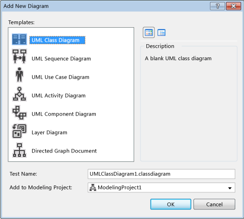
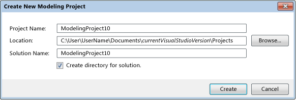

# Create UML modeling projects and diagrams
UML models help you understand, discuss, and design software systems. Visual Studio provides templates for five of the most frequently used UML diagrams: activity, class, component, sequence, and use case. In addition, you can create layer diagrams, which help you define the structure of your system.  
  
 UML modeling diagrams and layer diagrams can exist only inside a modeling project. Each modeling project contains a shared UML model and several UML diagrams. Each diagram is a partial view of the model. The UML model contains all the elements on the UML diagrams and can be viewed by using UML Model Explorer. For information about models and their relationship to diagrams, see [Create UML modeling projects and diagrams](../vs140/edit-uml-models-and-diagrams.md). For information about modeling projects under version control, see [Manage models and diagrams under version control](../vs140/manage-models-and-diagrams-under-version-control.md) and [Structure modeling solutions](../vs140/structure-your-modeling-solution.md)  
  
> [!NOTE]
>  There is another kind of diagram, the .NET class diagram, which is used to visualize program code. For more information, see [Designing and Viewing Classes and Types](http://go.microsoft.com/fwlink/?LinkId=142231).  
  
##   Create a Diagram in a Modeling Project  
 To see which versions of Visual Studio support this feature, see [Version support for architecture and modeling tools](../vs140/what-s-new-for-design-in-visual-studio.md#VersionSupport).  
  
#### To create a diagram and add it to a project  
  
1.  On the **Architecture** menu, choose **New UML or Layer Diagram**.  
  
2.  In the **Add New Diagram** dialog box, click the type of modeling diagram that you want.  
  
       
  
3.  Type a name for the new diagram.  
  
4.  In the **Add to modeling project** box:  
  
    -   Select a modeling project that already exists in your solution, and then click **OK**.  
  
     \- or -  
  
    1.  Select **Create a new modeling project**, and then click **OK**.  
  
    2.  In the **Create New Modeling Project** dialog box, type a name and location for the new project, and then click **OK**.  
  
           
  
         If your solution is open, the new project is added to the solution. If you have no open solution, you can type a name for a new solution.  
  
 If you already have a modeling project, you can also use the following procedure.  
  
#### To add a diagram to an existing modeling project  
  
1.  In **Solution Explorer**, click the modeling project node.  
  
    > [!NOTE]
    >  The modeling project contains a model definition folder named **ModelDefinition**.  
  
2.  On the **Project** menu, click **Add New Item**.  
  
3.  In the **Add New Item -** *\<project name>* dialog box, under **Templates**, click the modeling diagram type, for example, **UML Component Diagram**.  
  
4.  Type a name for the diagram, and then click **Add**.  
  
     The modeling diagram opens and appears in the modeling project.  
  
    > [!CAUTION]
    >  Do not add, copy, or drag existing diagram files to other modeling projects or to other locations in the solution. This causes elements to disappear from the copied diagrams or errors to occur when you open the diagrams. You must open the diagram file from the modeling project in which it was created. This is because a UML diagram is a view of the model that is owned by its modeling project. To copy a diagram file, create a new diagram, and then copy the elements from the source diagram to the new diagram. For more information, see [Troubleshooting Modeling Projects and Diagrams](#TroubleshootingModelingProjects).  
  
#### To create a blank modeling project  
  
1.  On the **File** menu, point to **New**, and then click **Project**.  
  
2.  In the **New Project** dialog box, under **Installed Templates**, click **Modeling Projects**.  
  
3.  In the middle window, click **Modeling Project**.  
  
4.  Name the project and specify a location in the **Name** and **Location** boxes.  
  
5.  In the **Solution** box, select **Add to Solution** to add the new project to a solution you already have open; or **Create new Solution** to close any open solution and add the project to a new solution.  
  
##   Removing Modeling Diagrams from a Project  
 You can permanently delete a diagram, or you can temporarily exclude a diagram from a project and then restore it.  
  
#### To permanently delete a diagram from a project  
  
-   In **Solution Explorer**, right-click the main file that represents the diagram, and then click **Delete**.  
  
     The diagram is removed from the project and the file system. The elements shown on the diagram are not removed from **UML Model Explorer**.  
  
    > [!NOTE]
    >  Each diagram has two files, one subsidiary to the other. For example, if you have a component diagram with the name `CD1`, you should delete the file that is named `CD1.componentdiagram`. Its subsidiary file that is named `CD1.componentdiagram.layout` will be deleted automatically.  
  
#### To temporarily exclude a diagram from a project  
  
-   In **Solution Explorer**, right-click the diagram file, and then click **Exclude from Project**.  
  
     The diagram is removed from the project. It is not removed from the file system.  
  
    > [!NOTE]
    >  The elements shown on the diagram are not removed from **UML Model Explorer**.  
  
#### To restore a temporarily excluded diagram to a project  
  
1.  In **Solution Explorer**, click the modeling project node.  
  
    > [!NOTE]
    >  The modeling project contains a model definition folder named **ModelDefinition**.  
  
2.  On the **Project** menu, click **Add Existing Item**.  
  
3.  In the **Add Existing Item** dialog box, locate the diagram file, select the file, and then click **Add**.  
  
     The modeling diagram opens and appears in the modeling project.  
  
    > [!NOTE]
    >  Each diagram has a pair of files in the file system. Do not select a file that has the extension `.layout`. Also, Visual Studio does not support adding existing UML diagrams to multiple modeling projects. Each diagram file must be opened within the modeling project in which it was created. This is because a UML diagram shows a view of a model that is owned by its modeling project.  
  
##   Diagrams that Do Not Require Modeling Projects  
 The following kinds of diagrams are not part of a modeling project:  
  
-   Class diagrams that are created as views of the source code. These are not related to UML class diagrams. For more information, see [Designing and Viewing Classes and Types](../vs140/designing-and-viewing-classes-and-types.md).  
  
-   Code maps. See [Map dependencies across your code](../vs140/map-dependencies-across-your-solutions.md).  
  
-   Diagrams that are not UML diagrams or layer diagrams, such as domain specific languages.  
  
##   Troubleshooting Modeling Projects and Diagrams  
 The following table describes issues that can occur with modeling projects or diagrams and how to resolve them:  
  
|**Issue**|**Causes**|**Resolution**|  
|---------------|----------------|--------------------|  
|The modeling project cannot be opened or loaded into the solution.   The following message is displayed:   "One or more projects in the solution were not loaded correctly. Please see the Output Window for details."   The Output window displays the following message:   "*ModelingProjectFilenameAndPath*.modelproj: error: Unrecognized Guid format."|A modeling project has references to projects that have the same name and are in the same solution.   For example, a layer is linked to projects that have the same name and are in the same solution.|Use a text editor to open the modeling project file, remove the references, and then try to open the modeling project again.   To avoid this issue, do not add references to projects that have the same name. Make sure projects have unique names.|  
|Elements are missing from diagrams that are added, copied, or dragged to other modeling projects or to other locations in the solution.   - or -   The following messages are displayed when you try to open a diagram:   -   "Some shapes or connectors on the diagram are missing because their definitions do not exist in this project. Either the definitions were deleted from the model while the diagram was closed, or the diagram was copied to another project that does not contain those definitions."   - or -   -   "This document is opened by another project."|The diagram file was added, dragged, or copied from a modeling project to another modeling project or to another location in the solution.|To copy a diagram file, create a new diagram, and then copy the elements from the source diagram to the new diagram.|  
  
## See Also  
 [How to Draw Modeling Diagrams](../vs140/edit-uml-models-and-diagrams.md)   
 [Structuring Modeling Solutions](../vs140/structure-your-modeling-solution.md)