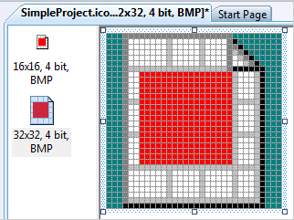
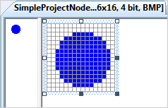
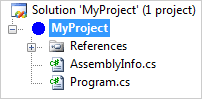
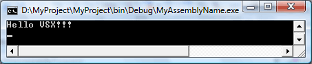

# Creating a Basic Project System, Part 1
In Visual Studio, projects are the containers that developers use to organize source code files and other assets. Projects appear as children of solutions in the **Solution Explorer**. Projects let you organize, build, debug, and deploy source code and create references to Web services, databases, and other resources.  
  
 Projects are defined in project files, for example a .csproj file for a Visual C# project. You can create your own project type that has your own project file name extension. For more information about project types, see [Project Types](../vs140/project-types.md).  
  
> [!NOTE]
>  If you need to extend Visual Studio with a custom project type, we strongly recommend leveraging the [Visual Studio Project System](https://github.com/Microsoft/VSProjectSystem) which has a number of advantages over building a project system from scratch:  
>   
>  -   Easier onboarding.  Even a basic project system requires tens of thousands of lines of code.  Leveraging CPS reduces the onboarding cost to a few clicks before you are ready to customize it to your needs.  
> -   Easier maintenance.  By leveraging CPS, you only need to maintain your own scenarios.  We handle the upkeep of all of the project system infrastructure.  
>   
>  If you need to target versions of Visual Studio older than Visual Studio 2013, you will not be able to leverage CPS in a Visual Studio extension.  If that is the case, this walkthrough is a good place to get started.  
  
 This walkthrough shows you how to create a project type that has the project file name extension .myproj. This walkthrough borrows from the existing Visual C# project system.  
  
> [!NOTE]
>  For an end-to-end sample of a complete language project system, see the IronPython Sample Deep Dive in [Visual Studio Extensibility Samples](../vs140/vssdk-samples.md).  
  
 This walkthrough teaches how to accomplish these tasks:  
  
-   Create a basic project type.  
  
-   Create a basic project template.  
  
-   Register the project template with Visual Studio.  
  
-   Create a project instance by opening the **New Project** dialog box and then using your template.  
  
-   Create a project factory for your project system.  
  
-   Create a project node for your project system.  
  
-   Add custom icons for the project system.  
  
-   Implement basic template parameter substitution.  
  
## Prerequisites  
 Starting in Visual Studio 2015, you do not install the Visual Studio SDK from the download center. It is included as an optional feature in Visual Studio setup. You can also install the VS SDK later on. For more information, see [Installing the Visual Studio SDK](../vs140/installing-the-visual-studio-sdk.md).  
  
 You must also download the source code for the [Managed Package Framework for Projects](http://mpfproj12.codeplex.com/). Extract the file to a location that is accessible to the solution you are going to create.  
  
## Creating a Basic Project Type  
 Create a C# VSIX project named **SimpleProject**. (**File, New, Project** and then **C#, Extensibility, Visual Studio Package**). Add a Visual Studio Package project item template (on the Solution Explorer, right-click the project node and select **Add / New Item**, then go to **Extensibility / Visual Studio Package**). Name the file **SimpleProjectPackage**.  
  
## Creating a Basic Project Template  
 Now, you can modify this basic VSPackage to implement the new .myproj project type. To create a project that is based on the .myproj project type, Visual Studio has to know which files, resources, and references to add to the new project. To provide this information, put project files in a project template folder. When a user uses the .myproj project to create a project, the files are copied to the new project.  
  
#### To create a basic project template  
  
1.  Add three folders to the project, one under the other: **Templates\Projects\SimpleProject**. (In **Solution Explorer**, right-click the **SimpleProject** project node, point to **Add**, and then click **New Folder**. Name the folder <CodeContentPlaceHolder>27\</CodeContentPlaceHolder>. In the **Templates** folder, add a folder named <CodeContentPlaceHolder>28\</CodeContentPlaceHolder>. In the **Projects** folder, add a folder named <CodeContentPlaceHolder>29\</CodeContentPlaceHolder>.)  
  
2.  In the **Projects\SimpleProject** folder add an icon file named <CodeContentPlaceHolder>30\</CodeContentPlaceHolder>. When you click **Add**, the icon editor opens.  
  
3.  Make the icon distinctive. This icon will appear in the **New Project** dialog box later in the walkthrough.  
  
       
  
4.  Save the icon and close the icon editor.  
  
5.  In the **Projects\SimpleProject** folder, add a **Class** item named <CodeContentPlaceHolder>31\</CodeContentPlaceHolder>.  
  
6.  Replace the existing code with the following lines.  
  
<CodeContentPlaceHolder>0\</CodeContentPlaceHolder>  
    > [!IMPORTANT]
    >  This is not the final form of the Program.cs code; the replacement parameters will be dealt with in a later step. You may see compile errors, but as long as the file’s **BuildAction** is **Content**, you should be able to build and run the project as usual.  
  
1.  Save the file.  
  
2.  Copy the AssemblyInfo.cs file from the **Properties** folder to the **Projects\SimpleProject** folder.  
  
3.  In the **Projects\SimpleProject** folder add an XML file named <CodeContentPlaceHolder>32\</CodeContentPlaceHolder>.  
  
    > [!NOTE]
    >  The file name extension for all projects of this type is .myproj. If you want to change it, you must change it everywhere it is mentioned in the walkthrough.  
  
4.  Replace the existing content with the following lines.  
  
<CodeContentPlaceHolder>1\</CodeContentPlaceHolder>  
5.  Save the file.  
  
6.  In the **Properties** window, set the **Build Action** of AssemblyInfo.cs, Program.cs, SimpleProject.ico, and SimpleProject.myproj to **Content**, and set their **Include in VSIX** properties to **True**.  
  
 This project template describes a basic Visual C# project that has both a Debug configuration and a Release configuration. The project includes two source files, AssemblyInfo.cs and Program.cs, and several assembly references. When a project is created from the template, the ProjectGuid value is automatically replaced by a new GUID.  
  
 In **Solution Explorer**, the expanded **Templates** folder should appear as follows:  
  
 Templates  
  
 Projects  
  
 SimpleProject  
  
 AssemblyInfo.cs  
  
 Program.cs  
  
 SimpleProject.ico  
  
 SimpleProject.myproj  
  
## Creating a Basic Project Factory  
 You must tell Visual Studio the location of your project template folder. To do this, add an attribute to the VSPackage class that implements the project factory so that the template location is written to the system registry when the VSPackage is built. Start by creating a basic project factory that is identified by a project factory GUID. Use the \<xref:Microsoft.VisualStudio.Shell.ProvideProjectFactoryAttribute*> attribute to connect the project factory to the SimpleProjectPackage class.  
  
#### To create a basic project factory  
  
1.  Open SimpleProjectPackageGuids.cs in the code editor.  
  
2.  Create GUIDs for your project factory (on the **Tools** menu, click **Create GUID**), or use the one in the following example. Add the GUIDs to the SimpleProjectPackageGuids class. The GUIDs must be in both GUID form and string form. The resulting code should resemble the following example.  
  
<CodeContentPlaceHolder>2\</CodeContentPlaceHolder>  
3.  Add a class to the top **SimpleProject** folder named <CodeContentPlaceHolder>33\</CodeContentPlaceHolder>.  
  
4.  Add the following using statements:  
  
<CodeContentPlaceHolder>3\</CodeContentPlaceHolder>  
5.  Add a Guid attribute to the SimpleProjectFactory class. The value of the attribute is the new project factory GUID.  
  
<CodeContentPlaceHolder>4\</CodeContentPlaceHolder>  
 Now you can register your project template.  
  
#### To register the project template  
  
1.  In SimpleProjectPackage.cs, add a \<xref:Microsoft.VisualStudio.Shell.ProvideProjectFactoryAttribute*> attribute to the SimpleProjectPackage class, as follows.  
  
<CodeContentPlaceHolder>5\</CodeContentPlaceHolder>  
2.  Rebuild the solution and verify that it builds without errors.  
  
     Rebuilding registers the project template.  
  
 The parameters <CodeContentPlaceHolder>34\</CodeContentPlaceHolder> and <CodeContentPlaceHolder>35\</CodeContentPlaceHolder> are set to the project file name extension (.myproj). The <CodeContentPlaceHolder>36\</CodeContentPlaceHolder> parameter is set to the relative path of the Templates folder. During the build, this path will be converted to a full build and added to the registry to register the project system.  
  
## Testing the Template Registration  
 Template registration tells Visual Studio the location of your project template folder so that Visual Studio can display the template name and icon in the **New Project** dialog box.  
  
#### To test the template registration  
  
1.  Press F5 to start debugging an experimental instance of Visual Studio.  
  
2.  In the experimental instance, create a new project of your newly-created project type. In the **New Project** dialog box, you should see **SimpleProject** under **Installed templates**.  
  
 Now you have a project factory that is registered. However, it cannot yet create a project. The project package and project factory work together to create and initialize a project.  
  
## Add the Managed Package Framework code  
 Implement the connection between the project package and the project factory.  
  
-   Import the source-code files for the Managed Package Framework.  
  
    1.  Unload the SimpleProject project (in **Solution Explorer**, select the project node and on the context menu click **Unload Project**.) and open the project file in the XML editor.  
  
    2.  Add the following blocks to the project file (just above the \<Import> blocks). Set ProjectBasePath to the location of the ProjectBase.files file in the Managed Package Framework code you just downloaded. You might have to add a backslash to the pathname. If you do not, the project might fail to find the Managed Package Framework code.  
  
<CodeContentPlaceHolder>6\</CodeContentPlaceHolder>  
        > [!IMPORTANT]
        >  Don’t forget the backslash at the end of the path.  
  
    3.  Reload the project.  
  
    4.  Add references to the following assemblies:  
  
        -   Microsoft.VisualStudio.Designer.Interfaces (in <VSSDK install>VisualStudioIntegrationCommonAssembliesv2.0)  
  
        -   WindowsBase  
  
        -   Microsoft.Build.Tasks.v4.0  
  
#### To initialize the project factory  
  
1.  In the SimpleProjectPackage.cs file, add the following <CodeContentPlaceHolder>37\</CodeContentPlaceHolder> statement.  
  
<CodeContentPlaceHolder>7\</CodeContentPlaceHolder>  
2.  Derive the <CodeContentPlaceHolder>38\</CodeContentPlaceHolder> class from <CodeContentPlaceHolder>39\</CodeContentPlaceHolder>.  
  
<CodeContentPlaceHolder>8\</CodeContentPlaceHolder>  
3.  Register the project factory. Add the following line to the <CodeContentPlaceHolder>40\</CodeContentPlaceHolder> method, just after <CodeContentPlaceHolder>41\</CodeContentPlaceHolder>.  
  
<CodeContentPlaceHolder>9\</CodeContentPlaceHolder>  
4.  Implement the abstract property <CodeContentPlaceHolder>42\</CodeContentPlaceHolder>:  
  
<CodeContentPlaceHolder>10\</CodeContentPlaceHolder>  
5.  In SimpleProjectFactory.cs, add the following <CodeContentPlaceHolder>43\</CodeContentPlaceHolder> statement after the existing <CodeContentPlaceHolder>44\</CodeContentPlaceHolder> statements.  
  
<CodeContentPlaceHolder>11\</CodeContentPlaceHolder>  
6.  Derive the <CodeContentPlaceHolder>45\</CodeContentPlaceHolder> class from <CodeContentPlaceHolder>46\</CodeContentPlaceHolder>.  
  
<CodeContentPlaceHolder>12\</CodeContentPlaceHolder>  
7.  Add the following dummy method to the <CodeContentPlaceHolder>47\</CodeContentPlaceHolder> class. You will implement this method in a later section.  
  
<CodeContentPlaceHolder>13\</CodeContentPlaceHolder>  
8.  Add the following field and constructor to the <CodeContentPlaceHolder>48\</CodeContentPlaceHolder> class. This <CodeContentPlaceHolder>49\</CodeContentPlaceHolder> reference is cached in a private field so that it can be used in setting a service provider site.  
  
<CodeContentPlaceHolder>14\</CodeContentPlaceHolder>  
9. Rebuild the solution and verify that it builds without errors.  
  
## Testing the Project Factory Implementation  
 Test whether the constructor for your project factory implementation is called.  
  
#### To test the project factory implementation  
  
1.  In the SimpleProjectFactory.cs file, set a breakpoint on the following line in the <CodeContentPlaceHolder>50\</CodeContentPlaceHolder> constructor.  
  
<CodeContentPlaceHolder>15\</CodeContentPlaceHolder>  
2.  Press F5 to start an experimental instance of Visual Studio.  
  
3.  In the experimental instance, start to create a new project.In the **New Project** dialog box, select the SimpleProject project type and then click **OK**. Execution stops at the breakpoint.  
  
4.  Clear the breakpoint and stop debugging. Since we have not created a project node yet, the project creation code still throws exceptions.  
  
## Extending the Project Node Class  
 Now you can implement the <CodeContentPlaceHolder>51\</CodeContentPlaceHolder> class, which derives from the <CodeContentPlaceHolder>52\</CodeContentPlaceHolder> class. The <CodeContentPlaceHolder>53\</CodeContentPlaceHolder> base class handles the following tasks of project creation:  
  
-   Copies the project template file, SimpleProject.myproj, to the new project folder. The copy is renamed according to the name that is entered in the **New Project** dialog box. The <CodeContentPlaceHolder>54\</CodeContentPlaceHolder> property value is replaced by a new GUID.  
  
-   Traverses the MSBuild elements of the project template file, SimpleProject.myproj, and looks for <CodeContentPlaceHolder>55\</CodeContentPlaceHolder> elements. For each <CodeContentPlaceHolder>56\</CodeContentPlaceHolder> target file, copies the file to the new project folder.  
  
 The derived <CodeContentPlaceHolder>57\</CodeContentPlaceHolder> class handles these tasks:  
  
-   Enables icons for project and file nodes in **Solution Explorer** to be created or selected.  
  
-   Enables additional project template parameter substitutions to be specified.  
  
#### To extend the project node class  
  
1.  
  
2.  Add a class named <CodeContentPlaceHolder>58\</CodeContentPlaceHolder>.  
  
3.  Replace the existing code with the following code.  
  
<CodeContentPlaceHolder>16\</CodeContentPlaceHolder>  
 This <CodeContentPlaceHolder>59\</CodeContentPlaceHolder> class implementation has these overridden methods:  
  
-   <CodeContentPlaceHolder>60\</CodeContentPlaceHolder>, which returns the project factory GUID.  
  
-   <CodeContentPlaceHolder>61\</CodeContentPlaceHolder>, which returns the localized name of the project type.  
  
-   <CodeContentPlaceHolder>62\</CodeContentPlaceHolder>, which copies selected files from the template folder to the destination project. This method is further implemented in a later section.  
  
 The <CodeContentPlaceHolder>63\</CodeContentPlaceHolder> constructor, like the <CodeContentPlaceHolder>64\</CodeContentPlaceHolder> constructor, caches a <CodeContentPlaceHolder>65\</CodeContentPlaceHolder> reference in a private field for later use.  
  
 To connect the <CodeContentPlaceHolder>66\</CodeContentPlaceHolder> class to the <CodeContentPlaceHolder>67\</CodeContentPlaceHolder> class, you must instantiate a new <CodeContentPlaceHolder>68\</CodeContentPlaceHolder> in the <CodeContentPlaceHolder>69\</CodeContentPlaceHolder> method and cache it in a private field for later use.  
  
#### To connect the project factory class and the node class  
  
1.  In the SimpleProjectFactory.cs file, add the following <CodeContentPlaceHolder>70\</CodeContentPlaceHolder> statement:  
  
<CodeContentPlaceHolder>17\</CodeContentPlaceHolder>  
2.  Replace the <CodeContentPlaceHolder>71\</CodeContentPlaceHolder> method by using the following code.  
  
<CodeContentPlaceHolder>18\</CodeContentPlaceHolder>  
3.  Rebuild the solution and verify that it builds without errors.  
  
## Testing the Project Node Class  
 Test your project factory to see whether it creates a project hierarchy.  
  
#### To test the project node class  
  
1.  Press F5 to start debugging. In the experimental instance, create a new SimpleProject.  
  
2.  Visual Studio should call your project factory to create a project.  
  
3.  Close the experimental instance of Visual Studio.  
  
## Adding a Custom Project Node Icon  
 The project node icon in the earlier section is a default icon. You can change it to a custom icon.  
  
#### To add a custom project node icon  
  
1.  In the **Resources** folder, add a bitmap file named SimpleProjectNode.bmp.  
  
2.  In the **Properties** windows, reduce the bitmap to 16 by 16 pixels. Make the bitmap distinctive.  
  
       
  
3.  In the **Properties** window, change the **Build action** of the bitmap to **Embedded Resource**.  
  
4.  In SimpleProjectNode.cs, add the following <CodeContentPlaceHolder>72\</CodeContentPlaceHolder> statements:  
  
<CodeContentPlaceHolder>19\</CodeContentPlaceHolder>  
5.  Add the following static field and constructor to the <CodeContentPlaceHolder>73\</CodeContentPlaceHolder> class.  
  
<CodeContentPlaceHolder>20\</CodeContentPlaceHolder>  
6.  Add the following property to the beginning of the <CodeContentPlaceHolder>74\</CodeContentPlaceHolder> class.  
  
<CodeContentPlaceHolder>21\</CodeContentPlaceHolder>  
7.  Replace the instance constructor with the following code.  
  
<CodeContentPlaceHolder>22\</CodeContentPlaceHolder>  
 During static construction, <CodeContentPlaceHolder>75\</CodeContentPlaceHolder> retrieves the project node bitmap from the assembly manifest resources and caches it in a private field for later use. Notice the syntax of the \<xref:System.Reflection.Assembly.GetManifestResourceStream*> image path. To see the names of the manifest resources embedded in an assembly, use the \<xref:System.Reflection.Assembly.GetManifestResourceNames*> method. When this method is applied to the <CodeContentPlaceHolder>76\</CodeContentPlaceHolder> assembly, the results should be as follows:  
  
-   SimpleProject.Resources.resources  
  
-   VisualStudio.Project.resources  
  
-   SimpleProject.VSPackage.resources  
  
-   Resources.imagelis.bmp  
  
-   Microsoft.VisualStudio.Project.DontShowAgainDialog.resources  
  
-   Microsoft.VisualStudio.Project.SecurityWarningDialog.resources  
  
-   SimpleProject.Resources.SimpleProjectNode.bmp  
  
 During instance construction, the <CodeContentPlaceHolder>77\</CodeContentPlaceHolder> base class loads Resources.imagelis.bmp, in which are embedded commonly used 16 x 16 bitmaps from Resources\imagelis.bmp. This bitmap list is made available to <CodeContentPlaceHolder>78\</CodeContentPlaceHolder> as ImageHandler.ImageList. <CodeContentPlaceHolder>79\</CodeContentPlaceHolder> appends the project node bitmap to the list. The offset of the project node bitmap in the image list is cached for later use as the value of the public <CodeContentPlaceHolder>80\</CodeContentPlaceHolder> property. Visual Studio uses this property to determine which bitmap to display as the project node icon.  
  
## Testing the Custom Project Node Icon  
 Test your project factory to see whether it creates a project hierarchy that has your custom project node icon.  
  
#### To test the custom project node icon  
  
1.  Start debugging, and in the experimental instance create a new SimpleProject.  
  
2.  In the newly-created project, notice that SimpleProjectNode.bmp is used as the project node icon.  
  
       
  
3.  Open Program.cs in the code editor. You should see source code that resembles the following code.  
  
<CodeContentPlaceHolder>23\</CodeContentPlaceHolder>  
     Notice that the template parameters $nameSpace$ and $className$ do not have new values. You will learn how to implement template parameter substitution in the next section.  
  
## Substituting Template Parameters  
 In an earlier section, you registered the project template with Visual Studio by using the <CodeContentPlaceHolder>81\</CodeContentPlaceHolder> attribute. Registering the path of a template folder in this manner lets you enable basic template parameter substitution by overriding and expanding the <CodeContentPlaceHolder>82\</CodeContentPlaceHolder> class. For more information, see [New Project Generation: Under the Hood, Part Two](../vs140/new-project-generation--under-the-hood--part-two.md).  
  
 Now add replacement code to the <CodeContentPlaceHolder>83\</CodeContentPlaceHolder> class.  
  
#### To substitute template parameters  
  
1.  In the SimpleProjectNode.cs file, add the following <CodeContentPlaceHolder>84\</CodeContentPlaceHolder> statement.  
  
<CodeContentPlaceHolder>24\</CodeContentPlaceHolder>  
2.  Replace the <CodeContentPlaceHolder>85\</CodeContentPlaceHolder> method by using the following code.  
  
<CodeContentPlaceHolder>25\</CodeContentPlaceHolder>  
3.  Set a breakpoint in the method, just after the <CodeContentPlaceHolder>86\</CodeContentPlaceHolder> assignment statement.  
  
 The assignment statements determine reasonable values for a namespace and a new class name. The two <CodeContentPlaceHolder>87\</CodeContentPlaceHolder> method calls replace the corresponding template parameter values by using these new values.  
  
## Testing the Template Parameter Substitution  
 Now you can test template parameter substitution.  
  
#### To test the template parameter substitution  
  
1.  Start debugging, and in the experimental instance create a new SimpleProject.  
  
2.  Execution stops at the breakpoint in the <CodeContentPlaceHolder>88\</CodeContentPlaceHolder> method.  
  
3.  Examine the values for the <CodeContentPlaceHolder>89\</CodeContentPlaceHolder> and <CodeContentPlaceHolder>90\</CodeContentPlaceHolder> parameters.  
  
    -   <CodeContentPlaceHolder>91\</CodeContentPlaceHolder> is given the value of the \<RootNamespace> element in the \Templates\Projects\SimpleProject\SimpleProject.myproj project template file. In this case, the value is "MyRootNamespace".  
  
    -   <CodeContentPlaceHolder>92\</CodeContentPlaceHolder> is given the value of the class source file name, without the file name extension. In this case, the first file to be copied to the destination folder is AssemblyInfo.cs; therefore, the value of className is "AssemblyInfo".  
  
4.  Remove the breakpoint and press F5 to continue execution.  
  
     Visual Studio should finish creating a project.  
  
5.  Open Program.cs in the code editor. You should see source code that resembles the following code.  
  
<CodeContentPlaceHolder>26\</CodeContentPlaceHolder>  
     Notice that the namespace is now "MyRootNamespace" and the class name is now "Program".  
  
6.  Start debugging the project. The new project should compile, run, and display "Hello VSX!!!" in the console window.  
  
       
  
 Congratulations! You have implemented a basic managed project system.