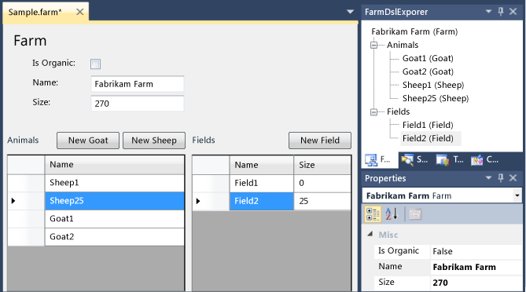
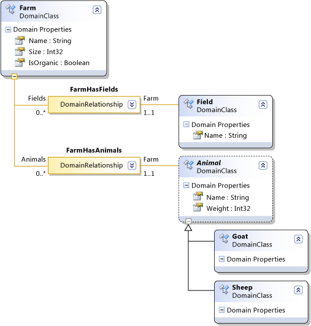
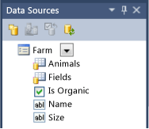
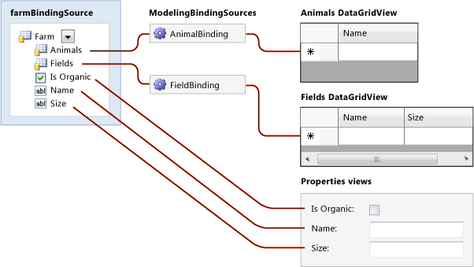

# Creating a Windows Forms-Based Domain-Specific Language
You can use Windows Forms to display the state of a domain-specific language (DSL) model, instead of using a DSL diagram. This topic walks you through binding a Windows Form to a DSL, using the [!INCLUDE[vsprvs](../vs140/includes/vsprvs_md.md)] Visualization and Modeling SDK.  
  
   
A DSL instance, showing a Windows Form UI and the model explorer.  
  
## Creating a Windows Forms DSL  
 The **Minimal WinForm Designer** DSL template creates a minimal DSL that you can modify to suit your own requirements.  
  
#### To create a minimal WinForms DSL  
  
1.  Create a DSL from the **Minimal WinForm Designer** template.  
  
     In this walkthrough, the following names are assumed:  
  
    |||  
    |-|-|  
    |Solution and DSL name|FarmApp|  
    |Namespace|Company.FarmApp|  
  
2.  Experiment with the initial example that the template provides:  
  
    1.  Transform All Templates.  
  
    2.  Build and run the sample (**CTRL+F5**).  
  
    3.  In the experimental instance of Visual Studio, open the <CodeContentPlaceHolder>5\</CodeContentPlaceHolder> file in the debugging project.  
  
         Notice that it is displayed in a Windows Forms control.  
  
         You can also see the elements of the model displayed in the Explorer.  
  
         Add some elements either in the form or the Explorer, and notice that they appear in the other display.  
  
 In the main instance of [!INCLUDE[vsprvs](../vs140/includes/vsprvs_md.md)], notice the following points about the DSL solution:  
  
-   <CodeContentPlaceHolder>6\</CodeContentPlaceHolder> contains no diagram elements. This is because you will not use DSL diagrams to view instance models of this DSL. Instead, you will bind a Windows Form to the model, and the elements on the form will display the model.  
  
-   In addition to the <CodeContentPlaceHolder>7\</CodeContentPlaceHolder> and <CodeContentPlaceHolder>8\</CodeContentPlaceHolder> projects, the solution contains a third project named <CodeContentPlaceHolder>9\</CodeContentPlaceHolder>**UI** project contains the definition of a Windows Forms control. <CodeContentPlaceHolder>10\</CodeContentPlaceHolder> depends on <CodeContentPlaceHolder>11\</CodeContentPlaceHolder>, and <CodeContentPlaceHolder>12\</CodeContentPlaceHolder> depends on <CodeContentPlaceHolder>13\</CodeContentPlaceHolder>.  
  
-   In the <CodeContentPlaceHolder>14\</CodeContentPlaceHolder> project, <CodeContentPlaceHolder>15\</CodeContentPlaceHolder> contains the code that displays the Windows Forms control that is defined in the <CodeContentPlaceHolder>16\</CodeContentPlaceHolder> project.  
  
-   The <CodeContentPlaceHolder>17\</CodeContentPlaceHolder> project contains a working sample of a form control bound to the DSL. However, it will not work when you have changed the DSL Definition. The <CodeContentPlaceHolder>18\</CodeContentPlaceHolder> project contains:  
  
    -   A Windows Forms class named <CodeContentPlaceHolder>19\</CodeContentPlaceHolder>.  
  
    -   A file named <CodeContentPlaceHolder>20\</CodeContentPlaceHolder> that contains an additional partial definition of <CodeContentPlaceHolder>21\</CodeContentPlaceHolder>. To see its content, in **Solution Explorer**, open the shortcut menu for the file and choose **View Code**.  
  
### About the UI Project  
 When you update the DSL Definition file to define your own DSL, you will have to update the control in the <CodeContentPlaceHolder>22\</CodeContentPlaceHolder> project to display your DSL. Unlike the <CodeContentPlaceHolder>23\</CodeContentPlaceHolder> and <CodeContentPlaceHolder>24\</CodeContentPlaceHolder> projects, the sample <CodeContentPlaceHolder>25\</CodeContentPlaceHolder> project is not generated from <CodeContentPlaceHolder>26\</CodeContentPlaceHolder>. You can add .tt files to generate the code if you want, although that is not covered in this walkthrough.  
  
## Updating the DSL Definition  
 The following the DSL definition is used in this walkthrough.  
  
   
  
#### To update the DSL definition  
  
1.  Open DslDefinition.dsl in the DSL designer.  
  
2.  Delete **ExampleElement**  
  
3.  Rename the **ExampleModel** domain class to <CodeContentPlaceHolder>27\</CodeContentPlaceHolder>.  
  
     Give it additional domain properties named <CodeContentPlaceHolder>28\</CodeContentPlaceHolder> of type **Int32**, and <CodeContentPlaceHolder>29\</CodeContentPlaceHolder> of type **Boolean**.  
  
    > [!NOTE]
    >  If you delete the root domain class and then create a new root, you will have to reset the Editor Root Class property. In **DSL Explorer**, select **Editor**. Then in the Properties window, set **Root Class** to <CodeContentPlaceHolder>30\</CodeContentPlaceHolder>.  
  
4.  Use the **Named Domain Class** tool to create the following domain classes:  
  
    -   <CodeContentPlaceHolder>31\</CodeContentPlaceHolder> – Give this an additional domain property named <CodeContentPlaceHolder>32\</CodeContentPlaceHolder>.  
  
    -   <CodeContentPlaceHolder>33\</CodeContentPlaceHolder> – In the Properties window, set **Inheritance Modifier** to **Abstract**.  
  
5.  Use the **Domain Class** tool to create the following classes:  
  
    -   <CodeContentPlaceHolder>34\</CodeContentPlaceHolder>  
  
    -   <CodeContentPlaceHolder>35\</CodeContentPlaceHolder>  
  
6.  Use the **Inheritance** tool to make <CodeContentPlaceHolder>36\</CodeContentPlaceHolder> and <CodeContentPlaceHolder>37\</CodeContentPlaceHolder> inherit from <CodeContentPlaceHolder>38\</CodeContentPlaceHolder>.  
  
7.  Use the **Embedding** tool to embed <CodeContentPlaceHolder>39\</CodeContentPlaceHolder> and <CodeContentPlaceHolder>40\</CodeContentPlaceHolder> under <CodeContentPlaceHolder>41\</CodeContentPlaceHolder>.  
  
8.  You might want to tidy the diagram. To reduce the number of duplicate elements, use the **Bring Subtree Here** command on the shortcut menu of leaf elements.  
  
9. **Transform All Templates** in the toolbar of Solution Explorer.  
  
10. Build the **Dsl** project.  
  
    > [!NOTE]
    >  At this stage, the other projects will not build without errors. However, we want to build the Dsl project so that its assembly is available to the Data Source Wizard.  
  
## Updating the UI Project  
 Now you can create a new user control that will display the information that is stored in the DSL model. The easiest way to connect the user control to the model is through data bindings. The data binding adaptor type named **ModelingBindingSource** is specifically designed to connect DSLs to non-VMSDK interfaces.  
  
#### To define your DSL model as a data source  
  
1.  On the **Data** menu, choose **Show Data Sources**.  
  
     The **Data Sources** window opens.  
  
     Choose **Add New Data Source**. The **Data Source Configuration Wizard** opens.  
  
2.  Choose **Object**, **Next**.  
  
     Expand **Dsl**, **Company.FarmApp**, and select **Farm**, which is the root class of your model. Choose **Finish**.  
  
     In Solution Explorer, the **UI** project now contains **Properties\DataSources\Farm.datasource**  
  
     The properties and relationships of your model class appear in the Data Sources window.  
  
       
  
#### To connect your model to a form  
  
1.  In the **UI** project, delete all the existing .cs files.  
  
2.  Add a new **User Control** file named <CodeContentPlaceHolder>42\</CodeContentPlaceHolder> to the **UI** project.  
  
3.  In the **Data Sources** window, on the drop-down menu on **Farm**, choose **Details**.  
  
     Leave the default settings for the other properties.  
  
4.  Open FarmControl.cs in the design view.  
  
     Drag **Farm** from the Data Sources window onto FarmControl.  
  
     A set of controls appears, one for each property. The relationship properties do not generate controls.  
  
5.  Delete **farmBindingNavigator**. This is also automatically generated in the <CodeContentPlaceHolder>43\</CodeContentPlaceHolder> designer, but it is not useful for this application.  
  
6.  Using the toolbox, create two instances of **DataGridView**, and name them <CodeContentPlaceHolder>44\</CodeContentPlaceHolder> and <CodeContentPlaceHolder>45\</CodeContentPlaceHolder>.  
  
    > [!NOTE]
    >  An alternative step is to drag the Animals and Fields items from the Data Sources window onto the control. This action automatically creates data grids and bindings between the grid view and the data source. However, this binding does not work correctly for DSLs. Therefore it is better to create the data grids and bindings manually.  
  
7.  If the Toolbox does not contain the **ModelingBindingSource** tool, add it. On the shortcut menu of the **Data** tab, choose **Choose Items**. In the **Choose Toolbox Items** dialog, select **ModelingBindingSource** from the **.NET Framework Tab**.  
  
8.  Using the Toolbox, create two instances of **ModelingBindingSource**, and name them <CodeContentPlaceHolder>46\</CodeContentPlaceHolder> and <CodeContentPlaceHolder>47\</CodeContentPlaceHolder>.  
  
9. Set the **DataSource** property of each **ModelingBindingSource** to **farmBindingSource**.  
  
     Set the **DataMember** property to **Animals** or **Fields**.  
  
10. Set the **DataSource** properties of <CodeContentPlaceHolder>48\</CodeContentPlaceHolder> to <CodeContentPlaceHolder>49\</CodeContentPlaceHolder>, and of  <CodeContentPlaceHolder>50\</CodeContentPlaceHolder> to <CodeContentPlaceHolder>51\</CodeContentPlaceHolder>.  
  
11. Adjust the layout of the Farm control to your taste.  
  
 The **ModelingBindingSource** is an adapter that performs several functions that are specific to DSLs:  
  
-   It wraps updates in a VMSDK Store Transaction.  
  
     For example, when the user deletes a row from the data view grid, a regular binding would result in a transaction exception.  
  
-   It ensures that, when the user selects a row, the Properties window displays the properties of the corresponding model element, instead of the data grid row.  
  
   
Schema of links between data sources and views.  
  
#### To complete the bindings to the DSL  
  
1.  Add the following code in a separate code file in the **UI** project:  
  
<CodeContentPlaceHolder>0\</CodeContentPlaceHolder>  
2.  In the **DslPackage** project, edit **DslPackage\DocView.tt** to update the following variable definition:  
  
<CodeContentPlaceHolder>1\</CodeContentPlaceHolder>  
## Testing the DSL  
 The DSL solution can now build and run, although you might want to add further improvements later.  
  
#### To test the DSL  
  
1.  Build and run the solution.  
  
2.  In the experimental instance of Visual Studio, open the **Sample** file.  
  
3.  In the **FarmApp Explorer**, open the shortcut menu on the **Farm** root node, and choose **Add New Goat**.  
  
     <CodeContentPlaceHolder>52\</CodeContentPlaceHolder> appears in the **Animals** view.  
  
    > [!WARNING]
    >  You must use the shortcut menu on the **Farm** node, not the **Animals** node.  
  
4.  Select the **Farm** root node and view its properties.  
  
     In the form view, change the **Name** or **Size** of the farm.  
  
     When you navigate away from each field in the form, the corresponding property changes in the Properties window.  
  
## Enhancing the DSL  
  
#### To make the properties update immediately  
  
1.  In the design view of FarmControl.cs, select a simple field such as Name, Size or IsOrganic.  
  
2.  In the Properties window, expand **DataBindings** and open **(Advanced)**.  
  
     In the **Formatting and Advanced Binding** dialog, under **Data Source Update Mode**, choose **OnPropertyChanged**.  
  
3.  Build and run the solution.  
  
     Verify that when you change the content of the field, the corresponding property of the Farm model changes immediately.  
  
#### To provide Add buttons  
  
1.  In the design view of FarmControl.cs, use the toolbox to create a button on the form.  
  
     Edit the name and text of the button, for example to <CodeContentPlaceHolder>53\</CodeContentPlaceHolder>.  
  
2.  Open the code behind the button (for example by double-clicking it).  
  
     Edit it as follows:  
  
<CodeContentPlaceHolder>2\</CodeContentPlaceHolder>  
     You will also need to insert the following directive:  
  
<CodeContentPlaceHolder>3\</CodeContentPlaceHolder>  
3.  Add similar buttons for Goats and Fields.  
  
4.  Build and run the solution.  
  
5.  Verify that the new button adds an item. The new item should appear in both the FarmApp Explorer and in the appropriate data grid view.  
  
     You should be able to edit the name of the element in the data grid view. You can also delete it from there.  
  
   
  
### About the code to add an element  
 For the new element buttons, the following alternative code is slightly simpler.  
  
<CodeContentPlaceHolder>4\</CodeContentPlaceHolder>  
 However, this code does not set a default name for the new item. It does not run any customized merge that you might have defined in the **Element Merge Directives** of the DSL, and it does not run any custom merge code that might have been defined.  
  
 Therefore we recommend that you use \<xref:Microsoft.VisualStudio.Modeling.ElementOperations*> to create new elements. For more information, see [Customizing Element Creation and Pasting](../vs140/customizing-element-creation-and-movement.md).  
  
## See Also  
 [How to Define a Domain Specific Language](../vs140/how-to-define-a-domain-specific-language.md)   
 [Programming Domain Specific Languages](../vs140/writing-code-to-customise-a-domain-specific-language.md)   
 [Domain-Specific Languages](../vs140/modeling-sdk-for-visual-studio---domain-specific-languages.md)