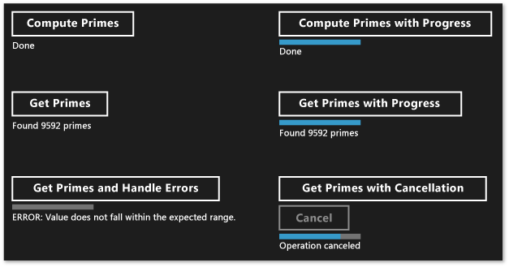
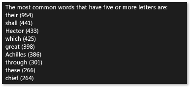

# Creating Asynchronous Operations in C++ for Windows Store Apps
This document describes some of the key points to keep in mind when you use the task class to produce Windows ThreadPool-based asynchronous operations in a [!INCLUDE[win8_appname_long](../vs140/includes/win8_appname_long_md.md)] app.  
  
 The use of asynchronous programming is a key component in the [!INCLUDE[win8_appname_long](../vs140/includes/win8_appname_long_md.md)] app model because it enables apps to remain responsive to user input. You can start a long-running task without blocking the UI thread, and you can receive the results of the task later. You can also cancel tasks and receive progress notifications as tasks run in the background. The document [Asynchronous programming in C++](http://msdn.microsoft.com/library/windows/apps/Hh780559.aspx) provides an overview of the asynchronous pattern that's available in Visual C++ to create [!INCLUDE[win8_appname_long](../vs140/includes/win8_appname_long_md.md)] apps. That document teaches how to both consume and create chains of asynchronous [!INCLUDE[wrt](../vs140/includes/wrt_md.md)] operations. This section describes how to use the types in ppltasks.h to produce asynchronous operations that can be consumed by another [!INCLUDE[wrt](../vs140/includes/wrt_md.md)] component and how to control how asynchronous work is executed. Also consider reading [Async programming patterns and tips in Hilo (Windows Store apps using C++ and XAML)](http://msdn.microsoft.com/library/windows/apps/jj160321.aspx) to learn how we used the task class to implement asynchronous operations in Hilo, a [!INCLUDE[win8_appname_long](../vs140/includes/win8_appname_long_md.md)] app using C++ and XAML.  
  
> [!NOTE]
>  You can use the [Parallel Patterns Library](../vs140/parallel-patterns-library--ppl-.md) (PPL) and [Asynchronous Agents Library](../vs140/asynchronous-agents-library.md) in a [!INCLUDE[win8_appname_long](../vs140/includes/win8_appname_long_md.md)] app. However, you cannot use the Task Scheduler or the Resource Manager. This document describes additional features that the PPL provides that are available only to a [!INCLUDE[win8_appname_long](../vs140/includes/win8_appname_long_md.md)] app, and not to a desktop app.  
  
## Key points  
  
-   Use [concurrency::create_async](../vs140/create_async-function.md) to create asynchronous operations that can be used by other components (which might be written in languages other than C++).  
  
-   Use [concurrency::progress_reporter](../vs140/progress_reporter-class.md) to report progress notifications to components that call your asynchronous operations.  
  
-   Use cancellation tokens to enable internal asynchronous operations to cancel.  
  
-   The behavior of the <CodeContentPlaceHolder>0\</CodeContentPlaceHolder> function depends on the return type of the work function that is passed to it. A work function that returns a task (either <CodeContentPlaceHolder>1\</CodeContentPlaceHolder> or <CodeContentPlaceHolder>2\</CodeContentPlaceHolder>) runs synchronously in the context that called <CodeContentPlaceHolder>3\</CodeContentPlaceHolder>. A work function that returns <CodeContentPlaceHolder>4\</CodeContentPlaceHolder> or <CodeContentPlaceHolder>5\</CodeContentPlaceHolder> runs in an arbitrary context.  
  
-   You can use the [concurrency::task::then](../vs140/task--then-method.md) method to create a chain of tasks that run one after another. In a [!INCLUDE[win8_appname_long](../vs140/includes/win8_appname_long_md.md)] app, the default context for a task’s continuations depends on how that task was constructed. If the task was created by passing an asynchronous action to the task constructor, or by passing a lambda expression that returns an asynchronous action, then the default context for all continuations of that task is the current context. If the task is not constructed from an asynchronous action, then an arbitrary context is used by default for the task’s continuations. You can override the default context with the [concurrency::task_continuation_context](../vs140/task_continuation_context-class.md) class.  
  
## In this document  
  
-   [Creating Asynchronous Operations](#create-async)  
  
-   [Example: Creating a C++ Windows Runtime Component](#example-component)  
  
-   [Controlling the Execution Thread](#exethread)  
  
-   [Example: Controlling Execution in a Windows Store App with C++ and XAML](#example-app)  
  
##  \<a name="create-async">\</a> Creating Asynchronous Operations  
 You can use the task and continuation model in the Parallel Patterns Library (PPL) to define background tasks as well as additional tasks that run when the previous task completes. This functionality is provided by the [concurrency::task](../vs140/task-class--concurrency-runtime-.md) class. For more information about this model and the <CodeContentPlaceHolder>6\</CodeContentPlaceHolder> class, see [Task Parallelism](../vs140/task-parallelism--concurrency-runtime-.md).  
  
 The [!INCLUDE[wrt](../vs140/includes/wrt_md.md)] is a programming interface that you can use to create [!INCLUDE[win8_appname_long](../vs140/includes/win8_appname_long_md.md)] apps that run only in a special operating system environment. Such apps use authorized functions, data types, and devices, and are distributed from the [!INCLUDE[win8_appstore_long](../vs140/includes/win8_appstore_long_md.md)]. The [!INCLUDE[wrt](../vs140/includes/wrt_md.md)] is represented by the *Application Binary Interface* (ABI). The ABI is an underlying binary contract that makes [!INCLUDE[wrt](../vs140/includes/wrt_md.md)] APIs available to programming languages such as Visual C++.  
  
 By using the [!INCLUDE[wrt](../vs140/includes/wrt_md.md)], you can use the best features of various programming languages and combine them into one app. For example, you might create your UI in JavaScript and perform the computationally-intensive app logic in a C++ component. The ability to perform these computationally-intensive operations in the background is a key factor in keeping your UI responsive. Because the <CodeContentPlaceHolder>7\</CodeContentPlaceHolder> class is specific to C++, you must use a [!INCLUDE[wrt](../vs140/includes/wrt_md.md)] interface to communicate asynchronous operations to other components (which might be written in languages other than C++). The [!INCLUDE[wrt](../vs140/includes/wrt_md.md)] provides four interfaces that you can use to represent asynchronous operations:  
  
 [Windows::Foundation::IAsyncAction](http://msdn.microsoft.com/library/windows/apps/windows.foundation.iasyncaction.aspx)  
 Represents an asynchronous action.  
  
 [Windows::Foundation::IAsyncActionWithProgress\<TProgress>](http://msdn.microsoft.com/library/windows/apps/br206581.aspx)  
 Represents an asynchronous action that reports progress.  
  
 [Windows::Foundation::IAsyncOperation\<TResult>](http://msdn.microsoft.com/library/windows/apps/br206598.aspx)  
 Represents an asynchronous operation that returns a result.  
  
 [Windows::Foundation::IAsyncOperationWithProgress\<TResult, TProgress>](http://msdn.microsoft.com/library/windows/apps/br206594.aspx)  
 Represents an asynchronous operation that returns a result and reports progress.  
  
 The notion of an *action* means that the asynchronous task doesn't produce a value (think of a function that returns <CodeContentPlaceHolder>8\</CodeContentPlaceHolder>). The notion of an *operation* means that the asynchronous task does produce a value. The notion of *progress* means that the task can report progress messages to the caller. JavaScript, the .NET Framework, and Visual C++ each provides its own way to create instances of these interfaces for use across the ABI boundary. For Visual C++, the PPL provides the [concurrency::create_async](../vs140/create_async-function.md) function. This function creates a [!INCLUDE[wrt](../vs140/includes/wrt_md.md)] asynchronous action or operation that represents the completion of a task. The <CodeContentPlaceHolder>9\</CodeContentPlaceHolder> function takes a work function (typically a lambda expression), internally creates a <CodeContentPlaceHolder>10\</CodeContentPlaceHolder> object, and wraps that task in one of the four asynchronous [!INCLUDE[wrt](../vs140/includes/wrt_md.md)] interfaces.  
  
> [!NOTE]
>  Use <CodeContentPlaceHolder>11\</CodeContentPlaceHolder> only when you have to create functionality that can be accessed from another language or another [!INCLUDE[wrt](../vs140/includes/wrt_md.md)] component. Use the <CodeContentPlaceHolder>12\</CodeContentPlaceHolder> class directly when you know that the operation is both produced and consumed by C++ code in the same component.  
  
 The return type of <CodeContentPlaceHolder>13\</CodeContentPlaceHolder> is determined by the type of its arguments. For example, if your work function doesn't return a value and doesn't report progress, <CodeContentPlaceHolder>14\</CodeContentPlaceHolder> returns <CodeContentPlaceHolder>15\</CodeContentPlaceHolder>. If your work function doesn't return a value and also reports progress, <CodeContentPlaceHolder>16\</CodeContentPlaceHolder> returns <CodeContentPlaceHolder>17\</CodeContentPlaceHolder>. To report progress, provide a [concurrency::progress_reporter](../vs140/progress_reporter-class.md) object as the parameter to your work function. The ability to report progress enables you to report what amount of work was performed and what amount still remains (for example, as a percentage). It also enables you to report results as they become available.  
  
 The <CodeContentPlaceHolder>18\</CodeContentPlaceHolder>, <CodeContentPlaceHolder>19\</CodeContentPlaceHolder>, <CodeContentPlaceHolder>20\</CodeContentPlaceHolder>, and <CodeContentPlaceHolder>21\</CodeContentPlaceHolder> interfaces each provide a <CodeContentPlaceHolder>22\</CodeContentPlaceHolder> method that enables you to cancel the asynchronous operation. The <CodeContentPlaceHolder>23\</CodeContentPlaceHolder> class works with cancellation tokens. When you use a cancellation token to cancel work, the runtime does not start new work that subscribes to that token. Work that is already active can monitor its cancellation token and stop when it can. This mechanism is described in greater detail in the document [Cancellation in the PPL](../vs140/cancellation-in-the-ppl.md). You can connect task cancellation with the [!INCLUDE[wrt](../vs140/includes/wrt_md.md)]<CodeContentPlaceHolder>24\</CodeContentPlaceHolder> methods in two ways. First, you can define the work function that you pass to <CodeContentPlaceHolder>25\</CodeContentPlaceHolder> to take a [concurrency::cancellation_token](cancellation_token) object. When the <CodeContentPlaceHolder>26\</CodeContentPlaceHolder> method is called, this cancellation token is cancelled and the normal cancellation rules apply to the underlying <CodeContentPlaceHolder>27\</CodeContentPlaceHolder> object that supports the <CodeContentPlaceHolder>28\</CodeContentPlaceHolder> call. If you do not provide a <CodeContentPlaceHolder>29\</CodeContentPlaceHolder> object, the underlying <CodeContentPlaceHolder>30\</CodeContentPlaceHolder> object defines one implicitly. Define a <CodeContentPlaceHolder>31\</CodeContentPlaceHolder> object when you need to cooperatively respond to cancellation in your work function. The section [Example: Controlling Execution in a Windows Store App with C++ and XAML](#example-app) shows an example of how to perform cancellation in a [!INCLUDE[win8_appname_long](../vs140/includes/win8_appname_long_md.md)] app with C# and XAML that uses a custom [!INCLUDE[wrt](../vs140/includes/wrt_md.md)] C++ component.  
  
> [!WARNING]
>  In a chain of task continuations, always clean up state and then call [concurrency::cancel_current_task](../vs140/cancel_current_task-function.md) when the cancellation token is cancelled. If you return early instead of calling <CodeContentPlaceHolder>32\</CodeContentPlaceHolder>, the operation transitions to the completed state instead of the canceled state.  
  
 The following table summarizes the combinations that you can use to define asynchronous operations in your app.  
  
|To create this [!INCLUDE[wrt](../vs140/includes/wrt_md.md)] interface|Return this type from <CodeContentPlaceHolder>33\</CodeContentPlaceHolder>|Pass these parameter types to your work function to use an implicit cancellation token|Pass these parameter types to your work function to use an explicit cancellation token|  
|----------------------------------------------------------------------------------|------------------------------------------|--------------------------------------------------------------------------------------------|--------------------------------------------------------------------------------------------|  
|<CodeContentPlaceHolder>34\</CodeContentPlaceHolder>|<CodeContentPlaceHolder>35\</CodeContentPlaceHolder> or <CodeContentPlaceHolder>36\</CodeContentPlaceHolder>|(none)|(<CodeContentPlaceHolder>37\</CodeContentPlaceHolder>)|  
|<CodeContentPlaceHolder>38\</CodeContentPlaceHolder>|<CodeContentPlaceHolder>39\</CodeContentPlaceHolder> or <CodeContentPlaceHolder>40\</CodeContentPlaceHolder>|(<CodeContentPlaceHolder>41\</CodeContentPlaceHolder>)|(<CodeContentPlaceHolder>42\</CodeContentPlaceHolder>, <CodeContentPlaceHolder>43\</CodeContentPlaceHolder>)|  
|<CodeContentPlaceHolder>44\</CodeContentPlaceHolder>|<CodeContentPlaceHolder>45\</CodeContentPlaceHolder> or <CodeContentPlaceHolder>46\</CodeContentPlaceHolder>|(none)|(<CodeContentPlaceHolder>47\</CodeContentPlaceHolder>)|  
|<CodeContentPlaceHolder>48\</CodeContentPlaceHolder>|<CodeContentPlaceHolder>49\</CodeContentPlaceHolder> or <CodeContentPlaceHolder>50\</CodeContentPlaceHolder>|(<CodeContentPlaceHolder>51\</CodeContentPlaceHolder>)|(<CodeContentPlaceHolder>52\</CodeContentPlaceHolder>, <CodeContentPlaceHolder>53\</CodeContentPlaceHolder>)|  
  
 You can return a value or a <CodeContentPlaceHolder>54\</CodeContentPlaceHolder> object from the work function that you pass to the <CodeContentPlaceHolder>55\</CodeContentPlaceHolder> function. These variations produce different behaviors. When you return a value, the work function is wrapped in a <CodeContentPlaceHolder>56\</CodeContentPlaceHolder> so that it can be run on a background thread. In addition, the underlying <CodeContentPlaceHolder>57\</CodeContentPlaceHolder> uses an implicit cancellation token. Conversely, if you return a <CodeContentPlaceHolder>58\</CodeContentPlaceHolder> object, the work function runs synchronously. Therefore, if you return a <CodeContentPlaceHolder>59\</CodeContentPlaceHolder> object, ensure that any lengthy operations in your work function also run as tasks to enable your app to remain responsive. In addition, the underlying <CodeContentPlaceHolder>60\</CodeContentPlaceHolder> does not use an implicit cancellation token. Therefore, you need to define your work function to take a <CodeContentPlaceHolder>61\</CodeContentPlaceHolder> object if you require support for cancellation when you return a <CodeContentPlaceHolder>62\</CodeContentPlaceHolder> object from <CodeContentPlaceHolder>63\</CodeContentPlaceHolder>.  
  
 The following example shows the various ways to create an <CodeContentPlaceHolder>64\</CodeContentPlaceHolder> object that can be consumed by another [!INCLUDE[wrt](../vs140/includes/wrt_md.md)] component.  
  
 [!code[concrt-windowsstore-primes#100](../vs140/codesnippet/CPP/creating-asynchronous-operations-in-c---for-windows-store-apps_1.cpp)]  
  
##  \<a name="example-component">\</a> Example: Creating a C++ Windows Runtime Component and Consuming it from C#  
 Consider an app that uses XAML and C# to define the UI and a C++ [!INCLUDE[wrt](../vs140/includes/wrt_md.md)] component to perform compute-intensive operations. In this example, the C++ component computes which numbers in a given range are prime. To illustrate the differences among the four [!INCLUDE[wrt](../vs140/includes/wrt_md.md)] asynchronous task interfaces, start, in Visual Studio, by creating a **Blank Solution** and naming it <CodeContentPlaceHolder>65\</CodeContentPlaceHolder>. Then add to the solution a **Windows Runtime Component** project and naming it <CodeContentPlaceHolder>66\</CodeContentPlaceHolder>. Add the following code to the generated C++ header file (this example renames Class1.h to Primes.h). Each <CodeContentPlaceHolder>67\</CodeContentPlaceHolder> method defines one of the four asynchronous interfaces. The methods that return a value return a [Windows::Foundation::Collections::IVector\<int>](http://msdn.microsoft.com/library/windows/apps/br206631.aspx) object. The methods that report progress produce <CodeContentPlaceHolder>68\</CodeContentPlaceHolder> values that define the percentage of overall work that has completed.  
  
 [!code[concrt-windowsstore-primes#1](../vs140/codesnippet/CPP/creating-asynchronous-operations-in-c---for-windows-store-apps_2.h)]  
  
> [!NOTE]
>  By convention, asynchronous method names in the [!INCLUDE[wrt](../vs140/includes/wrt_md.md)] typically end with "Async".  
  
 Add the following code to the generated C++ source file (this example renames Class1.cpp to Primes.cpp). The <CodeContentPlaceHolder>69\</CodeContentPlaceHolder> function determines whether its input is prime. The remaining methods implement the <CodeContentPlaceHolder>70\</CodeContentPlaceHolder> class. Each call to <CodeContentPlaceHolder>71\</CodeContentPlaceHolder> uses a signature that's compatible with the method from which it is called. For example, because <CodeContentPlaceHolder>72\</CodeContentPlaceHolder> returns <CodeContentPlaceHolder>73\</CodeContentPlaceHolder>, the work function that's provided to <CodeContentPlaceHolder>74\</CodeContentPlaceHolder> doesn't return a value and doesn't take a <CodeContentPlaceHolder>75\</CodeContentPlaceHolder> object as its parameter.  
  
 [!code[concrt-windowsstore-primes#2](../vs140/codesnippet/CPP/creating-asynchronous-operations-in-c---for-windows-store-apps_3.cpp)]  
  
 Each method first performs validation to ensure that that the input parameters are non-negative. If an input value is negative, the method throws [Platform::InvalidArgumentException](http://msdn.microsoft.com/library/windows/apps/hh755794\(v=vs.110\).aspx). Error handling is explained later in this section.  
  
 To consume these methods from a [!INCLUDE[win8_appname_long](../vs140/includes/win8_appname_long_md.md)] app, use the Visual C# **Blank App (XAML)** template to add a second project to the Visual Studio solution. This example names the project <CodeContentPlaceHolder>76\</CodeContentPlaceHolder>. Then, from the <CodeContentPlaceHolder>77\</CodeContentPlaceHolder> project, add a reference to the <CodeContentPlaceHolder>78\</CodeContentPlaceHolder> project.  
  
 Add the following code to MainPage.xaml. This code defines the UI so that you can call the C++ component and display results.  
  
 [!code[concrt-windowsstore-primes#3](../vs140/codesnippet/Xaml/creating-asynchronous-operations-in-c---for-windows-store-apps_4.xaml)]  
  
 Add the following code to the <CodeContentPlaceHolder>79\</CodeContentPlaceHolder> class in MainPage.xaml. This code defines a <CodeContentPlaceHolder>80\</CodeContentPlaceHolder> object and the button event handlers.  
  
 [!code[concrt-windowsstore-primes#4](../vs140/codesnippet/CSharp/creating-asynchronous-operations-in-c---for-windows-store-apps_5.cs)]  
  
 These methods use the <CodeContentPlaceHolder>81\</CodeContentPlaceHolder> and <CodeContentPlaceHolder>82\</CodeContentPlaceHolder> keywords to update the UI after the asynchronous operations complete. For information about the asynchronous patterns that are available to C# and Visual Basic, see [Asynchronous patterns in Windows Store apps with C#](http://msdn.microsoft.com/library/windows/apps/hh464924.aspx) and [Asynchronous patterns in Windows Store apps with VB](http://msdn.microsoft.com/library/windows/apps/hh464924.aspx).  
  
 The <CodeContentPlaceHolder>83\</CodeContentPlaceHolder> and <CodeContentPlaceHolder>84\</CodeContentPlaceHolder> methods work together to enable the user to cancel the operation. When the user chooses the **Cancel** button, the <CodeContentPlaceHolder>85\</CodeContentPlaceHolder> method calls [IAsyncOperationWithProgress\<TResult, TProgress>::Cancel](http://msdn.microsoft.com/library/windows/apps/windows.foundation.iasyncinfo.cancel.aspx) to cancel the operation. The Concurrency Runtime, which manages the underlying asynchronous operation, throws an internal exception type that's caught by the [!INCLUDE[wrt](../vs140/includes/wrt_md.md)] to communicate that cancellation has completed. For more information about the cancellation model, see [Cancellation in the PPL](../vs140/cancellation-in-the-ppl.md).  
  
> [!IMPORTANT]
>  To enable the PPL to correctly report to the [!INCLUDE[wrt](../vs140/includes/wrt_md.md)] that it has canceled the operation, do not catch this internal exception type. This means that you should also not catch all exceptions (<CodeContentPlaceHolder>86\</CodeContentPlaceHolder>). If you must catch all exceptions, rethrow the exception to ensure that the [!INCLUDE[wrt](../vs140/includes/wrt_md.md)] can complete the cancellation operation.  
  
 The following illustration shows the <CodeContentPlaceHolder>87\</CodeContentPlaceHolder> app after each option has been chosen.  
  
   
  
 For examples that use <CodeContentPlaceHolder>88\</CodeContentPlaceHolder> to create asynchronous tasks that can be consumed by other languages, see [Using C++ in the Bing Maps Trip Optimizer sample](http://msdn.microsoft.com/library/windows/apps/hh699891\(v=vs.110\).aspx) and [Windows 8 Asynchronous Operations in C++ with PPL](http://code.msdn.microsoft.com/windowsapps/Windows-8-Asynchronous-08009a0d).  
  
##  \<a name="exethread">\</a> Controlling the Execution Thread  
 The [!INCLUDE[wrt](../vs140/includes/wrt_md.md)] uses the COM threading model. In this model, objects are hosted in different apartments, depending on how they handle their synchronization. Thread-safe objects are hosted in the multi-threaded apartment (MTA). Objects that must be accessed by a single thread are hosted in a single-threaded apartment (STA).  
  
 In an app that has a UI, the ASTA (Application STA) thread is responsible for pumping window messages and is the only thread in the process that can update the STA-hosted UI controls. This has two consequences. First, to enable the app to remain responsive, all CPU-intensive and I/O operations should not be run on the ASTA thread. Second, results that come from background threads must be marshaled back to the ASTA to update the UI. In a C++ [!INCLUDE[win8_appname_long](../vs140/includes/win8_appname_long_md.md)] app, <CodeContentPlaceHolder>89\</CodeContentPlaceHolder> and other XAML pages all run on the ATSA. Therefore, task continuations that are declared on the ASTA are run there by default so you can update controls directly in the continuation body. However, if you nest a task in another task, any continuations on that nested task run in the MTA. Therefore, you need to consider whether to explicitly specify on what context these continuations run.  
  
 A task that's created from an asynchronous operation, such as <CodeContentPlaceHolder>90\</CodeContentPlaceHolder>, uses special semantics that can help you ignore the threading details. Although an operation might run on a background thread (or it may not be backed by a thread at all), its continuations are by default guaranteed to run on the apartment that started the continuation operations (in other words, from the apartment that called <CodeContentPlaceHolder>91\</CodeContentPlaceHolder>). You can use the [concurrency::task_continuation_context](../vs140/task_continuation_context-class.md) class to control the execution context of a continuation. Use these static helper methods to create <CodeContentPlaceHolder>92\</CodeContentPlaceHolder> objects:  
  
-   Use [concurrency::task_continuation_context::use_arbitrary](../vs140/task_continuation_context--use_arbitrary-method.md) to specify that the continuation runs on a background thread.  
  
-   Use [concurrency::task_continuation_context::use_current](../vs140/task_continuation_context--use_current-method.md) to specify that the continuation runs on the thread that called <CodeContentPlaceHolder>93\</CodeContentPlaceHolder>.  
  
 You can pass a <CodeContentPlaceHolder>94\</CodeContentPlaceHolder> object to the [task::then](../vs140/task--then-method.md) method to explicitly control the execution context of the continuation or you can pass the task to another apartment and then call the <CodeContentPlaceHolder>95\</CodeContentPlaceHolder> method to implicitly control the execution context.  
  
> [!IMPORTANT]
>  Because the main UI thread of [!INCLUDE[win8_appname_long](../vs140/includes/win8_appname_long_md.md)] apps run under STA, continuations that you create on that STA by default run on the STA. Accordingly, continuations that you create on the MTA run on the MTA.  
  
 The following section shows an app that reads a file from disk, finds the most common words in that file, and then shows the results in the UI. The final operation, updating the UI, occurs on the UI thread.  
  
> [!IMPORTANT]
>  This behavior is specific to [!INCLUDE[win8_appname_long](../vs140/includes/win8_appname_long_md.md)] apps. For desktop apps, you do not control where continuations run. Instead, the scheduler chooses a worker thread on which to run each continuation.  
  
> [!IMPORTANT]
>  Do not call [concurrency::task::wait](../vs140/task--wait-method.md) in the body of a continuation that runs on the STA. Otherwise, the runtime throws [concurrency::invalid_operation](../vs140/invalid_operation-class.md) because this method blocks the current thread and can cause the app to become unresponsive. However, you can call the [concurrency::task::get](../vs140/task--get-method.md) method to receive the result of the antecedent task in a task-based continuation.  
  
##  \<a name="example-app">\</a> Example: Controlling Execution in a [!INCLUDE[win8_appname_long](../vs140/includes/win8_appname_long_md.md)] App with C++ and XAML  
 Consider a C++ XAML app that reads a file from disk, finds the most common words in that file, and then shows the results in the UI. To create this app, start, in Visual Studio, by creating a [!INCLUDE[win8_appname_long](../vs140/includes/win8_appname_long_md.md)]**Blank App (XAML)** project and naming it <CodeContentPlaceHolder>96\</CodeContentPlaceHolder>. In your app manifest, specify the **Documents Library** capability to enable the app to access the Documents folder. Also add the Text (.txt) file type to the declarations section of the app manifest. For more information about app capabilities and declarations, see [App packages and deployment](http://msdn.microsoft.com/library/windows/apps/hh464929.aspx).  
  
 Update the <CodeContentPlaceHolder>97\</CodeContentPlaceHolder> element in MainPage.xaml to include a <CodeContentPlaceHolder>98\</CodeContentPlaceHolder> element and a <CodeContentPlaceHolder>99\</CodeContentPlaceHolder> element. The <CodeContentPlaceHolder>100\</CodeContentPlaceHolder> indicates that the operation is in progress and the <CodeContentPlaceHolder>101\</CodeContentPlaceHolder> shows the results of the computation.  
  
 [!code[concrt-windowsstore-commonwords#1](../vs140/codesnippet/Xaml/creating-asynchronous-operations-in-c---for-windows-store-apps_6.xaml)]  
  
 Add the following <CodeContentPlaceHolder>102\</CodeContentPlaceHolder> statements to pch.h.  
  
 [!code[concrt-windowsstore-commonwords#2](../vs140/codesnippet/CPP/creating-asynchronous-operations-in-c---for-windows-store-apps_7.h)]  
  
 Add the following method declarations to the <CodeContentPlaceHolder>103\</CodeContentPlaceHolder> class (MainPage.h).  
  
 [!code[concrt-windowsstore-commonwords#3](../vs140/codesnippet/CPP/creating-asynchronous-operations-in-c---for-windows-store-apps_8.h)]  
  
 Add the following <CodeContentPlaceHolder>104\</CodeContentPlaceHolder> statements to MainPage.cpp.  
  
 [!code[concrt-windowsstore-commonwords#4](../vs140/codesnippet/CPP/creating-asynchronous-operations-in-c---for-windows-store-apps_9.cpp)]  
  
 In MainPage.cpp, implement the <CodeContentPlaceHolder>105\</CodeContentPlaceHolder>, <CodeContentPlaceHolder>106\</CodeContentPlaceHolder>, and <CodeContentPlaceHolder>107\</CodeContentPlaceHolder> methods. The <CodeContentPlaceHolder>108\</CodeContentPlaceHolder> and <CodeContentPlaceHolder>109\</CodeContentPlaceHolder> perform computationally-intensive operations. The <CodeContentPlaceHolder>110\</CodeContentPlaceHolder> method displays the result of the computation in the UI.  
  
 [!code[concrt-windowsstore-commonwords#5](../vs140/codesnippet/CPP/creating-asynchronous-operations-in-c---for-windows-store-apps_10.cpp)]  
  
 Modify the <CodeContentPlaceHolder>111\</CodeContentPlaceHolder> constructor to create a chain of continuation tasks that displays in the UI the common words in the book *The Iliad* by Homer. The first two continuation tasks, which split the text into individual words and find common words, can be time consuming and are therefore explicitly set to run in the background. The final continuation task, which updates the UI, specifies no continuation context, and therefore follows the apartment threading rules.  
  
 [!code[concrt-windowsstore-commonwords#6](../vs140/codesnippet/CPP/creating-asynchronous-operations-in-c---for-windows-store-apps_11.cpp)]  
  
> [!NOTE]
>  This example demonstrates how to specify execution contexts and how to compose a chain of continuations. Recall that by default a task that's created from an asynchronous operation runs its continuations on the apartment that called <CodeContentPlaceHolder>112\</CodeContentPlaceHolder>. Therefore, this example uses <CodeContentPlaceHolder>113\</CodeContentPlaceHolder> to specify that operations that do not involve the UI be performed on a background thread.  
  
 The following illustration shows the results of the <CodeContentPlaceHolder>114\</CodeContentPlaceHolder> app.  
  
   
  
 In this example, it’s possible to support cancellation because the <CodeContentPlaceHolder>115\</CodeContentPlaceHolder> objects that support <CodeContentPlaceHolder>116\</CodeContentPlaceHolder> use an implicit cancellation token. Define your work function to take a <CodeContentPlaceHolder>117\</CodeContentPlaceHolder> object if your tasks need to respond to cancellation in a cooperative manner. For more info about cancellation in the PPL, see [Cancellation in the PPL](../vs140/cancellation-in-the-ppl.md)  
  
## See Also  
 [Concurrency Runtime](../vs140/concurrency-runtime.md)