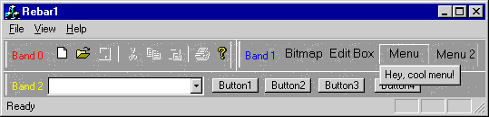

# CReBar Class
A control bar that provides layout, persistence, and state information for rebar controls.  
  
## Syntax  
  
<CodeContentPlaceHolder>0\</CodeContentPlaceHolder>  
## Members  
  
### Public Methods  
  
|Name|Description|  
|----------|-----------------|  
|[CReBar::AddBar](#crebar__addbar)|Adds a band to a rebar.|  
|[CReBar::Create](#crebar__create)|Creates the rebar control and attaches it to the <CodeContentPlaceHolder>4\</CodeContentPlaceHolder> object.|  
|[CReBar::GetReBarCtrl](#crebar__getrebarctrl)|Allows direct access to the underlying common control.|  
  
## Remarks  
 A rebar object can contain a variety of child windows, usually other controls, including edit boxes, toolbars, and list boxes. A rebar object can display its child windows over a specified bitmap. Your application can automatically resize the rebar, or the user can manually resize the rebar by clicking or dragging its gripper bar.  
  
   
  
## Rebar Control  
 A rebar object behaves similarly to a toolbar object. A rebar uses the click-and-drag mechanism to resize its bands. A rebar control can contain one or more bands, with each band having any combination of a gripper bar, a bitmap, a text label, and a child window. However, bands cannot contain more than one child window.  
  
 **CReBar** uses the [CReBarCtrl](../vs140/crebarctrl-class.md) class to provide its implementation. You can access the rebar control through [GetReBarCtrl](#crebar__getrebarctrl) to take advantage of the control's customization options. For more information about rebar controls, see <CodeContentPlaceHolder>5\</CodeContentPlaceHolder>. For more information about using rebar controls, see [Using CReBarCtrl](../vs140/using-crebarctrl.md).  
  
> [!CAUTION]
>  Rebar and rebar control objects do not support MFC control bar docking. If **CRebar::EnableDocking** is called, your application will assert.  
  
## Inheritance Hierarchy  
 [CObject](../vs140/cobject-class.md)  
  
 [CCmdTarget](../vs140/ccmdtarget-class.md)  
  
 [CWnd](../vs140/cwnd-class.md)  
  
 [CControlBar](../vs140/ccontrolbar-class.md)  
  
 <CodeContentPlaceHolder>6\</CodeContentPlaceHolder>  
  
## Requirements  
 **Header:** afxext.h  
  
##  \<a name="crebar__addbar">\</a>  CReBar::AddBar  
 Call this member function to add a band to the rebar.  
  
<CodeContentPlaceHolder>1\</CodeContentPlaceHolder>  
### Parameters  
 <CodeContentPlaceHolder>7\</CodeContentPlaceHolder>  
 A pointer to a <CodeContentPlaceHolder>8\</CodeContentPlaceHolder> object that is the child window to be inserted into the rebar. The referenced object must have a **WS_CHILD**.  
  
 <CodeContentPlaceHolder>9\</CodeContentPlaceHolder>  
 A pointer to a string containing the text to appear on the rebar. **NULL** by default. The text contained in <CodeContentPlaceHolder>10\</CodeContentPlaceHolder> is not part of the child window; it is on the rebar itself.  
  
 <CodeContentPlaceHolder>11\</CodeContentPlaceHolder>  
 A pointer to a <CodeContentPlaceHolder>12\</CodeContentPlaceHolder> object to be displayed on the rebar background. **NULL** by default.  
  
 <CodeContentPlaceHolder>13\</CodeContentPlaceHolder>  
 A <CodeContentPlaceHolder>14\</CodeContentPlaceHolder> containing the style to apply to the rebar. See the **fStyle** function description in the Win32 structure                                 [REBARBANDINFO](http://msdn.microsoft.com/library/windows/desktop/bb774393) for a complete list of band styles.  
  
 *clrFore*  
 A **COLORREF** value that represents the foreground color of the rebar.  
  
 *clrBack*  
 A **COLORREF** value that represents the background color of the rebar.  
  
### Return Value  
 Nonzero if successful; otherwise 0.  
  
### Example  
 [!code[NVC_MFC_CReBarCtrl#1](../vs140/codesnippet/CPP/crebar-class_1.cpp)]  
  
##  \<a name="crebar__create">\</a>  CReBar::Create  
 Call this member function to create a rebar.  
  
<CodeContentPlaceHolder>2\</CodeContentPlaceHolder>  
### Parameters  
 <CodeContentPlaceHolder>15\</CodeContentPlaceHolder>  
 Pointer to the <CodeContentPlaceHolder>16\</CodeContentPlaceHolder> object whose Windows window is the parent of the status bar. Normally your frame window.  
  
 <CodeContentPlaceHolder>17\</CodeContentPlaceHolder>  
 The rebar control style. By default, **RBS_BANDBORDERS**, which displays narrow lines to separate adjacent bands within the rebar control. See                                 [Rebar Control Styles](http://msdn.microsoft.com/library/windows/desktop/bb774377) in the [!INCLUDE[winSDK](../vs140/includes/winsdk_md.md)] for a list of styles.  
  
 <CodeContentPlaceHolder>18\</CodeContentPlaceHolder>  
 The rebar window styles.  
  
 <CodeContentPlaceHolder>19\</CodeContentPlaceHolder>  
 The rebar's child-window ID.  
  
### Return Value  
 Nonzero if successful; otherwise 0.  
  
### Example  
  See the example for [CReBar::AddBar](#crebar__addbar).  
  
##  \<a name="crebar__getrebarctrl">\</a>  CReBar::GetReBarCtrl  
 This member function allows direct access to the underlying common control.  
  
<CodeContentPlaceHolder>3\</CodeContentPlaceHolder>  
### Return Value  
 A reference to a [CReBarCtrl](../vs140/crebarctrl-class.md) object.  
  
### Remarks  
 Call this member function to take advantage of the functionality of the Windows rebar common control in customizing your rebar. When you call <CodeContentPlaceHolder>20\</CodeContentPlaceHolder>, it returns a reference object to the <CodeContentPlaceHolder>21\</CodeContentPlaceHolder> object so you can use either set of member functions.  
  
 For more information about using <CodeContentPlaceHolder>22\</CodeContentPlaceHolder> to customize your rebar, see [Using CReBarCtrl](../vs140/using-crebarctrl.md).  
  
### Example  
 [!code[NVC_MFC_CReBarCtrl#2](../vs140/codesnippet/CPP/crebar-class_2.cpp)]  
  
## See Also  
 [MFC Sample MFCIE](../vs140/visual-c---samples.md)   
 [Base Class](../vs140/ccontrolbar-class.md)   
 [Hierarchy Chart](../vs140/hierarchy-chart.md)