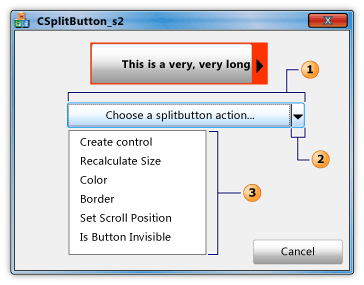

# CSplitButton Class
The <CodeContentPlaceHolder>6\</CodeContentPlaceHolder> class represents a split button control. The split button control performs a default behavior when a user clicks the main part of the button, and displays a drop-down menu when a user clicks the drop-down arrow of the button.  
  
## Syntax  
  
<CodeContentPlaceHolder>0\</CodeContentPlaceHolder>  
## Members  
  
### Public Constructors  
  
|Name|Description|  
|----------|-----------------|  
|[CSplitButton::CSplitButton](#csplitbutton__csplitbutton)|Constructs a <CodeContentPlaceHolder>7\</CodeContentPlaceHolder> object.|  
  
### Public Methods  
  
|Name|Description|  
|----------|-----------------|  
|[CSplitButton::Create](#csplitbutton__create)|Creates a split button control with specified styles and attaches it to the current <CodeContentPlaceHolder>8\</CodeContentPlaceHolder> object.|  
|[CSplitButton::SetDropDownMenu](#csplitbutton__setdropdownmenu)|Sets the drop-down menu that is displayed when a user clicks the drop-down arrow of the current split button control.|  
  
### Protected Methods  
  
|Name|Description|  
|----------|-----------------|  
|[CSplitButton::OnDropDown](#csplitbutton__ondropdown)|Handles the <CodeContentPlaceHolder>9\</CodeContentPlaceHolder> notification that the system sends when a user clicks the drop-down arrow of the current split button control.|  
  
## Remarks  
 The <CodeContentPlaceHolder>10\</CodeContentPlaceHolder> class is derived from the [CButton](../vs140/cbutton-class.md) class. The split button control is a button control whose style is <CodeContentPlaceHolder>11\</CodeContentPlaceHolder>. It displays a custom menu when a user clicks the drop-down arrow. For more information, see the <CodeContentPlaceHolder>12\</CodeContentPlaceHolder> and <CodeContentPlaceHolder>13\</CodeContentPlaceHolder> styles in                 [Button Styles](http://msdn.microsoft.com/library/windows/desktop/bb775951).  
  
 The following figure depicts a dialog box that contains a pager control and a (1) split button control. The (2) drop-down arrow has already been clicked and the (3) submenu is displayed.  
  
   
  
## Inheritance Hierarchy  
 [CObject](../vs140/cobject-class.md)  
  
 [CCmdTarget](../vs140/ccmdtarget-class.md)  
  
 [CWnd](../vs140/cwnd-class.md)  
  
 [CButton](../vs140/cbutton-class.md)  
  
 <CodeContentPlaceHolder>14\</CodeContentPlaceHolder>  
  
## Requirements  
 **Header:** afxcmn.h  
  
 This class is supported in [!INCLUDE[windowsver](../vs140/includes/windowsver_md.md)] and later.  
  
 Additional requirements for this class are described in [Build Requirements for Vista Common Controls](../vs140/build-requirements-for-windows-vista-common-controls.md).  
  
##  \<a name="csplitbutton__create">\</a>  CSplitButton::Create  
 Creates a split button control with specified styles and attaches it to the current <CodeContentPlaceHolder>15\</CodeContentPlaceHolder> object.  
  
<CodeContentPlaceHolder>1\</CodeContentPlaceHolder>  
### Parameters  
  
|Parameter|Description|  
|---------------|-----------------|  
|[in] <CodeContentPlaceHolder>16\</CodeContentPlaceHolder>|A bitwise combination (OR) of styles to be applied to the control. For more information, see [Button Styles](../vs140/button-styles.md).|  
|[in] <CodeContentPlaceHolder>17\</CodeContentPlaceHolder>|A reference to a                                         [RECT](http://msdn.microsoft.com/library/windows/desktop/dd162897) structure that contains the position and size of the control.|  
|[in] <CodeContentPlaceHolder>18\</CodeContentPlaceHolder>|A non-null pointer to a [CWnd](../vs140/cwnd-class.md) object that is the parent window of the control.|  
|[in] <CodeContentPlaceHolder>19\</CodeContentPlaceHolder>|The ID of the control.|  
  
### Return Value  
 <CodeContentPlaceHolder>20\</CodeContentPlaceHolder> if this method is successful; otherwise, <CodeContentPlaceHolder>21\</CodeContentPlaceHolder>.  
  
##  \<a name="csplitbutton__csplitbutton">\</a>  CSplitButton::CSplitButton  
 Constructs a <CodeContentPlaceHolder>22\</CodeContentPlaceHolder> object. The constructor's parameters specify a submenu that is displayed when a user clicks the drop-down arrow of the split button control.  
  
<CodeContentPlaceHolder>2\</CodeContentPlaceHolder>  
### Parameters  
  
|Parameter|Description|  
|---------------|-----------------|  
|[in] <CodeContentPlaceHolder>23\</CodeContentPlaceHolder>|The resource ID of the menu bar.|  
|[in] <CodeContentPlaceHolder>24\</CodeContentPlaceHolder>|The resource ID of a submenu.|  
|[in] <CodeContentPlaceHolder>25\</CodeContentPlaceHolder>|A pointer to a [CMenu](../vs140/cmenu-class.md) object that specifies a submenu. The <CodeContentPlaceHolder>26\</CodeContentPlaceHolder> object deletes the <CodeContentPlaceHolder>27\</CodeContentPlaceHolder> object and its associated <CodeContentPlaceHolder>28\</CodeContentPlaceHolder> when the <CodeContentPlaceHolder>29\</CodeContentPlaceHolder> object goes out of scope.|  
  
### Remarks  
 Use the [CSplitButton::Create](#csplitbutton__create) method to create a split button control and attach it to the <CodeContentPlaceHolder>30\</CodeContentPlaceHolder> object.  
  
##  \<a name="csplitbutton__ondropdown">\</a>  CSplitButton::OnDropDown  
 Handles the <CodeContentPlaceHolder>31\</CodeContentPlaceHolder> notification that the system sends when a user clicks the drop-down arrow of the current split button control.  
  
<CodeContentPlaceHolder>3\</CodeContentPlaceHolder>  
### Parameters  
  
|Parameter|Description|  
|---------------|-----------------|  
|[in] <CodeContentPlaceHolder>32\</CodeContentPlaceHolder>|Pointer to an                                         [NMHDR](http://msdn.microsoft.com/library/windows/desktop/bb775514) structure that contains information about the                                         [BCN_DROPDOWN](http://msdn.microsoft.com/library/windows/desktop/bb775983) notification.|  
|[out] <CodeContentPlaceHolder>33\</CodeContentPlaceHolder>|(Not used; no value is returned.) Return value of the                                         [BCN_DROPDOWN](http://msdn.microsoft.com/library/windows/desktop/bb775983) notification.|  
  
### Remarks  
 When the user clicks the drop-down arrow on a split button control, system sends a <CodeContentPlaceHolder>34\</CodeContentPlaceHolder> notification message, which the <CodeContentPlaceHolder>35\</CodeContentPlaceHolder> method handles. However, the <CodeContentPlaceHolder>36\</CodeContentPlaceHolder> object does not forward the <CodeContentPlaceHolder>37\</CodeContentPlaceHolder> notification to the control that contains the split button control. Consequently, the containing control cannot support a custom action in response to the notification.  
  
 To implement a custom action that the containing control supports, use a [CButton](../vs140/cbutton-class.md) object with a style of <CodeContentPlaceHolder>38\</CodeContentPlaceHolder> instead of a <CodeContentPlaceHolder>39\</CodeContentPlaceHolder> object. Then implement a handler for the <CodeContentPlaceHolder>40\</CodeContentPlaceHolder> notification in the <CodeContentPlaceHolder>41\</CodeContentPlaceHolder> object. For more information, see [Button Styles](../vs140/button-styles.md).  
  
 To implement a custom action that the split button control itself supports, use [message reflection](../vs140/tn062--message-reflection-for-windows-controls.md). Derive your own class from the <CodeContentPlaceHolder>42\</CodeContentPlaceHolder> class and name it, for example, CMySplitButton. Then add the following message map to your application to handle the <CodeContentPlaceHolder>43\</CodeContentPlaceHolder> notification:  
  
<CodeContentPlaceHolder>4\</CodeContentPlaceHolder>  
##  \<a name="csplitbutton__setdropdownmenu">\</a>  CSplitButton::SetDropDownMenu  
 Sets the drop-down menu that is displayed when a user clicks the drop-down arrow of the current split button control.  
  
<CodeContentPlaceHolder>5\</CodeContentPlaceHolder>  
### Parameters  
  
|Parameter|Description|  
|---------------|-----------------|  
|[in] <CodeContentPlaceHolder>44\</CodeContentPlaceHolder>|The resource ID of the menu bar.|  
|[in] <CodeContentPlaceHolder>45\</CodeContentPlaceHolder>|The resource ID of a submenu.|  
|[in] <CodeContentPlaceHolder>46\</CodeContentPlaceHolder>|Pointer to a [CMenu](../vs140/cmenu-class.md) object that specifies a submenu. The <CodeContentPlaceHolder>47\</CodeContentPlaceHolder> object deletes the <CodeContentPlaceHolder>48\</CodeContentPlaceHolder> object and its associated <CodeContentPlaceHolder>49\</CodeContentPlaceHolder> when the <CodeContentPlaceHolder>50\</CodeContentPlaceHolder> object goes out of scope.|  
  
### Remarks  
 The <CodeContentPlaceHolder>51\</CodeContentPlaceHolder> parameter identifies a menu bar, which is a horizontal list of menu bar items. The <CodeContentPlaceHolder>52\</CodeContentPlaceHolder> parameter is a zero-based index number that identifies a submenu, which is the drop-down list of menu items associated with each menu bar item. For example, a typical application has a menu that contains the menu bar items, "File," "Edit," and "Help." The "File" menu bar item has a submenu that contains the menu items, "Open," "Close" and "Exit." When the drop-down arrow of the split-button control is clicked, the control displays the specified submenu, not the menu bar.  
  
 The following figure depicts a dialog box that contains a pager control and a (1) split button control. The (2) drop-down arrow has already been clicked and the (3) submenu is displayed.  
  
   
  
### Example  
 The first statement in the following code example demonstrates the [CSplitButton::SetDropDownMenu](#csplitbutton__setdropdownmenu) method. We created the menu with the Visual Studio resource editor, which automatically named the menu bar ID, <CodeContentPlaceHolder>53\</CodeContentPlaceHolder>. The <CodeContentPlaceHolder>54\</CodeContentPlaceHolder> parameter, which is zero, refers to the only submenu of the menu bar.  
  
 [!code[NVC_MFC_CSplitButton_s2#1](../vs140/codesnippet/CPP/csplitbutton-class_1.cpp)]  
  
## See Also  
 [CSplitButton Class](../vs140/csplitbutton-class.md)   
 [Hierarchy Chart](../vs140/hierarchy-chart.md)   
 [CButton Class](../vs140/cbutton-class.md)