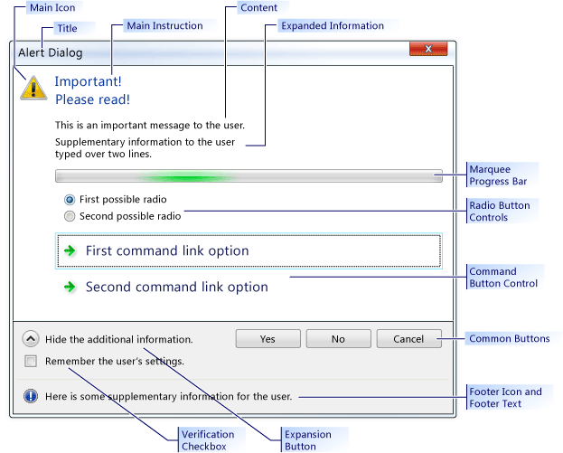

# CTaskDialog Class
A pop-up dialog box that functions like a message box but can display additional information to the user. The <CodeContentPlaceHolder>56\</CodeContentPlaceHolder> also includes functionality for gathering information from the user.  
  
## Syntax  
  
<CodeContentPlaceHolder>0\</CodeContentPlaceHolder>  
## Members  
  
### Constructors  
  
|||  
|-|-|  
|[CTaskDialog::CTaskDialog](#ctaskdialog__ctaskdialog)|Constructs a <CodeContentPlaceHolder>57\</CodeContentPlaceHolder> object.|  
  
### Methods  
  
|||  
|-|-|  
|[CTaskDialog::AddCommandControl](#ctaskdialog__addcommandcontrol)|Adds a command button control to the <CodeContentPlaceHolder>58\</CodeContentPlaceHolder>.|  
|[CTaskDialog::AddRadioButton](#ctaskdialog__addradiobutton)|Adds a radio button to the <CodeContentPlaceHolder>59\</CodeContentPlaceHolder>.|  
|[CTaskDialog::ClickCommandControl](#ctaskdialog__clickcommandcontrol)|Clicks a command button control or common button programmatically.|  
|[CTaskDialog::ClickRadioButton](#ctaskdialog__clickradiobutton)|Clicks a radio button programmatically.|  
|[CTaskDialog::DoModal](#ctaskdialog__domodal)|Displays the <CodeContentPlaceHolder>60\</CodeContentPlaceHolder>.|  
|[CTaskDialog::GetCommonButtonCount](#ctaskdialog__getcommonbuttoncount)|Retrieves the number of common buttons available.|  
|[CTaskDialog::GetCommonButtonFlag](#ctaskdialog__getcommonbuttonflag)|Converts a standard Windows button to the common button type associated with the <CodeContentPlaceHolder>61\</CodeContentPlaceHolder> class.|  
|[CTaskDialog::GetCommonButtonId](#ctaskdialog__getcommonbuttonid)|Converts one of the common button types associated with the <CodeContentPlaceHolder>62\</CodeContentPlaceHolder> class to a standard Windows button.|  
|[CTaskDialog::GetOptions](#ctaskdialog__getoptions)|Returns the option flags for this <CodeContentPlaceHolder>63\</CodeContentPlaceHolder>.|  
|[CTaskDialog::GetSelectedCommandControlID](#ctaskdialog__getselectedcommandcontrolid)|Returns the selected command button control.|  
|[CTaskDialog::GetSelectedRadioButtonID](#ctaskdialog__getselectedradiobuttonid)|Returns the selected radio button.|  
|[CTaskDialog::GetVerificationCheckboxState](#ctaskdialog__getverificationcheckboxstate)|Retrieves the state of the verification check box.|  
|[CTaskDialog::IsCommandControlEnabled](#ctaskdialog__iscommandcontrolenabled)|Determines whether a command button control or common button is enabled.|  
|[CTaskDialog::IsRadioButtonEnabled](#ctaskdialog__isradiobuttonenabled)|Determines whether a radio button is enabled.|  
|[CTaskDialog::IsSupported](#ctaskdialog__issupported)|Determines whether the computer that is running the application supports the <CodeContentPlaceHolder>64\</CodeContentPlaceHolder>.|  
|[CTaskDialog::LoadCommonControls](#ctaskdialog__loadcommandcontrols)|Adds command button controls by using data from the string table.|  
|[CTaskDialog::LoadRadioButtons](#ctaskdialog__loadradiobuttons)|Adds radio buttons by using data from the string table.|  
|[CTaskDialog::NavigateTo](#ctaskdialog__navigateto)|Transfers the focus to another <CodeContentPlaceHolder>65\</CodeContentPlaceHolder>.|  
|[CTaskDialog::OnCommandControlClick](#ctaskdialog__oncommandcontrolclick)|The framework calls this method when the user clicks a command button control.|  
|[CTaskDialog::OnCreate](#ctaskdialog__oncreate)|The framework calls this method after it creates the <CodeContentPlaceHolder>66\</CodeContentPlaceHolder>.|  
|[CTaskDialog::OnDestroy](#ctaskdialog__ondestroy)|The framework calls this method immediately before it destroys the <CodeContentPlaceHolder>67\</CodeContentPlaceHolder>.|  
|[CTaskDialog::OnExpandButtonClick](#ctaskdialog__onexpandbuttonclick)|The framework calls this method when the user clicks on the expansion button.|  
|[CTaskDialog::OnHelp](#ctaskdialog__onhelp)|The framework calls this method when the user requests help.|  
|[CTaskDialog::OnHyperlinkClick](#ctaskdialog__onhyperlinkclick)|The framework calls this method when the user clicks on a hyperlink.|  
|[CTaskDialog::OnInit](#ctaskdialog__oninit)|The framework calls this method when the <CodeContentPlaceHolder>68\</CodeContentPlaceHolder> is initialized.|  
|[CTaskDialog::OnNavigatePage](#ctaskdialog__onnavigatepage)|The framework calls this method when the user moves the focus with regard to controls on the <CodeContentPlaceHolder>69\</CodeContentPlaceHolder>.|  
|[CTaskDialog::OnRadioButtonClick](#ctaskdialog__onradiobuttonclick)|The framework calls this method when the user selects a radio button control.|  
|[CTaskDialog::OnTimer](#ctaskdialog__ontimer)|The framework calls this method when the timer expires.|  
|[CTaskDialog::OnVerificationCheckboxClick](#ctaskdialog__onverificationcheckboxclick)|The framework calls this method when the user clicks the verification check box.|  
|[CTaskDialog::RemoveAllCommandControls](#ctaskdialog__removeallcommandcontrols)|Removes all the command controls from the <CodeContentPlaceHolder>70\</CodeContentPlaceHolder>.|  
|[CTaskDialog::RemoveAllRadioButtons](#ctaskdialog__removeallradiobuttons)|Removes all the radio buttons from the <CodeContentPlaceHolder>71\</CodeContentPlaceHolder>.|  
|[CTaskDialog::SetCommandControlOptions](#ctaskdialog__setcommandcontroloptions)|Updates a command button control on the <CodeContentPlaceHolder>72\</CodeContentPlaceHolder>.|  
|[CTaskDialog::SetCommonButtonOptions](#ctaskdialog__setcommonbuttonoptions)|Updates a subset of common buttons to be enabled and require UAC elevation.|  
|[CTaskDialog::SetCommonButtons](#ctaskdialog__setcommonbuttons)|Adds common buttons to the <CodeContentPlaceHolder>73\</CodeContentPlaceHolder>.|  
|[CTaskDialog::SetContent](#ctaskdialog__setcontent)|Updates the content of the <CodeContentPlaceHolder>74\</CodeContentPlaceHolder>.|  
|[CTaskDialog::SetDefaultCommandControl](#ctaskdialog__setdefaultcommandcontrol)|Specifies the default command button control.|  
|[CTaskDialog::SetDefaultRadioButton](#ctaskdialog__setdefaultradiobutton)|Specifies the default radio button.|  
|[CTaskDialog::SetDialogWidth](#ctaskdialog__setdialogwidth)|Adjusts the width of the <CodeContentPlaceHolder>75\</CodeContentPlaceHolder>.|  
|[CTaskDialog::SetExpansionArea](#ctaskdialog__setexpansionarea)|Updates the expansion area of the <CodeContentPlaceHolder>76\</CodeContentPlaceHolder>.|  
|[CTaskDialog::SetFooterIcon](#ctaskdialog__setfootericon)|Updates the footer icon for the <CodeContentPlaceHolder>77\</CodeContentPlaceHolder>.|  
|[CTaskDialog::SetFooterText](#ctaskdialog__setfootertext)|Updates the text on the footer of the <CodeContentPlaceHolder>78\</CodeContentPlaceHolder>.|  
|[CTaskDialog::SetMainIcon](#ctaskdialog__setmainicon)|Updates the main icon of the <CodeContentPlaceHolder>79\</CodeContentPlaceHolder>.|  
|[CTaskDialog::SetMainInstruction](#ctaskdialog__setmaininstruction)|Updates the main instruction of the <CodeContentPlaceHolder>80\</CodeContentPlaceHolder>.|  
|[CTaskDialog::SetOptions](#ctaskdialog__setoptions)|Configures the options for the <CodeContentPlaceHolder>81\</CodeContentPlaceHolder>.|  
|[CTaskDialog::SetProgressBarMarquee](#ctaskdialog__setprogressbarmarquee)|Configures a marquee bar for the <CodeContentPlaceHolder>82\</CodeContentPlaceHolder> and adds it to the dialog box.|  
|[CTaskDialog::SetProgressBarPosition](#ctaskdialog__setprogressbarposition)|Adjusts the position of the progress bar.|  
|[CTaskDialog::SetProgressBarRange](#ctaskdialog__setprogressbarrange)|Adjusts the range of the progress bar.|  
|[CTaskDialog::SetProgressBarState](#ctaskdialog__setprogressbarstate)|Sets the state of the progress bar and displays it on the <CodeContentPlaceHolder>83\</CodeContentPlaceHolder>.|  
|[CTaskDialog::SetRadioButtonOptions](#ctaskdialog__setradiobuttonoptions)|Enables or disables a radio button.|  
|[CTaskDialog::SetVerificationCheckbox](#ctaskdialog__setverificationcheckbox)|Sets the checked state of the verification check box.|  
|[CTaskDialog::SetVerificationCheckboxText](#ctaskdialog__setverificationcheckboxtext)|Sets the text on the right side of the verification check box.|  
|[CTaskDialog::SetWindowTitle](#ctaskdialog__setwindowtitle)|Sets the title of the <CodeContentPlaceHolder>84\</CodeContentPlaceHolder>.|  
|[CTaskDialog::ShowDialog](#ctaskdialog__showdialog)|Creates and displays a <CodeContentPlaceHolder>85\</CodeContentPlaceHolder>.|  
|[CTaskDialog::TaskDialogCallback](#ctaskdialog__taskdialogcallback)|The framework calls this in response to various Windows messages.|  
  
### Data Members  
  
|||  
|-|-|  
|<CodeContentPlaceHolder>86\</CodeContentPlaceHolder>|The array of command button controls for the <CodeContentPlaceHolder>87\</CodeContentPlaceHolder>.|  
|<CodeContentPlaceHolder>88\</CodeContentPlaceHolder>|The array of radio button controls for the <CodeContentPlaceHolder>89\</CodeContentPlaceHolder>.|  
|<CodeContentPlaceHolder>90\</CodeContentPlaceHolder>|<CodeContentPlaceHolder>91\</CodeContentPlaceHolder> indicates the verification check box is checked; <CodeContentPlaceHolder>92\</CodeContentPlaceHolder> indicates it is not.|  
|<CodeContentPlaceHolder>93\</CodeContentPlaceHolder>|The icon in the footer of the <CodeContentPlaceHolder>94\</CodeContentPlaceHolder>.|  
|<CodeContentPlaceHolder>95\</CodeContentPlaceHolder>|A handle to the window for the <CodeContentPlaceHolder>96\</CodeContentPlaceHolder>.|  
|<CodeContentPlaceHolder>97\</CodeContentPlaceHolder>|The main icon of the <CodeContentPlaceHolder>98\</CodeContentPlaceHolder>.|  
|<CodeContentPlaceHolder>99\</CodeContentPlaceHolder>|A mask that indicates which of the common buttons are disabled.|  
|<CodeContentPlaceHolder>100\</CodeContentPlaceHolder>|A mask that indicates which of the common buttons require UAC elevation.|  
|<CodeContentPlaceHolder>101\</CodeContentPlaceHolder>|The ID of the selected command button control.|  
|<CodeContentPlaceHolder>102\</CodeContentPlaceHolder>|A mask that indicates which common buttons are displayed on the <CodeContentPlaceHolder>103\</CodeContentPlaceHolder>.|  
|<CodeContentPlaceHolder>104\</CodeContentPlaceHolder>|The ID of the command button control that is selected when the <CodeContentPlaceHolder>105\</CodeContentPlaceHolder> is displayed.|  
|<CodeContentPlaceHolder>106\</CodeContentPlaceHolder>|The ID of the radio button control that is selected when the <CodeContentPlaceHolder>107\</CodeContentPlaceHolder> is displayed.|  
|<CodeContentPlaceHolder>108\</CodeContentPlaceHolder>|A mask that indicates the options for the <CodeContentPlaceHolder>109\</CodeContentPlaceHolder>.|  
|<CodeContentPlaceHolder>110\</CodeContentPlaceHolder>|The current position for the progress bar.  This value must be between <CodeContentPlaceHolder>111\</CodeContentPlaceHolder> and <CodeContentPlaceHolder>112\</CodeContentPlaceHolder>.|  
|<CodeContentPlaceHolder>113\</CodeContentPlaceHolder>|The maximum value for the progress bar.|  
|<CodeContentPlaceHolder>114\</CodeContentPlaceHolder>|The minimum value for the progress bar.|  
|<CodeContentPlaceHolder>115\</CodeContentPlaceHolder>|The state of the progress bar. For more information, see [CTaskDialog::SetProgressBarState](#ctaskdialog__setprogressbarstate).|  
|<CodeContentPlaceHolder>116\</CodeContentPlaceHolder>|The ID of the selected radio button control.|  
|<CodeContentPlaceHolder>117\</CodeContentPlaceHolder>|The width of the <CodeContentPlaceHolder>118\</CodeContentPlaceHolder> in pixels.|  
|<CodeContentPlaceHolder>119\</CodeContentPlaceHolder>|The string the <CodeContentPlaceHolder>120\</CodeContentPlaceHolder> displays to the right of the expansion box when the expanded information is hidden.|  
|<CodeContentPlaceHolder>121\</CodeContentPlaceHolder>|The content string of the <CodeContentPlaceHolder>122\</CodeContentPlaceHolder>.|  
|<CodeContentPlaceHolder>123\</CodeContentPlaceHolder>|The string the <CodeContentPlaceHolder>124\</CodeContentPlaceHolder> displays to the right of the expansion box when the expanded information is displayed.|  
|<CodeContentPlaceHolder>125\</CodeContentPlaceHolder>|The footer of the <CodeContentPlaceHolder>126\</CodeContentPlaceHolder>.|  
|<CodeContentPlaceHolder>127\</CodeContentPlaceHolder>|The expanded information for the <CodeContentPlaceHolder>128\</CodeContentPlaceHolder>.|  
|<CodeContentPlaceHolder>129\</CodeContentPlaceHolder>|The main instruction of the <CodeContentPlaceHolder>130\</CodeContentPlaceHolder>.|  
|<CodeContentPlaceHolder>131\</CodeContentPlaceHolder>|The title of the <CodeContentPlaceHolder>132\</CodeContentPlaceHolder>.|  
|<CodeContentPlaceHolder>133\</CodeContentPlaceHolder>|The string that the <CodeContentPlaceHolder>134\</CodeContentPlaceHolder> displays to the right of the verification check box.|  
  
## Remarks  
 The <CodeContentPlaceHolder>135\</CodeContentPlaceHolder> class replaces the standard Windows message box and has additional functionality such as new controls to gather information from the user. This class is in the MFC library in [!INCLUDE[vs_dev10_long](../vs140/includes/vs_dev10_long_md.md)]. The <CodeContentPlaceHolder>136\</CodeContentPlaceHolder> is available starting with [!INCLUDE[wiprlhext](../vs140/includes/wiprlhext_md.md)]. Earlier versions of Windows cannot display the <CodeContentPlaceHolder>137\</CodeContentPlaceHolder> object. Use <CodeContentPlaceHolder>138\</CodeContentPlaceHolder> to determine at runtime whether the current user can display the task dialog box. The standard Windows message box is still supported in [!INCLUDE[vs_dev10_long](../vs140/includes/vs_dev10_long_md.md)].  
  
 The <CodeContentPlaceHolder>139\</CodeContentPlaceHolder> is available only when you build your application by using the Unicode library.  
  
 The <CodeContentPlaceHolder>140\</CodeContentPlaceHolder> has two different constructors. One constructor enables you to specify two command buttons and a maximum of six regular button controls. You can add more command buttons after you create the <CodeContentPlaceHolder>141\</CodeContentPlaceHolder>. The second constructor does not support any command buttons, but you can add an unlimited number of regular button controls. For more information about the constructors, see [CTaskDialog::CTaskDialog](#ctaskdialog__ctaskdialog).  
  
 The following image shows a sample <CodeContentPlaceHolder>142\</CodeContentPlaceHolder> to illustrate the location of some of the controls.  
  
   
CTaskDialog Sample  
  
## Requirements  
 **Minimum required operating system:** [!INCLUDE[wiprlhext](../vs140/includes/wiprlhext_md.md)]  
  
 **Header:** afxtaskdialog.h  
  
##  \<a name="ctaskdialog__addcommandcontrol">\</a>  CTaskDialog::AddCommandControl  
 Adds a new command button control to the <CodeContentPlaceHolder>143\</CodeContentPlaceHolder>.  
  
<CodeContentPlaceHolder>1\</CodeContentPlaceHolder>  
### Parameters  
 [in] <CodeContentPlaceHolder>144\</CodeContentPlaceHolder>  
 The command control identification number.  
  
 [in] <CodeContentPlaceHolder>145\</CodeContentPlaceHolder>  
 The string that the <CodeContentPlaceHolder>146\</CodeContentPlaceHolder> displays to the user. Use this string to explain the purpose of the command.  
  
 [in] <CodeContentPlaceHolder>147\</CodeContentPlaceHolder>  
 A Boolean parameter that indicates if the new button is enabled or disabled.  
  
 [in] <CodeContentPlaceHolder>148\</CodeContentPlaceHolder>  
 A Boolean parameter that indicates whether a command requires elevation.  
  
### Remarks  
 The [CTaskDialog Class](../vs140/ctaskdialog-class.md) can display an unlimited number of command button controls. However, if a <CodeContentPlaceHolder>149\</CodeContentPlaceHolder> displays any command button controls, it can display a maximum of six buttons. If a <CodeContentPlaceHolder>150\</CodeContentPlaceHolder> has no command button controls, it can display an unlimited number of buttons.  
  
 When the user selects a command button control, the <CodeContentPlaceHolder>151\</CodeContentPlaceHolder> closes. If your application displays the dialog box by using [CTaskDialog::DoModal](#ctaskdialog__domodal), <CodeContentPlaceHolder>152\</CodeContentPlaceHolder> returns the <CodeContentPlaceHolder>153\</CodeContentPlaceHolder> of the selected command button control.  
  
### Example  
 [!code[NVC_MFC_CTaskDialog#2](../vs140/codesnippet/CPP/ctaskdialog-class_1.cpp)]  
  
##  \<a name="ctaskdialog__addradiobutton">\</a>  CTaskDialog::AddRadioButton  
 Adds a radio button to the <CodeContentPlaceHolder>154\</CodeContentPlaceHolder>.  
  
<CodeContentPlaceHolder>2\</CodeContentPlaceHolder>  
### Parameters  
 [in] <CodeContentPlaceHolder>155\</CodeContentPlaceHolder>  
 The identification number of the radio button.  
  
 [in] <CodeContentPlaceHolder>156\</CodeContentPlaceHolder>  
 The string that the <CodeContentPlaceHolder>157\</CodeContentPlaceHolder> displays next to the radio button.  
  
 [in] <CodeContentPlaceHolder>158\</CodeContentPlaceHolder>  
 A Boolean parameter that indicates whether the radio button is enabled.  
  
### Remarks  
 The radio buttons for the [CTaskDialog Class](../vs140/ctaskdialog-class.md) enable you to gather information from the user. Use the function [CTaskDialog::GetSelectedRadioButtonID](#ctaskdialog__getselectedradiobuttonid) to determine which radio button is selected.  
  
 The <CodeContentPlaceHolder>159\</CodeContentPlaceHolder> does not require that the <CodeContentPlaceHolder>160\</CodeContentPlaceHolder> parameters are unique for each radio button. However, you may experience unexpected behavior if you do not use a distinct identifier for each radio button.  
  
### Example  
 [!code[NVC_MFC_CTaskDialog#3](../vs140/codesnippet/CPP/ctaskdialog-class_2.cpp)]  
  
##  \<a name="ctaskdialog__clickcommandcontrol">\</a>  CTaskDialog::ClickCommandControl  
 Clicks a command button control or common button programmatically.  
  
<CodeContentPlaceHolder>3\</CodeContentPlaceHolder>  
### Parameters  
 [in] <CodeContentPlaceHolder>161\</CodeContentPlaceHolder>  
 The command ID of the control to click.  
  
### Remarks  
 This method generates the windows message <CodeContentPlaceHolder>162\</CodeContentPlaceHolder>.  
  
##  \<a name="ctaskdialog__clickradiobutton">\</a>  CTaskDialog::ClickRadioButton  
 Clicks a radio button programmatically.  
  
<CodeContentPlaceHolder>4\</CodeContentPlaceHolder>  
### Parameters  
 [in] <CodeContentPlaceHolder>163\</CodeContentPlaceHolder>  
 The ID of the radio button to click.  
  
### Remarks  
 This method generates the windows message <CodeContentPlaceHolder>164\</CodeContentPlaceHolder>.  
  
##  \<a name="ctaskdialog__ctaskdialog">\</a>  CTaskDialog::CTaskDialog  
 Creates an instance of the [CTaskDialog Class](../vs140/ctaskdialog-class.md).  
  
<CodeContentPlaceHolder>5\</CodeContentPlaceHolder>  
### Parameters  
 [in] <CodeContentPlaceHolder>165\</CodeContentPlaceHolder>  
 The string to use for the content of the <CodeContentPlaceHolder>166\</CodeContentPlaceHolder>.  
  
 [in] <CodeContentPlaceHolder>167\</CodeContentPlaceHolder>  
 The main instruction of the <CodeContentPlaceHolder>168\</CodeContentPlaceHolder>.  
  
 [in] <CodeContentPlaceHolder>169\</CodeContentPlaceHolder>  
 The title of the <CodeContentPlaceHolder>170\</CodeContentPlaceHolder>.  
  
 [in] <CodeContentPlaceHolder>171\</CodeContentPlaceHolder>  
 A mask of the common buttons to add to the <CodeContentPlaceHolder>172\</CodeContentPlaceHolder>.  
  
 [in] <CodeContentPlaceHolder>173\</CodeContentPlaceHolder>  
 The set of options to use for the <CodeContentPlaceHolder>174\</CodeContentPlaceHolder>.  
  
 [in] <CodeContentPlaceHolder>175\</CodeContentPlaceHolder>  
 The string to use as the footer.  
  
 [in] <CodeContentPlaceHolder>176\</CodeContentPlaceHolder>  
 The string ID of the first command.  
  
 [in] <CodeContentPlaceHolder>177\</CodeContentPlaceHolder>  
 The string ID of the last command.  
  
### Remarks  
 There are two ways that you can add a <CodeContentPlaceHolder>178\</CodeContentPlaceHolder> to your application. The first way is to use one of the constructors to create a <CodeContentPlaceHolder>179\</CodeContentPlaceHolder> and display it using [CTaskDialog::DoModal](#ctaskdialog__domodal). The second way is to use the static function [CTaskDialog::ShowDialog](#ctaskdialog__showdialog), which enables you to display a <CodeContentPlaceHolder>180\</CodeContentPlaceHolder> without explicitly creating a <CodeContentPlaceHolder>181\</CodeContentPlaceHolder> object.  
  
 The second constructor creates command button controls by using data from the resource file of your application. The string table in the resource file has several strings with associated string IDs. This method adds a command button control for each valid entry in the string table between <CodeContentPlaceHolder>182\</CodeContentPlaceHolder> and <CodeContentPlaceHolder>183\</CodeContentPlaceHolder>, inclusive. For these command button controls, the string in the string table is the control's caption and the string ID is the control's ID.  
  
 See [CTaskDialog::SetOptions](#ctaskdialog__setoptions) for a list of valid options.  
  
### Example  
 [!code[NVC_MFC_CTaskDialog#7](../vs140/codesnippet/CPP/ctaskdialog-class_3.cpp)]  
  
##  \<a name="ctaskdialog__domodal">\</a>  CTaskDialog::DoModal  
 Shows the <CodeContentPlaceHolder>184\</CodeContentPlaceHolder> and makes it modal.  
  
<CodeContentPlaceHolder>6\</CodeContentPlaceHolder>  
### Parameters  
 [in] <CodeContentPlaceHolder>185\</CodeContentPlaceHolder>  
 The parent window for the <CodeContentPlaceHolder>186\</CodeContentPlaceHolder>.  
  
### Return Value  
 An integer that corresponds to the selection made by the user.  
  
### Remarks  
 Displays this instance of the [CTaskDialog](../vs140/ctaskdialog-class.md). The application then waits for the user to close the dialog box.  
  
 The <CodeContentPlaceHolder>187\</CodeContentPlaceHolder> closes when the user selects a common button, a command link control, or closes the <CodeContentPlaceHolder>188\</CodeContentPlaceHolder>. The return value is the identifier that indicates how the user closed the dialog box.  
  
### Example  
 [!code[NVC_MFC_CTaskDialog#7](../vs140/codesnippet/CPP/ctaskdialog-class_3.cpp)]  
  
##  \<a name="ctaskdialog__getcommonbuttoncount">\</a>  CTaskDialog::GetCommonButtonCount  
 Retrieves the number of common buttons.  
  
<CodeContentPlaceHolder>7\</CodeContentPlaceHolder>  
### Return Value  
 The number of common buttons available.  
  
### Remarks  
 The common buttons are the default buttons that you provide to [CTaskDialog::CTaskDialog](#ctaskdialog__ctaskdialog). The [CTaskDialog Class](../vs140/ctaskdialog-class.md) displays the buttons along the bottom of the dialog box.  
  
 The enumerated list of buttons is provided in CommCtrl.h.  
  
##  \<a name="ctaskdialog__getcommonbuttonflag">\</a>  CTaskDialog::GetCommonButtonFlag  
 Converts a standard Windows button to the common button type associated with the [CTaskDialog Class](../vs140/ctaskdialog-class.md).  
  
<CodeContentPlaceHolder>8\</CodeContentPlaceHolder>  
### Parameters  
 [in] <CodeContentPlaceHolder>189\</CodeContentPlaceHolder>  
 The standard Windows button value.  
  
### Return Value  
 The value of the corresponding <CodeContentPlaceHolder>190\</CodeContentPlaceHolder> common button. If there is no corresponding common button, this method returns 0.  
  
##  \<a name="ctaskdialog__getcommonbuttonid">\</a>  CTaskDialog::GetCommonButtonId  
 Converts one of the common button types associated with the [CTaskDialog Class](../vs140/ctaskdialog-class.md) to a standard Windows button.  
  
<CodeContentPlaceHolder>9\</CodeContentPlaceHolder>  
### Parameters  
 [in] <CodeContentPlaceHolder>191\</CodeContentPlaceHolder>  
 The common button type associated with the <CodeContentPlaceHolder>192\</CodeContentPlaceHolder> class.  
  
### Return Value  
 The value of the corresponding standard Windows button. If there is no corresponding Windows button, the method returns 0.  
  
##  \<a name="ctaskdialog__getoptions">\</a>  CTaskDialog::GetOptions  
 Returns the option flags for this <CodeContentPlaceHolder>193\</CodeContentPlaceHolder>.  
  
<CodeContentPlaceHolder>10\</CodeContentPlaceHolder>  
### Return Value  
 The flags for the <CodeContentPlaceHolder>194\</CodeContentPlaceHolder>.  
  
### Remarks  
 For more information about the options available to the [CTaskDialog Class](../vs140/ctaskdialog-class.md), see [CTaskDialog::SetOptions](#ctaskdialog__setoptions).  
  
### Example  
 [!code[NVC_MFC_CTaskDialog#7](../vs140/codesnippet/CPP/ctaskdialog-class_3.cpp)]  
  
##  \<a name="ctaskdialog__getselectedcommandcontrolid">\</a>  CTaskDialog::GetSelectedCommandControlID  
 Returns the selected command button control.  
  
<CodeContentPlaceHolder>11\</CodeContentPlaceHolder>  
### Return Value  
 The ID of the currently selected command button control.  
  
### Remarks  
 You do not have to use this method to retrieve the ID of the command button that the user selected. That ID is returned by either [CTaskDialog::DoModal](#ctaskdialog__domodal) or [CTaskDialog::ShowDialog](#ctaskdialog__showdialog).  
  
### Example  
 [!code[NVC_MFC_CTaskDialog#2](../vs140/codesnippet/CPP/ctaskdialog-class_1.cpp)]  
  
##  \<a name="ctaskdialog__getselectedradiobuttonid">\</a>  CTaskDialog::GetSelectedRadioButtonID  
 Returns the selected radio button.  
  
<CodeContentPlaceHolder>12\</CodeContentPlaceHolder>  
### Return Value  
 The ID of the selected radio button.  
  
### Remarks  
 You can use this method after the user closes the dialog box to retrieve the selected radio button.  
  
### Example  
 [!code[NVC_MFC_CTaskDialog#3](../vs140/codesnippet/CPP/ctaskdialog-class_2.cpp)]  
  
##  \<a name="ctaskdialog__getverificationcheckboxstate">\</a>  CTaskDialog::GetVerificationCheckboxState  
 Retrieves the state of the verification check box.  
  
<CodeContentPlaceHolder>13\</CodeContentPlaceHolder>  
### Return Value  
 <CodeContentPlaceHolder>195\</CodeContentPlaceHolder> if the check box is checked, <CodeContentPlaceHolder>196\</CodeContentPlaceHolder> if it is not.  
  
### Example  
 [!code[NVC_MFC_CTaskDialog#5](../vs140/codesnippet/CPP/ctaskdialog-class_4.cpp)]  
  
##  \<a name="ctaskdialog__iscommandcontrolenabled">\</a>  CTaskDialog::IsCommandControlEnabled  
 Determines whether a command button control or button is enabled.  
  
<CodeContentPlaceHolder>14\</CodeContentPlaceHolder>  
### Parameters  
 [in] <CodeContentPlaceHolder>197\</CodeContentPlaceHolder>  
 The ID of the command button control or button to test.  
  
### Return Value  
 <CodeContentPlaceHolder>198\</CodeContentPlaceHolder> if the control is enabled, <CodeContentPlaceHolder>199\</CodeContentPlaceHolder> if it is not.  
  
### Remarks  
 You can use this method to determine the availability of both command button controls and the common buttons of the [CTaskDialog Class](../vs140/ctaskdialog-class.md).  
  
 If <CodeContentPlaceHolder>200\</CodeContentPlaceHolder> is not a valid identifier for either a common <CodeContentPlaceHolder>201\</CodeContentPlaceHolder> button or a command button control, this method throws an exception.  
  
### Example  
 [!code[NVC_MFC_CTaskDialog#2](../vs140/codesnippet/CPP/ctaskdialog-class_1.cpp)]  
  
##  \<a name="ctaskdialog__isradiobuttonenabled">\</a>  CTaskDialog::IsRadioButtonEnabled  
 Determines whether a radio button is enabled.  
  
<CodeContentPlaceHolder>15\</CodeContentPlaceHolder>  
### Parameters  
 [in] <CodeContentPlaceHolder>202\</CodeContentPlaceHolder>  
 The ID of the radio button to test.  
  
### Return Value  
 <CodeContentPlaceHolder>203\</CodeContentPlaceHolder> if the radio button is enabled, <CodeContentPlaceHolder>204\</CodeContentPlaceHolder> if it is not.  
  
### Remarks  
 If <CodeContentPlaceHolder>205\</CodeContentPlaceHolder> is not a valid identifier for a radio button, this method throws an exception.  
  
### Example  
 [!code[NVC_MFC_CTaskDialog#3](../vs140/codesnippet/CPP/ctaskdialog-class_2.cpp)]  
  
##  \<a name="ctaskdialog__issupported">\</a>  CTaskDialog::IsSupported  
 Determines whether the computer that is running the application supports the <CodeContentPlaceHolder>206\</CodeContentPlaceHolder>.  
  
<CodeContentPlaceHolder>16\</CodeContentPlaceHolder>  
### Return Value  
 <CodeContentPlaceHolder>207\</CodeContentPlaceHolder> if the computer supports the <CodeContentPlaceHolder>208\</CodeContentPlaceHolder>; <CodeContentPlaceHolder>209\</CodeContentPlaceHolder> otherwise.  
  
### Remarks  
 Use this function to determine at runtime if the computer that is running your application supports the [CTaskDialog Class](../vs140/ctaskdialog-class.md). If the computer does not support the <CodeContentPlaceHolder>210\</CodeContentPlaceHolder>, you should provide another method of communicating information to the user. Your application will crash if it tries to use a <CodeContentPlaceHolder>211\</CodeContentPlaceHolder> on a computer that does not support the <CodeContentPlaceHolder>212\</CodeContentPlaceHolder> class.  
  
### Example  
 [!code[NVC_MFC_CTaskDialog#1](../vs140/codesnippet/CPP/ctaskdialog-class_5.cpp)]  
  
##  \<a name="ctaskdialog__loadcommandcontrols">\</a>  CTaskDialog::LoadCommandControls  
 Adds command button controls by using data from the string table.  
  
<CodeContentPlaceHolder>17\</CodeContentPlaceHolder>  
### Parameters  
 [in] <CodeContentPlaceHolder>213\</CodeContentPlaceHolder>  
 The string ID of the first command.  
  
 [in] <CodeContentPlaceHolder>214\</CodeContentPlaceHolder>  
 The string ID of the last command.  
  
### Remarks  
 This method creates command button controls by using data from the resource file of your application. The string table in the resource file has several strings with associated string IDs. New command button controls added by using this method use the string for the control's caption and the string ID for the control's ID. The range of strings selected is provided by <CodeContentPlaceHolder>215\</CodeContentPlaceHolder> and <CodeContentPlaceHolder>216\</CodeContentPlaceHolder>, inclusive. If there is an empty entry in the range, the method does not add a command button control for that entry.  
  
 By default, new command button controls are enabled and do not require elevation.  
  
### Example  
 [!code[NVC_MFC_CTaskDialog#2](../vs140/codesnippet/CPP/ctaskdialog-class_1.cpp)]  
  
##  \<a name="ctaskdialog__loadradiobuttons">\</a>  CTaskDialog::LoadRadioButtons  
 Adds radio button controls by using data from the string table.  
  
<CodeContentPlaceHolder>18\</CodeContentPlaceHolder>  
### Parameters  
 [in] <CodeContentPlaceHolder>217\</CodeContentPlaceHolder>  
 The string ID of the first radio button.  
  
 [in] <CodeContentPlaceHolder>218\</CodeContentPlaceHolder>  
 The string ID of the last radio button.  
  
### Remarks  
 This method creates radio buttons by using data from the resource file of your application. The string table in the resource file has several strings with associated string IDs. New radio buttons added by using this method use the string for the radio button's caption and the string ID for the radio button's ID. The range of strings selected is provided by <CodeContentPlaceHolder>219\</CodeContentPlaceHolder> and <CodeContentPlaceHolder>220\</CodeContentPlaceHolder>, inclusive. If there is an empty entry in the range, the method does not add a radio button for that entry.  
  
 By default, new radio buttons are enabled.  
  
### Example  
 [!code[NVC_MFC_CTaskDialog#3](../vs140/codesnippet/CPP/ctaskdialog-class_2.cpp)]  
  
##  \<a name="ctaskdialog__navigateto">\</a>  CTaskDialog::NavigateTo  
 Transfers the focus to another <CodeContentPlaceHolder>221\</CodeContentPlaceHolder>.  
  
<CodeContentPlaceHolder>19\</CodeContentPlaceHolder>  
### Parameters  
 [in] <CodeContentPlaceHolder>222\</CodeContentPlaceHolder>  
 The <CodeContentPlaceHolder>223\</CodeContentPlaceHolder> that receives the focus.  
  
### Remarks  
 This method hides the current <CodeContentPlaceHolder>224\</CodeContentPlaceHolder> when it displays the <CodeContentPlaceHolder>225\</CodeContentPlaceHolder>. The <CodeContentPlaceHolder>226\</CodeContentPlaceHolder> is displayed in the same location as the current <CodeContentPlaceHolder>227\</CodeContentPlaceHolder>.  
  
##  \<a name="ctaskdialog__oncommandcontrolclick">\</a>  CTaskDialog::OnCommandControlClick  
 The framework calls this method when the user clicks a command button control.  
  
<CodeContentPlaceHolder>20\</CodeContentPlaceHolder>  
### Parameters  
 [in] <CodeContentPlaceHolder>228\</CodeContentPlaceHolder>  
 The ID of the command button control that the user selected.  
  
### Return Value  
 The default implementation returns <CodeContentPlaceHolder>229\</CodeContentPlaceHolder>.  
  
### Remarks  
 Override this method in a derived class to implement custom behavior.  
  
##  \<a name="ctaskdialog__oncreate">\</a>  CTaskDialog::OnCreate  
 The framework calls this method after it creates the <CodeContentPlaceHolder>230\</CodeContentPlaceHolder>.  
  
<CodeContentPlaceHolder>21\</CodeContentPlaceHolder>  
### Return Value  
 The default implementation returns <CodeContentPlaceHolder>231\</CodeContentPlaceHolder>.  
  
### Remarks  
 Override this method in a derived class to implement custom behavior.  
  
##  \<a name="ctaskdialog__ondestroy">\</a>  CTaskDialog::OnDestroy  
 The framework calls this method immediately before it destroys the <CodeContentPlaceHolder>232\</CodeContentPlaceHolder>.  
  
<CodeContentPlaceHolder>22\</CodeContentPlaceHolder>  
### Return Value  
 The default implementation returns <CodeContentPlaceHolder>233\</CodeContentPlaceHolder>.  
  
### Remarks  
 Override this method in a derived class to implement custom behavior.  
  
##  \<a name="ctaskdialog__onexpandbuttonclick">\</a>  CTaskDialog::OnExpandButtonClick  
 The framework calls this method when the user clicks on the expansion button.  
  
<CodeContentPlaceHolder>23\</CodeContentPlaceHolder>  
### Parameters  
 [in] <CodeContentPlaceHolder>234\</CodeContentPlaceHolder>  
 A nonzero value indicates the extra information is displayed; 0 indicates the extra information is hidden.  
  
### Return Value  
 The default implementation returns <CodeContentPlaceHolder>235\</CodeContentPlaceHolder>.  
  
### Remarks  
 Override this method in a derived class to implement custom behavior.  
  
##  \<a name="ctaskdialog__onhelp">\</a>  CTaskDialog::OnHelp  
 The framework calls this method when the user requests help.  
  
<CodeContentPlaceHolder>24\</CodeContentPlaceHolder>  
### Return Value  
 The default implementation returns <CodeContentPlaceHolder>236\</CodeContentPlaceHolder>.  
  
### Remarks  
 Override this method in a derived class to implement custom behavior.  
  
##  \<a name="ctaskdialog__onhyperlinkclick">\</a>  CTaskDialog::OnHyperlinkClick  
 The framework calls this method when the user clicks on a hyperlink.  
  
<CodeContentPlaceHolder>25\</CodeContentPlaceHolder>  
### Parameters  
 [in] <CodeContentPlaceHolder>237\</CodeContentPlaceHolder>  
 The string that represents the hyperlink.  
  
### Return Value  
 The default implementation returns <CodeContentPlaceHolder>238\</CodeContentPlaceHolder>.  
  
### Remarks  
 This method calls                         [ShellExecute](http://msdn.microsoft.com/library/windows/desktop/bb762153) before it returns <CodeContentPlaceHolder>239\</CodeContentPlaceHolder>.  
  
 Override this method in a derived class to implement custom behavior.  
  
##  \<a name="ctaskdialog__oninit">\</a>  CTaskDialog::OnInit  
 The framework calls this method when the <CodeContentPlaceHolder>240\</CodeContentPlaceHolder> is initialized.  
  
<CodeContentPlaceHolder>26\</CodeContentPlaceHolder>  
### Return Value  
 The default implementation returns <CodeContentPlaceHolder>241\</CodeContentPlaceHolder>.  
  
### Remarks  
 Override this method in a derived class to implement custom behavior.  
  
##  \<a name="ctaskdialog__onnavigatepage">\</a>  CTaskDialog::OnNavigatePage  
 The framework calls this method in response to the [CTaskDialog::NavigateTo](#ctaskdialog__navigateto) method.  
  
<CodeContentPlaceHolder>27\</CodeContentPlaceHolder>  
### Return Value  
 The default implementation returns <CodeContentPlaceHolder>242\</CodeContentPlaceHolder>.  
  
### Remarks  
 Override this method in a derived class to implement custom behavior.  
  
##  \<a name="ctaskdialog__onradiobuttonclick">\</a>  CTaskDialog::OnRadioButtonClick  
 The framework calls this method when the user selects a radio button control.  
  
<CodeContentPlaceHolder>28\</CodeContentPlaceHolder>  
### Parameters  
 [in] <CodeContentPlaceHolder>243\</CodeContentPlaceHolder>  
 The ID of the radio button control that the user clicked.  
  
### Return Value  
 The default implementation returns <CodeContentPlaceHolder>244\</CodeContentPlaceHolder>.  
  
### Remarks  
 Override this method in a derived class to implement custom behavior.  
  
##  \<a name="ctaskdialog__ontimer">\</a>  CTaskDialog::OnTimer  
 The framework calls this method when the timer expires.  
  
<CodeContentPlaceHolder>29\</CodeContentPlaceHolder>  
### Parameters  
 [in] <CodeContentPlaceHolder>245\</CodeContentPlaceHolder>  
 Time in milliseconds since the <CodeContentPlaceHolder>246\</CodeContentPlaceHolder> was created or the timer was reset.  
  
### Return Value  
 The default implementation returns <CodeContentPlaceHolder>247\</CodeContentPlaceHolder>.  
  
### Remarks  
 Override this method in a derived class to implement custom behavior.  
  
##  \<a name="ctaskdialog__onverificationcheckboxclick">\</a>  CTaskDialog::OnVerificationCheckboxClick  
 The framework calls this method when the user clicks the verification check box.  
  
<CodeContentPlaceHolder>30\</CodeContentPlaceHolder>  
### Parameters  
 [in] <CodeContentPlaceHolder>248\</CodeContentPlaceHolder>  
 <CodeContentPlaceHolder>249\</CodeContentPlaceHolder> indicates the verification check box is selected; <CodeContentPlaceHolder>250\</CodeContentPlaceHolder> indicates it is not.  
  
### Return Value  
 The default implementation returns <CodeContentPlaceHolder>251\</CodeContentPlaceHolder>.  
  
### Remarks  
 Override this method in a derived class to implement custom behavior.  
  
##  \<a name="ctaskdialog__removeallcommandcontrols">\</a>  CTaskDialog::RemoveAllCommandControls  
 Removes all the command button controls from the <CodeContentPlaceHolder>252\</CodeContentPlaceHolder>.  
  
<CodeContentPlaceHolder>31\</CodeContentPlaceHolder>  
### Example  
 [!code[NVC_MFC_CTaskDialog#2](../vs140/codesnippet/CPP/ctaskdialog-class_1.cpp)]  
  
##  \<a name="ctaskdialog__removeallradiobuttons">\</a>  CTaskDialog::RemoveAllRadioButtons  
 Removes all the radio buttons from the <CodeContentPlaceHolder>253\</CodeContentPlaceHolder>.  
  
<CodeContentPlaceHolder>32\</CodeContentPlaceHolder>  
### Example  
 [!code[NVC_MFC_CTaskDialog#3](../vs140/codesnippet/CPP/ctaskdialog-class_2.cpp)]  
  
##  \<a name="ctaskdialog__setcommandcontroloptions">\</a>  CTaskDialog::SetCommandControlOptions  
 Updates a command button control on the <CodeContentPlaceHolder>254\</CodeContentPlaceHolder>.  
  
<CodeContentPlaceHolder>33\</CodeContentPlaceHolder>  
### Parameters  
 [in] <CodeContentPlaceHolder>255\</CodeContentPlaceHolder>  
 The ID of the command control to update.  
  
 [in] <CodeContentPlaceHolder>256\</CodeContentPlaceHolder>  
 A Boolean parameter that indicates if the specified command button control is enabled or disabled.  
  
 [in] <CodeContentPlaceHolder>257\</CodeContentPlaceHolder>  
 A Boolean parameter that indicates if the specified command button control requires elevation.  
  
### Remarks  
 Use this method to change whether a command button control is enabled or requires elevation after it has been added to the [CTaskDialog Class](../vs140/ctaskdialog-class.md).  
  
### Example  
 [!code[NVC_MFC_CTaskDialog#2](../vs140/codesnippet/CPP/ctaskdialog-class_1.cpp)]  
  
##  \<a name="ctaskdialog__setcommonbuttonoptions">\</a>  CTaskDialog::SetCommonButtonOptions  
 Updates a subset of common buttons to be enabled and to require UAC elevation.  
  
<CodeContentPlaceHolder>34\</CodeContentPlaceHolder>  
### Parameters  
 [in] <CodeContentPlaceHolder>258\</CodeContentPlaceHolder>  
 A mask for the common buttons to disable.  
  
 [in] <CodeContentPlaceHolder>259\</CodeContentPlaceHolder>  
 A mask for the common buttons that require elevation.  
  
### Remarks  
 You can set the common buttons available to an instance of the [CTaskDialog Class](../vs140/ctaskdialog-class.md) by using the constructor [CTaskDialog::CTaskDialog](#ctaskdialog__ctaskdialog) and the method [CTaskDialog::SetCommonButtons](#ctaskdialog__setcommonbuttons). <CodeContentPlaceHolder>260\</CodeContentPlaceHolder> does not support adding new common buttons.  
  
 If you use this method to disable or elevate a common button that is not available for this <CodeContentPlaceHolder>261\</CodeContentPlaceHolder>, this method throws an exception by using the [ENSURE (MFC)](../vs140/ensure--mfc-.md) macro.  
  
 This method enables any button that is available to the <CodeContentPlaceHolder>262\</CodeContentPlaceHolder> but is not in the <CodeContentPlaceHolder>263\</CodeContentPlaceHolder>, even if it was previously disabled. This method treats elevation in a similar manner: it records common buttons as not requiring elevation if the common button is available but not included in <CodeContentPlaceHolder>264\</CodeContentPlaceHolder>.  
  
### Example  
 [!code[NVC_MFC_CTaskDialog#6](../vs140/codesnippet/CPP/ctaskdialog-class_6.cpp)]  
  
##  \<a name="ctaskdialog__setcommonbuttons">\</a>  CTaskDialog::SetCommonButtons  
 Adds common buttons to the <CodeContentPlaceHolder>265\</CodeContentPlaceHolder>.  
  
<CodeContentPlaceHolder>35\</CodeContentPlaceHolder>  
### Parameters  
 [in] <CodeContentPlaceHolder>266\</CodeContentPlaceHolder>  
 A mask of the buttons to add to the <CodeContentPlaceHolder>267\</CodeContentPlaceHolder>.  
  
 [in] <CodeContentPlaceHolder>268\</CodeContentPlaceHolder>  
 A mask of the buttons to disable.  
  
 [in] <CodeContentPlaceHolder>269\</CodeContentPlaceHolder>  
 A mask of the buttons that require elevation.  
  
### Remarks  
 You cannot call this method after the display window for this instance of the [CTaskDialog Class](../vs140/ctaskdialog-class.md) is created. If you do, this method throws an exception.  
  
 The buttons indicated by <CodeContentPlaceHolder>270\</CodeContentPlaceHolder> override any common buttons previously added to the <CodeContentPlaceHolder>271\</CodeContentPlaceHolder>. Only the buttons indicated in <CodeContentPlaceHolder>272\</CodeContentPlaceHolder> are available.  
  
 If either <CodeContentPlaceHolder>273\</CodeContentPlaceHolder> or <CodeContentPlaceHolder>274\</CodeContentPlaceHolder> contain a button that is not in <CodeContentPlaceHolder>275\</CodeContentPlaceHolder>, this method throws an exception by using the [ENSURE (MFC)](../vs140/ensure--mfc-.md) macro.  
  
 By default, all common buttons are enabled and do not require elevation.  
  
### Example  
 [!code[NVC_MFC_CTaskDialog#6](../vs140/codesnippet/CPP/ctaskdialog-class_6.cpp)]  
  
##  \<a name="ctaskdialog__setcontent">\</a>  CTaskDialog::SetContent  
 Updates the content of the <CodeContentPlaceHolder>276\</CodeContentPlaceHolder>.  
  
<CodeContentPlaceHolder>36\</CodeContentPlaceHolder>  
### Parameters  
 [in] <CodeContentPlaceHolder>277\</CodeContentPlaceHolder>  
 The string to display to the user.  
  
### Remarks  
 The content of the [CTaskDialog Class](../vs140/ctaskdialog-class.md) is the text that is displayed to the user in the main section of the dialog box.  
  
### Example  
 [!code[NVC_MFC_CTaskDialog#7](../vs140/codesnippet/CPP/ctaskdialog-class_3.cpp)]  
  
##  \<a name="ctaskdialog__setdefaultcommandcontrol">\</a>  CTaskDialog::SetDefaultCommandControl  
 Specifies the default command button control.  
  
<CodeContentPlaceHolder>37\</CodeContentPlaceHolder>  
### Parameters  
 [in] <CodeContentPlaceHolder>278\</CodeContentPlaceHolder>  
 The ID of the command button control to be the default.  
  
### Remarks  
 The default command button control is the control that is selected when the <CodeContentPlaceHolder>279\</CodeContentPlaceHolder> is first displayed to the user.  
  
 This method throws an exception if it cannot find the command button control specified by <CodeContentPlaceHolder>280\</CodeContentPlaceHolder>.  
  
### Example  
 [!code[NVC_MFC_CTaskDialog#2](../vs140/codesnippet/CPP/ctaskdialog-class_1.cpp)]  
  
##  \<a name="ctaskdialog__setdefaultradiobutton">\</a>  CTaskDialog::SetDefaultRadioButton  
 Specifies the default radio button.  
  
<CodeContentPlaceHolder>38\</CodeContentPlaceHolder>  
### Parameters  
 [in] <CodeContentPlaceHolder>281\</CodeContentPlaceHolder>  
 The ID of the radio button to be the default.  
  
### Remarks  
 The default radio button is the button that is selected when the <CodeContentPlaceHolder>282\</CodeContentPlaceHolder> is first displayed to the user.  
  
 This method throws an exception if it cannot find the radio button specified by <CodeContentPlaceHolder>283\</CodeContentPlaceHolder>.  
  
### Example  
 [!code[NVC_MFC_CTaskDialog#3](../vs140/codesnippet/CPP/ctaskdialog-class_2.cpp)]  
  
##  \<a name="ctaskdialog__setdialogwidth">\</a>  CTaskDialog::SetDialogWidth  
 Adjusts the width of the <CodeContentPlaceHolder>284\</CodeContentPlaceHolder>.  
  
<CodeContentPlaceHolder>39\</CodeContentPlaceHolder>  
### Parameters  
 [in] <CodeContentPlaceHolder>285\</CodeContentPlaceHolder>  
 The width of the dialog box, in pixels.  
  
### Remarks  
 The parameter <CodeContentPlaceHolder>286\</CodeContentPlaceHolder> must be greater than or equal to 0. Otherwise, this method throws an exception.  
  
 If <CodeContentPlaceHolder>287\</CodeContentPlaceHolder> is set to 0, this method sets the dialog box to the default size.  
  
### Example  
 [!code[NVC_MFC_CTaskDialog#7](../vs140/codesnippet/CPP/ctaskdialog-class_3.cpp)]  
  
##  \<a name="ctaskdialog__setexpansionarea">\</a>  CTaskDialog::SetExpansionArea  
 Updates the expansion area of the <CodeContentPlaceHolder>288\</CodeContentPlaceHolder>.  
  
<CodeContentPlaceHolder>40\</CodeContentPlaceHolder>  
### Parameters  
 [in] <CodeContentPlaceHolder>289\</CodeContentPlaceHolder>  
 The string that the <CodeContentPlaceHolder>290\</CodeContentPlaceHolder> displays in the main body of the dialog box when the user clicks the expansion button.  
  
 [in] <CodeContentPlaceHolder>291\</CodeContentPlaceHolder>  
 The string that the <CodeContentPlaceHolder>292\</CodeContentPlaceHolder> displays next to the expansion button when the expanded area is collapsed.  
  
 [in] <CodeContentPlaceHolder>293\</CodeContentPlaceHolder>  
 The string that the <CodeContentPlaceHolder>294\</CodeContentPlaceHolder> displays next to the expansion button when the expanded area is displayed.  
  
### Remarks  
 The expansion area of the [CTaskDialog Class](../vs140/ctaskdialog-class.md) enables you to provide additional information to the user. The expansion area is in the main part of the <CodeContentPlaceHolder>295\</CodeContentPlaceHolder>, located immediately underneath the title and content string.  
  
 When the <CodeContentPlaceHolder>296\</CodeContentPlaceHolder> is first displayed, it does not show the expanded information and puts <CodeContentPlaceHolder>297\</CodeContentPlaceHolder> next to the expansion button. When the user clicks the expansion button, the <CodeContentPlaceHolder>298\</CodeContentPlaceHolder> displays <CodeContentPlaceHolder>299\</CodeContentPlaceHolder> and changes the label to <CodeContentPlaceHolder>300\</CodeContentPlaceHolder>.  
  
### Example  
 [!code[NVC_MFC_CTaskDialog#7](../vs140/codesnippet/CPP/ctaskdialog-class_3.cpp)]  
  
##  \<a name="ctaskdialog__setfootericon">\</a>  CTaskDialog::SetFooterIcon  
 Updates the footer icon of the <CodeContentPlaceHolder>301\</CodeContentPlaceHolder>.  
  
<CodeContentPlaceHolder>41\</CodeContentPlaceHolder>  
### Parameters  
 [in] <CodeContentPlaceHolder>302\</CodeContentPlaceHolder>  
 The new icon for the <CodeContentPlaceHolder>303\</CodeContentPlaceHolder>.  
  
 [in] <CodeContentPlaceHolder>304\</CodeContentPlaceHolder>  
 The new icon for the <CodeContentPlaceHolder>305\</CodeContentPlaceHolder>.  
  
### Remarks  
 The footer icon is displayed on the bottom of the [CTaskDialog Class](../vs140/ctaskdialog-class.md). It can have associated footer text. You can change the footer text with [CTaskDialog::SetFooterText](#ctaskdialog__setfootertext).  
  
 This method throws an exception with the [ENSURE (MFC)](../vs140/ensure--mfc-.md) macro if the <CodeContentPlaceHolder>306\</CodeContentPlaceHolder> is displayed or the input parameter is <CodeContentPlaceHolder>307\</CodeContentPlaceHolder>.  
  
 A <CodeContentPlaceHolder>308\</CodeContentPlaceHolder> can only accept an <CodeContentPlaceHolder>309\</CodeContentPlaceHolder> or <CodeContentPlaceHolder>310\</CodeContentPlaceHolder> as a footer icon. This is configured by setting the option <CodeContentPlaceHolder>311\</CodeContentPlaceHolder> in the constructor or [CTaskDialog::SetOptions](#ctaskdialog__setoptions). By default, the <CodeContentPlaceHolder>312\</CodeContentPlaceHolder> is configured to use <CodeContentPlaceHolder>313\</CodeContentPlaceHolder> as the input type for the footer icon. This method generates an exception if you try to set the icon using the inappropriate type.  
  
### Example  
 [!code[NVC_MFC_CTaskDialog#7](../vs140/codesnippet/CPP/ctaskdialog-class_3.cpp)]  
  
##  \<a name="ctaskdialog__setfootertext">\</a>  CTaskDialog::SetFooterText  
 Updates the text on the footer of the <CodeContentPlaceHolder>314\</CodeContentPlaceHolder>.  
  
<CodeContentPlaceHolder>42\</CodeContentPlaceHolder>  
### Parameters  
 [in] <CodeContentPlaceHolder>315\</CodeContentPlaceHolder>  
 The new text for the footer.  
  
### Remarks  
 The footer icon appears next to the footer text on the bottom of the <CodeContentPlaceHolder>316\</CodeContentPlaceHolder>. You can change the footer icon with [CTaskDialog::SetFooterIcon](#ctaskdialog__setfootericon).  
  
### Example  
 [!code[NVC_MFC_CTaskDialog#7](../vs140/codesnippet/CPP/ctaskdialog-class_3.cpp)]  
  
##  \<a name="ctaskdialog__setmainicon">\</a>  CTaskDialog::SetMainIcon  
 Updates the main icon of the <CodeContentPlaceHolder>317\</CodeContentPlaceHolder>.  
  
<CodeContentPlaceHolder>43\</CodeContentPlaceHolder>  
### Parameters  
 [in] <CodeContentPlaceHolder>318\</CodeContentPlaceHolder>  
 The new icon.  
  
 [in] <CodeContentPlaceHolder>319\</CodeContentPlaceHolder>  
 The new icon.  
  
### Remarks  
 This method throws an exception with the [ENSURE (MFC)](../vs140/ensure--mfc-.md) macro if the <CodeContentPlaceHolder>320\</CodeContentPlaceHolder> is displayed or the input parameter is <CodeContentPlaceHolder>321\</CodeContentPlaceHolder>.  
  
 A <CodeContentPlaceHolder>322\</CodeContentPlaceHolder> can only accept an <CodeContentPlaceHolder>323\</CodeContentPlaceHolder> or <CodeContentPlaceHolder>324\</CodeContentPlaceHolder> as a main icon. You can configure this by setting the <CodeContentPlaceHolder>325\</CodeContentPlaceHolder> option in the constructor or in the [CTaskDialog::SetOptions](#ctaskdialog__setoptions) method. By default, the <CodeContentPlaceHolder>326\</CodeContentPlaceHolder> is configured to use <CodeContentPlaceHolder>327\</CodeContentPlaceHolder> as the input type for the main icon. This method generates an exception if you try to set the icon using the inappropriate type.  
  
### Example  
 [!code[NVC_MFC_CTaskDialog#7](../vs140/codesnippet/CPP/ctaskdialog-class_3.cpp)]  
  
##  \<a name="ctaskdialog__setmaininstruction">\</a>  CTaskDialog::SetMainInstruction  
 Updates the main instruction of the <CodeContentPlaceHolder>328\</CodeContentPlaceHolder>.  
  
<CodeContentPlaceHolder>44\</CodeContentPlaceHolder>  
### Parameters  
 [in] <CodeContentPlaceHolder>329\</CodeContentPlaceHolder>  
 The new main instruction.  
  
### Remarks  
 The main instruction of the [CTaskDialog Class](../vs140/ctaskdialog-class.md) is text displayed to the user in a large bold font. It is located in the dialog box underneath the title bar.  
  
### Example  
 [!code[NVC_MFC_CTaskDialog#7](../vs140/codesnippet/CPP/ctaskdialog-class_3.cpp)]  
  
##  \<a name="ctaskdialog__setoptions">\</a>  CTaskDialog::SetOptions  
 Configures the options for the <CodeContentPlaceHolder>330\</CodeContentPlaceHolder>.  
  
<CodeContentPlaceHolder>45\</CodeContentPlaceHolder>  
### Parameters  
 [in] <CodeContentPlaceHolder>331\</CodeContentPlaceHolder>  
 The set of flags to use for the <CodeContentPlaceHolder>332\</CodeContentPlaceHolder>.  
  
### Remarks  
 This method clears all the current options for the <CodeContentPlaceHolder>333\</CodeContentPlaceHolder>. To preserve the current options, you must retrieve them first with [CTaskDialog::GetOptions](#ctaskdialog__getoptions) and combine them with the options that you want to set.  
  
 The following table lists all the valid options.  
  
 <CodeContentPlaceHolder>334\</CodeContentPlaceHolder>  
 Enables hyperlinks in the <CodeContentPlaceHolder>335\</CodeContentPlaceHolder>.  
  
 <CodeContentPlaceHolder>336\</CodeContentPlaceHolder>  
 Configures the <CodeContentPlaceHolder>337\</CodeContentPlaceHolder> to use a <CodeContentPlaceHolder>338\</CodeContentPlaceHolder> for the main icon. The alternative is to use a <CodeContentPlaceHolder>339\</CodeContentPlaceHolder>.  
  
 <CodeContentPlaceHolder>340\</CodeContentPlaceHolder>  
 Configures the <CodeContentPlaceHolder>341\</CodeContentPlaceHolder> to use a <CodeContentPlaceHolder>342\</CodeContentPlaceHolder> for the footer icon. The alternative is to use a <CodeContentPlaceHolder>343\</CodeContentPlaceHolder>.  
  
 <CodeContentPlaceHolder>344\</CodeContentPlaceHolder>  
 Enables the user to close the <CodeContentPlaceHolder>345\</CodeContentPlaceHolder> by using the keyboard or by using the icon in the upper-right corner of the dialog box, even if the **Cancel** button is not enabled. If this flag is not set and the **Cancel** button is not enabled, the user cannot close the dialog box by using Alt+F4, the Escape key, or the title bar's close button.  
  
 <CodeContentPlaceHolder>346\</CodeContentPlaceHolder>  
 Configures the <CodeContentPlaceHolder>347\</CodeContentPlaceHolder> to use command button controls.  
  
 <CodeContentPlaceHolder>348\</CodeContentPlaceHolder>  
 Configures the <CodeContentPlaceHolder>349\</CodeContentPlaceHolder> to use command button controls without displaying an icon next to the control. <CodeContentPlaceHolder>350\</CodeContentPlaceHolder> overrides <CodeContentPlaceHolder>351\</CodeContentPlaceHolder>.  
  
 <CodeContentPlaceHolder>352\</CodeContentPlaceHolder>  
 Indicates the expansion area is currently expanded.  
  
 <CodeContentPlaceHolder>353\</CodeContentPlaceHolder>  
 Determines whether the expansion area is expanded by default.  
  
 <CodeContentPlaceHolder>354\</CodeContentPlaceHolder>  
 Indicates the verification check box is currently selected.  
  
 <CodeContentPlaceHolder>355\</CodeContentPlaceHolder>  
 Configures the <CodeContentPlaceHolder>356\</CodeContentPlaceHolder> to display a progress bar.  
  
 <CodeContentPlaceHolder>357\</CodeContentPlaceHolder>  
 Configures the progress bar to be a marquee progress bar. If you enable this option, you must set <CodeContentPlaceHolder>358\</CodeContentPlaceHolder> to have the expected behavior.  
  
 <CodeContentPlaceHolder>359\</CodeContentPlaceHolder>  
 Indicates that the <CodeContentPlaceHolder>360\</CodeContentPlaceHolder> callback interval is set to approximately 200 milliseconds.  
  
 <CodeContentPlaceHolder>361\</CodeContentPlaceHolder>  
 Configures the <CodeContentPlaceHolder>362\</CodeContentPlaceHolder> to be centered relative to the parent window. If this flag is not enabled, the <CodeContentPlaceHolder>363\</CodeContentPlaceHolder> is centered relative to the monitor.  
  
 <CodeContentPlaceHolder>364\</CodeContentPlaceHolder>  
 Configures the <CodeContentPlaceHolder>365\</CodeContentPlaceHolder> for a right-to-left reading layout.  
  
 <CodeContentPlaceHolder>366\</CodeContentPlaceHolder>  
 Indicates that no radio button is selected when the <CodeContentPlaceHolder>367\</CodeContentPlaceHolder> appears.  
  
 <CodeContentPlaceHolder>368\</CodeContentPlaceHolder>  
 Enables the user to minimize the <CodeContentPlaceHolder>369\</CodeContentPlaceHolder>. To support this option, the <CodeContentPlaceHolder>370\</CodeContentPlaceHolder> cannot be modal. MFC does not support this option because MFC does not support a modeless <CodeContentPlaceHolder>371\</CodeContentPlaceHolder>.  
  
### Example  
 [!code[NVC_MFC_CTaskDialog#7](../vs140/codesnippet/CPP/ctaskdialog-class_3.cpp)]  
  
##  \<a name="ctaskdialog__setprogressbarmarquee">\</a>  CTaskDialog::SetProgressBarMarquee  
 Configures a marquee bar for the <CodeContentPlaceHolder>372\</CodeContentPlaceHolder> and adds it to the dialog box.  
  
<CodeContentPlaceHolder>46\</CodeContentPlaceHolder>  
### Parameters  
 [in] <CodeContentPlaceHolder>373\</CodeContentPlaceHolder>  
 <CodeContentPlaceHolder>374\</CodeContentPlaceHolder> to enable the marquee bar; <CodeContentPlaceHolder>375\</CodeContentPlaceHolder> to disable the marquee bar and remove it from the <CodeContentPlaceHolder>376\</CodeContentPlaceHolder>.  
  
 [in] <CodeContentPlaceHolder>377\</CodeContentPlaceHolder>  
 An integer that indicates the speed of the marquee bar.  
  
### Remarks  
 The marquee bar appears underneath the main text of the [CTaskDialog Class](../vs140/ctaskdialog-class.md).  
  
 Use <CodeContentPlaceHolder>378\</CodeContentPlaceHolder> to set the speed of the marquee bar; larger values indicate a slower speed. A value of 0 for <CodeContentPlaceHolder>379\</CodeContentPlaceHolder> makes the marquee bar move at the default speed for [!INCLUDE[wiprlhext](../vs140/includes/wiprlhext_md.md)].  
  
 This method throws an exception with the [ENSURE (MFC)](../vs140/ensure--mfc-.md) macro if <CodeContentPlaceHolder>380\</CodeContentPlaceHolder> is less than 0.  
  
### Example  
 [!code[NVC_MFC_CTaskDialog#4](../vs140/codesnippet/CPP/ctaskdialog-class_7.cpp)]  
  
##  \<a name="ctaskdialog__setprogressbarposition">\</a>  CTaskDialog::SetProgressBarPosition  
 Adjusts the position of the progress bar.  
  
<CodeContentPlaceHolder>47\</CodeContentPlaceHolder>  
### Parameters  
 [in] <CodeContentPlaceHolder>381\</CodeContentPlaceHolder>  
 The position for the progress bar.  
  
### Remarks  
 This method throws an exception with the [ENSURE (MFC)](../vs140/ensure--mfc-.md) macro if <CodeContentPlaceHolder>382\</CodeContentPlaceHolder> is not in the progress bar range. You can change the progress bar range with [CTaskDialog::SetProgressBarRange](#ctaskdialog__setprogressbarrange).  
  
### Example  
 [!code[NVC_MFC_CTaskDialog#4](../vs140/codesnippet/CPP/ctaskdialog-class_7.cpp)]  
  
##  \<a name="ctaskdialog__setprogressbarrange">\</a>  CTaskDialog::SetProgressBarRange  
 Adjusts the range of the progress bar.  
  
<CodeContentPlaceHolder>48\</CodeContentPlaceHolder>  
### Parameters  
 [in] <CodeContentPlaceHolder>383\</CodeContentPlaceHolder>  
 The lower bound of the progress bar.  
  
 [in] <CodeContentPlaceHolder>384\</CodeContentPlaceHolder>  
 The upper bound of the progress bar.  
  
### Remarks  
 The position of the progress bar is relative to <CodeContentPlaceHolder>385\</CodeContentPlaceHolder> and <CodeContentPlaceHolder>386\</CodeContentPlaceHolder>. For example, if <CodeContentPlaceHolder>387\</CodeContentPlaceHolder> is 50 and <CodeContentPlaceHolder>388\</CodeContentPlaceHolder> is 100, a position of 75 is halfway across the progress bar. Use [CTaskDialog::SetProgressBarPosition](#ctaskdialog__setprogressbarposition) to set the position of the progress bar.  
  
 To display the progress bar, the option <CodeContentPlaceHolder>389\</CodeContentPlaceHolder> must be enabled and <CodeContentPlaceHolder>390\</CodeContentPlaceHolder> must not be enabled. This method automatically sets <CodeContentPlaceHolder>391\</CodeContentPlaceHolder> and clears <CodeContentPlaceHolder>392\</CodeContentPlaceHolder>. Use [CTaskDialog::SetOptions](#ctaskdialog__setoptions) to manually change the options for this instance of the [CTaskDialog Class](../vs140/ctaskdialog-class.md).  
  
 This method throws an exception with the [ENSURE (MFC)](../vs140/ensure--mfc-.md) macro if <CodeContentPlaceHolder>393\</CodeContentPlaceHolder> is not less than <CodeContentPlaceHolder>394\</CodeContentPlaceHolder>. This method also throws an exception if the <CodeContentPlaceHolder>395\</CodeContentPlaceHolder> is already displayed and has a marquee progress bar.  
  
### Example  
 [!code[NVC_MFC_CTaskDialog#4](../vs140/codesnippet/CPP/ctaskdialog-class_7.cpp)]  
  
##  \<a name="ctaskdialog__setprogressbarstate">\</a>  CTaskDialog::SetProgressBarState  
 Sets the state of the progress bar and displays it on the <CodeContentPlaceHolder>396\</CodeContentPlaceHolder>.  
  
<CodeContentPlaceHolder>49\</CodeContentPlaceHolder>  
### Parameters  
 [in] <CodeContentPlaceHolder>397\</CodeContentPlaceHolder>  
 The state of the progress bar. See the Remarks section for the possible values.  
  
### Remarks  
 This method throws an exception with the [ENSURE (MFC)](../vs140/ensure--mfc-.md) macro if the <CodeContentPlaceHolder>398\</CodeContentPlaceHolder> is already displayed and has a marquee progress bar.  
  
 The following table lists the possible values for <CodeContentPlaceHolder>399\</CodeContentPlaceHolder>. In all these cases, the progress bar will fill with the regular color until it reaches the designated stop position. At that point it will change color based on the state.  
  
 PBST_NORMAL  
 After the progress bar fills, the <CodeContentPlaceHolder>400\</CodeContentPlaceHolder> does not change the color of the bar. By default, the regular color is green.  
  
 PBST_ERROR  
 After the progress bar fills, the <CodeContentPlaceHolder>401\</CodeContentPlaceHolder> changes the color of the bar to the error color. By default, this is red.  
  
 PBST_PAUSED  
 After the progress bar fills, the <CodeContentPlaceHolder>402\</CodeContentPlaceHolder> changes the color of the bar to the paused color. By default, this is yellow.  
  
 You can set where the progress bar stops with [CTaskDialog::SetProgressBarPosition](#ctaskdialog__setprogressbarposition).  
  
### Example  
 [!code[NVC_MFC_CTaskDialog#4](../vs140/codesnippet/CPP/ctaskdialog-class_7.cpp)]  
  
##  \<a name="ctaskdialog__setradiobuttonoptions">\</a>  CTaskDialog::SetRadioButtonOptions  
 Enables or disables a radio button.  
  
<CodeContentPlaceHolder>50\</CodeContentPlaceHolder>  
### Parameters  
 [in] <CodeContentPlaceHolder>403\</CodeContentPlaceHolder>  
 The ID of the radio button control.  
  
 [in] <CodeContentPlaceHolder>404\</CodeContentPlaceHolder>  
 <CodeContentPlaceHolder>405\</CodeContentPlaceHolder> to enable the radio button; <CodeContentPlaceHolder>406\</CodeContentPlaceHolder> to disable the radio button.  
  
### Remarks  
 This method throws an exception with the [ENSURE (MFC)](../vs140/ensure--mfc-.md) macro if <CodeContentPlaceHolder>407\</CodeContentPlaceHolder> is not a valid ID for a radio button.  
  
### Example  
 [!code[NVC_MFC_CTaskDialog#3](../vs140/codesnippet/CPP/ctaskdialog-class_2.cpp)]  
  
##  \<a name="ctaskdialog__setverificationcheckbox">\</a>  CTaskDialog::SetVerificationCheckbox  
 Sets the checked state of the verification check box.  
  
<CodeContentPlaceHolder>51\</CodeContentPlaceHolder>  
### Parameters  
 [in] <CodeContentPlaceHolder>408\</CodeContentPlaceHolder>  
 <CodeContentPlaceHolder>409\</CodeContentPlaceHolder> to have the verification check box selected when the <CodeContentPlaceHolder>410\</CodeContentPlaceHolder> is displayed; <CodeContentPlaceHolder>411\</CodeContentPlaceHolder> to have the verification check box unselected when the <CodeContentPlaceHolder>412\</CodeContentPlaceHolder> is displayed.  
  
### Example  
 [!code[NVC_MFC_CTaskDialog#5](../vs140/codesnippet/CPP/ctaskdialog-class_4.cpp)]  
  
##  \<a name="ctaskdialog__setverificationcheckboxtext">\</a>  CTaskDialog::SetVerificationCheckboxText  
 Sets the text that is displayed to the right of the verification check box.  
  
<CodeContentPlaceHolder>52\</CodeContentPlaceHolder>  
### Parameters  
 [in] <CodeContentPlaceHolder>413\</CodeContentPlaceHolder>  
 The text that this method displays next to the verification check box.  
  
### Remarks  
 This method throws an exception with the [ENSURE (MFC)](../vs140/ensure--mfc-.md) macro if this instance of the [CTaskDialog Class](../vs140/ctaskdialog-class.md) is already displayed.  
  
### Example  
 [!code[NVC_MFC_CTaskDialog#5](../vs140/codesnippet/CPP/ctaskdialog-class_4.cpp)]  
  
##  \<a name="ctaskdialog__setwindowtitle">\</a>  CTaskDialog::SetWindowTitle  
 Sets the title of the <CodeContentPlaceHolder>414\</CodeContentPlaceHolder>.  
  
<CodeContentPlaceHolder>53\</CodeContentPlaceHolder>  
### Parameters  
 [in] <CodeContentPlaceHolder>415\</CodeContentPlaceHolder>  
 The new title for the <CodeContentPlaceHolder>416\</CodeContentPlaceHolder>.  
  
### Remarks  
  
### Example  
 [!code[NVC_MFC_CTaskDialog#7](../vs140/codesnippet/CPP/ctaskdialog-class_3.cpp)]  
  
##  \<a name="ctaskdialog__showdialog">\</a>  CTaskDialog::ShowDialog  
 Creates and displays a <CodeContentPlaceHolder>417\</CodeContentPlaceHolder>.  
  
<CodeContentPlaceHolder>54\</CodeContentPlaceHolder>  
### Parameters  
 [in] <CodeContentPlaceHolder>418\</CodeContentPlaceHolder>  
 The string to use for the content of the <CodeContentPlaceHolder>419\</CodeContentPlaceHolder>.  
  
 [in] <CodeContentPlaceHolder>420\</CodeContentPlaceHolder>  
 The main instruction of the <CodeContentPlaceHolder>421\</CodeContentPlaceHolder>.  
  
 [in] <CodeContentPlaceHolder>422\</CodeContentPlaceHolder>  
 The title of the <CodeContentPlaceHolder>423\</CodeContentPlaceHolder>.  
  
 [in] <CodeContentPlaceHolder>424\</CodeContentPlaceHolder>  
 The string ID of the first command.  
  
 [in] <CodeContentPlaceHolder>425\</CodeContentPlaceHolder>  
 The string ID of the last command.  
  
 [in] <CodeContentPlaceHolder>426\</CodeContentPlaceHolder>  
 A mask of the buttons to add to the <CodeContentPlaceHolder>427\</CodeContentPlaceHolder>.  
  
 [in] <CodeContentPlaceHolder>428\</CodeContentPlaceHolder>  
 The set of options to use for the <CodeContentPlaceHolder>429\</CodeContentPlaceHolder>.  
  
 [in] <CodeContentPlaceHolder>430\</CodeContentPlaceHolder>  
 The string to use as the footer.  
  
### Return Value  
 An integer that corresponds to the selection made by the user.  
  
### Remarks  
 This static method enables you to create an instance of the [CTaskDialog Class](../vs140/ctaskdialog-class.md) without explicitly creating a <CodeContentPlaceHolder>431\</CodeContentPlaceHolder> object in your code. Because there is no <CodeContentPlaceHolder>432\</CodeContentPlaceHolder> object, you cannot call any other methods of the <CodeContentPlaceHolder>433\</CodeContentPlaceHolder> if you use this method to show a <CodeContentPlaceHolder>434\</CodeContentPlaceHolder> to the user.  
  
 This method creates command button controls by using data from the resource file of your application. The string table in the resource file has several strings with associated string IDs. This method adds a command button control for each valid entry in the string table between <CodeContentPlaceHolder>435\</CodeContentPlaceHolder> and <CodeContentPlaceHolder>436\</CodeContentPlaceHolder>, inclusive. For these command button controls, the string in the string table is the control's caption and the string ID is the control's ID.  
  
 See [CTaskDialog::SetOptions](#ctaskdialog__setoptions) for a list of valid options.  
  
 The <CodeContentPlaceHolder>437\</CodeContentPlaceHolder> closes when the user selects a common button, a command link control, or closes the <CodeContentPlaceHolder>438\</CodeContentPlaceHolder>. The return value is the identifier that indicates how the user closed the dialog box.  
  
### Example  
 [!code[NVC_MFC_CTaskDialog#1](../vs140/codesnippet/CPP/ctaskdialog-class_5.cpp)]  
  
##  \<a name="ctaskdialog__taskdialogcallback">\</a>  CTaskDialog::TaskDialogCallback  
 The framework calls this method in response to various Windows messages.  
  
<CodeContentPlaceHolder>55\</CodeContentPlaceHolder>  
### Parameters  
 [in] <CodeContentPlaceHolder>439\</CodeContentPlaceHolder>  
 A handle to the <CodeContentPlaceHolder>440\</CodeContentPlaceHolder> structure for the <CodeContentPlaceHolder>441\</CodeContentPlaceHolder>.  
  
 [in] <CodeContentPlaceHolder>442\</CodeContentPlaceHolder>  
 The notification code that specifies the generated message.  
  
 [in] <CodeContentPlaceHolder>443\</CodeContentPlaceHolder>  
 More information about the message.  
  
 [in] <CodeContentPlaceHolder>444\</CodeContentPlaceHolder>  
 More information about the message.  
  
 [in] <CodeContentPlaceHolder>445\</CodeContentPlaceHolder>  
 A pointer to the <CodeContentPlaceHolder>446\</CodeContentPlaceHolder> object that the callback message applies to.  
  
### Return Value  
 Depends on the specific notification code. See the Remarks section for more information.  
  
### Remarks  
 The default implementation of <CodeContentPlaceHolder>447\</CodeContentPlaceHolder> handles the specific message and then calls the appropriate On method of the [CTaskDialog Class](../vs140/ctaskdialog-class.md). For example, in response to the <CodeContentPlaceHolder>448\</CodeContentPlaceHolder> message, <CodeContentPlaceHolder>449\</CodeContentPlaceHolder> calls [CTaskDialog::OnCommandControlClick](#ctaskdialog__oncommandcontrolclick).  
  
 The values for <CodeContentPlaceHolder>450\</CodeContentPlaceHolder> and <CodeContentPlaceHolder>451\</CodeContentPlaceHolder> depend on the specific generated message. It is possible for either or both of these values to be empty. The following table lists the default notifications that are supported and what the values of <CodeContentPlaceHolder>452\</CodeContentPlaceHolder> and <CodeContentPlaceHolder>453\</CodeContentPlaceHolder> represent. If you override this method in a derived class, you should implement the callback code for each message in the following table.  
  
|Notification Message|<CodeContentPlaceHolder>454\</CodeContentPlaceHolder> Value|<CodeContentPlaceHolder>455\</CodeContentPlaceHolder> Value|  
|--------------------------|--------------------|--------------------|  
|<CodeContentPlaceHolder>456\</CodeContentPlaceHolder>|Not used.|Not used.|  
|<CodeContentPlaceHolder>457\</CodeContentPlaceHolder>|Not used.|Not used.|  
|<CodeContentPlaceHolder>458\</CodeContentPlaceHolder>|The command button control ID.|Not used.|  
|<CodeContentPlaceHolder>459\</CodeContentPlaceHolder>|Not used.|A                                         [LPCWSTR](http://msdn.microsoft.com/library/windows/desktop/aa383751) structure that contains the link.|  
|<CodeContentPlaceHolder>460\</CodeContentPlaceHolder>|Time in milliseconds since the <CodeContentPlaceHolder>461\</CodeContentPlaceHolder> was created or the timer was reset.|Not used.|  
|<CodeContentPlaceHolder>462\</CodeContentPlaceHolder>|Not used.|Not used.|  
|<CodeContentPlaceHolder>463\</CodeContentPlaceHolder>|The radio button ID.|Not used.|  
|<CodeContentPlaceHolder>464\</CodeContentPlaceHolder>|Not used.|Not used.|  
|<CodeContentPlaceHolder>465\</CodeContentPlaceHolder>|1 if the check box is checked, 0 if it is not.|Not used.|  
|<CodeContentPlaceHolder>466\</CodeContentPlaceHolder>|Not used.|Not used.|  
|<CodeContentPlaceHolder>467\</CodeContentPlaceHolder>|0 if the expansion area is collapsed; nonzero if the expansion text is displayed.|Not used.|  
  
## See Also  
 [MFC Classes](../vs140/mfc-classes.md)   
 [CObject Class](../vs140/cobject-class.md)   
 [Hierarchy Chart](../vs140/hierarchy-chart.md)   
 [Walkthrough: Adding a CTaskDialog to an Application](../vs140/walkthrough--adding-a-ctaskdialog-to-an-application.md)