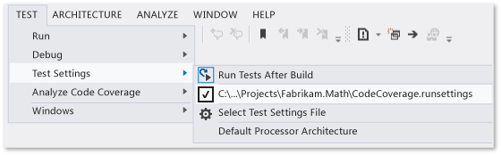
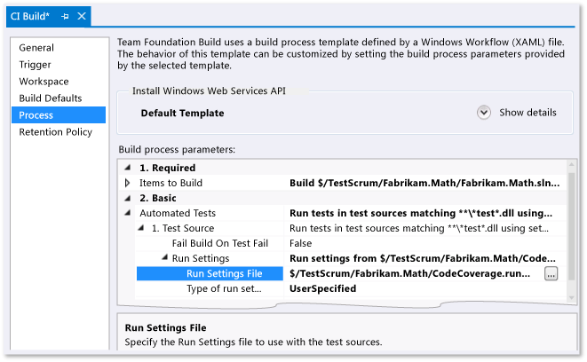

# Customizing Code Coverage Analysis
By default, the Visual Studio Code Coverage tool analyzes all solution assemblies (.exe/.dll) that are loaded during unit tests. We recommend that you retain this default, because it works well most of the time. For more information, see [Using Code Coverage](../vs140/using-code-coverage-to-determine-how-much-code-is-being-tested.md).  
  
 Before customizing the code coverage behavior, consider some alternatives:  
  
-   *I want to exclude the test code from the code coverage results and include only the application code.*  
  
     Add the <CodeContentPlaceHolder>6\</CodeContentPlaceHolder> to your test class.  
  
-   *I want to include assemblies that are not part of my solution.*  
  
     Obtain the .pdb files for these assemblies and copy them into the same folder as the assembly .dll files.  
  
 To customize the code coverage behavior, copy the [sample at the end of this topic](#sample) and add it to your solution using the file extension .runsettings. Edit it to your own needs, and then on the **Test** menu, choose **Test Settings**, **Select Test Settings** file. The remainder of this topic describes this procedure in more detail.  
  
## The .runsettings file  
 Advanced code coverage settings are specified in a .runsettings file. This is the configuration file used by unit testing tools. We recommend you copy the [sample at the end of this topic](#sample) and edit it to suit your own needs.  
  
-   *What happened to the .testsettings file I used in Visual Studio 2010?*  
  
     In Visual Studio 2010, the .testsettings file applies only to unit tests based on the MSTest framework. In Visual Studio 2012, the testing tools apply not only to MSTest, but also other frameworks such as NUnit and xUnit.net. The .testsettings file will not work with these. The .runsettings file is designed to customize the test tools in a way that works with all testing frameworks.  
  
 To customize code coverage, you will need to add a .runsettings file to your solution:  
  
1.  Add an .xml file as a solution item with the extension <CodeContentPlaceHolder>7\</CodeContentPlaceHolder>:  
  
     In Solution Explorer, on the shortcut menu of your solution, choose **Add**, **New Item**, and select **XML File**. Save the file with a name ending such as <CodeContentPlaceHolder>8\</CodeContentPlaceHolder>  
  
2.  Add the content given in the sample at the end of this topic, and then customize it to your needs as described in the following sections.  
  
3.  On the **Test** menu, choose **Test Settings**, **Select Test Settings File** and select the file.  
  
4.  Now when you run **Analyze Code Coverage**, this <CodeContentPlaceHolder>9\</CodeContentPlaceHolder> file will control its behavior. Don’t forget that you must run code coverage again: your previous coverage results and code coloring aren’t automatically hidden when you run tests or update your code.  
  
5.  To turn the custom settings off and on, deselect or select the file in the **Test**, **Test Settings** menu.  
  
   
  
 Other aspects of unit tests can be configured in the same .runsettings file. For more information, see [Configuring unit tests with .runsettings](../vs140/unit-test-your-code.md).  
  
### Specifying symbol search paths  
 Code coverage requires symbols (.pdb files) for assemblies to be present. For assemblies built by your solution, symbol files are generally present alongside the binary files, and code coverage works automatically. But in some cases, you might want to include referenced assemblies in your code coverage analysis. In such cases, the .pdb files might not be adjacent to the binaries, but you can specify the symbol search path in the .runsettings file.  
  
<CodeContentPlaceHolder>0\</CodeContentPlaceHolder>  
> [!WARNING]
>  Symbol resolution can take time, especially when using a remote file location with a lot of assemblies. Therefore, consider copying remote .pdb files to the same local location as the binary (.dll and .exe) files.  
  
### Excluding and including  
 You can exclude specified assemblies from code coverage analysis. For example:  
  
<CodeContentPlaceHolder>1\</CodeContentPlaceHolder>  
 As an alternative, you can specify which assemblies should be included. This approach has the drawback that when you add more assemblies to the solution, you have to remember to add them to the list:  
  
<CodeContentPlaceHolder>2\</CodeContentPlaceHolder>  
 If <CodeContentPlaceHolder>10\</CodeContentPlaceHolder> is empty, then code coverage processing includes all assemblies (.dll and .exe files) that are loaded and for which **.pdb** files can be found, except for items that match a clause in an <CodeContentPlaceHolder>11\</CodeContentPlaceHolder> list.  
  
 <CodeContentPlaceHolder>12\</CodeContentPlaceHolder> is processed before <CodeContentPlaceHolder>13\</CodeContentPlaceHolder>.  
  
### Regular expressions  
 Include and exclude nodes use regular expressions. For more information, see [Regular Expressions](../vs140/using-regular-expressions-in-visual-studio.md). Regular expressions are not the same as wildcards. In particular:  
  
1.  **.\*** matches a string of any characters  
  
2.  **\\.** matches a dot ".")  
  
3.  **\\(   \\)** matches parentheses "(  )"  
  
4.  **\\\\** matches a file path delimiter "\\"  
  
5.  **^** matches the start of the string  
  
6.  **$** matches the end of the string  
  
 All matches are case-insensitive.  
  
 For example:  
  
<CodeContentPlaceHolder>3\</CodeContentPlaceHolder>  
> [!WARNING]
>  If there is an error in a regular expression, such as an unescaped and unmatched parenthesis, then code coverage analysis will not run.  
  
### Other ways to include or exclude elements  
 See the [sample at the end of this topic](#sample) for examples.  
  
-   <CodeContentPlaceHolder>14\</CodeContentPlaceHolder> – Assemblies specified by assembly file path.  
  
-   <CodeContentPlaceHolder>15\</CodeContentPlaceHolder> – matches assemblies by the Company attribute.  
  
-   <CodeContentPlaceHolder>16\</CodeContentPlaceHolder> – matches signed assemblies by the public key token. For example to match all Visual Studio components and extensions, use <CodeContentPlaceHolder>17\</CodeContentPlaceHolder>.  
  
-   <CodeContentPlaceHolder>18\</CodeContentPlaceHolder> – matches elements by the path name of the source file in which they are defined.  
  
-   <CodeContentPlaceHolder>19\</CodeContentPlaceHolder> – matches elements to which a particular attribute is attached. Specify the full name of the attribute, including "Attribute" at the end of the name.  
  
-   <CodeContentPlaceHolder>20\</CodeContentPlaceHolder> – matches procedures, functions, or methods by fully qualified name.  
  
 **Matching a function name**  
  
 Your regular expression must match the fully qualified name of the function, including namespace, class name, method name and parameter list. For example,  
  
-   C# or Visual Basic: <CodeContentPlaceHolder>21\</CodeContentPlaceHolder>  
  
-   C++:  <CodeContentPlaceHolder>22\</CodeContentPlaceHolder>  
  
<CodeContentPlaceHolder>4\</CodeContentPlaceHolder>  
## How to specify .runsettings files while running tests  
  
### To customize runsettings in Visual Studio tests  
 Choose **Test**, **Test Settings**, **Select Test Settings File** and select the .runsettings file. The file appears on the Test Settings menu, and you can select or cancel it. While selected, your .runsettings file applies whenever you use **Analyze Code Coverage**.  
  
### To customize run settings in a command line test  
 To run tests from the command line, use vstest.console.exe. The settings file is a parameter of this utility. For more information, see [Using VSTest.console from the command line](assetId:///852812d8-b3bb-407e-bc43-04d511fcb27a).  
  
1.  Launch the Visual Studio Developer Command Prompt:  
  
     On Windows **Start**, choose **All Programs**, **Microsoft Visual Studio**, **Visual Studio Tools**, **Developer Command Prompt**.  
  
2.  Run:  
  
     <CodeContentPlaceHolder>23\</CodeContentPlaceHolder>  
  
### To customize run settings in a build definition  
 You can get code coverage data from a team build.  
  
   
  
1.  Make sure your .runsettings file is checked in.  
  
2.  In Team Explorer, open **Builds**, and then add or edit a build definition.  
  
3.  On the **Process** page, expand **Automated Tests**, **Test Source**, **Run Settings**. Select your **.runsettings** file.  
  
    -   *But **Test Assembly** appears instead of **Test Source**. When I try to set the **Run Settings** field, I can only select .testsettings files.*  
  
         Under **Automated Tests**, select **Test Assembly**, and choose **[...]** at the end of the line. In the **Add/Edit Test Run** dialog box, set **Test Runner** to **Visual Studio Test Runner**.  
  
 The results are visible in the summary section of the build report.  
  
##  \<a name="sample">\</a> Sample .runsettings file  
 Copy this code and edit it to suit your own needs. This is the default .runsettings file.  
  
 (For other uses of the .runsettings file, see [Customizing unit tests](../vs140/configure-unit-tests-by-using-a-.runsettings-file.md).)  
  
<CodeContentPlaceHolder>5\</CodeContentPlaceHolder>  
## See Also  
 [Using Code Coverage](../vs140/using-code-coverage-to-determine-how-much-code-is-being-tested.md)   
 [Configuring unit tests with .runsettings](../vs140/unit-test-your-code.md)