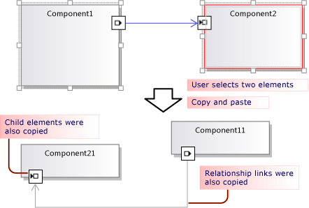
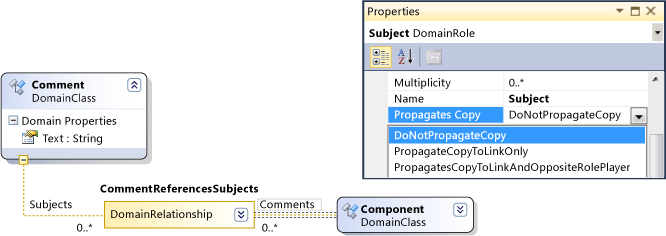
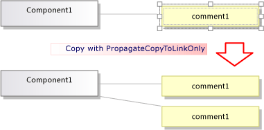
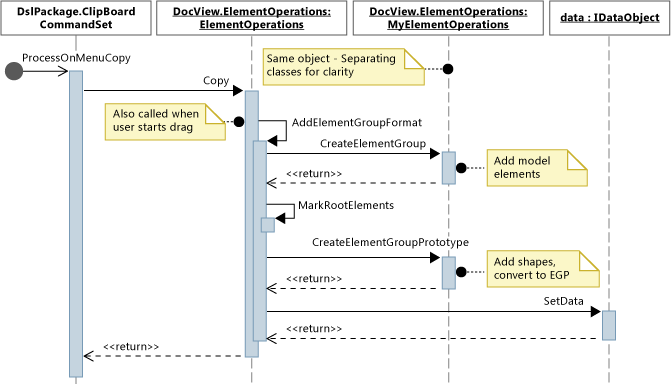
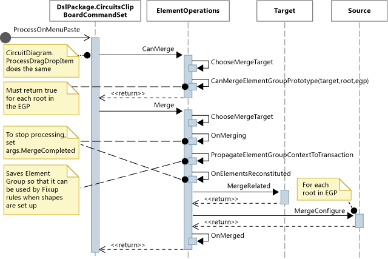

# Customizing Copy Behavior
In a domain-specific language (DSL) created with the [!INCLUDE[vsprvs](../vs140/includes/vsprvs_md.md)] Visualization and Modeling SDK, you can alter what happens when the user copies and pastes elements.  
  
## Standard Copy and Paste Behavior  
 To enable copying, set the **Enable Copy Paste** property of the **Editor** node in DSL Explorer.  
  
 By default, when the user copies elements to the clipboard, the following elements are also copied:  
  
-   Embedded descendants of the selected elements. (That is, elements that are the targets of embedding relationships that are sourced at copied elements.)  
  
-   Relationship links between the copied elements.  
  
 This rule applies recursively to the copied elements and links.  
  
   
  
 The copied elements and links are serialized and stored in an \<xref:Microsoft.VisualStudio.Modeling.ElementGroupPrototype*> (EGP), which is placed on the clipboard.  
  
 An image of the copied elements is also placed on the clipboard. This allows the user to paste into other applications such as Word.  
  
 The user can paste copied elements onto a target that can accept the elements according to the DSL Definition. For example, in a DSL generated from the components solution template, the user can paste ports onto components, but not onto the diagram; and can paste components onto the diagram, but not onto other components.  
  
## Customizing Copy and Paste Behavior  
 For more information about customizing the model by using program code, see [Navigating and Updating a Model](../vs140/navigating-and-updating-a-model-in-program-code.md).  
  
 **Enable or disable copy, cut, and paste.**  
 In DSL Explorer, set the **Enable Copy Paste** property of the **Editor** node.  
  
 **Copy links to the same target.** For example, to have a copied comment box linked to the same subject element.  
 Set the **Propagates Copy** property of the role to **Propagate copy to link only**. For more information, see [Customizing Link Copy Behavior](#customizeLinks).  
  
 Copy linked elements. For example, when you copy a new element, copies of any linked comment boxes are made as well.  
 Set the **Propagates Copy** property of the role to **Propagate copy to link and opposite role player**. For more information, see [Customizing Link Copy Behavior](#customizeLinks).  
  
 **Rapidly duplicate elements by copying and pasting.** Normally, the item you just copied is still selected, and you cannot paste the same type of element onto it.  
 Add an Element Merge Directive to the domain class, and set it to forward merges to the parent class. This will have the same effect on drag operations. For more information, see [Customizing Element Creation and Movement](../vs140/customizing-element-creation-and-movement.md).  
  
 \- or -  
  
 Select the diagram before pasting the elements, by overriding <CodeContentPlaceHolder>9\</CodeContentPlaceHolder>. Add this code in a custom file in the DslPackage project:  
  
<CodeContentPlaceHolder>0\</CodeContentPlaceHolder>  
 **Create additional links when the user pastes onto a selected target.** For example, when a comment box is pasted onto an element, a link is made between them.  
 Add an Element Merge Directive to the target domain class, and set it to process the merge by adding links. This will have the same effect on drag operations. For more information, see [Customizing Element Creation and Movement](../vs140/customizing-element-creation-and-movement.md).  
  
 \- or -  
  
 Override <CodeContentPlaceHolder>10\</CodeContentPlaceHolder> to create the additional links after calling the base method.  
  
 **Customize the formats in which elements can be copied** to external applications – for example, to add a border to the bitmap form.  
 Override *MyDsl*<CodeContentPlaceHolder>11\</CodeContentPlaceHolder> in the DslPackage project.  
  
 **Customize how elements are copied to the clipboard by the copy command, but not in a drag operation.**  
 Override *MyDsl*<CodeContentPlaceHolder>12\</CodeContentPlaceHolder> in the DslPackage project.  
  
 **Preserve shape layout through copy and paste.**  
 When the user copies multiple shapes, you can preserve their relative positions when they are pasted. This technique is demonstrated by the example at [VMSDK: Circuit Diagrams sample](http://go.microsoft.com/fwlink/?LinkId=213879).  
  
 To achieve this effect, add the shapes and connectors to the copied ElementGroupPrototype. The most convenient method to override is ElementOperations.CreateElementGroupPrototype(). To do this, add the following code to the Dsl project:  
  
<CodeContentPlaceHolder>1\</CodeContentPlaceHolder>  
 **Paste shapes in a chosen location, such as the current cursor position.**  
 When the user copies multiple shapes, you can preserve their relative positions when they are pasted. This technique is demonstrated by the example at [VMSDK: Circuit Diagrams sample](http://go.microsoft.com/fwlink/?LinkId=213879).  
  
 To achieve this effect, override <CodeContentPlaceHolder>13\</CodeContentPlaceHolder> to use the location-specific version of <CodeContentPlaceHolder>14\</CodeContentPlaceHolder>. To do this, add the following code in the DslPackage project:  
  
<CodeContentPlaceHolder>2\</CodeContentPlaceHolder>  
 **Let the user drag and drop elements.**  
 See [How to define a drag-drop handler](../vs140/how-to--add-a-drag-and-drop-handler.md).  
  
##  \<a name="customizeLinks">\</a> Customizing Link Copy Behavior  
 When the user copies an element, the standard behavior is that any embedded elements are also copied. You can modify the standard copying behavior. In the DSL Definition, select a role at one side of a relationship and in the Properties window set the **Propagates Copy** value.  
  
   
  
 There are three values:  
  
-   Do not propagate copy  
  
-   Propagate copy to link only - when the group is pasted, the new copy of this link will refer to the existing element at the other end of the link.  
  
-   Propagate copy to link and opposite role player - the copied group includes a copy of the element at the other end of the link.  
  
   
  
 The changes that you make will affect both the elements and the image that is copied.  
  
## Programming Copy and Paste Behavior  
 Many aspects of a DSL’s behavior with regard to copy, paste, creation, and deletion of objects are governed by an instance of \<xref:Microsoft.VisualStudio.Modeling.ElementOperations*> that is coupled to the diagram. You can modify your DSL’s behavior by deriving your own class from \<xref:Microsoft.VisualStudio.Modeling.ElementOperations*> and overriding the \<xref:Microsoft.VisualStudio.Modeling.Diagrams.Diagram.ElementOperations*> property of your diagram class.  
  
> [!TIP]
>  For more information about customizing the model by using program code, see [Navigating and Updating a Model](../vs140/navigating-and-updating-a-model-in-program-code.md).  
  
   
  
   
  
#### To define your own ElementOperations  
  
1.  In a new file in your DSL project, create a class that is derived from \<xref:Microsoft.VisualStudio.Modeling.Diagrams.DesignSurfaceElementOperations*>.  
  
2.  Add a partial class definition for your diagram class. The name of this class can be found in **Dsl\GeneratedCode\Diagrams.cs**.  
  
     In the diagram class, override  \<xref:Microsoft.VisualStudio.Modeling.Diagrams.Diagram.ElementOperations*> to return an instance of your ElementOperations subclass. You should return the same instance at every call.  
  
 Add this code in a custom code file in the DslPackage project:  
  
<CodeContentPlaceHolder>3\</CodeContentPlaceHolder>  
## Receiving items dragged from other models  
 ElementOperations can also be used to define copy, move, deletion and drag-and-drop behavior. As a demonstration of the use of ElementOperations, the example given here defines custom drag-and-drop behavior. However, for that purpose you might consider the alternative approach described in [How to Define a Drag and Drop Handler](../vs140/how-to--add-a-drag-and-drop-handler.md), which is more extensible.  
  
 Define two methods in your ElementOperations class:  
  
-   <CodeContentPlaceHolder>15\</CodeContentPlaceHolder> which determines whether the source element can be dragged onto the target shape, connector or diagram.  
  
-   <CodeContentPlaceHolder>16\</CodeContentPlaceHolder> which combines the source element into the target.  
  
### CanMerge()  
 <CodeContentPlaceHolder>17\</CodeContentPlaceHolder> is called to determine feedback that should be given to the user as the mouse moves across the diagram. The parameters to the method are the element over which the mouse is hovering, and data about the source from which the drag operation has been performed. The user can drag from anywhere on the screen. Therefore, the source object can be of many different types and can be serialized in different formats. If the source is a DSL or UML model, the data parameter is the serialization of an \<xref:Microsoft.VisualStudio.Modeling.ElementGroupPrototype*>. Drag, copy and toolbox operations use ElementGroupPrototypes to represent fragments of models.  
  
 An Element Group Prototype can contain any number of elements and links. Element types can be identified by their GUIDs. The GUID is of the shape that was dragged, not the underlying model element. In following example, <CodeContentPlaceHolder>18\</CodeContentPlaceHolder> returns true if a class shape from a UML diagram is dragged onto this diagram.  
  
<CodeContentPlaceHolder>4\</CodeContentPlaceHolder>  
## MergeElementGroupPrototype()  
 This method is called when the user drops an element onto a diagram, a shape, or a connector. It should merge the dragged content into the target element. In this example, the code determines whether it recognizes the combination of target and prototype types; if so, the method converts the dragged elements into a prototype of the elements that should be added to the model. The base method is called to perform the merge, either of the converted or unconverted elements.  
  
<CodeContentPlaceHolder>5\</CodeContentPlaceHolder>  
 This example deals with UML class elements dragged from a UML class diagram. The DSL is not designed to store UML classes directly, but instead, we create a DSL element for each dragged UML class. This would be useful, for example, if the DSL is an instance diagram. The user could drag classes onto the diagram to create instances of those classes.  
  
<CodeContentPlaceHolder>6\</CodeContentPlaceHolder>  
## Standard Copy Behavior  
 The code in this section shows methods that can you can override to alter copying behavior. To help you see how to achieve your own customizations, this section shows code that overrides the methods involved in copying, but does not change the standard behavior.  
  
 When the user presses CTRL+C or uses the Copy menu command, the method \<xref:Microsoft.VisualStudio.Modeling.Shell.ClipboardCommandSet.ProcessOnMenuCopyCommand*> is called. You can see how this is set up in **DslPackage\Generated Code\CommandSet.cs**. For more information about how commands are set up, see [How to Add a Command](../vs140/how-to--add-a-command-to-the-shortcut-menu.md).  
  
 You can override ProcessOnMenuCopyCommand by adding a partial class definition of *MyDsl*<CodeContentPlaceHolder>19\</CodeContentPlaceHolder> in the DslPackage project.  
  
<CodeContentPlaceHolder>7\</CodeContentPlaceHolder>  
 Each diagram has a singleton instance of ElementOperations. You can supply your own derivative. This file, which can be placed in the DSL project, would behave the same as the code that it overrides:  
  
<CodeContentPlaceHolder>8\</CodeContentPlaceHolder>  
## See Also  
 [Customizing Element Creation](../vs140/customizing-element-creation-and-movement.md)   
 [How to Define a Drag and Drop Handler](../vs140/how-to--add-a-drag-and-drop-handler.md)   
 [How to Modify Delete Behavior](../vs140/customizing-deletion-behavior.md)   
 [Sample: VMSDK Circuit Diagrams sample](http://go.microsoft.com/fwlink/?LinkId=213879)