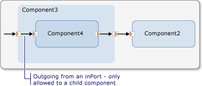
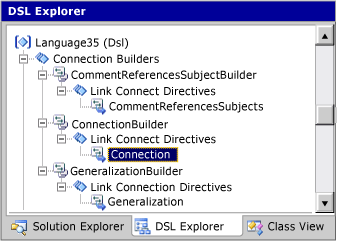
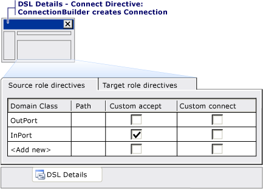

# Customizing Tools and the Toolbox
You must define toolbox items for the elements that you want to let users add to their models. There are two kinds of tools: element tools and connection tools. In the generated designer, a user can select an element tool to drag shapes to the diagram, and can select a connection tool to draw links between the shapes. In general, element tools let users add instances of domain classes to their models, and connection tools let them add instances of domain relationships.  
  
 In this topic:  
  
-   [How the Toolbox is Defined](#ToolboxDef)  
  
-   [Customizing Element Tools](#customizing)  
  
-   [Creating Groups of Elements from a Tool](#groups)  
  
-   [Customizing Connection Tools](#connections)  
  
##  <a name="ToolboxDef"></a> How the toolbox is defined  
 In the DSL Explorer, expand the Editor node and the nodes underneath it. Typically you will see a hierarchy that resembles this:  
  
```  
  
Editor  
     Toobox Tabs  
        MyDsl          //a tab  
           Tools  
               ExampleElement      // an element tool  
               ExampleRelationship // a connection tool  
  
```  
  
 In this part of DSL Explorer, you can:  
  
-   Create new tabs. Tabs define the section headings in the toolbox.  
  
-   Create new tools.  
  
-   Copy and paste tools.  
  
-   Move tools up or down in the list.  
  
-   Delete tabs and tools.  
  
> [!IMPORTANT]
>  To add or paste items in a DSL Explorer, right-click the grandparent of the new node. For example, to add a tool, right-click the tab, and not the **Tools** node. To add a tab, right-click the **Editor** node.  
  
 The **Toolbox Icon** property of every tool references a 16x16 bitmap file. These files are usually kept in the **Dsl\Resources** folder.  
  
 The **Class** property of an element tool refers to a concrete domain class. By default, the tool will create instances of this class. However, you can write code to have the tool create groups of elements, or elements of different types.  
  
 The **Connection Builder** property of a connection tool refers to a connection builder, which defines what types of elements the tool can connect, and what relationships it creates between them. Connection builders are defined as nodes in the DSL Explorer. Connection builders are created automatically when you define domain relationships, but you can write code to customize them.  
  
#### To add a tool to the toolbox  
  
1.  You usually create an element tool after you have created a shape class and mapped it to a domain class.  
  
     You usually create a connector tool after you have created a connector class and mapped it to a reference relationship.  
  
2.  In DSL Explorer, expand the **Editor** node and the **Toolbox Tabs** node.  
  
     Right-click a toolbox tab node, and then click **Add New Element Tool** or **Add New Connection Tool**.  
  
3.  Set the **Toolbox Icon** property to refer to a 16x16 bitmap.  
  
     If you want to define a new icon, create a bitmap file in Solution Explorer in the **Dsl\Resources** folder. The file should have the following property values: **Build Action** = **Content**; **Copy to Output Directory** = **Do not copy**.  
  
4.  **For an element tool:** Set the **Class** property of the tool to refer to a concrete domain class that is mapped to a shape.  
  
     **For a connector tool:** Set the **Connection Builder** property of the tool to one of the items that are offered in the drop-down list. Connection builders are automatically created when you map a connector to a domain relationship. If you have recently created a connector, you would normally select the associated connection builder.  
  
5.  To test the DSL, press F5 or CTRL+F5, and in the experimental instance of [!INCLUDE[vsprvs](../vs140/includes/vsprvs_md.md)], open a sample model file. The new tool should appear on the toolbox. Drag it onto the diagram to verify that it creates a new element.  
  
     If the tool does not appear, stop the experimental [!INCLUDE[vsprvs](../vs140/includes/vsprvs_md.md)]. In the Windows **Start** menu, run **Reset the Microsoft Visual Studio 2010 Experimental Instance**. On the [!INCLUDE[vsprvs](../vs140/includes/vsprvs_md.md)]**Build** menu, click **Rebuild Solution**. Then test the DSL again.  
  
##  <a name="customizing"></a> Customizing Element Tools  
 By default, the tool will create a single instance of the specified class, but you can vary this in two ways:  
  
-   Define Element Merge Directives on other classes, enabling them to accept new instances of this class, and enabling them to create additional links when the new element is created. For example, you could allow the user to drop a Comment onto another element, and thereby create a reference link between the two.  
  
     These customizations also affect what happens when the user pastes or drags and drops an element.  
  
     For more information, see [Customizing Element Creation](../vs140/customizing-element-creation-and-movement.md).  
  
-   Write code to customize the tool so that it can create groups of elements. The tool is initialized by methods in ToolboxHelper.cs that you can override. For more information, see [Creating Groups of Elements from a Tool](#groups).  
  
##  <a name="groups"></a> Creating Groups of Elements from a Tool  
 Each element tool contains a prototype of the elements that it should create. By default, each element tool creates a single element, but it is also possible to create a group of related objects with one tool. To do this, you initialize the tool with an <xref:Microsoft.VisualStudio.Modeling.ElementGroupPrototype*> that contains the related items.  
  
 The following example is taken from a DSL in which there is a type Transistor. Each Transistor has three named Terminals. The element tool for Transistors stores a prototype containing four model elements and three relationship links. When the user drags the tool onto the diagram, the prototype is instantiated and linked to the model root.  
  
 This code overrides a method that is defined in **Dsl\GeneratedCode\ToolboxHelper.cs**.  
  
 For more information about customizing the model by using program code, see [Navigating and Updating a Model](../vs140/navigating-and-updating-a-model-in-program-code.md).  
  
```  
using Microsoft.VisualStudio.Modeling;  
using Microsoft.VisualStudio.Modeling.Diagrams;  
  
  public partial class CircuitsToolboxHelper  
  {  
    /// <summary>  
    /// Toolbox initialization, called for each element tool on the toolbox.  
    /// This version deals with each Component subtype separately.  
    /// </summary>  
    /// <param name="store"></param>  
    /// <param name="domainClassId">Identifies the domain class this tool should instantiate.</param>  
    /// <returns>prototype of the object or group of objects to be created by tool</returns>  
    protected override ElementGroupPrototype CreateElementToolPrototype(Store store, Guid domainClassId)  
    {  
        if (domainClassId == Transistor.DomainClassId)  
        {  
            Transistor transistor = new Transistor(store);  
  
            transistor.Base = new ComponentTerminal(store);  
            transistor.Collector = new ComponentTerminal(store);  
            transistor.Emitter = new ComponentTerminal(store);  
  
            transistor.Base.Name = "base";  
            transistor.Collector.Name = "collector";  
            transistor.Emitter.Name = "emitter";  
  
            // Create an ElementGroup for the Toolbox.  
            ElementGroup elementGroup = new ElementGroup(store.DefaultPartition);  
            elementGroup.AddGraph(transistor, true);  
            // AddGraph includes the embedded parts  
  
            return elementGroup.CreatePrototype();  
        }  
        else  
        {  
            return base.CreateElementToolPrototype(store, domainClassId);  
}  }    }  
  
```  
  
##  <a name="connections"></a> Customizing Connection Tools  
 Usually, you create an element tool when you create a new connector class. Alternatively, you can overload one tool by allowing the types of the two ends to determine the type of the relationship. For example, you could define one connection tool that could create both Person-Person relationships and Person-Town relationships.  
  
 Connection tools invoke connection builders. Use connection builders to specify how users can link elements in the generated designer. Connection builders specify the elements that can be linked and the kind of link that is created between them.  
  
 When you create a reference relationship between domain classes, a connection builder is automatically created. You can use this connection builder when you map a connection tool. For more information about how to create connection tools, see [Configuring the Toolbox](../vs140/customizing-tools-and-the-toolbox.md).  
  
 You can modify the default connection builder so that it can deal with a different range of source and target types, and create different types of relationship.  
  
 You also can write custom code for connection builders to specify the source and target classes for the connection, define the type of connection to be made, and take other actions associated with the creation of a connection.  
  
### The Structure of Connection Builders  
 Connection builders contain one or more link connect directives, which specify the domain relationship and the source and target elements. For example, in the Task Flow solution template, you can see the **CommentReferencesSubjectsBuilder** in the **DSL Explorer**. This connection builder contains one link connect directive named **CommentReferencesSubjects**, which is mapped to the domain relationship **CommentReferencesSubjects**. This link connect directive contains a source role directive that points to the `Comment` domain class, and a target role directive that points to the `FlowElement` domain class.  
  
### Using Connection Builders to Restrict Source and Target Roles  
 You can use connection builders to restrict the occurrence of certain classes in either the source role or the target role of a given domain relationship. For example, you may have a base domain class that has a domain relationship to another domain class, but you may not want all derived classes of the base class to have the same roles in that relationship. In the Task Flow solution, there are four concrete domain classes (**StartPoint**, **EndPoint**, **MergeBranch**, and **Synchronization**) that inherit directly from the abstract domain class **FlowElement**, and two concrete domain classes (**Task** and **ObjectInState**) that inherit indirectly from it. There is also a **Flow** reference relationship that takes **FlowElement** domain classes in both its source role and target role. However, an instance of an **EndPoint** domain class should not be the source of an instance of a **Flow** relationship, nor should an instance of a **StartPoint** class be the target of an instance of a **Flow** relationship. The **FlowBuilder** connection builder has a link connect directive named **Flow** that specifies which domain classes can play the source role (**Task**, **MergeBranch**, **StartPoint**, and **Synchronization**) and which can play the target role(**MergeBranch**, **Endpoint**, and **Synchronization**).  
  
### Connection Builders with Multiple Link Connect Directives  
 You can add more than one link connect directive to a connection builder. This can help you hide some of the complexities of the domain model from users and keep the **Toolbox** from getting too cluttered. You can add link connect directives for several different domain relationships to a single connection builder. However, you should combine domain relationships when they perform approximately the same function.  
  
 In the Task Flow solution, the **Flow** connection tool is used to draw instances of both the **Flow** and the **ObjectFlow** domain relationships. The **FlowBuilder** connection builder has, in addition to the **Flow** link connect directive described earlier, two link connect directives named **ObjectFlow**. These directives specify that an instance of an **ObjectFlow** relationship may be drawn between instances of the **ObjectInState** domain class, or from an instance of an **ObjectInState** to an instance of a **Task**, but not between two instances of a **Task**, or from an instance of a **Task** to an instance of an **ObjectInState**. However, an instance of a **Flow** relationship may be drawn between two instances of a **Task**. If you compile and run the Task Flow solution, you can see that drawing a **Flow** from an instance of an **ObjectInState** to an instance of a **Task** creates an instance of an **ObjectFlow**, but drawing a **Flow** between two instances of a **Task** creates an instance of a **Flow**.  
  
### Custom Code for Connection Builders  
 There are four checkboxes in the user interface that define different types of customization of connection builders:  
  
-   the **Custom accept** check box on a source or target role directive  
  
-   the **Custom connect** check box on a source or target role directive  
  
-   the **Uses custom connect** check box on a connect directive  
  
-   the **Is Custom** property of the connection builder  
  
 You have to provide some program code to make these customizations. To discover what code you must supply, check one of these boxes, click Transform All Templates, and then build your solution. An error report will result. Double-click the error report to see a comment that explains what code you should add.  
  
> [!NOTE]
>  To add custom code, create a partial class definition in a code file separate from the code files in the GeneratedCode folders. To avoid losing your work, you should not edit the generated code files. For more information, see [Overriding and Extending the Generated Classes](../vs140/overriding-and-extending-the-generated-classes.md).  
  
#### Creating Custom Connection code  
 In each link connect directive, the **Source role directives** tab defines from what types you can drag. Similarly, the **Target role directives** tab defines to what types you can drag. For each type, you can further specify whether to allow the connection (for that link connect directive) by setting the **Custom Accept** flag and then supplying the extra code.  
  
 You can also customize what occurs when the connection is made. For example, you can customize just the case where the drag occurs to or from a particular class, all the cases that one link connect directive governs, or the whole FlowBuilder connection builder. For each of these options, you can set custom flags at the appropriate level. When you transform all templates and try to build the solution, error messages direct you to comments that are in the generated code. These comments identify what you must supply.  
  
 In the Components Diagram sample, the connection builder for the Connection domain relationship is customized to restrict the connections that can be made between ports. The following illustration shows that you can make connections only from `OutPort` elements to `InPort` elements, but you can nest components inside each other.  
  
 **Connection Coming in to an OutPort from a Nested Component**  
  
   
  
 Therefore, you might want to specify that a connection can come from a nested component to an OutPort. To specify such a connection, you set **Uses Custom Accept** on the **InPort** type as source role and the **OutPort** type as target role in the **DSL Details** window as shown in the following illustrations:  
  
 **Link Connect Directive in DSL Explorer**  
  
   
  
 **Link Connect Directive in DSL Details Window**  
  
   
  
 You must then provide methods in the ConnectionBuilder class:  
  
```  
  public partial class ConnectionBuilder  
  {  
    /// <summary>  
    /// OK if this component has children  
    /// </summary>  
    private static bool CanAcceptInPortAsSource(InPort candidate)  
    {  
       return candidate.Component.Children.Count > 0;  
    }  
  
    /// <summary>  
    /// Only if source is on parent of target.  
    /// </summary>  
    private static bool CanAcceptInPortAndInPortAsSourceAndTarget                (InPort sourceInPort, InPort targetInPort)  
    {  
      return sourceInPort.Component == targetInPort.Component.Parent;  
    }  
// And similar for OutPorts…  
```  
  
 For more information about customizing the model by using program code, see [Navigating and Updating a Model](../vs140/navigating-and-updating-a-model-in-program-code.md).  
  
 You can use similar code, for example, to prevent users from creating loops with parent-child links. These restrictions are considered ‘hard’ constraints because users cannot violate them at any time. You can also create ‘soft’ validation checks that users can bypass temporarily by creating invalid configurations that they cannot save.  
  
### Good Practice in Defining Connection Builders  
 You should define one connection builder to create different types of relationships only if they are conceptually related. In the task flow sample, you use the same builder to create flows between tasks and also between tasks and objects. However, it would be confusing to use the same builder to create relationships between comments and tasks.  
  
 If you define a connection builder for multiple types of relationships, you should ensure that it cannot match more than one type from the same pair of source and target objects. Otherwise, the results will be unpredictable.  
  
 You use custom code to apply ‘hard’ constraints, but you should consider whether users should be able to temporarily make invalid connections. If they should, you can modify the constraints so that connections are not validated until users try to save changes.  
  
## See Also  
 [Customizing Element Creation and Movement](../vs140/customizing-element-creation-and-movement.md)   
 [Customizing Copy Behavior](../vs140/customizing-copy-behavior.md)   
 [How to add a drag and drop handler](../vs140/how-to--add-a-drag-and-drop-handler.md)   
 [Navigating and Updating a Model](../vs140/navigating-and-updating-a-model-in-program-code.md)   
 [Circuit Diagrams sample DSL](http://code.msdn.microsoft.com/Visualization-Modeling-SDK-763778e8)