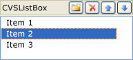

# CVSListBox Class
The <CodeContentPlaceHolder>12\</CodeContentPlaceHolder> class supports an editable list control.  
  
## Syntax  
  
<CodeContentPlaceHolder>0\</CodeContentPlaceHolder>  
## Members  
  
### Public Constructors  
  
|Name|Description|  
|----------|-----------------|  
|[CVSListBox::CVSListBox](#cvslistbox__cvslistbox)|Constructs a <CodeContentPlaceHolder>13\</CodeContentPlaceHolder> object.|  
|<CodeContentPlaceHolder>14\</CodeContentPlaceHolder>|Destructor.|  
  
### Public Methods  
  
|Name|Description|  
|----------|-----------------|  
|[CVSListBox::AddItem](#cvslistbox__additem)|Adds a string to a list control. (Overrides <CodeContentPlaceHolder>15\</CodeContentPlaceHolder>.)|  
|[CVSListBox::EditItem](#cvslistbox__edititem)|Starts an edit operation on the text of a list control item. (Overrides <CodeContentPlaceHolder>16\</CodeContentPlaceHolder>.)|  
|[CVSListBox::GetCount](#cvslistbox__getcount)|Retrieves the number of strings in an editable list control. (Overrides <CodeContentPlaceHolder>17\</CodeContentPlaceHolder>.)|  
|[CVSListBox::GetItemData](#cvslistbox__getitemdata)|Retrieves an application-specific 32-bit value that is associated with an editable list control item. (Overrides <CodeContentPlaceHolder>18\</CodeContentPlaceHolder>.)|  
|[CVSListBox::GetItemText](#cvslistbox__getitemtext)|Retrieves the text of an editable list control item. (Overrides <CodeContentPlaceHolder>19\</CodeContentPlaceHolder>.)|  
|[CVSListBox::GetSelItem](#cvslistbox__getselitem)|Retrieves the zero-based index of the currently selected item in an editable list control. (Overrides <CodeContentPlaceHolder>20\</CodeContentPlaceHolder>.)|  
|<CodeContentPlaceHolder>21\</CodeContentPlaceHolder>|Translates window messages before they are dispatched to the                                         [TranslateMessage](http://msdn.microsoft.com/library/windows/desktop/ms644955) and                                         [DispatchMessage](http://msdn.microsoft.com/library/windows/desktop/ms644934) Windows functions. For more information and method syntax, see [CWnd::PreTranslateMessage](../vs140/cwnd-class.md#cwnd__pretranslatemessage). (Overrides <CodeContentPlaceHolder>22\</CodeContentPlaceHolder>.)|  
|[CVSListBox::RemoveItem](#cvslistbox__removeitem)|Removes an item from an editable list control. (Overrides <CodeContentPlaceHolder>23\</CodeContentPlaceHolder>.)|  
|[CVSListBox::SelectItem](#cvslistbox__selectitem)|Selects an editable list control string. (Overrides <CodeContentPlaceHolder>24\</CodeContentPlaceHolder>.)|  
|[CVSListBox::SetItemData](#cvslistbox__setitemdata)|Associates an application-specific 32-bit value with an editable list control item. (Overrides <CodeContentPlaceHolder>25\</CodeContentPlaceHolder>.)|  
  
### Protected Methods  
  
|Name|Description|  
|----------|-----------------|  
|[CVSListBox::GetListHwnd](#cvslistbox__getlisthwnd)|Returns the handle to the current embedded list view control.|  
  
## Remarks  
 The <CodeContentPlaceHolder>26\</CodeContentPlaceHolder> class provides a set of edit buttons that enable the user to create, modify, delete, or rearrange the items in a list control.  
  
 The following is a picture of the editable list control. The second list entry, which is titled "Item2", is selected for editing.  
  
   
  
 If you use the resource editor to add an editable list control, notice that the **Toolbox** pane of the editor does not provide a predefined editable list control. Instead, add a static control such as the **Group Box** control. The framework uses the static control as a placeholder to specify the size and position of the editable list control.  
  
 To use an editable list control in a dialog box template, declare a <CodeContentPlaceHolder>27\</CodeContentPlaceHolder> variable in your dialog box class. To support data exchange between the variable and the control, define a <CodeContentPlaceHolder>28\</CodeContentPlaceHolder> macro entry in the <CodeContentPlaceHolder>29\</CodeContentPlaceHolder> method of the dialog box. By default, the editable list control is created without edit buttons. Use the inherited CVSListBoxBase::SetStandardButtons method to enable the edit buttons.  
  
 For more information, see the Samples directory, the <CodeContentPlaceHolder>30\</CodeContentPlaceHolder> sample, the Page3.cpp and Page3.h files.  
  
## Inheritance Hierarchy  
 [CObject](../vs140/cobject-class.md)  
  
 [CCmdTarget](../vs140/ccmdtarget-class.md)  
  
 [CWnd](../vs140/cwnd-class.md)  
  
 [CStatic](../vs140/cstatic-class.md)  
  
 <CodeContentPlaceHolder>31\</CodeContentPlaceHolder>  
  
 [CVSListBox](../vs140/cvslistbox-class.md)  
  
## Requirements  
 **Header:** afxvslistbox.h  
  
##  \<a name="cvslistbox__additem">\</a>  CVSListBox::AddItem  
 Adds a string to a list control.  
  
<CodeContentPlaceHolder>1\</CodeContentPlaceHolder>  
### Parameters  
 [in] <CodeContentPlaceHolder>32\</CodeContentPlaceHolder>  
 A reference to a string.  
  
 [in] <CodeContentPlaceHolder>33\</CodeContentPlaceHolder>  
 An application-specific 32-bit value that is associated with the string. The default value is 0.  
  
 [in] <CodeContentPlaceHolder>34\</CodeContentPlaceHolder>  
 The zero-based index of the position that will hold the string. If the <CodeContentPlaceHolder>35\</CodeContentPlaceHolder> parameter is -1, the string is added to the end of the list. The default value is -1.  
  
### Return Value  
 The zero-based index of the position of the string in the list control.  
  
### Remarks  
 Use the [CVSListBox::GetItemData](#cvslistbox__getitemdata) method to retrieve the value that is specified by the <CodeContentPlaceHolder>36\</CodeContentPlaceHolder> parameter. This value can be an application-specific integer or a pointer to other data.  
  
##  \<a name="cvslistbox__cvslistbox">\</a>  CVSListBox::CVSListBox  
 Constructs a <CodeContentPlaceHolder>37\</CodeContentPlaceHolder> object.  
  
<CodeContentPlaceHolder>2\</CodeContentPlaceHolder>  
### Return Value  
  
### Remarks  
  
##  \<a name="cvslistbox__edititem">\</a>  CVSListBox::EditItem  
 Starts an edit operation on the text of a list control item.  
  
<CodeContentPlaceHolder>3\</CodeContentPlaceHolder>  
### Parameters  
 [in] <CodeContentPlaceHolder>38\</CodeContentPlaceHolder>  
 Zero-based index of a list control item.  
  
### Return Value  
 <CodeContentPlaceHolder>39\</CodeContentPlaceHolder> if the edit operation starts successfully; otherwise, <CodeContentPlaceHolder>40\</CodeContentPlaceHolder>.  
  
### Remarks  
 The user starts an edit operation either by double-clicking the label of an item, or by pressing the **F2** or **SPACEBAR** key when an item has the focus.  
  
##  \<a name="cvslistbox__getcount">\</a>  CVSListBox::GetCount  
 Retrieves the number of strings in an editable list control.  
  
<CodeContentPlaceHolder>4\</CodeContentPlaceHolder>  
### Return Value  
 The number of items in the list control.  
  
### Remarks  
 Note that the count is one greater than the index value of the last item because the index is zero-based.  
  
##  \<a name="cvslistbox__getitemdata">\</a>  CVSListBox::GetItemData  
 Retrieves an application-specific 32-bit value that is associated with an editable list control item.  
  
<CodeContentPlaceHolder>5\</CodeContentPlaceHolder>  
### Parameters  
 [in] <CodeContentPlaceHolder>41\</CodeContentPlaceHolder>  
 The zero-based index of an editable list control item.  
  
### Return Value  
 The 32-bit value that is associated with the specified item.  
  
### Remarks  
 Use the [CVSListBox::SetItemData](#cvslistbox__setitemdata) or [CVSListBox::AddItem](#cvslistbox__additem) method to associate the 32-bit value with the list control item. This value can be an application-specific integer or a pointer to other data.  
  
##  \<a name="cvslistbox__getitemtext">\</a>  CVSListBox::GetItemText  
 Retrieves the text of an editable list control item.  
  
<CodeContentPlaceHolder>6\</CodeContentPlaceHolder>  
### Parameters  
 [in] <CodeContentPlaceHolder>42\</CodeContentPlaceHolder>  
 The zero-based index of an editable list control item.  
  
### Return Value  
 A [CString](../vs140/cstringt-class.md) object that contains the text of the specified item.  
  
### Remarks  
  
##  \<a name="cvslistbox__getlisthwnd">\</a>  CVSListBox::GetListHwnd  
 Returns the handle to the current embedded list view control.  
  
<CodeContentPlaceHolder>7\</CodeContentPlaceHolder>  
### Return Value  
 A handle to the embedded list view control.  
  
### Remarks  
 Use this method to retrieve a handle to the embedded list view control that supports the <CodeContentPlaceHolder>43\</CodeContentPlaceHolder> class.  
  
##  \<a name="cvslistbox__getselitem">\</a>  CVSListBox::GetSelItem  
 Retrieves the zero-based index of the currently selected item in an editable list control.  
  
<CodeContentPlaceHolder>8\</CodeContentPlaceHolder>  
### Return Value  
 If this method is successful, the zero-based index of the currently selected item; otherwise, -1.  
  
### Remarks  
  
##  \<a name="cvslistbox__removeitem">\</a>  CVSListBox::RemoveItem  
 Removes an item from an editable list control.  
  
<CodeContentPlaceHolder>9\</CodeContentPlaceHolder>  
### Parameters  
 [in] <CodeContentPlaceHolder>44\</CodeContentPlaceHolder>  
 The zero-based index of an editable list control item.  
  
### Return Value  
 <CodeContentPlaceHolder>45\</CodeContentPlaceHolder> if the specified item is removed; otherwise, <CodeContentPlaceHolder>46\</CodeContentPlaceHolder>.  
  
### Remarks  
  
##  \<a name="cvslistbox__selectitem">\</a>  CVSListBox::SelectItem  
 Selects an editable list control string.  
  
<CodeContentPlaceHolder>10\</CodeContentPlaceHolder>  
### Parameters  
 [in] <CodeContentPlaceHolder>47\</CodeContentPlaceHolder>  
 The zero-based index of an editable list control item.  
  
### Return Value  
 <CodeContentPlaceHolder>48\</CodeContentPlaceHolder> if this method is successful; otherwise, <CodeContentPlaceHolder>49\</CodeContentPlaceHolder>.  
  
### Remarks  
 This method selects the specified item, and if it is required, scrolls the item into view.  
  
##  \<a name="cvslistbox__setitemdata">\</a>  CVSListBox::SetItemData  
 Associates an application-specific 32-bit value with an editable list control item.  
  
<CodeContentPlaceHolder>11\</CodeContentPlaceHolder>  
### Parameters  
 [in] <CodeContentPlaceHolder>50\</CodeContentPlaceHolder>  
 The zero-based index of an editable list control item.  
  
 [in] <CodeContentPlaceHolder>51\</CodeContentPlaceHolder>  
 A 32-bit value. This value can be an application-specific integer or a pointer to other data.  
  
### Remarks  
  
## See Also  
 [Hierarchy Chart](../vs140/hierarchy-chart.md)   
 [Classes](../vs140/mfc-classes.md)