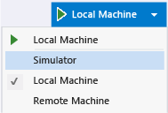
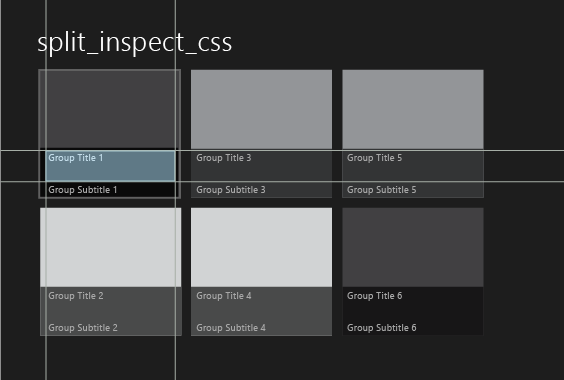
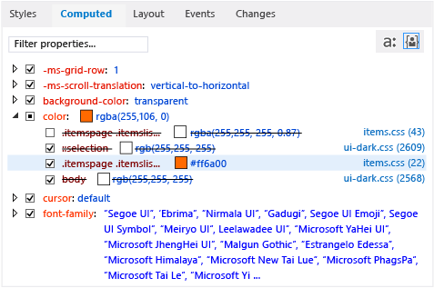
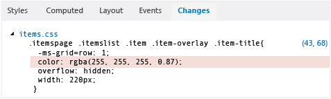

# Debug CSS styles using DOM Explorer
  
  
 When you're debugging Windows Store apps, Windows Phone Store apps, and apps created using Visual Studio Tools for Apache Cordova, you can view and change CSS rules for selected DOM elements and their child elements.  
  
 The **Styles** and **Computed** tabs in DOM Explorer show the CSS rules that apply to a selected element. The rules are displayed in the order of their specificity according to CSS precedence rules. Rules at the top of a selector or style in a tab (the most specific rules) are the last to be applied to the selected element, and rules at the bottom of a selector or style are the first to be applied. When rules are applied, they override previously applied rules.  
  
 The **Styles**, **Computed**, and **Changes** tabs provide different views of style information.  
  
-   Use the **Styles** tab to view rules organized by CSS selector name, such as <CodeContentPlaceHolder>3\</CodeContentPlaceHolder>. You can also use this tab to enable or disable specific styles, manually edit values, and to see the immediate results of these changes.  
  
-   Use the **Computed** tab to view the computed values of a style. For example, if you set a size to 1em, the value computed by Internet Explorer might be 16px. Styles in this tab are organized by style name, such as <CodeContentPlaceHolder>4\</CodeContentPlaceHolder>. You can also use this tab to enable or disable specific styles, manually edit values, and to see the immediate results of these changes.  
  
    > [!NOTE]
    >  In Visual Studio 2013 Update 2, the information provided in the **Trace** tab has been merged with the **Computed** tab, and the **Trace** tab has been removed.  
  
-   Use the **Changes** tab (Windows Store and Windows Phone Store apps only) to identify and track CSS styles that you have changed during a debugging session.  
  
> [!TIP]
>  Changes you make to styles in the **Styles** and **Computed** tabs aren't permanent. They're lost when you stop debugging. To change source code and reload pages without stopping and restarting the debugger, refresh your app by using the   button (**Refresh Windows app**) on the **Debug** toolbar (Windows Store and Windows Phone Store apps only). For more info, see [How to: refresh an app](../vs140/refresh-an-app--javascript-.md).  
  
## Example of fixing a CSS rule  
 This example shows how to inspect CSS rules and debug a style issue. For this example, let's say that you want to change the color of a font used to display group titles in the [!INCLUDE[win8_appname_long](../vs140/includes/win8_appname_long_md.md)] Split App template.  
  
> [!NOTE]
>  This example shows a Windows Store app, but all the DOM Explorer features shown also apply to a Windows Phone Store app and, except for the Changes tab, an app created using Visual Studio Tools for Apache Cordova.  
  
#### To view and change CSS rules  
  
1.  In Visual Studio, create a [!INCLUDE[win8_appname_long](../vs140/includes/win8_appname_long_md.md)] app using JavaScript and HTML in the Split App project template.  
  
2.  In **Solution Explorer**, open items.css. (You can find items.css in the pages folder.)  
  
3.  Replace the following CSS code:  
  
<CodeContentPlaceHolder>0\</CodeContentPlaceHolder>  
     with this:  
  
<CodeContentPlaceHolder>1\</CodeContentPlaceHolder>  
     This adds a style that specifies the color #ff6a00 (orange) for each item in the list. The CSS selector, <CodeContentPlaceHolder>5\</CodeContentPlaceHolder>, indicates a set of class names for DIV elements in items.html, which appear as nested elements in the live DOM. The <CodeContentPlaceHolder>6\</CodeContentPlaceHolder> DIV element specifies the list items.  
  
4.  Select **Simulator** in the drop-down list on the **Debug** toolbar (**Local Machine** is the default value).  
  
       
  
5.  Press F5 to run your app in debug mode.  
  
     When the app finishes loading, look at the headings of the list items, such as **Group Title: 1**. The color is unchanged, so the attempt to apply an orange color to the titles didn't work. We'll figure out what went wrong and fix it by using the CSS tabs in DOM Explorer.  
  
    > [!TIP]
    >  After the app appears in the Simulator, position the Simulator right next to the Visual Studio window so you can immediately see the results of your selections and changes you make to CSS styles.  
  
6.  Switch to Visual Studio and click **Select Element** in DOM Explorer (or press Ctrl+B). This changes the selection mode so that you can select an item by clicking it, and brings the app into the foreground. The mode reverts back after a single click. Here is the **Select Element** button.   
  
    > [!TIP]
    >  You can also select HTML elements directly in DOM Explorer. For more info on selecting elements, see [QuickStart: Debugging Windows Metro style apps with JavaScript](../vs140/quickstart--debug-html-and-css.md).  
  
7.  In the Simulator, hover over the title of the first item in the list, **Group Title: 1**, in the left panel of the home page. The title is highlighted, as shown here:  
  
       
  
    > [!NOTE]
    >  The Windows Phone Emulator only partially supports highlighting elements by hovering.  
  
8.  Click the outlined title. DOM Explorer automatically selects the corresponding HTML element, which looks similar to this.  
  
<CodeContentPlaceHolder>2\</CodeContentPlaceHolder>  
     When you select the H4 element in DOM Explorer, the DOM Explorer tabs now show the rules that are associated with the H4 element. The **Computed** tab is shown here, with the <CodeContentPlaceHolder>7\</CodeContentPlaceHolder> property opened:  
  
       
  
     This view provides useful information about the rules that are associated with the <CodeContentPlaceHolder>8\</CodeContentPlaceHolder> style, such as the following:  
  
    -   The CSS selector we modified in items.css, <CodeContentPlaceHolder>9\</CodeContentPlaceHolder>, is not being used in the final style calculation (it appears in strikethrough text). Several other occurrences of the <CodeContentPlaceHolder>10\</CodeContentPlaceHolder> style also aren't being used.  
  
        > [!TIP]
        >  For longer selector names, the full name appears in a tooltip.  
  
    -   The final computed CSS value, <CodeContentPlaceHolder>11\</CodeContentPlaceHolder>, is set specifically for the following CSS selector: <CodeContentPlaceHolder>12\</CodeContentPlaceHolder>, which is also defined in items.css.  
  
        > [!TIP]
        >  Now that we know where the title color is set, we also know where we might change it. However, we can also test changes in DOM Explorer without refreshing the app, as shown in the remaining steps.  
  
9. Clear the check box for the first occurrence of the <CodeContentPlaceHolder>13\</CodeContentPlaceHolder> style, which is for the <CodeContentPlaceHolder>14\</CodeContentPlaceHolder> selector. Now, in the Simulator, you see that the color of the item titles all change to orange, as we intended, and the selector we modified in CSS, <CodeContentPlaceHolder>15\</CodeContentPlaceHolder>, is no longer overridden (that is, it no longer has strikethrough text applied). Here's the **Computed** tab after we clear the check box.  
  
       
  
10. Select the **Changes** tab.  
  
     Use the **Changes** tab to identify and track style changes that you make during a debugging session . The following illustration shows the <CodeContentPlaceHolder>16\</CodeContentPlaceHolder> selector in the **Changes** tab, which is now overridden.  
  
       
  
11. You can also manually edit CSS style values and see the immediate result by using the **Styles** tab.  
  
12. Select the **Styles** tab.  
  
13. Open the <CodeContentPlaceHolder>17\</CodeContentPlaceHolder> style selector.  
  
14. Select the first occurrence of the <CodeContentPlaceHolder>18\</CodeContentPlaceHolder> style, and then double-click the property value <CodeContentPlaceHolder>19\</CodeContentPlaceHolder>.  
  
15. Use the keyboard to modify this value. Change it to <CodeContentPlaceHolder>20\</CodeContentPlaceHolder>, and then press Enter. The colors of the item titles in the Simulator all change to yellow.  
  
16. To make changes to the source CSS file, click the **items.css** link on the **Styles** tab. This opens items.css, where you can change the value of the <CodeContentPlaceHolder>21\</CodeContentPlaceHolder> style in your app code. To refresh the app without stopping and restarting the debugger, click the   (**Refresh Windows app**) button on the **Debug** toolbar.  
  
## See Also  
 [QuickStart: Debugging apps (JavaScript)](../vs140/quickstart--debug-html-and-css.md)   
 [How to: view and edit the layout](../vs140/debug-layout-using-dom-explorer.md)   
 [How to: view event listeners](../vs140/view-dom-event-listeners.md)   
 [Product Support and Accessibility](http://go.microsoft.com/fwlink/?LinkId=253502)