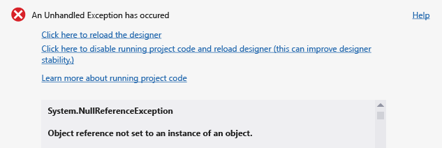
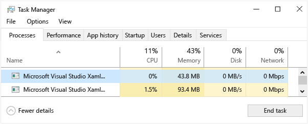

# Debugging or Disabling Project Code in XAML Designer
In many cases, unhandled exceptions in the XAML designer can be caused by project code attempting to access properties or methods which return different values or work in different ways when your application is running in the designer. You can resolve these exceptions by debugging the project code in another instance of Visual Studio, or temporarily prevent them by disabling project code in the designer.  
  
 Project code includes:  
  
-   Custom controls and user controls  
  
-   Class libraries  
  
-   Value converters  
  
-   Bindings against design time data generated from project code  
  
 When project code is disabled, Visual Studio will show placeholders such as the name of the property for a binding where the data is no longer available; or a placeholder for a control which is no longer running.  
  
   
  
#### To determine if project code is causing an exception  
  
1.  In the unhandled exception dialog, choose the **Click here to reload the designer** link.  
  
2.  On the menu bar choose **Debug**, **Start Debugging** to build and run the application.  
  
     If the application builds and runs successfully, the design-time exception may be caused by your project code running in the designer.  
  
#### To debug project code running in the designer  
  
1.  In the unhandled exception dialog, choose the **Click here to disable running project code and reload designer** link.  
  
2.  In the Windows Task Manager, choose the **End Task** button to close any instances of the Visual Studio XAML Designer that are currently running.  
  
       
  
3.  In Visual Studio, open the XAML page which contains the code or control you want to debug.  
  
4.  Open a new instance of Visual Studio, and then open a second instance of your project.  
  
5.  Set a breakpoint in your project code.  
  
6.  In the new instance of Visual Studio, on the menu bar, choose **Debug**, **Attach to Process**.  
  
7.  In the **Attach to Process** dialog, in the **Available Processes** list, choose **XDesProc.exe**, and then choose the **Attach** button.  
  
       
  
     This is the process for the XAML designer in the first instance of Visual Studio.  
  
8.  In the first instance of Visual Studio, on the menu bar choose **Debug**, **Start Debugging**.  
  
     You can now step into your code which is running in the designer.  
  
#### To disable project code in the designer  
  
-   In the unhandled exception dialog, choose the **Click here to disable running project code and reload designer** link.  
  
-   Alternatively, on the toolbar in the XAML designer, choose the **Disable project code** button.  
  
       
  
     You can toggle the button again to re-enable project code.  
  
    > [!NOTE]
    >  For projects that target ARM or X64 processors, Visual Studio cannot run project code in the designer, so the **Disable project code** button is disabled in the designer.  
  
-   Either option will cause the designer to reload, and will then disable all code for the associated project.  
  
    > [!NOTE]
    >  Disabling project code can lead to a loss of design time data. An alternative is to debug the code running in the designer.  
  
## See Also  
 [Designing XAML in Visual Studio](../vs140/designing-xaml-in-visual-studio.md)