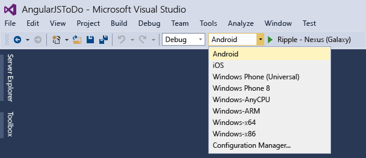
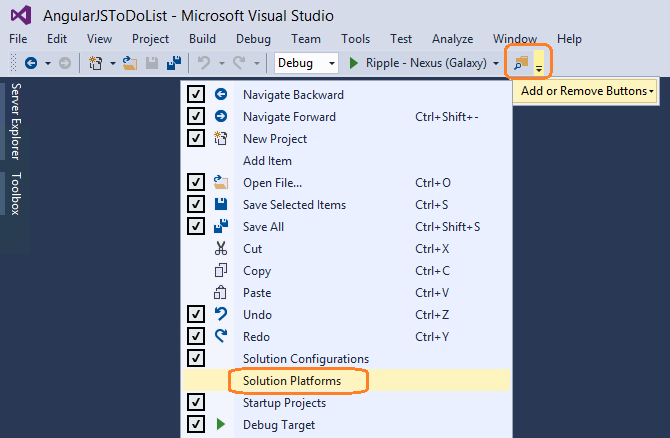
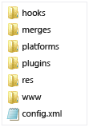
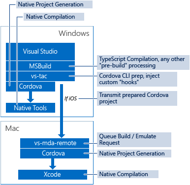

# Deploy and Run Your App Built with Visual Studio Tools for Apache Cordova
[!INCLUDE[cordova_header](../vs140/includes/cordova_header_md.md)]  
  
 Visual Studio can build, deploy, and run your Apache Cordova app on any platform: browser, Android, iOS, Windows, and Windows Phone. This article will help you:  
  
-   Choose your target platform in Visual Studio  
  
-   Understand how Visual Studio builds your app for each platform.  
  
 For instructions on how to build, deploy, and run your app on a specific platform, see one of these articles:  
  
-   [Run your app on Android](../vs140/run-your-apache-cordova-app-on-android.md)  
  
-   [Run your app on iOS](../vs140/run-your-apache-cordova-app-on-ios.md)  
  
-   [Run your app on Windows](../vs140/run-your-apache-cordova-app-on-windows.md)  
  
-   [Run your app on Windows Phone](../vs140/run-your-apache-cordova-app-on-windows-phone.md)  
  
-   [Run your app on the Apache Ripple Simulator](../vs140/run-your-apache-cordova-app-on-the-apache-ripple-simulator.md)  
  
 In addition, this article provides information about the [Cordova build process in Visual Studio](#BuildProcess).  
  
##  \ Choose your target platform in Visual Studio  
 When you want to run your Cordova app from Visual Studio, you must first select your target platform. The first time you try to do this after installing Visual Studio Tools for Apache Cordova, you might need to make the Solution Platforms list visible.  
  
#### To select your target platform  
  
1.  In Visual Studio, choose a platform from the **Solution Platforms** list. In the following example, we show Android selected.  
  
       
  
     If the **Solution Platforms** list isn’t showing, choose **Solution Platforms** from the **Add/Remove Buttons** list to display it.  
  
       
  
 For all other steps required to run your app, see the platform-specific topics for Android, iOS, Windows, and Windows Phone.  
  
##  \ How the Cordova build process works in Visual Studio  
 The Cordova Command Line Interface (CLI) does most of the heavy lifting for Visual Studio when you build and run a Cordova app. To make the process of installing and managing Cordova native code plugins easy, the CLI uses plugman, another command line tool. The CLI requires a specific folder structure, shown here. Most of this folder structure is mirrored by Visual Studio.  
  
   
  
 To leverage the CLI from the Visual Studio project, Visual Studio uses a CLI pre-processor called vs-tac, which is a Node.js (npm) package. The first time you build and run a project built using Visual Studio Tools for Apache Cordova, vs-tac installs Cordova, the Ripple Emulator, and other required dependencies. It is the job of vs-tac to accept a build, pre-process the Visual Studio project, execute the specified Cordova CLI build system command, and run (or emulate) the app.  
  
   
  
 When building, Visual Studio injects its own custom hooks into the project to enable features that the CLI does not support.  
  
 Visual Studio automates the process of adding platforms (using the `cordova platform add` command) and installation/uninstallation of Cordova plugins (using the `cordova plugin add` command) based on user selections in Visual Studio. Visual Studio uses the CLI to build for the requested platform for the selected configuration (for example, `cordova build android debug`).  
  
 CLI native platform projects and the Cordova CLI project itself are not intended for editing, so don’t add these projects to your source control. They are updated and edited by the build process. However, if you choose, you can use the generated native platform projects to get an exported copy of the project.  
  
 Following are a few platform-specific details on the build and deployment process.  
  
### Android  
 The CLI supports both building and running Android apps on Windows. To run the app on the Android emulator, Visual Studio runs the CLI command `cordova emulate android`. This command deploys the app to an already running emulator, or, if none are available, it starts up the last emulator that was created. To run the app on a connected Android device, Visual Studio runs the CLI command `cordova run android`. To configure your Android device or emulator, see [Run your App on Android](../vs140/run-your-apache-cordova-app-on-android.md).  
  
### iOS  
 Because Windows cannot build an iOS app directly, Visual Studio uses a remote agent called remotebuild to build and run your app on a remote Mac machine. (You can build locally if you are using Visual Studio inside a Windows VM on a Mac.) To build for iOS, vs-tac prepares the CLI project in exactly the same way as it does for any platform, but for iOS it then transfers the contents over to remotebuild on the Mac. The remote agent unzips the contents, adds the iOS platform (with the command `cordova platform add ios`), compiles the iOS app (`cordova prepare ios; cordova compile ios`), and then transfers the resulting package (IPA) back to the Windows host machine. To configure the remotebuild and host Visual Studio for iOS build, see [Install tools for iOS](https://msdn.microsoft.com/library/dn757054.aspx#ios).  
  
 To run apps on iOS, Visual Studio builds the app using remotebuild and then uses ios-sim to start up the simulator on the remote Mac machine. If you are running on an iOS device attached to your Mac, remotebuild starts the app directly (the ideviceinstaller must be installed from HomeBrew). If you run the app on an iOS device attached to Windows, Visual Studio builds and then adds the app to iTunes so you can deploy it to your device from Windows.  
  
### Windows and Windows Phone  
 When building for Windows/Windows Phone 8.1 and 10, Cordova generates a Windows Runtime app (APPX). When building for Windows Phone 8, it generates a Silverlight (XAP) WebView app. These apps are launched in the same way as a native Windows 8 or Windows Phone 8 project in Visual Studio. For more information, see [Run your app on Windows](../vs140/run-your-apache-cordova-app-on-windows.md) and [Run your app on Windows Phone](../vs140/run-your-apache-cordova-app-on-windows-phone.md).  
  
### Ripple Emulator  
 To make the Ripple build process to be as fast as possible, the CLI is used to generate the needed plugin code, but otherwise, Visual Studio provides the web content directly (instead of providing content from the generated native project). When you run the app, the Ripple emulator is initialized, and Chrome is started using a Ripple URL (for example, http://localhost:4400/index.html?enableripple=cordova-3.0.0-Nexus7 for the Nexus7 tablet device). All Chrome settings are stored locally to your Visual Studio instance so that your normal browser experience is not affected. For more information, see [Run your app on the Ripple Emulator](../vs140/run-your-apache-cordova-app-on-the-apache-ripple-simulator.md).  
  
  [Get the Visual Studio Tools for Apache Cordova](http://aka.ms/mchm38) or [learn more](https://www.visualstudio.com/cordova-vs.aspx)  
  
## See Also  
 [Getting started with Visual Studio Tools for Apache Cordova](../vs140/get-started-with-visual-studio-tools-for-apache-cordova1.md)   
 [Install the Visual Studio Tools for Apache Cordova Extension](../vs140/install-visual-studio-tools-for-apache-cordova.md)   
 [Create your first app](../vs140/create-your-first-app-using-visual-studio-tools-for-apache-cordova.md)