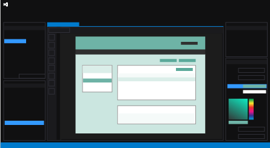
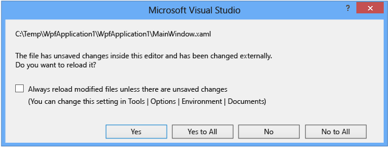

# Designing XAML in Visual Studio
Visual Studio and Blend for Visual Studio both provide visual tools for building engaging user interfaces and rich media experiences for XAML-based Windows desktop, web, [Windows Phone](http://msdn.microsoft.com/library/windowsphone/develop/jj683071.aspx), and [Windows Store](http://msdn.microsoft.com/library/windows/apps/jj129478.aspx) apps. Both share a common set of design and tool windows and a XAML editor, but Blend for Visual Studio provides additional design tools for more advanced tasks such as animation and behaviors.  
  
## Choosing the Right Tool  
 Your choice of design tools is largely dependent on your skill set. If you are more code-oriented, you can write XAML code in Visual Studio to accomplish even advanced design tasks. If you are more design-oriented, Blend for Visual Studio lets you perform advanced tasks without writing code.  
  
 You can switch back and forth between Visual Studio and Blend for Visual Studio, and you can even have the same project open in both at the same time. Changes made to XAML files in one IDE can be applied via automatic reload when you switch to the other IDE. You can control the reload behavior via options in the **Tools**, **Options** dialog box in either IDE.  
  
### Shared Capabilities  
 For most basic tasks, the IDE for Visual Studio and Blend for Visual Studio share the same set of windows and capabilities, with some subtle differences. Some highlights include:  
  
-   **A consistent user interface:** You can design your applications within the familiar context of the Visual Studio user interface, which makes switching between IDEs a more pleasant and productive experience. Blend for Visual Studio uses the Visual Studio Dark theme that helps you focus on the content you are designing by improving the contrast between your content and the user interface. See [Creating a UI by using XAML Designer](../vs140/creating-a-ui-by-using-xaml-designer-in-visual-studio.md).  
  
       
  
-   **XAML IntelliSense:** Both IDEs support all of the common capabilities you would expect from IntelliSense including statement completion, support for common editor operations like commenting and formatting code, and navigation to resources, binding, and code.  
  
-   **Basic debugging capabilities:** You can now debug in Blend, including setting breakpoints in your code to debug your running app. To maintain a consistent debugging experience with Visual Studio, Blend for Visual Studio includes most of Visual Studio’s debugging windows and toolbars. Advanced debugging capabilities such as diagnostics and code analysis are only available in Visual Studio. See [Debugging in Visual Studio](../vs140/debugging-in-visual-studio.md).  
  
-   **File reload experience:** You can edit your XAML files in either Blend for Visual Studio or Visual Studio, and have your edited files reload automatically as you switch between them. To minimize workflow interruptions, you can now set your file reload preferences in the file reload dialog.  
  
       
  
-   **Synchronized Layouts and Settings:** Custom layouts enable you to save and apply tool window layout customizations. Visual Studio will synchronize these customizations and preferences for both Visual Studio and Blend for Visual Studio across machines when you sign in with the same Microsoft account. See [Customizing Development Settings in Visual Studio](assetId:///22c4debb-4e31-47a8-8f19-16f328d7dcd3).  
  
-   **A common Solution Explorer:** The Solution Explorer provides you with an organized view of your projects and their files, as well as ready access to the commands associated with them. With Solution Explorer, it is easier to work with big enterprise projects. See [Solution and Project Basics](../vs140/solutions-and-projects-in-visual-studio.md).  
  
-   **Team Explorer:** With Team Explorer you can manage your projects with GIT or TFS repositories to facilitate team collaboration. See [Work in Team Explorer](assetId:///fd7a5cf7-7916-4fa0-b5e6-5a83cf377a02).  
  
-   **NuGet:** You can manage NuGet packages in both Visual Studio and Blend for Visual Studio. NuGet is a package manager for the .NET Framework that simplifies the installation and removal of packages from a solution.  
  
## Advanced Capabilities in Blend for Visual Studio  
 To increase your productivity, consider using Blend for Visual Studio for the following tasks. These are the areas where Blend for Visual Studio offers more speed and functionality than the Visual Studio designer or code alone.  
  
|To|Visual Studio|Blend for Visual Studio|More information|  
|--------|-------------------|-----------------------------|----------------------|  
|**Create animations**|There is no design tool for animations; you have to create them programmatically. This requires an understanding of the animation and timing system in WPF and extensive coding expertise.|You create animations visually and can preview them in Blend for Visual Studio. This is faster and more accurate than building your animations in code. You can add triggers to handle user interaction, and you can switch to code to add event handlers and other functionality.|[Animate](../vs140/animate-objects-in-xaml-designer.md)|  
|**Turn shapes and text into paths for easier manipulation**|Not supported.|You can make subtle or dramatic changes to shapes (such as rectangles and ellipses) by converting them to paths, which provide better editing control.  You can reshape or combine paths, and create compound paths from multiple shapes.\ \  You can also convert text blocks into paths to manipulate them as vector images.|[Draw shapes and paths](../vs140/draw-shapes-and-paths.md)|  
|**Add interactivity to your UI designs**|Requires C#, Visual Basic, or C++ code.|Drag and drop behaviors onto controls to add interactivity to your static designs. Behaviors are ready-to-use code snippets that encapsulate functionality such as drag/drop, zoom, and visual state changes. There’s a growing set of behaviors you can choose from, and you can create your own.\ \  You can then customize each behavior by changing its properties in Blend for Visual Studio or by adding event handlers in code.|[Insert controls and modify their behavior](../vs140/insert-controls-and-modify-their-behavior-in-xaml-designer.md)|  
|**Use Adobe artwork**|Not supported.|Import Adobe FXG, PhotoShop, or Illustrator artwork and implement the UI in Blend for Visual Studio.|[Insert images, videos, and audio clips](../vs140/insert-images--videos--and-audio-clips-in-xaml-designer.md)|  
|**Edit controls, templates, and styles**|Requires coding and knowledge of WPF styles and templates.|Turn any image into a control.\ \  Use the template editing tools to make changes to controls, styles, and templates with just a few mouse clicks.\ \  For example, you can use Blend for Visual Studio style resources to implement common WPF controls (such as buttons, list boxes, scroll bars, menus, etc.), and change their color, style, or underlying template directly in Blend for Visual Studio. You can then switch to code for finishing touches if you want.|[Modify the Style of objects](../vs140/modify-the-style-of-objects-in-blend.md)|  
|**Connect your UI to data**|You can create a data source from resources such as SQL Server databases, WCF or web services, objects, or SharePoint lists, and bind the data source to your UI controls.\ \  Design-time data must be created by hand for an interactive design experience.|Create sample data easily for prototyping and testing. Switch to live data when you’re ready.\ \  Blend for Visual Studio’s data generation capabilities are outstanding (you can add names, numbers, URLs, photos easily on the fly), and can save you a lot of time.\ \  For live data, you can bind your UI controls to an XML file or to any CLR data source.|[Display data](../vs140/display-data-in-blend.md)|  
  
 For more information about advanced XAML design, see . [Creating a UI by using Blend](../vs140/creating-a-ui-by-using-blend-for-visual-studio.md)